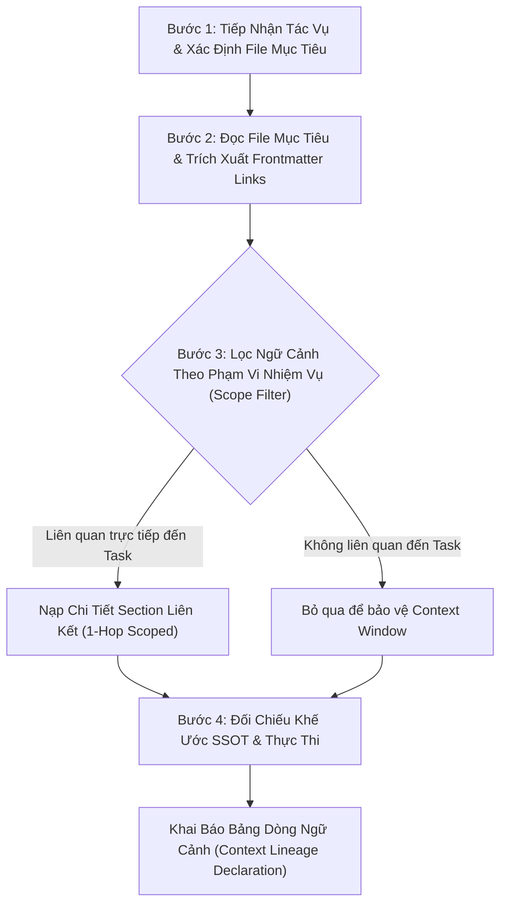

# MANDATORY CONTEXT MANAGEMENT & LINKED DOCUMENTATION STANDARDS (SSOT & SCOPED TRAVERSAL)

> [!IMPORTANT]
> **TIÊU CHUẨN BẮT BUỘC VỀ QUẢN TRỊ NGỮ CẢNH & MẠNG LƯỚI LIÊN KẾT TÀI LIỆU KỸ THUẬT**
> 
> **Mục tiêu tối thượng:**
> 1. Triệt tiêu hoàn toàn hiện tượng **Quên / Mất ngữ cảnh (Context Loss / Forgetting)** của Agent khi tiếp nhận yêu cầu phân tích, đề xuất kỹ thuật, sửa đổi mã nguồn hoặc triển khai module mới trong hệ sinh thái `IPGov_Chatbot`.
> 2. Bảo vệ tuyệt đối tính nhất quán theo nguyên lý **Nguồn Chân Lý Duy Nhất (Single Source of Truth - SSOT)**, ngăn ngừa tình trạng trôi dạt tài liệu (**Documentation Drift**).
> 3. Tránh bẫy quá tải token (**Token Saturation**) và suy giảm khả năng tập trung suy luận (**Lost in the Middle Trap - Liu et al., TACL 2024**).

---

## 1. Phân Tầng Vai Trò Tài Liệu Kỹ Thuật (Documentation Hierarchy & SSOT)

Toàn bộ tài liệu kỹ thuật trong hệ sinh thái `IPGov_Chatbot` được phân cấp chặt chẽ theo 4 vai trò chức năng:

1. **Tầng 1: Nguồn Chân Lý Duy Nhất (`role: SSOT` / `role: SSOT_INDEX`):**
   - Vị trí: `IPGov_Chatbot/blueprints/`
   - Định nghĩa: Nơi lưu trữ duy nhất các quyết định kiến trúc, lược đồ CSDL (DWH Schema), danh mục Intent, ma trận phân quyền HBAC, DTO contracts và giao thức SSE.
   - Nguyên tắc: Mọi tài liệu khác khi đề cập đến các thông số này **bắt buộc phải tham chiếu (Link / Anchor)** tới `blueprints/`, tuyệt đối không sao chép lại thành bản sao độc lập.
2. **Tầng 2: Đặc Tả Triển Khai Module (`role: SPEC` / `role: SPEC_MASTER`):**
   - Vị trí: `IPGov_Chatbot/docs/MODULE_*_SPEC.md` và `MASTER_PLAN_AND_PROGRESS_TRACKING.md`.
   - Định nghĩa: Đặc tả chi tiết từng lớp logic của module (Stage 1 đến Stage 8), trạng thái hoàn thành (DoD), và cấu trúc mã nguồn.
   - Nguyên tắc: Phụ thuộc trực tiếp (`depends_on`) vào các tệp SSOT tương ứng trong `blueprints/`.
3. **Tầng 3: Bộ Tiêu Chuẩn Kiểm Thử & Nghiệm Thu (`role: TEST_SUITE`):**
   - Vị trí: `IPGov_Chatbot/blueprints/08_BO_TEST_CASE_...md`, `evaluations/`, `tests/`.
   - Định nghĩa: Các kịch bản Golden Test Cases, ma trận độ phủ Archetypes, và tiêu chí nghiệm thu tự động.
4. **Tầng 4: Tài Liệu Hướng Dẫn Vận Hành (`role: GUIDE`):**
   - Vị trí: `IPGov_Chatbot/docs/BACKEND_RUN_GUIDE.md`, `README.md`.
   - Định nghĩa: Hướng dẫn cấu hình môi trường, khởi chạy terminal, và kiểm thử giao diện.

---

## 2. Chuẩn Hóa Cấu Trúc Hybrid: YAML Frontmatter & Anchor Slugs

Mọi tệp tài liệu kỹ thuật trong `IPGov_Chatbot/` bắt buộc phải được khai báo cấu trúc đầu trang (YAML Frontmatter) và các thẻ neo (Anchor Slugs) để hỗ trợ điều hướng máy đọc và Agent:

### 2.1. Cấu trúc YAML Frontmatter chuẩn
```yaml
---
doc_id: "BP-01-DWH" # Định danh duy nhất của tài liệu
title: "Kiến trúc Kho Dữ Liệu DWH (vna_wom_dev)"
role: "SSOT" # Giá trị hợp lệ: SSOT | SSOT_INDEX | SPEC | SPEC_MASTER | TEST_SUITE | GUIDE
scope: "Data Warehouse & Schema Contracts"
ssot_of: # Danh sách các tài liệu/mục khác sử dụng tài liệu này làm nguồn chân lý
  - "IPGov_Chatbot/docs/MASTER_PLAN_AND_PROGRESS_TRACKING.md#dwh-schema"
depends_on: [] # Danh sách các tài liệu SSOT mà tài liệu này phụ thuộc vào
related_docs: # Danh sách các tài liệu liên đới phục vụ kiểm thử hoặc hướng dẫn
  - "IPGov_Chatbot/docs/BACKEND_RUN_GUIDE.md#env-config"
  - "IPGov_Chatbot/blueprints/08_BO_TEST_CASE_KIEM_THU_TOAN_DIEN.md#tc-dwh"
---
```

### 2.2. Quy chuẩn Anchor Slugs
- Mọi tiêu đề cấp 2 (`##`) và cấp 3 (`###`) chứa định nghĩa cốt lõi (Schema, Contract DTO, Intent, Guardrail) phải có anchor heading chuẩn định dạng GitHub hoặc slug rõ ràng:
  ```markdown
  ### 2.1. Cấu Trúc Bảng Fact Chỉ Tiêu Kinh Tế (fact_economic_metric)
  ```
- Khi liên kết từ tài liệu khác, sử dụng cú pháp Markdown chuẩn kèm đường dẫn tệp và anchor:
  ```markdown
  Tham chiếu lược đồ chuẩn tại: [01_DATA_WAREHOUSE_SCHEMA...md#21-cau-truc-bang-fact-chi-tieu-kinh-te-fact_economic_metric](file:///c:/Users/Admin/HUIT%20-%20H%E1%BB%8Dc%20T%E1%BA%ADp/N%C4%83m%204/Chatbot_Project/IPGov_Chatbot/blueprints/01_DATA_WAREHOUSE_SCHEMA_VA_LUAT_NGHIEP_VU.md#21-cau-truc-bang-fact-chi-tieu-kinh-te-fact_economic_metric)
  ```

---

## 3. Quy Trình Duyệt Ngữ Cảnh 1-Hop Có Chọn Lọc (Task-Relevant Scoped Traversal)

Khi tiếp nhận bất kỳ yêu cầu nào liên quan đến phân tích, giải thích logic, đề xuất kiến trúc, chỉnh sửa mã nguồn hoặc viết test case, Agent **BẮT BUỘC PHẢI THỰC THI CHU TRÌNH 4 BƯỚC SAU ĐÂY**:



### Bước 1: Xác định tài liệu mục tiêu (Target Document Discovery)
- Nếu người dùng nhắc trực tiếp đến một tệp `.md` $\to$ Đó là File Mục Tiêu cấp 1.
- Nếu người dùng yêu cầu sửa đổi/phát triển một Module (ví dụ: Module 3 - Router) $\to$ Tìm và nạp Spec tương ứng (`IPGov_Chatbot/docs/MODULE_03_ROUTER_SPEC.md` hoặc `blueprints/05_MULTI_AGENT_WORKFLOW...md`).

### Bước 2: Trích xuất Frontmatter & Danh mục Liên kết
- Đọc nội dung file mục tiêu bằng `ctx_read`.
- Phân tích khối Frontmatter YAML: xem xét danh sách `depends_on`, `ssot_of`, và `related_docs`.

### Bước 3: Duyệt 1-Hop có chọn lọc (Task-Relevant Scoped Traversal)
- **CƯỠNG CHẾ BẢO VỆ CONTEXT WINDOW (CHỐNG LOST-IN-THE-MIDDLE):**
  - **TUYỆT ĐỐI KHÔNG** đọc mù quáng toàn bộ 100% nội dung của tất cả các file có liên kết.
  - **CHỈ ĐƯỢC PHÉP** đọc các Section/Khối trong tệp liên kết có liên quan trực tiếp đến các khía cạnh nhiệm vụ cần xử lý (ví dụ: nhiệm vụ sửa logic routing thì chỉ đọc mục `#intent-definitions`, không đọc phần cấu hình Kafka hay DLQ không liên quan).

### Bước 4: Đối chiếu Khế ước SSOT & Báo cáo Dòng Ngữ Cảnh
- Trước khi thực thi chỉnh sửa mã nguồn hoặc kết luận phân tích, Agent phải bảo đảm mọi giả định về schema, tên bảng, DTO, vai trò HBAC đều khớp hoàn toàn với file mang nhãn `role: SSOT`.

---

## 4. Cưỡng Chế Đồng Bộ Lan Truyền (Cascade Synchronization Invariant)

1. **Quy Tắc Sửa Nguồn Gốc (Edit at Source First):**
   - Nếu một thay đổi mã nguồn hoặc yêu cầu người dùng dẫn đến việc thay đổi định nghĩa kiến trúc (ví dụ: thêm 1 cột mới vào DWH, thêm 1 intent mới vào Router, thay đổi cấu trúc Token JWT):
     - **BẮT BUỘC** phải cập nhật tệp `role: SSOT` trong `blueprints/` trước tiên.
2. **Quy Tắc Lan Truyền Đồng Bộ (Cascade Sync):**
   - Ngay sau khi tệp SSOT thay đổi, Agent **BẮT BUỘC** áp dụng ma trận kỹ năng `blueprint-cascade-sync` để cập nhật đồng bộ các tệp `role: SPEC` (`MASTER_PLAN...`, `MODULE_*_SPEC.md`) và `role: TEST_SUITE` (`08_BO_TEST_CASE...md`).
   - Nghiêm cấm để tài liệu thiết kế và tài liệu hướng dẫn bị lệch pha nhau.

---

## 5. Khai Báo Dòng Ngữ Cảnh Bắt Buộc (Context Lineage Declaration)

Trong mọi câu trả lời phân tích kỹ thuật hoặc trước khi thực hiện viết code/chỉnh sửa hệ thống, Agent **BẮT BUỘC PHẢI KHAI BÁO BẢNG NGỮ CẢNH ĐÃ NẠP**:

```markdown
### 📋 Ngữ Cảnh Kỹ Thuật Đã Tham Chiếu (Context Lineage)
| Vai Trò | Tệp Tài Liệu | Mục / Anchor Tham Chiếu | Mục Đích Đối Chiếu |
|---|---|---|---|
| **SSOT** | `blueprints/01_DATA_WAREHOUSE...md` | `#fact-schema` | Xác minh tên bảng & kiểu dữ liệu |
| **SPEC** | `docs/MASTER_PLAN...md` | `#mod-05-generator` | Kiểm tra DoD và tiêu chí nghiệm thu |
| **TEST** | `blueprints/08_BO_TEST_CASE...md` | `#tc-dwh-01` | Đối chiếu kịch bản Golden Test |
```
*(Nếu thiếu bảng khai báo ngữ cảnh này, phản hồi được coi là chưa hoàn thành quy trình chuẩn).*
