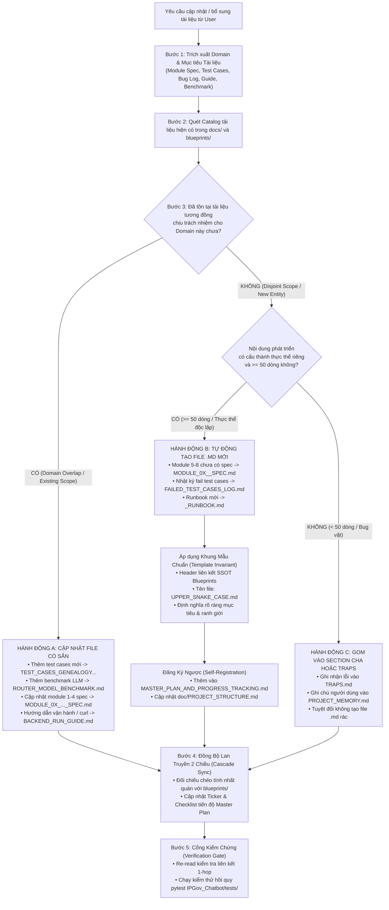

# Blueprint Cascade Synchronizer & Documentation Governance

## Overview

Trong hệ sinh thái **IPGov Chatbot**, bộ tài liệu tại `IPGov_Chatbot/blueprints/` đóng vai trò là **Nguồn Chân Lý Duy Nhất (Single Source of Truth - SSOT)** cho mọi quyết định kiến trúc, lược đồ DWH, giao thức đa tác tử, phân tầng bảo mật và tiêu chuẩn nghiệm thu. Đồng thời, thư mục `IPGov_Chatbot/docs/` là nơi chứa toàn bộ tài liệu đặc tả kỹ thuật chi tiết theo từng module (`MODULE_01` đến `MODULE_08`), hướng dẫn vận hành và phả hệ kiểm thử.

Kỹ năng này chịu trách nhiệm duy trì **sự đồng nhất tuyệt đối hai chiều** giữa thiết kế kiến trúc và tài liệu triển khai:
1. **Đồng Bộ Lan Truyền Xuôi (Downstream Cascade Sync):** Khi một bản vẽ trong `blueprints/` thay đổi, tự động lan truyền cập nhật sang toàn bộ các tệp đặc tả trong `docs/`, `MASTER_PLAN_AND_PROGRESS_TRACKING.md`, và bộ test `08_BO_TEST_CASE...md`.
2. **Quản Trị Tài Liệu & Tự Động Định Tuyến (In-Docs Governance & Auto-Creation Protocol):** Khi người dùng yêu cầu cập nhật hoặc bổ sung tài liệu kỹ thuật, tự động phân định thông minh giữa việc **"Cập nhật vào tài liệu có sẵn"** (nếu đã có file cùng domain) và **"Tự động tạo mới file `.md`"** (nếu là module hoặc thực thể kiểm thử/vận hành mới), đồng thời cưỡng chế cơ chế tự động đăng ký (Self-Registration) để triệt tiêu hoàn toàn nguy cơ **Tài liệu Mồ côi (Orphan Markdown)** hoặc **Bùng nổ File Vụn Vặt (File Sprawl)**.

---

## 4 Quy Tắc Bất Biến Cưỡng Chế (Core Invariants)

> [!IMPORTANT]
> ### 1. Quy Tắc Đồng Bộ Lan Truyền (The Cascade Sync Invariant)
> Mỗi khi chỉnh sửa bất kỳ tệp nào trong `IPGov_Chatbot/blueprints/`, Agent **BẮT BUỘC** phải rà soát và cập nhật toàn bộ các tệp markdown liên đới trong `IPGov_Chatbot/docs/` và `blueprints/08...`. Tuyệt đối không dừng lại ở việc chỉ sửa một file blueprint đơn lẻ.
> 
> ### 2. Quy Tắc Định Tuyến Tài Liệu Đơn Nhiệm (Single Responsibility Doc Routing)
> - **Nếu đã có tài liệu tương đồng phụ trách domain đó:** Bắt buộc cập nhật trực tiếp vào file hiện hữu (ví dụ: thêm test case mới $\to$ cập nhật vào `docs/TEST_CASES_GENEALOGY_AND_MAPPING_GUIDE.md`).
> - **Nếu là domain/module hoàn toàn mới chưa có tài liệu:** Tự động tạo mới file `.md` theo chuẩn `UPPER_SNAKE_CASE.md` (ví dụ: Module 5 chưa có spec $\to$ tạo mới `docs/MODULE_05_MULTI_AGENT_SPEC.md`).
> 
> ### 3. Quy Tắc Tự Động Đăng Ký Chống Mồ Côi (Mandatory Self-Registration Invariant)
> Tuyệt đối không để tồn tại tài liệu không có liên kết trỏ tới. Ngay sau khi tạo bất kỳ file `.md` mới nào trong `docs/`, Agent **BẮT BUỘC PHẢI TỰ ĐỘNG** đăng ký file đó vào:
> 1. Bảng danh mục tài liệu & tiến độ trong `IPGov_Chatbot/docs/MASTER_PLAN_AND_PROGRESS_TRACKING.md`.
> 2. Sơ đồ cây thư mục trong `doc/PROJECT_STRUCTURE.md`.
> 
> ### 4. Rào Chắn Chống Bùng Nổ File Vụn Vặt (Anti-Sprawl Guardrail)
> Nghiêm cấm tạo file `.md` mới cho các ghi chú ngắn, bug đơn lẻ, hoặc thay đổi nhỏ ($< 50$ dòng). Các mẩu ghi chú này phải được ghi nhận vào `TRAPS.md`, `.agents/PROJECT_MEMORY.md` hoặc tích hợp vào một section của tài liệu cha đang có.

---

## Sơ Đồ Quy Trình Định Tuyến & Tạo Tài Liệu (Routing & Auto-Creation Protocol)



---

## Ma Trận Phụ Thuộc & Quyết Định Hành Động (Decision & Dependency Matrix)

Khi tiếp nhận yêu cầu sửa đổi hoặc bổ sung thông tin, tra cứu ma trận dưới đây để thực hiện đúng hành động kỹ thuật:

| Yêu Cầu Cụ Thể | Trạng Thái File Hiện Có | Hành Động Kỹ Thuật | Tệp Mục Tiêu Tác Động | Nội Dung Cần Đồng Bộ Lan Truyền |
| :--- | :--- | :---: | :--- | :--- |
| **Bổ sung / cập nhật Test Cases mới** | Đã có tài liệu phả hệ test case | **CẬP NHẬT** | • `docs/TEST_CASES_GENEALOGY_AND_MAPPING_GUIDE.md`<br>• `blueprints/08_BO_TEST_CASE...md` | Cập nhật danh sách test case, ma trận độ phủ Archetypes, số lượng tổng test cases trong Master Plan. |
| **Cập nhật đặc tả Module 1, 2, 3, 4** | Đã có `MODULE_01` $\to$ `MODULE_04` trong `docs/` | **CẬP NHẬT** | • `docs/MODULE_0X_<NAME>_SPEC.md`<br>• `docs/MASTER_PLAN_AND_PROGRESS_TRACKING.md` | DTO contracts, sequence diagrams, rules HBAC, ticker DoD của module tương ứng. |
| **Bổ sung đặc tả Module 5 (Multi-Agent & SQL)** | Chưa có spec trong `docs/` (chỉ có blueprint 05) | **TẠO MỚI** | • Tạo mới: `docs/MODULE_05_MULTI_AGENT_SPEC.md`<br>• Đăng ký vào `MASTER_PLAN...` & `PROJECT_STRUCTURE.md` | Trích xuất kiến trúc từ `blueprints/05_MULTI_AGENT...`, thiết kế StateGraph, DIN/MAC-SQL stages, DTO contracts, đăng ký vào Master Plan. |
| **Bổ sung đặc tả Module 6 (Observability & DLQ)** | Chưa có spec trong `docs/` (chỉ có blueprint 06) | **TẠO MỚI** | • Tạo mới: `docs/MODULE_06_OBSERVABILITY_SPEC.md`<br>• Đăng ký vào `MASTER_PLAN...` & `PROJECT_STRUCTURE.md` | Trích xuất kiến trúc từ `blueprints/06_OBSERVABILITY...`, tiêu chuẩn Langfuse tracing, Dead Letter Queue (DLQ), Spider/BIRD eval. |
| **Bổ sung đặc tả Module 7 (Dynamic SQL Generator)** | Chưa có spec trong `docs/` (chỉ có blueprint 01 & 05) | **TẠO MỚI** | • Tạo mới: `docs/MODULE_07_DYNAMIC_SQL_SPEC.md`<br>• Đăng ký vào `MASTER_PLAN...` & `PROJECT_STRUCTURE.md` | Trích xuất quy tắc AST injection, DuckDB-to-PostgreSQL syntax adaptation, DWH report status filters. |
| **Bổ sung đặc tả Module 8 (Reasoning & UX Streaming)** | Chưa có spec trong `docs/` (chỉ có blueprint 07) | **TẠO MỚI** | • Tạo mới: `docs/MODULE_08_REASONING_UX_SPEC.md`<br>• Đăng ký vào `MASTER_PLAN...` & `PROJECT_STRUCTURE.md` | Trích xuất giao thức 10 SSE events, provenance badge, action chips UI, fallback chitchat response. |
| **Ghi nhận & phân tích các Fail Test Cases** | Chưa có tài liệu nhật ký ca test thất bại trong `docs/` | **TẠO MỚI** | • Tạo mới: `docs/FAILED_TEST_CASES_LOG.md`<br>• Đăng ký vào `MASTER_PLAN...` & `PROJECT_STRUCTURE.md` | Phân loại lỗi theo Dr.Spider / MMSQL taxonomy, ghi nhận reproduction steps, root cause và giải pháp fix kèm link sang `TRAPS.md`. |
| **Cập nhật benchmark định tuyến Router** | Đã có tài liệu benchmark | **CẬP NHẬT** | • `docs/ROUTER_MODEL_BENCHMARK.md` | Cập nhật bảng kết quả đo lường latency, độ chính xác F1-score của các mô hình LLM. |
| **Cập nhật cách chạy backend, lệnh curl, test bench** | Đã có tài liệu hướng dẫn vận hành | **CẬP NHẬT** | • `docs/BACKEND_RUN_GUIDE.md` | Bổ sung câu lệnh cURL, payload SSE mẫu, hướng dẫn kiểm thử trực quan trên `/bench`. |
| **Ghi chú lỗi vặt, fix cú pháp nhỏ ($< 30$ dòng)** | Đã có hệ thống Trap & Memory | **KHÔNG TẠO FILE MỚI** | • `TRAPS.md`<br>• `.agents/PROJECT_MEMORY.md` | Ghi trap mới `[TRAP-xxx]` hoặc note lưu ý của người dùng, không tạo file .md rác. |

---

## Khung Mẫu Khởi Tạo Tài Liệu Chuẩn (Standard Creation Templates)

Mọi tệp `.md` mới khi được tự động tạo trong `IPGov_Chatbot/docs/` **BẮT BUỘC** phải tuân theo một trong các khung mẫu chuẩn sau:

### Khung Mẫu 1: Dành Cho Tài Liệu Đặc Tả Module (`MODULE_0X_<NAME>_SPEC.md`)
```markdown
# ĐẶC TẢ KỸ THUẬT MODULE X: [TÊN MODULE CHUẨN]

> **Tài liệu tham chiếu kiến trúc gốc (SSOT):**
> - [0X_TEN_BLUEPRINT_SSOT.md](../blueprints/0X_TEN_BLUEPRINT_SSOT.md)
> - [00_TECH_STACK_VA_KIEN_TRUC_TONG_THE.md](../blueprints/00_TECH_STACK_VA_KIEN_TRUC_TONG_THE.md)
> - **Quy tắc lập trình & Context:** [ipgov-coding-rules.md](../../.agents/rules/ipgov-coding-rules.md)

---

## 1. Mục Đích & Phạm Vi Module
[Mô tả trách nhiệm đơn nhất của module, vai trò trong toàn bộ pipeline 8 giai đoạn]

## 2. Sơ Đồ Kiến Trúc & Luồng Xử Lý (Sequence Diagram / StateGraph)
```mermaid
sequenceDiagram
    ...
```

## 3. Cấu Trúc Dữ Liệu & Hợp Đồng DTO (Contract Specifications)
[Khai báo các TypedDict / Pydantic models với type annotations đầy đủ]

## 4. Ràng Buộc Kỹ Thuật & Phòng Vệ (Guardrails & Constraints)
[Các quy tắc AST, HBAC, timeout, fallback bắt buộc tuân thủ]

## 5. Tiêu Chuẩn Nghiệm Thu & Bộ Kiểm Thử (DoD & Verification Gates)
[Danh sách test cases liên quan trong blueprints/08_BO_TEST_CASE...md]
```

### Khung Mẫu 2: Dành Cho Nhật Ký Ca Test Lỗi (`FAILED_TEST_CASES_LOG.md`)
```markdown
# NHẬT KÝ THEO DÕI & PHÂN TÍCH CA KIỂM THỬ THẤT BẠI (FAIL TEST CASES LOG)

> **Tài liệu tham chiếu:**
> - [08_BO_TEST_CASE_KIEM_THU_TOAN_DIEN_VA_5_DIEM_MU_DWH.md](../blueprints/08_BO_TEST_CASE_KIEM_THU_TOAN_DIEN_VA_5_DIEM_MU_DWH.md)
> - [TEST_CASES_GENEALOGY_AND_MAPPING_GUIDE.md](./TEST_CASES_GENEALOGY_AND_MAPPING_GUIDE.md)
> - **Kho bẫy lỗi hệ thống:** [TRAPS.md](../../TRAPS.md)

---

## 1. Danh Mục Phân Loại Ca Test Lỗi (Failure Taxonomy)
[Phân loại theo Dr.Spider / MMSQL 5 nhóm câu hỏi: Ambiguous, Out-of-scope, Multi-turn, Security, Schema]

## 2. Chi Tiết Các Ca Kiểm Thử Thất Bại & Kế Hoạch Khắc Phục

### [FAIL-001] [Mã Test Case hoặc Prompt Mô Tả]
- **Mức độ nghiêm trọng:** Critical / High / Medium
- **Prompt đầu vào:** `"..."`
- **Kết quả thực tế:** `...`
- **Kết quả kỳ vọng (Ground Truth):** `...`
- **Phân tích nguyên nhân gốc rễ (Root Cause):** `...`
- **Hành động khắc phục (Remediation):** `...`
- **Liên kết Trap liên đới:** `[TRAP-xxx]` trong `TRAPS.md`
- **Trạng thái:** OPEN / RESOLVED
```

---

## Cơ Chế Tự Động Đăng Ký (Self-Registration Protocol)

Khi một tệp mới (ví dụ: `docs/MODULE_05_MULTI_AGENT_SPEC.md`) được tạo ra, Agent bắt buộc phải thực hiện ngay 2 bước đăng ký sau:

### 1. Cập nhật `IPGov_Chatbot/docs/MASTER_PLAN_AND_PROGRESS_TRACKING.md`
Chèn liên kết và trạng thái của tài liệu mới vào Bảng Checklist Module hoặc Bảng Danh Mục Tài Liệu Hạ Tầng:
```markdown
| MOD-05 | **Multi-Agent Workflow & DIN/MAC-SQL** | Hoàn thành đặc tả kỹ thuật tại [MODULE_05_MULTI_AGENT_SPEC.md](./MODULE_05_MULTI_AGENT_SPEC.md) |
```

### 2. Cập nhật `doc/PROJECT_STRUCTURE.md`
Cập nhật cây thư mục để các lần tra cứu sau nhận diện được tệp:
```markdown
├── docs/
│   ├── MODULE_05_MULTI_AGENT_SPEC.md # Đặc tả kỹ thuật Module 5: Multi-Agent & SQL Generation
```

---

## Cổng Kiểm Chứng Trước Hoàn Tất (Verification Gate)

Tuân thủ nghiêm ngặt kỹ năng `/verification-before-completion`:
1. **Kiểm tra liên kết 1-hop:** Đọc lại các liên kết Markdown vừa thêm/sửa, bảo đảm đường dẫn tương đối chính xác 100% (không dính lỗi 404 hoặc khoảng trắng sai).
2. **Kiểm tra tính nhất quán số liệu (Metric Consistency):**
   - Đảm bảo số lượng test case, số lượng Archetype và mã module khớp nhau trên cả file spec, file test và Master Plan.
3. **Chạy kiểm thử hồi quy hệ thống:**
   ```powershell
   .\.venv\Scripts\python.exe -m pytest IPGov_Chatbot/tests/ -v
   ```
   Khẳng định bằng bằng chứng thực nghiệm (192/192 tests pass) trước khi tuyên bố hoàn tất nhiệm vụ.

---

## Bảng Phòng Ngừa Biện Minh (Rationalization Table)

| Lý Do Biện Minh (Excuse) | Thực Tế Kỹ Thuật (Reality) | Quy Tắc Phòng Ngừa |
| :--- | :--- | :--- |
| *"Tài liệu này nhỏ, tạo file riêng cho tiện khỏi mất công đọc file cũ dài."* | Tạo file nhỏ vô tội vạ làm nát cấu trúc docs (File Sprawl), agent sau này không tìm ra. | Áp dụng ngưỡng $\ge 50$ dòng. Dưới 50 dòng bắt buộc gom vào section của tài liệu cha hoặc `TRAPS.md`. |
| *"Tôi đã tạo file mới rồi, không cần sửa Master Plan vì Master Plan chỉ quản lý code."* | Master Plan quản lý toàn bộ vòng đời dự án. File không đăng ký là file mồ côi (Orphan Doc), bị lãng quên ngay trong phiên sau. | Cưỡng chế Quy Tắc Tự Động Đăng Ký (Self-Registration Invariant). |
| *"Tôi chỉ thêm test case mới, tạo một file test_cases_moi.md cho nhanh."* | Dự án đã có sẵn `TEST_CASES_GENEALOGY...` và `08_BO_TEST_CASE...`. Tạo file mới gây trùng lặp và phân mảnh SSOT. | Cưỡng chế Quy Tắc Định Tuyến: Có file tương đồng thì BẮT BUỘC cập nhật vào file đó. |
| *"File blueprint thay đổi chút ít, không cần cập nhật file spec trong docs/."* | Sai lệch giữa blueprint và spec là nguyên nhân hàng đầu dẫn đến code sai lệch (Documentation Drift). | Cưỡng chế Quy Tắc Đồng Bộ Lan Truyền (Cascade Sync Invariant). |

---

## Danh Sách Cờ Đỏ (Red Flags - DỪNG LẠI & SỬA NGAY)

Nếu phát hiện một trong các dấu hiệu sau trong quá trình thực thi, Agent **BẮT BUỘC DỪNG LẠI VÀ ĐIỀU CHỈNH**:
- 🚩 Tạo file `.md` mới có tên viết thường hoặc chứa dấu gạch ngang (như `fail-tests.md`, `module5.md`). $\to$ **Sửa ngay:** Đổi thành `UPPER_SNAKE_CASE.md`.
- 🚩 Tạo file `.md` mới nhưng không có phần Header/Frontmatter trỏ về Blueprint SSOT. $\to$ **Sửa ngay:** Bổ sung khối trích dẫn SSOT theo đúng Khung Mẫu Chuẩn.
- 🚩 Tạo file `.md` mới xong nhưng không chỉnh sửa `MASTER_PLAN_AND_PROGRESS_TRACKING.md`. $\to$ **Sửa ngay:** Đăng ký tệp vào bảng checklist của Master Plan.
- 🚩 Tạo thêm file chứa test case trong khi `TEST_CASES_GENEALOGY_AND_MAPPING_GUIDE.md` đã tồn tại. $\to$ **Sửa ngay:** Xóa file vừa tạo và chuyển nội dung vào file hiện có.
- 🚩 Tuyên bố "đã đồng bộ xong" mà không đọc lại (re-read) kiểm tra liên kết chéo hoặc không chạy `pytest`. $\to$ **Sửa ngay:** Thực thi đầy đủ Cổng Kiểm Chứng.
