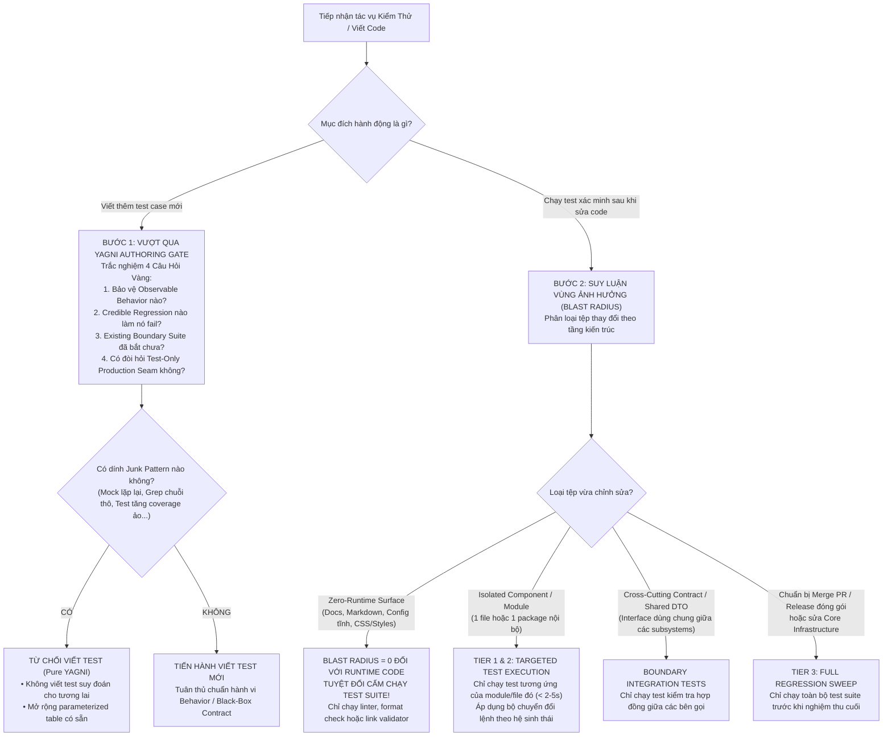

# Bonsai Testing — Universal YAGNI Test Authoring & Dynamic Scoping

## Overview

> *"Cắt tỉa cành thừa, nuôi dưỡng cành cốt lõi, giữ cho cây cảnh luôn khỏe mạnh, thanh thoát và không bao giờ bị rậm rạp hoang dại."* — **Triết lý Bonsai**

Trong kỹ nghệ phần mềm, **Mỗi bài test viết ra không phải là tài sản thuần túy, mà là một khoản nợ bảo trì (Maintenance Liability)**. Một bộ kiểm thử phình to, chạy chậm, chứa đầy các bài test rác gắn chặt vào chi tiết cài đặt (*implementation-coupled*) hoặc quét càn toàn bộ hệ thống sau mỗi thay đổi nhỏ là hiện thân của sự lãng phí tài nguyên và vi phạm nghiêm trọng nguyên lý **YAGNI (You Aren't Gonna Need It)**.

Kỹ năng **`bonsai-test`** là một quy chuẩn **độc lập với ngôn ngữ và framework (Framework-Agnostic)**, áp dụng cho mọi dự án phần mềm (Python, TypeScript/JavaScript, Go, Rust, Java, C#...). Kỹ năng thiết lập kỷ luật kiểm thử tinh gọn dựa trên 2 trụ cột cốt tử:
1. **The YAGNI Authoring Gate (Van Chặn Viết Test Mới):** Đặt ra 4 câu hỏi thẩm định bản chất và bộ lọc 10 mẫu test rác (*Junk Patterns*) để triệt tiêu các test suy đoán, test trùng lặp và test vô giá trị ngay từ trước khi viết mã.
2. **Dynamic Blast-Radius Scoping (Định Tuyến Vùng Ảnh Hưởng Động):** Khai tử thói quen chạy càn quét mù quáng toàn bộ test suite dự án; tự động suy luận vùng ảnh hưởng (*Blast Radius*) dựa trên cấu trúc tệp thay đổi để chỉ thực thi đúng các test suite liên quan trực tiếp với thời gian phản hồi $< 2$ giây.

---

## Sơ Đồ Quy Trình Bonsai Testing (Decision Flowchart)



---

## Trụ Cột 1: The Universal YAGNI Authoring Gate (Van Chặn Viết Test)

Trước khi viết bất kỳ một ca kiểm thử mới nào, bắt buộc phải trả lời đầy đủ **4 câu hỏi vàng**. Nếu thiếu câu trả lời cho bất kỳ câu hỏi nào, **TUYỆT ĐỐI KHÔNG VIẾT TEST ĐÓ**:

### 1. Bốn Câu Hỏi Vàng (The 4 Golden Questions)
1. **Observable Behavior:** Test này bảo vệ hành vi quan sát được nào, bất biến (*invariant*) nào, hay hợp đồng độc lập nào của người dùng cuối / consumer? *(Nếu chỉ assert cấu trúc biến nội bộ bên trong hàm $\to$ TỪ CHỐI).*
2. **Credible Regression:** Lỗi hồi quy thực tế, đáng tin cậy nào sẽ làm test này thất bại? Một bài test hồi quy cho bug phải chứng minh được nó **FAIL** trên mã nguồn trước khi sửa và **PASS** sau khi sửa (Red-Green Verification).
3. **Existing Coverage Gap:** Tại sao bộ test hiện hữu ở ranh giới (*boundary suite*) chưa bắt được lỗi đó? Mỗi hợp đồng chỉ được có **một test suite chịu trách nhiệm chính** ở ranh giới mạnh nhất. Ưu tiên mở rộng bảng tham số (*table-driven / parameterized tests*) thay vì nhân bản một test function mới.
4. **No Test-Only Seams:** Test này có đòi hỏi code production phải mở thêm biến `export`, wrapper giả, hàm getter hay cờ injection hook chỉ để phục vụ test hay không? *(Nếu có $\to$ chuyển test ra ranh giới công khai thực sự của hệ sinh thái).*

### 2. Bộ Lọc 10 Mẫu Test Rác Phổ Quát (Junk Patterns Checklist)
Cổng kiểm toán tự động bác bỏ bất kỳ ca kiểm thử nào rơi vào các mẫu sau:
1. **Assertion-free probes:** Test chạy code cho vui để kéo chỉ số Coverage mà không assert điều kiện nghiệp vụ cụ thể.
2. **Exact string / raw output greps:** So khớp chuỗi tĩnh thô thiển (như grep nguyên văn cả đoạn HTML, JSON string, hoặc SQL query) thay vì parse cấu trúc dữ liệu hoặc kiểm tra hành vi thực thi.
3. **Mocks tự biên tự diễn (Tautological Mocks):** Mock tự cài đặt lại logic của hàm được test; test chỉ đang chứng minh cái Mock chạy đúng chứ không chứng minh mã nguồn chạy đúng.
4. **Self-comparisons & Identity copiers:** So sánh đối tượng với chính nó hoặc clone của chính nó (`expect(a).toEqual(a)`).
5. **Private predicate testing:** Viết unit test riêng cho từng hàm private/nội bộ (`_helper()`, `internalFunc()`) vốn đã được bao bọc và thực thi bởi API công khai bên ngoài.
6. **Near-duplicate test invocations:** Tạo nhiều hàm test riêng biệt chỉ khác nhau đúng một giá trị tham số (vi phạm DRY $\to$ bắt buộc gom vào bảng tham số parameterized).
7. **Negative controls đỗ vì lý do không liên quan:** Test mong muốn bắt lỗi A nhưng thực tế lại pass do bị chặn bởi lỗi B ở một tầng bảo vệ khác hoàn toàn.
8. **Capability flags restatement:** Test chỉ assert lại giá trị của một cờ cấu hình tĩnh thay vì kiểm tra luồng thực thi mà cờ đó kích hoạt.
9. **Dead test-support code:** Các fixture, mock, class phụ trợ mà không còn test nào thực sự sử dụng.
10. **Empty-set false positives (Bẫy tập rỗng):** Assert một hàm/truy vấn trả về danh sách rỗng `[]` hoặc `None` và coi đó là test pass mà không kiểm chứng kết quả thực tế có dữ liệu.

---

## Trụ Cột 2: Dynamic Blast-Radius Scoping Engine (Bộ Định Tuyến Vùng Ảnh Hưởng Động)

> [!WARNING]
> **LỖI PHỔ BIẾN (CARGO CULT TESTING):** Sửa một file tài liệu markdown hoặc sửa một hàm nhỏ trong một module nhưng lại gõ lệnh chạy toàn bộ test suite của dự án, tiêu tốn hàng chục giây đến vài phút và làm nghẽn tiến trình phát triển.

Để bảo đảm tính tổng quát cho mọi dự án, Agent áp dụng **Thuật toán Suy luận Vùng Ảnh Hưởng (Blast-Radius Inference Engine)** theo 3 bước:

```
[Tệp Vừa Sửa Đổi] ──> (Bước 1: Phân Loại Tầng Kiến Trúc)
                   ──> (Bước 2: Tìm Tệp Test Đối Chiếu - Test Mirror Mapping)
                   ──> (Bước 3: Chọn Cấp Độ Kiểm Thử Trong Testing Ladder)
```

### Bước 1: Phân Loại Tầng Kiến Trúc & Vùng Ảnh Hưởng

| Tầng Kiến Trúc Bị Tác Động | Đặc Điểm Nhận Diện | Vùng Ảnh Hưởng (Blast Radius) | Hành Động Kiểm Thử Bắt Buộc |
| :--- | :--- | :---: | :--- |
| **Zero-Runtime Surface** | `*.md`, `docs/`, README, configs định dạng, CSS tĩnh, comments | **$0$** đối với Runtime Code | **TUYỆT ĐỐI CẤM CHẠY TEST SUITE!**<br>Chỉ chạy markdown linter hoặc link validator nếu cần. |
| **Leaf / Unit Component** | Hàm, class, utility, component nội bộ không có phụ thuộc ngược | Phạm vi cục bộ trong module | **Tier 1 (Focused Unit Test):** Chỉ chạy file test đối chiếu trực tiếp với file đó ($< 2\text{s}$). |
| **Subsystem / Feature Module** | Nhóm tệp thuộc một feature/package hoàn chỉnh | Toàn bộ subsystem đó | **Tier 2 (Subsystem Suite):** Chạy toàn bộ các test thuộc thư mục test của subsystem đó ($< 5\text{s}$). |
| **Shared Cross-Cutting Contract** | Shared DTOs, API Interfaces, Database Schemas, Event Payloads | Các consumer trực tiếp của contract | **Targeted Integration Test:** Chạy các test case kiểm tra giao tiếp giữa Producer và Consumer. |
| **Core Infrastructure / Monorepo Config** | Dockerfile, CI pipeline, Build toolchain, Root config | Toàn hệ thống | **Tier 3 (Full Regression Sweep):** Chạy toàn bộ test suite dự án ($< 30\text{s}$). |

---

### Bước 2: Quy Ước Tìm Tệp Test Đối Chiếu (Source-to-Test Mapping Conventions)

Agent tự động phát hiện vị trí của test suite dựa trên 3 cấu trúc dự án phổ biến nhất:

1. **Cấu trúc Đặt Cùng Thư Mục (Co-located Pattern - Phổ biến trong TypeScript/React/Go):**
   * Mã nguồn: `src/components/Button.tsx` $\to$ Test: `src/components/Button.test.tsx` (hoặc `Button.spec.tsx`)
   * Mã nguồn: `pkg/auth/token.go` $\to$ Test: `pkg/auth/token_test.go`
   * *Hành động:* Chạy trực tiếp tệp test nằm cùng thư mục.

2. **Cấu trúc Thư Mục Đối Gương (Mirror Directory Pattern - Phổ biến trong Python/Java/C#):**
   * Mã nguồn: `src/my_project/services/payment.py` $\to$ Test: `tests/services/test_payment.py`
   * Mã nguồn: `app/routers/user.py` $\to$ Test: `tests/routers/test_user.py`
   * *Hành động:* Ánh xạ đường dẫn từ `src/` hoặc `app/` sang `tests/` với tiền tố `test_`.

3. **Cấu trúc Gói Phân Hệ (Subsystem Package Pattern):**
   * Mã nguồn: `packages/billing/*` hoặc `modules/billing/*` $\to$ Test: `packages/billing/tests/*`
   * *Hành động:* Chạy toàn bộ test suite nằm trong package/module đó.

---

### Bước 3: Bộ Chuyển Đổi Lệnh Kiểm Thử Theo Hệ Sinh Thái (Ecosystem Command Adapters)

Khi đã xác định được tệp hoặc hàm test mục tiêu, sử dụng cú pháp lệnh chuẩn xác tương ứng với hệ sinh thái đang sử dụng:

| Hệ Sinh Thái | Lệnh Test 1 Hàm Cụ Thể (Tier 1: $< 1\text{s}$) | Lệnh Test 1 Tệp / Module (Tier 2: $< 5\text{s}$) | Lệnh Full Sweep (Tier 3: Trước PR) |
| :--- | :--- | :--- | :--- |
| **Python (`pytest`)** | `pytest path/to/test_file.py -k "test_func_name" -v` | `pytest path/to/test_file.py -v` | `pytest tests/ -q` |
| **Node / TS (`vitest`)** | `npx vitest run path/to/file.test.ts -t "test name"` | `npx vitest run path/to/file.test.ts` | `npx vitest run` |
| **Node / TS (`jest`)** | `npx jest path/to/file.test.ts -t "test name"` | `npx jest path/to/file.test.ts` | `npx jest` |
| **Go (`go test`)** | `go test ./path/to/pkg -run ^TestFuncName$` | `go test ./path/to/pkg/... -v` | `go test ./...` |
| **Rust (`cargo`)** | `cargo test test_func_name -- --exact` | `cargo test --test test_file_name` | `cargo test` |
| **.NET / C#** | `dotnet test --filter "FullyQualifiedName=Namespace.Class.Method"` | `dotnet test path/to/TestProject.csproj` | `dotnet test` |

---

## Kim Tự Tháp Kiểm Thử Bonsai (The 3-Tier Testing Ladder)

1. **Cấp 1: Focused Unit / Function Loop ($< 1\text{s}$):**
   - Chạy duy nhất hàm test đang viết hoặc kiểm tra trực tiếp bug đang sửa.
   - Sử dụng liên tục trong vòng lặp phát triển TDD Red-Green-Refactor.

2. **Cấp 2: Subsystem / Boundary Suite ($< 5\text{s}$):**
   - Chạy toàn bộ các test của module/package vừa sửa (theo quy ước ánh xạ ở trên).
   - Sử dụng làm cổng xác nhận (Acceptance Gate) trước khi coi một tính năng đơn lẻ là hoàn thành.

3. **Cấp 3: Full Regression Sweep ($< 60\text{s}$):**
   - Chạy toàn bộ test suite của toàn bộ codebase.
   - **CHỈ ĐƯỢC PHÉP KÍCH HOẠT KHI:**
     * Chỉnh sửa các hợp đồng cốt lõi ảnh hưởng toàn bộ dự án (Root shared DTOs, Core architecture).
     * Trước khi mở Pull Request, commit lớn, hoặc bàn giao nghiệm thu dự án.

---

## Bảng Phòng Ngừa Biện Minh (Rationalization Table)

| Lý Do Biện Minh (Excuse) | Thực Tế Kỹ Thuật (Reality) | Quy Tắc Phòng Ngừa Của Bonsai |
| :--- | :--- | :--- |
| *"Chạy hết cả test suite cho chắc ăn, đằng nào máy cũng tự chạy."* | Lãng phí thời gian vô ích mỗi lần sửa code, làm đứt gãy dòng tập trung (*Flow state*) của nhà phát triển. | Áp dụng triệt để Scoping Engine. Chỉ test đúng phạm vi chịu ảnh hưởng trực tiếp. |
| *"Tôi sửa file markdown/skill/docs, tiện tay chạy luôn test runner xem hệ thống có lỗi không."* | Markdown blast radius = 0 đối với runtime. Chạy test là hành vi mê tín kỹ thuật (*Cargo Cult Testing*). | Cấm tiệt chạy test runner khi chỉ sửa tài liệu/tệp tĩnh. |
| *"Viết thêm vài test case cho các trường hợp có thể xảy ra trong tương lai."* | Vi phạm trực diện triết lý YAGNI. Test suy đoán biến thành gánh nặng bảo trì khi spec thay đổi. | Authoring Gate Question 2: Phải có credible regression thực tế mới được viết test. |
| *"Tạo một hàm test mới cho nhanh, copy paste từ hàm cũ sang đổi mỗi tham số."* | Nhân bản test rác làm phình to dòng code, khó bảo trì khi interface thay đổi. | Authoring Gate Question 3: Bắt buộc dùng parameterized/table-driven tests để tái sử dụng. |

---

## Danh Sách Cờ Đỏ (Red Flags — DỪNG LẠI NGAY)

Nếu phát hiện các dấu hiệu sau trong quá trình thực thi, Agent **BẮT BUỘC DỪNG LẠI VÀ CHỈNH SỬA**:
- 🚩 Vừa sửa một tệp cục bộ trong một thư mục con đã gõ ngay lệnh chạy toàn bộ test suite dự án (`pytest`, `npm test`, `go test ./...`). $\to$ **Dừng lại:** Chuyển sang lệnh kiểm thử mục tiêu của tệp/module tương ứng.
- 🚩 Vừa sửa file `.md` hoặc tệp tài liệu đã chạy test runner runtime. $\to$ **Dừng lại:** Hủy lệnh ngay lập tức.
- 🚩 Viết test case mà không thể giải thích được lỗi hồi quy (*credible regression*) nào sẽ kích hoạt nó fail. $\to$ **Dừng lại:** Xóa test case đó ngay theo triết lý YAGNI.
- 🚩 Tạo file test mới có chứa assert chuỗi thô tĩnh hoặc mock toàn bộ logic nghiệp vụ của hàm cần test. $\to$ **Dừng lại:** Chuyển sang kiểm tra hành vi độc lập (*Observable Behavior*).
