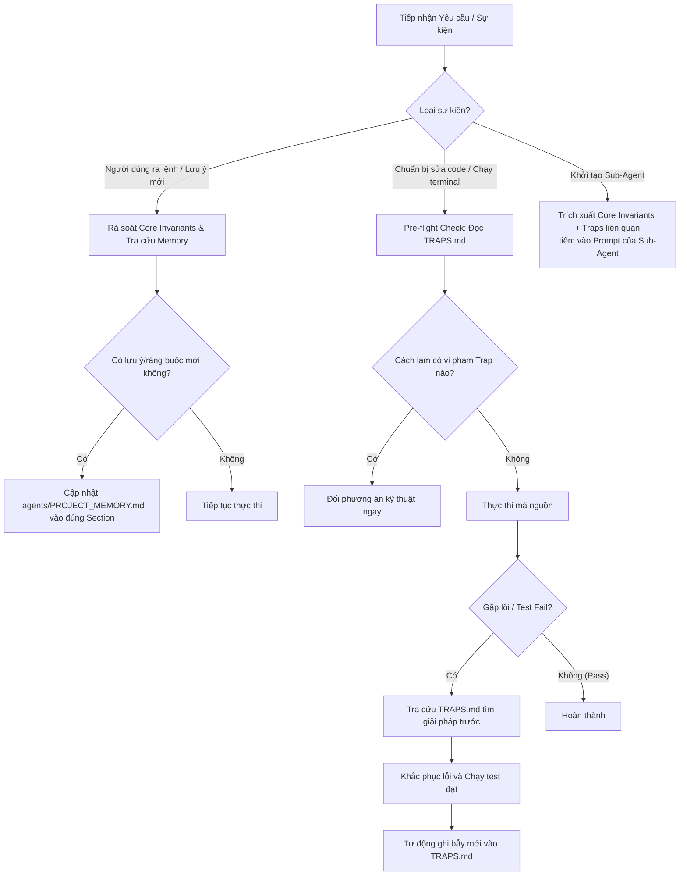

# Project Memory & Traps Management

## Overview
Duy trì bộ nhớ sống của dự án và bức tường lửa ngăn ngừa tái phạm lỗi lập trình (Memory Firewall). Agent trở nên thông minh hơn theo thời gian nhờ tích lũy các chỉ đạo nghiệp vụ vào [`.agents/PROJECT_MEMORY.md`](file:///c:/Users/Admin/HUIT%20-%20H%E1%BB%8Dc%20T%E1%BA%ADp/N%C4%83m%204/Chatbot_Project/.agents/PROJECT_MEMORY.md) và các bài học kỹ thuật vào [`TRAPS.md`](file:///c:/Users/Admin/HUIT%20-%20H%E1%BB%8Dc%20T%E1%BA%ADp/N%C4%83m%204/Chatbot_Project/TRAPS.md).

## When to Use



## Quick Reference: Cấu Trúc Ghi Chép

### 1. Mẫu Cập Nhật `.agents/PROJECT_MEMORY.md`
Khi người dùng đưa ra chỉ đạo mới, chèn vào mục tương ứng:
```markdown
- **[YYYY-MM-DD] <Tên lưu ý / Ràng buộc>**: <Mô tả chi tiết nội dung chỉ đạo, quy định nghiệp vụ hoặc thói quen code>.
```

### 2. Mẫu Ghi Bẫy Mã Nguồn vào `TRAPS.md`
Khi fix xong một lỗi kỹ thuật, thêm vào cuối tệp `TRAPS.md`:
```markdown
### [TRAP-xxx] <Tên bẫy / Lỗi ngắn gọn>
- **Môi trường & Công nghệ:** <PowerShell / Python / Docker Postgres / Pytest / FastAPI...>
- **Triệu chứng (Symptoms):** <Thông báo lỗi, exit code hoặc hành vi sai trái>
- **Nguyên nhân gốc rễ (Root Cause):** <Giải thích tại sao lỗi lại xảy ra>
- **Quy tắc dứt điểm (Never Do / Always Do):**
  * ❌ **NEVER:** <Hành động sai lầm đã làm>
  * ✅ **ALWAYS:** <Cách làm chuẩn xác bắt buộc áp dụng>
```

## Pre-flight Checklist Trước Khi Chạy Code
Trước khi gõ lệnh terminal hoặc chỉnh sửa file kỹ thuật:
1. [ ] Đã kiểm tra mục công nghệ tương ứng trong `TRAPS.md` chưa?
2. [ ] Có lệnh shell nào chứa chuỗi trích dẫn kép phức tạp hoặc backtick trên PowerShell Windows không?
3. [ ] Có script Python nào chạy độc lập cần bổ sung `PYTHONPATH` hoặc `sys.path` không?
4. [ ] Câu lệnh SQL Fact DWH có xử lý an toàn cho `NULLIF(TRIM(value), '')::numeric` chưa?

## Red Flags - DỪNG LẠI NGAY & SỬA LẠI
- "Lỗi này nhỏ quá, không cần ghi vào TRAPS.md đâu" $\to$ **Dừng lại: Lỗi nhỏ lặp lại nhiều lần gây tốn retry và burn token.**
- "Mình nhớ cách sửa rồi, không cần cập nhật PROJECT_MEMORY.md" $\to$ **Dừng lại: Session sau hoặc Sub-Agent sẽ quên ngay.**
- "Cứ chạy thử terminal xem có lỗi không rồi tính tiếp" $\to$ **Dừng lại: Bắt buộc Pre-flight check TRAPS.md trước.**

## Bảng Chống Ngụy Biện (Rationalization Table)
| Lời ngụy biện | Thực tế |
| :--- | :--- |
| *"User chỉ góp ý bâng quơ, không phải lệnh chính thức"* | Mọi góp ý của user đều phản ánh kỳ vọng thực tế. Ghi ngay vào Memory. |
| *"Lỗi cú pháp PowerShell chỉ do gõ nhầm"* | Escape ký tự trên Windows PowerShell luôn tái diễn nếu không có bẫy mẫu trong TRAPS. |
| *"Sub-agent tự thông minh đọc được codebase, không cần tiêm traps"* | Sub-agent chạy trong ngữ cảnh cô lập hoàn toàn; không tiêm bẫy là đảm bảo sub-agent sẽ vấp ngã y hệt. |
