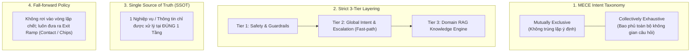
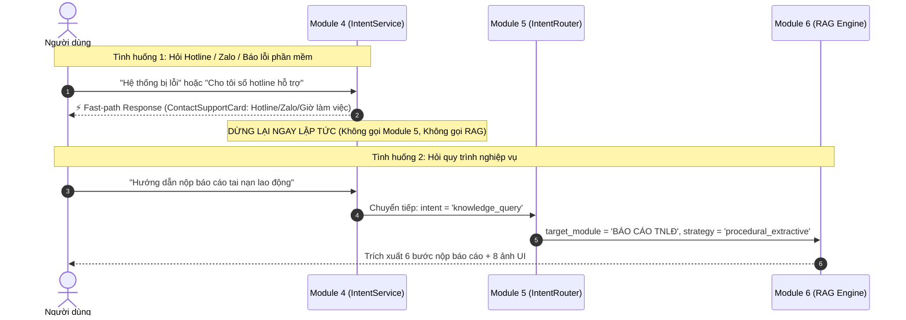

# QUY TẮC THIẾT KẾ KIẾN TRÚC HỆ THỐNG CHATBOT (CHATBOT SYSTEM DESIGN STANDARDS)

> **Mục đích:** Thiết lập bộ khung nguyên tắc chuẩn công nghiệp (Industry Standards) cho kiến trúc phân tầng, phân loại ý định (Intent Taxonomy), chính sách điều hướng (Routing Policy) và xử lý sự cố (Escalation & Fallback) cho toàn bộ hệ thống Chatbot HDSD Doanh nghiệp.  
> **Trạng thái:** BAN HÀNH QUY CHUẨN THIẾT KẾ CHUNG (ARCHITECTURAL NORMS)

---

## 1. NGUYÊN TẮC THIẾT KẾ CỐT LÕI (CORE ARCHITECTURAL PRINCIPLES)

Dựa trên các chuẩn mực kiến trúc Conversational AI hiện đại (Rasa NLU, Microsoft Bot Framework, AWS Lex, LangGraph Router Architecture), hệ thống Chatbot tuân thủ nghiêm ngặt **4 nguyên lý cốt lõi**:

### 1.1. Nguyên tắc MECE (Mutually Exclusive, Collectively Exhaustive)
* **Mutually Exclusive (Loại trừ lẫn nhau):** Một câu hỏi từ người dùng chỉ được ánh xạ vào **chính xác 1 Intent duy nhất** tại mỗi tầng phân loại. Tuyệt đối không để xảy ra tình trạng 1 thực thể/ý định xuất hiện đồng thời ở nhiều tầng hoặc bị che khuất (Shadowing).
* **Collectively Exhaustive (Bao phủ toàn diện):** Hệ thống có cơ chế tiếp nhận mọi câu hỏi mà không có vùng mù (Unknown), với các nhánh rẽ định sẵn: Chitchat $\to$ Escalation/Support $\to$ Domain RAG Knowledge $\to$ Out-of-scope Fallback.

### 1.2. Nguyên tắc Đơn nhiệm & Phân tầng Nghiêm ngặt (Strict Layering & Single Responsibility)
* **Tier 1 - Safety & Guardrails (Module 3):** Chuyên trách 100% việc lọc tấn công (Prompt Injection, SQL Injection, Jailbreak).
* **Tier 2 - Macro Intent & Escalation (Module 4):** Chuyên trách 100% các ý định toàn cục (Chào hỏi, Hỏi năng lực bot, Báo lỗi phần mềm, Yêu cầu Hotline/Zalo hỗ trợ).
* **Tier 3 - Domain & RAG Strategy Router (Module 5):** Chuyên trách 100% việc tra cứu tài liệu nghiệp vụ (Đăng ký, Đăng nhập, TNLĐ, ATVSLĐ, Thống kê...). **Không xử lý các thông tin hỗ trợ tĩnh.**

### 1.3. Nguyên tắc Đơn điểm Chân lý (Single Source of Truth - SSOT & DRY)
* Thông tin liên hệ kỹ thuật (Hotline, Zalo, Giờ làm việc) là **Dữ liệu Tĩnh Cứu trợ (Static Escalation Metadata)**, được định nghĩa và xử lý tập trung duy nhất tại **Tier 2 (Module 4)**, trả về dưới dạng Card UI trực tiếp $(< 10\text{ ms})$.
* Không đưa thông tin liên hệ hỗ trợ thành một phân hệ tài liệu (Document Chunk) trong Vector Database để tránh việc tốn tài nguyên tìm kiếm RAG cho một thông tin vốn dĩ cố định.

---

## 2. ĐẶC TẢ RANH GIỚI KIẾN TRÚC (SYSTEM BOUNDARIES & MODULE MATRIX)

Bảng phân định trách nhiệm rõ ràng, đảm bảo tính phân ly độc lập giữa các Module trong hệ thống:

| Tầng / Module | Trách nhiệm Duy nhất (Single Responsibility) | Các Routes / Intents Hợp lệ | Hành vi Xử lý & Đầu ra |
| :--- | :--- | :--- | :--- |
| **MODULE 03** *(Guardrails)* | Kiểm soát an toàn & lọc mã độc | `security_violation` | Từ chối ngay lập tức $(< 1\text{ ms})$. |
| **MODULE 04** *(Macro Intent & Escalation)* | Xử lý giao tiếp chung, năng lực hệ thống & điều hướng cứu hộ khẩn cấp | 1. `chitchat_capability` 2. `chitchat_greeting` 3. `chitchat_thanks` 4. `contact_escalation` *(Hotline/Zalo/Sự cố)* 5. `knowledge_query` *(Ủy quyền cho Module 5)* | **Fast-path In-Memory $(< 10\text{ ms})$**: Trả về câu trả lời trực tiếp + Contact Card + Quick Action Chips. |
| **MODULE 05** *(Domain & Strategy Router)* | Phân loại phân hệ nghiệp vụ & chiến lược RAG | **7 Phân hệ Nghiệp vụ Cốt lõi**: 1. `ĐĂNG KÝ` 2. `ĐĂNG NHẬP` 3. `THAY ĐỔI MẬT KHẨU` 4. `THAY ĐỔI THÔNG TIN DOANH NGHIỆP` 5. `BÁO CÁO ĐỊNH KỲ - 1. Tai nạn lao động` 6. `BÁO CÁO ĐỊNH KỲ - 2. An toàn vệ sinh lao động` 7. `THỐNG KÊ` | **Chiến lược RAG**: - `procedural_extractive` (Mode A) - `targeted_qa` (Mode B) |
| **MODULE 02 & 06** *(RAG Engine & LLM)* | Truy xuất tài liệu nghiệp vụ & Tổng hợp câu trả lời | Xử lý dữ liệu từ 7 phân hệ nghiệp vụ | Trích xuất các bước thực hiện hoặc gọi LLM trả lời chi tiết. |

---

## 3. THIẾT KẾ CHUẨN HÓA CHO LUỒNG HỖ TRỢ KỸ THUẬT (CONTACT & ESCALATION FLOW)

---

## 4. QUY CHUẨN ĐẶT TÊN & NGUYÊN TẮC LẬP TRÌNH (CODE CONVENTIONS)

1. **Quy tắc Gom nhóm Intent Hỗ trợ (Intent Cohesion):**
   * Tất cả các câu hỏi liên quan đến: *Hotline, số điện thoại, Zalo, tổng đài, bộ phận kỹ thuật, báo lỗi, treo máy, sự cố, giờ làm việc của tổng đài* $\to$ Gom chung về một Intent duy nhất: **`contact_escalation`** tại Module 4.
2. **Quy tắc Tinh gọn Domain Router (Lean Domain Router):**
   * Module 5 chỉ chứa danh mục các nghiệp vụ có quy trình hướng dẫn thao tác trong phần mềm (Actionable User Workflows). Tuyệt đối không chứa các danh mục thông tin liên hệ.
3. **Quy tắc Kiểm thử (Testing Standards):**
   * Khi viết Unit Test cho Module 4: Phải kiểm tra toàn bộ các biến thể hỏi Hotline/Zalo/Báo lỗi đều trả về `contact_escalation`.
   * Khi viết Unit Test cho Module 5: Danh sách `INTENT_MODULE_MAP` chỉ có đúng 7 phân hệ nghiệp vụ.
