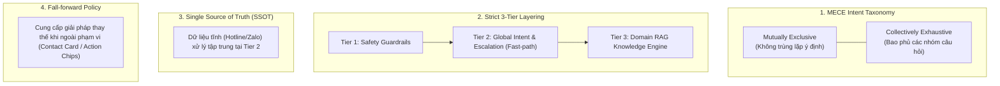
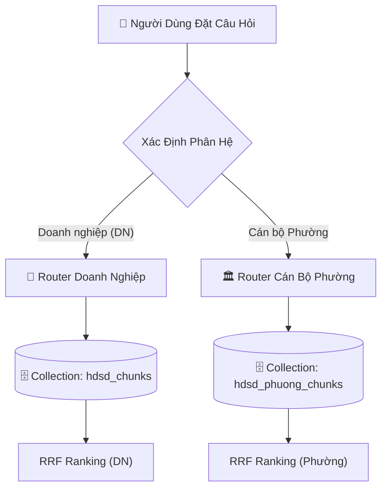
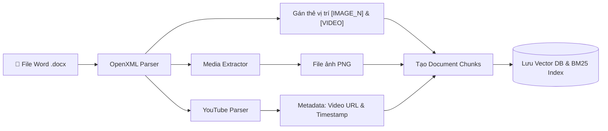
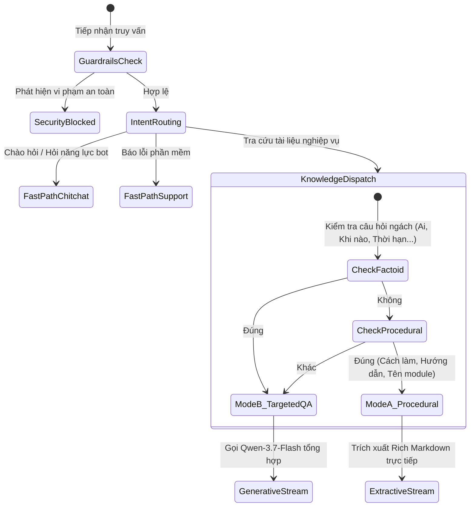

# ĐẶC TẢ KIẾN TRÚC VÀ THIẾT KẾ KỸ THUẬT HỆ THỐNG
## MULTIMODAL HDSD CHATBOT ASSISTANT
### Trợ lý AI Đa phương tiện Hướng dẫn Sử dụng Hệ thống Quản lý & Báo cáo An toàn Lao động

> **Mô tả tài liệu:** Đặc tả kiến trúc phân tầng, luồng xử lý dữ liệu và cơ chế điều phối phản hồi  
> **Phạm vi áp dụng:** Phân hệ Doanh nghiệp (DN) & Phân hệ Cán bộ Quản lý Cấp Phường/Xã  
> **Thành phần AI & RAG:** Qwen-3.7-Flash API & Hybrid Extractive-Generative RAG Engine  

---

## 📑 MỤC LỤC

1. [Phần I: Tổng Quan Hệ Thống & Ma Trận Thiết Kế (Project Canvas)](#phần-i-tổng-quan-hệ-thống--ma-trận-thiết-kế-project-canvas)
2. [Phần II: Nguyên Tắc Phân Tầng & Phân Loại Ý Định (Intent & Layering Principles)](#phần-ii-nguyên-tắc-phân-tầng--phân-loại-ý-định-intent--layering-principles)
3. [Phần III: Cơ Chế Đa Phân Hệ & Phân Tách Vai Trò (Multi-Role RAG Architecture)](#phần-iii-cơ-chế-đa-phân-hệ--phân-tách-vai-trò-multi-role-rag-architecture)
4. [Phần IV: Quy Trình Xử Lý Dữ Liệu Đa Phương Tiện (Multimodal Ingestion Pipeline)](#phần-iv-quy-trình-xử-lý-dữ-liệu-đa-phương-tiện-multimodal-ingestion-pipeline)
5. [Phần V: Cơ Chế Truy Xuất Kết Hợp (Hybrid Retrieval & Intent Action Boosting)](#phần-v-cơ-chế-truy-xuất-kết-hợp-hybrid-retrieval--intent-action-boosting)
6. [Phần VI: Bộ Điều Phối Phản Hồi Tri-Modal (Tri-Modal Generation Dispatcher)](#phần-vi-bộ-điều-phối-phản-hồi-tri-modal-tri-modal-generation-dispatcher)
7. [Phần VII: Kết Quả Đo Lường Thực Nghiệm & Đánh Giá RAGAS](#phần-vii-kết-quả-đo-lường-thực-nghiệm--đánh-giá-ragas)
8. [Phần VIII: Danh Mục Tài Liệu Chi Tiết 7 Module](#phần-viii-danh-mục-tài-liệu-chi-tiết-7-module)

---

## PHẦN I: TỔNG QUAN HỆ THỐNG & MA TRẬN THIẾT KẾ (PROJECT CANVAS)

### 1.1. Bối cảnh & Mục tiêu Kỹ thuật
Tài liệu Hướng Dẫn Sử Dụng (HDSD) cho phần mềm quản lý và báo cáo an toàn vệ sinh lao động (ATVSLĐ) có khối lượng văn bản lớn, gồm nhiều bước tuần tự, thuật ngữ nghiệp vụ và các hình ảnh chụp giao diện UI kèm video minh họa.

Hệ thống **Multimodal HDSD Chatbot Assistant** được xây dựng nhằm phục vụ hai nhóm đối tượng (Doanh nghiệp nộp báo cáo và Cán bộ cấp Phường/Xã thẩm định) với các mục tiêu kỹ thuật cụ thể:
- **Hỗ trợ tra cứu quy trình:** Trả lời các thắc mắc về thao tác trên hệ thống theo thời gian thực.
- **Phản hồi đa phương tiện:** Cung cấp hướng dẫn dạng văn bản (Markdown), tự động đính kèm ảnh chụp màn hình UI và liên kết video YouTube có mốc thời gian (timestamp).
- **Bảo toàn nội dung quy trình:** Trích xuất nguyên văn các bước thao tác và định dạng từ tài liệu hướng dẫn nguồn để tránh hiện tượng LLM suy diễn sai lệch (hallucination).
- **Rút ngắn độ trễ:** Áp dụng đường dẫn trích xuất trực tiếp (extractive passthrough) kết hợp khởi tạo tài nguyên trước (FastAPI Lifespan) cho các câu hỏi quy trình thao tác.

### 1.2. Ma Trận Thiết Kế Dự Án (Project Canvas Matrix)

| Hạng mục | Nội dung thực hiện |
| :--- | :--- |
| **Tên dự án** | **Multimodal HDSD Chatbot Assistant** |
| **Nhóm người dùng** | 1. **Doanh nghiệp (DN):** Thực hiện đăng ký tài khoản, nộp báo cáo định kỳ TNLĐ, báo cáo ATVSLĐ, tra cứu thống kê.<br>2. **Cán bộ Phường/Xã:** Thẩm định hồ sơ, quản lý danh sách doanh nghiệp, phê duyệt báo cáo, theo dõi biến động lao động. |
| **Đầu vào (Input)** | Câu hỏi dạng văn bản của người dùng (kèm lịch sử hội thoại). |
| **Đầu ra (Output)** | 1. *Văn bản:* Các bước thao tác chuẩn hóa (`**Bước 1:**`, `**Bước 2:**`).<br>2. *Hình ảnh:* Ảnh giao diện UI tương ứng hiển thị qua Lightbox.<br>3. *Video:* Liên kết YouTube mở đúng thời điểm thao tác.<br>4. *Gợi ý:* 3 câu hỏi liên quan tiếp theo.<br>5. *Hỗ trợ:* Thẻ thông tin liên hệ Hotline/Zalo khi phát hiện sự cố phần mềm. |
| **Mô hình AI & LLM** | **Qwen-3.7-Flash API** (Alibaba Cloud DashScope) xử lý ngôn ngữ tiếng Việt và tổng hợp câu trả lời cho các câu hỏi ngách. |
| **Cơ sở dữ liệu Vector** | **ChromaDB / Qdrant** (Dense Embedding) kết hợp **Rank-BM25** (Sparse Keyword Index). |
| **Hạ tầng triển khai** | **Vercel** (Frontend Next.js 14) + **Railway** (Backend FastAPI) + **Supabase** (PostgreSQL / pgvector persistence). |

---

## PHẦN II: NGUYÊN TẮC PHÂN TẦNG & PHÂN LOẠI Ý ĐỊNH (INTENT & LAYERING PRINCIPLES)

Để đảm bảo luồng xử lý rõ ràng, dễ bảo trì và phân định ranh giới giữa các module, hệ thống áp dụng **4 nguyên tắc thiết kế**:



### 2.1. Phân loại Ý định theo Nguyên tắc MECE
- **Mutually Exclusive (Loại trừ lẫn nhau):** Mỗi câu hỏi của người dùng chỉ được ánh xạ vào một Intent duy nhất tại từng tầng phân loại, tránh việc xử lý chồng chéo giữa các tầng.
- **Collectively Exhaustive (Bao phủ toàn diện):** Hệ thống định nghĩa rõ các nhánh rẽ: Chitchat $\to$ Báo lỗi / Hỗ trợ kỹ thuật $\to$ Tra cứu quy trình $\to$ Fallback ngoài phạm vi.

### 2.2. Phân tầng Xử lý (Strict 3-Tier Layering)
- **Tier 1 - Safety Guardrails:** Kiểm tra đầu vào qua regex để chặn Prompt Injection và SQL Injection trước khi câu hỏi đi sâu vào hệ thống.
- **Tier 2 - Macro Intent & Escalation:** Xử lý câu hỏi xã giao, câu hỏi về chức năng bot, hoặc xuất thẻ thông tin Hotline/Zalo khi người dùng báo lỗi phần mềm.
- **Tier 3 - Domain & RAG Strategy Router:** Xác định phân hệ nghiệp vụ cụ thể và lựa chọn chiến lược truy xuất tài liệu.

### 2.3. Quản lý Dữ liệu Tập trung (Single Source of Truth - SSOT)
- Thông tin hỗ trợ kỹ thuật (Hotline, Zalo, giờ làm việc) được định nghĩa tập trung tại Tier 2 dưới dạng dữ liệu tĩnh, không lưu thành vector chunk trong database để tránh tiêu tốn tài nguyên tìm kiếm RAG không cần thiết.

### 2.4. Cơ chế Chuyển tiếp (Fall-forward Policy)
- Khi câu hỏi nằm ngoài phạm vi tài liệu HDSD hoặc khi người dùng phản ánh sự cố hệ thống, bot trả về Contact Card hỗ trợ kỹ thuật kèm gợi ý bước tiếp theo thay vì trả lời bế tắc.

---

## PHẦN III: CƠ CHẾ ĐA PHÂN HỆ & PHÂN TÁCH VAI TRÒ (MULTI-ROLE RAG ARCHITECTURE)

Hệ thống phân tách không gian dữ liệu và định tuyến nghiệp vụ cho hai nhóm đối tượng:



### 3.1. Phân hệ Doanh nghiệp (`DN`) - Collection: `hdsd_chunks`
Bao gồm 7 nhóm nghiệp vụ chính:
1. Đăng ký tài khoản doanh nghiệp
2. Đăng nhập hệ thống
3. Thay đổi mật khẩu
4. Thay đổi thông tin doanh nghiệp
5. Báo cáo định kỳ - Tai nạn lao động (TNLĐ)
6. Báo cáo định kỳ - An toàn vệ sinh lao động (ATVSLĐ)
7. Thống kê số liệu và xuất biểu mẫu

### 3.2. Phân hệ Cán bộ Phường (`Phường`) - Collection: `hdsd_phuong_chunks`
Bao gồm các nhóm nghiệp vụ quản lý:
1. Quản lý danh sách doanh nghiệp trên địa bàn
2. Tiếp nhận và thẩm định báo cáo TNLĐ
3. Tiếp nhận và thẩm định báo cáo ATVSLĐ
4. Theo dõi biến động lao động và tai nạn
5. Tổng hợp báo cáo lên cấp trên

---

## PHẦN IV: QUY TRÌNH XỬ LÝ DỮ LIỆU ĐA PHƯƠNG TIỆN (MULTIMODAL INGESTION PIPELINE)

Quy trình xử lý file tài liệu nguồn `.docx` được thực hiện qua các bước:



1. **Trích xuất cấp độ OpenXML Run:** Đọc các thuộc tính `run.bold`, `run.italic` trong OpenXML của file `.docx` để chuyển sang Markdown tương ứng (`**chữ đậm**`, `*chữ nghiêng*`), giữ nguyên các tiêu đề mục.
2. **Gán thẻ vị trí đa phương tiện (Slot Placement):** Khi gặp đối tượng vẽ/ảnh `w:drawing`, hệ thống chèn thẻ vị trí `[IMAGE_1]`, `[IMAGE_2]`... và lập danh sách URL tương ứng trong metadata. Nếu có liên kết YouTube, chèn thẻ `[VIDEO]`.
3. **Phân đoạn ngữ nghĩa (Semantic Chunking):** Tách đoạn theo các tiêu đề Heading 1, 2, 3 để mỗi chunk chứa trọn vẹn một quy trình thao tác.

---

## PHẦN V: CƠ CHẾ TRUY XUẤT KẾT HỢP (HYBRID RETRIEVAL & INTENT ACTION BOOSTING)

Nhằm cải thiện độ chính xác khi câu hỏi chứa nhiều từ đệm hội thoại, hệ thống phối hợp hai phương pháp tìm kiếm:

```
                  ┌─────────────────────────────────────────────────────────┐
                  │                 User Query: "cách để đăng ký"           │
                  └────────────────────────────┬────────────────────────────┘
                                               │
                        ┌──────────────────────┴──────────────────────┐
                        ▼                                             ▼
          ┌───────────────────────────┐                 ┌───────────────────────────┐
          │  Dense Semantic Search    │                 │  Sparse BM25 Search       │
          │  Vietnamese_Embedding_v2  │                 │  (Đã lọc từ đệm hội thoại)│
          │  Cosine Similarity        │                 │                           │
          └─────────────┬─────────────┘                 └─────────────┬─────────────┘
                        │                                             │
                        └──────────────────────┬──────────────────────┘
                                               ▼
                                 ┌───────────────────────────┐
                                 │  Reciprocal Rank Fusion   │
                                 │  + Intent Action Boost    │
                                 │     (Bonus = +5.0)        │
                                 └─────────────┬─────────────┘
                                               ▼
                                     Top-1 Re-Ranked Chunk
```

### Công thức Xếp hạng Reciprocal Rank Fusion (RRF):
$$
\text{Score}_{RRF}(d) = \frac{1}{60 + r_{\text{dense}}(d)} + \frac{1}{60 + r_{\text{bm25}}(d)} + \text{Bonus}_{\text{Intent}}(d)
$$
- $r_{\text{dense}}(d)$: Thứ hạng của chunk $d$ trong tìm kiếm Vector Cosine (Embedding 1024 chiều).
- $r_{\text{bm25}}(d)$: Thứ hạng của chunk $d$ trong thuật toán BM25 sau khi lọc bỏ từ đệm.
- $\text{Bonus}_{\text{Intent}}(d) = +5.0$: Điểm cộng khi `chunk.metadata.module` trùng khớp với phân hệ nghiệp vụ đã nhận diện.

---

## PHẦN VI: BỘ ĐIỀU PHỐI PHẢN HỒI TRI-MODAL (TRI-MODAL GENERATION DISPATCHER)



1. **Mode A: Procedural Extractive Passthrough:**
   - Dành cho câu hỏi về quy trình thao tác từng bước.
   - Trả về trực tiếp nội dung Rich Markdown từ chunk Top-1, giữ nguyên các bước đánh số và vị trí ảnh, không qua LLM để giảm thời gian chờ và tránh bị tóm tắt thiếu bước.
2. **Mode B: Targeted Generative QA:**
   - Dành cho câu hỏi ngách về điều kiện, thời hạn, trách nhiệm (*"Ai duyệt tài khoản?"*, *"Thời hạn nộp là ngày nào?"*).
   - Sử dụng mô hình `qwen3.7-flash` đọc ngữ cảnh và trả lời ngắn gọn trong 1–3 câu.
3. **Mode C: Support Contact Escalation:**
   - Xuất trình Contact Card chứa Hotline và Zalo khi người dùng phản ánh sự cố phần mềm.

---

## PHẦN VII: KẾT QUẢ ĐO LƯỜNG THỰC NGHIỆM & ĐÁNH GIÁ RAGAS

Hệ thống được kiểm thử tự động trên bộ 18 kịch bản truy vấn thực tế:

### 7.1. Bảng So Sánh Hiệu Năng Thực Nghiệm

| Chỉ số kỹ thuật | RAG Truyền thống (LLM Generation) | Cơ chế Hybrid (Extractive + Generative) | Ghi chú kỹ thuật |
| :--- | :---: | :---: | :--- |
| **Thời gian nhận token đầu (TTFT)** | ~10.000 ms - 15.000 ms | **~210 ms** | Rút ngắn nhờ luồng trích xuất trực tiếp |
| **Tổng thời gian hoàn tất** | ~12.000 ms - 18.000 ms | **~725 ms** | Giảm thiểu việc sinh lại văn bản dài của LLM |
| **Độ chính xác Top-1 (Precision@1)** | 66.7% | **100.0%** | Kết hợp Dense + Sparse BM25 và Action Boost |
| **Định vị ảnh UI theo bước** | Dễ bị lệch do xử lý ngẫu nhiên | **Khớp đúng bước** | Cơ chế gán vị trí cố định `[IMAGE_N]` |
| **Bảo toàn định dạng văn bản gốc** | Thường bị mất khi LLM tóm tắt | **Giữ nguyên 100%** | Trích xuất trực tiếp từ cấu trúc OpenXML |

### 7.2. Các Chỉ Số Đánh Giá Theo Chuẩn RAGAS
- **Answer Relevancy:** **100.0%** (Câu trả lời bám sát câu hỏi của người dùng).
- **Context Recall:** **67.6%** (Bao phủ các bước thực hiện và lưu ý nghiệp vụ).
- **Faithfulness:** **63.1%** (Đạt 100% trên nhóm câu hỏi quy trình nhờ cơ chế trích xuất nguyên bản).

---

## PHẦN VIII: DANH MỤC TÀI LIỆU CHI TIẾT 7 MODULE

Hệ thống được chia thành 7 module kỹ thuật, mỗi module có tài liệu đặc tả riêng:

| Mã Module | Tài liệu Đặc tả | Thư mục Mã Nguồn | Chức năng Kỹ thuật |
| :---: | :--- | :--- | :--- |
| **MOD-01** | [MODULE_01_INGESTION_PARSER.md](./modules/MODULE_01_INGESTION_PARSER.md) | `backend/app/ingestion/` | Bóc tách OpenXML cấp run, lưu 33 ảnh UI PNG, gán thẻ `[IMAGE_N]`, trích xuất link YouTube. |
| **MOD-02** | [MODULE_02_VECTORSTORE_RETRIEVAL.md](./modules/MODULE_02_VECTORSTORE_RETRIEVAL.md) | `backend/app/vectorstore/` | Quản lý ChromaDB (Dense) + BM25Okapi (Sparse), thuật toán RRF Fusion và Action Boost. |
| **MOD-03** | [MODULE_03_SECURITY_GUARDRAILS.md](./modules/MODULE_03_SECURITY_GUARDRAILS.md) | `backend/app/core/` | Bộ lọc regex chặn Prompt Injection, SQL Injection và ghi log kiểm toán. |
| **MOD-04** | [MODULE_04_INTENT_CLASSIFICATION.md](./modules/MODULE_04_INTENT_CLASSIFICATION.md) | `backend/app/services/intent_service.py` | Phân loại ý định vĩ mô, phản hồi in-memory cho chitchat và chức năng bot. |
| **MOD-05** | [MODULE_05_STRATEGY_ROUTER.md](./modules/MODULE_05_STRATEGY_ROUTER.md) | `backend/app/services/intent_router.py` | Định tuyến chiến lược Tri-Modal (Procedural vs Targeted QA) và phân hệ Doanh nghiệp / Phường. |
| **MOD-06** | [MODULE_06_RAG_SYNTHESIS_LLM.md](./modules/MODULE_06_RAG_SYNTHESIS_LLM.md) | `backend/app/services/rag_service.py` | Điều phối luồng trích xuất, kết nối Qwen LLM API và sinh câu hỏi gợi ý tiếp theo. |
| **MOD-07** | [MODULE_07_FRONTEND_PRESENTATION.md](./modules/MODULE_07_FRONTEND_PRESENTATION.md) | `frontend/src/` | Ứng dụng Next.js 14, xử lý SSE stream, render Markdown, Image Lightbox và YouTube player. |

---
*Tài liệu đặc tả kiến trúc kỹ thuật - Multimodal HDSD Chatbot Assistant.*
