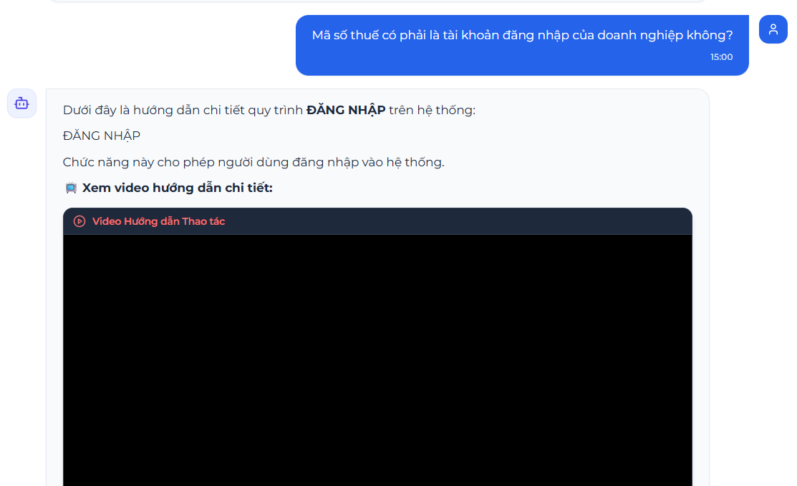
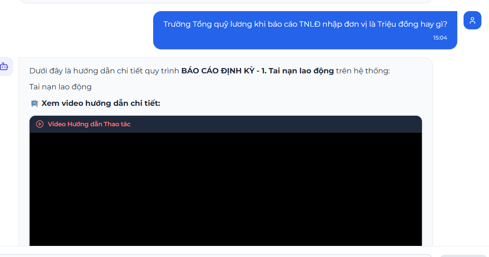
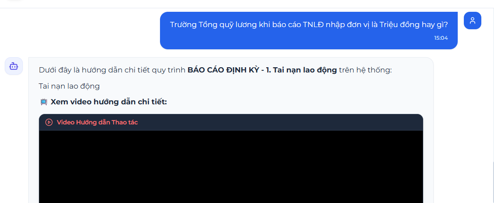
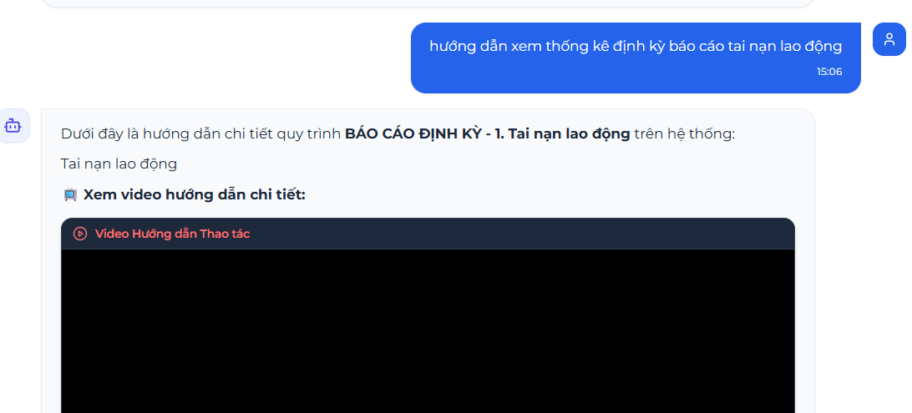
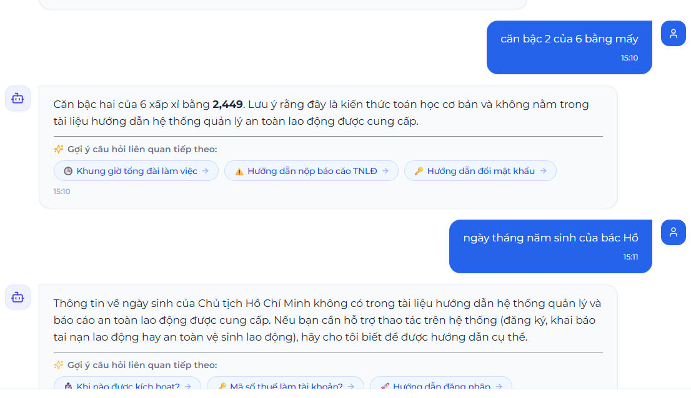

1. **Hỏi câu hỏi ngách nhưng output ra Mode-A** 

- 

2. **Sai tài liệu giữa các mode**

- Hỏi tài liệu thống kê nhưng output ra tài liệu tai nạn lao động

3. **Out-of-scope**

Những quest này phải từ chối trả lời vì thông tin quest không có trong database và phải outpt ra thông tin liên hệ của bộ phận hỗ trợ
