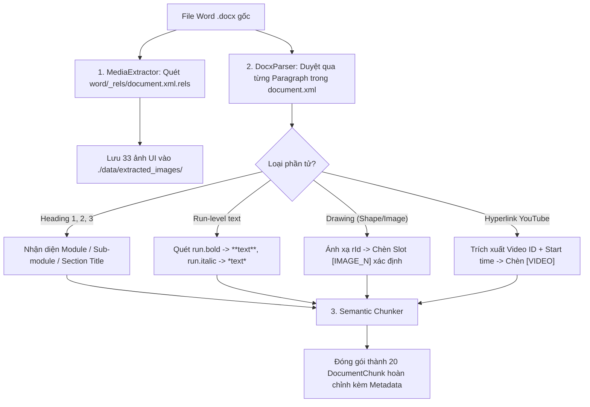

# MODULE 01: INGESTION & MULTIMODAL PARSER ENGINE
> **Tài liệu Kỹ thuật Chi tiết - Phân hệ Xử lý Dữ liệu Đầu vào**  
> **Tài liệu gốc tham chiếu:** [SYSTEM_DOCUMENTATION.md](file:///c:/Users/Admin/HUIT%20-%20H%E1%BB%8Dc%20T%E1%BA%ADp/N%C4%83m%204/Chatbot_Project/Bussiness_Rules/docs/SYSTEM_DOCUMENTATION.md)  
> **Tài liệu nghiệp vụ liên kết:** [_AI_HDSD_ATLĐ (DN).v1_HCM_2026 (1).docx](file:///c:/Users/Admin/HUIT%20-%20H%E1%BB%8Dc%20T%E1%BA%ADp/N%C4%83m%204/Chatbot_Project/Bussiness_Rules/docs/_AI_HDSD_ATL%C4%90%20(DN).v1_HCM_2026%20(1).docx)

---

## 1. Tổng quan & Vị trí Module trong Codebase

Module **Ingestion & Multimodal Parser Engine** chịu trách nhiệm đọc hiểu cấu trúc phân cấp Office OpenXML của tệp Word hướng dẫn sử dụng gốc, trích xuất nguyên vẹn văn bản định dạng Rich Markdown (giữ nguyên in đậm, in nghiêng, tiêu đề phân hệ, các bước thực hiện), bóc tách toàn bộ 33 ảnh giao diện UI chuẩn xác $1:1$ và nhận diện các liên kết video YouTube kèm mốc thời gian bắt đầu.

### Các tệp nguồn chính:
* [`app/ingestion/docx_parser.py`](file:///c:/Users/Admin/HUIT%20-%20H%E1%BB%8Dc%20T%E1%BA%ADp/N%C4%83m%204/Chatbot_Project/backend/app/ingestion/docx_parser.py): Quét OpenXML cấp Run, trích xuất cấu trúc Heading/Paragraphs/Drawings.
* [`app/ingestion/media_extractor.py`](file:///c:/Users/Admin/HUIT%20-%20H%E1%BB%8Dc%20T%E1%BA%ADp/N%C4%83m%204/Chatbot_Project/backend/app/ingestion/media_extractor.py): Bóc tách tệp nhị phân ảnh từ zip package và phân tích cú pháp link YouTube.
* [`app/ingestion/chunker.py`](file:///c:/Users/Admin/HUIT%20-%20H%E1%BB%8Dc%20T%E1%BA%ADp/N%C4%83m%204/Chatbot_Project/backend/app/ingestion/chunker.py): Phân đoạn ngữ nghĩa theo từng mục nghiệp vụ (Semantic Heading Chunking).
* [`scripts/ingest_docs.py`](file:///c:/Users/Admin/HUIT%20-%20H%E1%BB%8Dc%20T%E1%BA%ADp/N%C4%83m%204/Chatbot_Project/backend/scripts/ingest_docs.py): Kịch bản thực thi toàn bộ pipeline nạp tài liệu vào cơ sở dữ liệu.

---

## 2. Logic Xử lý Chi tiết (Detailed Processing Logic)



### 2.1. Quét cấp độ Run (XML Run-level Rich Text Extraction)
Không dùng `paragraph.text` thông thường (vì làm mất in đậm/nghiêng). Thuật toán duyệt qua từng `Run` trong thẻ `<w:p>`:
1. Nếu `run.bold == True` $\to$ bọc cú pháp Markdown: `**{text}**`.
2. Nếu `run.italic == True` $\to$ bọc cú pháp Markdown: `*{text}*`.
3. Nhận diện các mẫu bước thực hiện (`1.`, `2.`, `Bước 1:`, `Bước 2:`) $\to$ chuẩn hóa thống nhất về: `**Bước N:**`.

### 2.2. Định vị Đa phương tiện Xác định (Deterministic Media Slot Insertion)
* Khi gặp thẻ `<w:drawing>` trong OpenXML, hệ thống bóc tách thuộc tính `r:embed="rIdX"`.
* Tra cứu mối quan hệ trong file `document.xml.rels` để lấy tên file ảnh thực tế và lưu với format:  
  `_AI_HDSD_ATLĐ__DN__v1_HCM_2026_img_{image_index}_{rId}.png`.
* Chèn vị trí tương đối `[IMAGE_N]` (với $N$ bắt đầu từ 1 trong từng mục chunk).
* Đoạn văn bản ngay dưới ảnh nếu có kiểu chữ in nghiêng sẽ được tự động gom làm caption: `*(Màn hình đăng ký)*`.

### 2.3. Phân chia Đoạn theo Cấu trúc Ngữ nghĩa (Semantic Chunking)
* Không cắt theo số lượng ký tự cố định (fixed token chunking) để tránh gãy nát quy trình.
* Cắt chunk theo **Heading Boundaries (Tiêu đề phân hệ)**: Mỗi mục nghiệp vụ (ví dụ: mục "1. Đăng ký tài khoản", mục "2. Đăng nhập", mục "3. Báo cáo TNLĐ") tạo thành một `DocumentChunk` nguyên khối, bảo toàn trọn vẹn ngữ cảnh từ Bước 1 đến Bước cuối cùng.

---

## 3. Đặc tả Giao tiếp Input / Output (Data Contracts)

### 3.1. Input Specification
* **File nguồn:** Tệp Microsoft Word `.docx` (Office OpenXML format).
* **Đường dẫn mặc định:** `Bussiness_Rules/docs/_AI_HDSD_ATLĐ (DN).v1_HCM_2026 (1).docx`.

### 3.2. Output Specification (`DocumentChunk` Model)
```python
class ChunkMetadata(BaseModel):
    module: Optional[str]              # VD: "ĐĂNG KÝ", "BÁO CÁO ĐỊNH KỲ - 1. Tai nạn lao động"
    sub_module: Optional[str]          # VD: "Báo cáo định kỳ (có HĐLĐ)"
    section_title: str                 # VD: "1. Đăng ký tài khoản doanh nghiệp"
    heading_level: int                 # 1, 2 hoặc 3
    document_source: str               # "_AI_HDSD_ATLĐ (DN).v1_HCM_2026 (1).docx"
    image_urls: List[str]              # Danh sách URL ảnh tương ứng với [IMAGE_1], [IMAGE_2]...
    youtube_info: Optional[YouTubeInfo]# Thông tin video nếu có
    action_keywords: List[str]         # ["đăng ký", "tạo tài khoản", "mã số thuế"]

class DocumentChunk(BaseModel):
    id: str                            # UUID duy nhất của Chunk (VD: "chunk_doc_01")
    text_content: str                  # Văn bản Rich Markdown nguyên bản chứa [IMAGE_N], [VIDEO]
    metadata: ChunkMetadata
```

---

## 4. Ma trận Liên kết Nghiệp vụ với Tài liệu `_AI_HDSD_ATLĐ (DN)`

| STT | Phân hệ / Mục trong file Word | Cấp Heading | Tên Module ánh xạ | Số ảnh UI | Link Video YouTube |
| :---: | :--- | :---: | :--- | :---: | :---: |
| **1** | **I. ĐĂNG KÝ TÀI KHOẢN** | Heading 1 | `ĐĂNG KÝ` | 3 ảnh (img 0, 1, 2) | Có |
| **2** | **II. ĐĂNG NHẬP HỆ THỐNG** | Heading 1 | `ĐĂNG NHẬP` | 2 ảnh (img 3, 4) | Có |
| **3** | **III. THAY ĐỔI MẬT KHẨU** | Heading 1 | `THAY ĐỔI MẬT KHẨU` | 2 ảnh (img 6, 7) | Không |
| **4** | **IV. THAY ĐỔI THÔNG TIN DOANH NGHIỆP** | Heading 1 | `THAY ĐỔI THÔNG TIN DOANH NGHIỆP` | 3 ảnh (img 8, 10, 16) | Không |
| **5** | **V. BÁO CÁO ĐỊNH KỲ - 1. Báo cáo TNLĐ** | Heading 2 | `BÁO CÁO ĐỊNH KỲ - 1. Tai nạn lao động` | 8 ảnh (img 17 - 25) | Có |
| **6** | **V. BÁO CÁO ĐỊNH KỲ - 2. Báo cáo ATVSLĐ** | Heading 2 | `BÁO CÁO ĐỊNH KỲ - 2. An toàn vệ sinh lao động` | 8 ảnh (img 26 - 33) | Có |
| **7** | **VI. THỐNG KÊ BÁO CÁO** | Heading 1 | `THỐNG KÊ` | 4 ảnh (img 34 - 37) | Không |
| **8** | **VII. LIÊN HỆ HỖ TRỢ KỸ THUẬT** | Heading 1 | `LIÊN HỆ HỖ TRỢ` | 3 ảnh (img 38 - 42) | Không |

---

## 5. Kịch bản & Mã Kiểm thử Độc lập (Unit Test Suite)

```python
import pytest
from pathlib import Path
from app.ingestion.docx_parser import DocxParser
from app.ingestion.chunker import SemanticChunker

def test_docx_parser_and_image_extraction():
    docx_path = "Bussiness_Rules/docs/_AI_HDSD_ATLĐ (DN).v1_HCM_2026 (1).docx"
    assert Path(docx_path).exists(), "Tệp docx gốc phải tồn tại"

    parser = DocxParser(docx_path)
    parsed_sections = parser.parse()
    
    assert len(parsed_sections) > 0
    # Kiểm tra bảo toàn định dạng in đậm và slot ảnh
    reg_section = next(s for s in parsed_sections if "ĐĂNG KÝ" in s["title"])
    assert "**Bước 1:**" in reg_section["content"]
    assert "[IMAGE_1]" in reg_section["content"]
    assert len(reg_section["images"]) >= 2

def test_semantic_chunker():
    dummy_sections = [
        {
            "title": "I. ĐĂNG KÝ TÀI KHOẢN",
            "level": 1,
            "module": "ĐĂNG KÝ",
            "content": "**Bước 1:** Truy cập web.\n[IMAGE_1]\n\n**Bước 2:** Nhập MST.",
            "images": ["img_1.png", "img_2.png"],
            "youtube": {"video_id": "xyz", "start_seconds": 10, "display_link": "https://youtu.be/xyz"}
        }
    ]
    chunker = SemanticChunker()
    chunks = chunker.split_sections(dummy_sections)
    
    assert len(chunks) == 1
    assert chunks[0].metadata.module == "ĐĂNG KÝ"
    assert chunks[0].metadata.youtube_info.video_id == "xyz"
    assert len(chunks[0].metadata.image_urls) == 2
```
