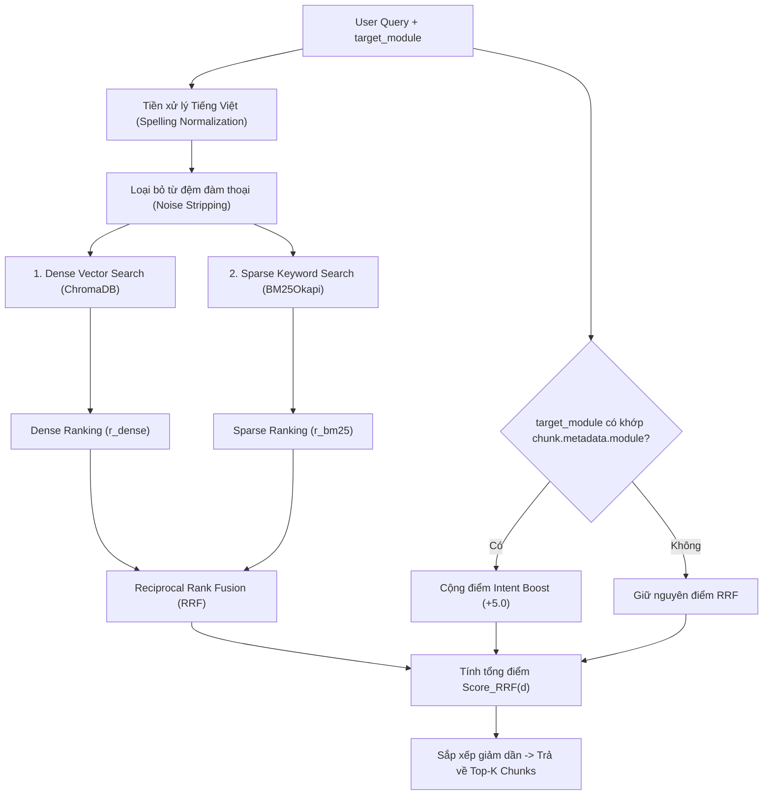

# MODULE 02: STORAGE & HYBRID INDEXING LAYER
> **Tài liệu Kỹ thuật Chi tiết - Phân hệ Lưu trữ & Truy xuất Lai**  
> **Tài liệu gốc tham chiếu:** [SYSTEM_DOCUMENTATION.md](file:///c:/Users/Admin/HUIT%20-%20H%E1%BB%8Dc%20T%E1%BA%ADp/N%C4%83m%204/Chatbot_Project/Bussiness_Rules/docs/SYSTEM_DOCUMENTATION.md)  
> **Tài liệu nghiệp vụ liên kết:** [_AI_HDSD_ATLĐ (DN).v1_HCM_2026 (1).docx](file:///c:/Users/Admin/HUIT%20-%20H%E1%BB%8Dc%20T%E1%BA%ADp/N%C4%83m%204/Chatbot_Project/Bussiness_Rules/docs/_AI_HDSD_ATL%C4%90%20(DN).v1_HCM_2026%20(1).docx)

---

## 1. Tổng quan & Vị trí Module trong Codebase

Module **Storage & Hybrid Indexing Layer** đóng vai trò là kho lưu trữ trung tâm và cỗ máy tìm kiếm kết hợp đa phương thức (Hybrid Retrieval Engine). Hệ thống tích hợp song song:
1. **Dense Vector Search (ChromaDB)**: Tìm kiếm độ tương đồng ngữ nghĩa bằng Cosine Similarity.
2. **Sparse Keyword Search (Rank-BM25Okapi)**: Tìm kiếm từ khóa chính xác, có tiền xử lý chuẩn hóa chính tả tiếng Việt và loại bỏ từ đệm đàm thoại.
3. **Thuật toán Hợp nhất Thứ hạng RRF (Reciprocal Rank Fusion)**: Kết hợp điểm số của 2 cỗ máy tìm kiếm cùng điểm thưởng ưu tiên nghiệp vụ **`+5.0 Intent Boost`**.

### Các tệp nguồn chính:
* [`app/vectorstore/base.py`](file:///c:/Users/Admin/HUIT%20-%20H%E1%BB%8Dc%20T%E1%BA%ADp/N%C4%83m%204/Chatbot_Project/backend/app/vectorstore/base.py): Interface trừu tượng cơ sở cho các Vector Database.
* [`app/vectorstore/chroma_store.py`](file:///c:/Users/Admin/HUIT%20-%20H%E1%BB%8Dc%20T%E1%BA%ADp/N%C4%83m%204/Chatbot_Project/backend/app/vectorstore/chroma_store.py): Quản lý lưu trữ ChromaDB cục bộ với mô hình nhúng (`paraphrase-multilingual-MiniLM-L12-v2` hoặc ONNX embedding).
* [`app/vectorstore/hybrid_retriever.py`](file:///c:/Users/Admin/HUIT%20-%20H%E1%BB%8Dc%20T%E1%BA%ADp/N%C4%83m%204/Chatbot_Project/backend/app/vectorstore/hybrid_retriever.py): Cỗ máy truy xuất kết hợp BM25 + ChromaDB + Module Filter + RRF Fusion.

---

## 2. Logic Xử lý Chi tiết (Detailed Processing Logic)



### 2.1. Chuẩn hóa Chính tả Tiếng Việt & Phân tách Token (`tokenize_vi`)
Tiếng Việt có nhiều biến thể gõ dấu (ví dụ: `kí` vs `ký`, `quí` vs `quý`, `mĩ` vs `mỹ`). Hệ thống dùng bảng quy đổi `VI_NORMALIZATION_MAP` để đồng nhất toàn bộ từ khóa trước khi nạp vào chỉ mục BM25:
```python
VI_NORMALIZATION_MAP = {
    r"\bkí\b": "ký", r"\bkì\b": "kỳ", r"\bkỉ\b": "kỷ", r"\bkĩ\b": "kỹ", r"\bkị\b": "kỵ",
    r"\blí\b": "lý", r"\blì\b": "lỳ", r"\blỉ\b": "lỷ", r"\blĩ\b": "lỹ", r"\blị\b": "lỵ",
    r"\bmí\b": "mỹ", r"\bmì\b": "mỳ", r"\bmỉ\b": "mỷ", r"\bmĩ\b": "mỹ", r"\bmị\b": "mỵ",
    r"\bsí\b": "sỹ", r"\bsì\b": "sỳ", r"\bsỉ\b": "sỷ", r"\bsĩ\b": "sỹ", r"\bsị\b": "sỵ",
    r"\btí\b": "tỷ", r"\btì\b": "tỳ", r"\btỉ\b": "tỷ", r"\btĩ\b": "tỹ", r"\btị\b": "tỵ",
    r"\bquí\b": "quý", r"\bquì\b": "quỳ", r"\bquỉ\b": "quỷ", r"\bquĩ\b": "quỹ", r"\bquị\b": "quỵ",
}
```

### 2.2. Kỹ thuật Phân tách Từ đệm Hội thoại (`strip_conversational_noise`)
Loại bỏ các từ dừng như *"làm sao để"*, *"cách để"*, *"hướng dẫn tôi"*, *"trong app"*, *"trên hệ thống"* để tránh làm loãng trọng số TF-IDF của BM25.

### 2.3. Công thức Hợp nhất Thứ hạng RRF + Intent Action Boost
Điểm số cuối cùng của mỗi chunk $d$ được tính theo công thức:
$$
\text{Score}_{RRF}(d) = \frac{1}{60 + r_{\text{dense}}(d)} + \frac{1}{60 + r_{\text{bm25}}(d)} + \text{Bonus}_{\text{Intent}}(d)
$$

* $r_{\text{dense}}(d)$: Thứ hạng của chunk $d$ trong danh sách trả về của ChromaDB ($0, 1, 2, \dots$).
* $r_{\text{bm25}}(d)$: Thứ hạng của chunk $d$ trong danh sách trả về của BM25 ($0, 1, 2, \dots$).
* $\text{Bonus}_{\text{Intent}}(d) = +5.0$: Điểm cộng tuyệt đối nếu chunk thuộc đúng `target_module` được Router phân loại. Điều này đảm bảo chunk đúng nghiệp vụ luôn đứng Top-1.

---

## 3. Đặc tả Giao tiếp Input / Output (Data Contracts)

### 3.1. Input Parameters cho hàm `search`
```python
async def search(
    query: str,                     # Câu hỏi của user (VD: "cách nộp báo cáo tai nạn lao động")
    top_k: int = 2,                 # Số lượng chunk cần lấy (mặc định 2 hoặc 3)
    alpha: float = 0.3,             # Trọng số ưu tiên (0.0: thuần BM25, 1.0: thuần Vector)
    target_module: Optional[str] = None # Phân hệ mục tiêu (VD: "BÁO CÁO ĐỊNH KỲ - 1. Tai nạn lao động")
) -> List[DocumentChunk]:
```

### 3.2. Output Return
Trả về danh sách `List[DocumentChunk]` đã được sắp xếp điểm giảm dần, mỗi phần tử chứa đầy đủ:
* `id`: Định danh chunk.
* `text_content`: Văn bản Markdown nguyên bản có thẻ `[IMAGE_N]` và `[VIDEO]`.
* `metadata`: Chứa danh sách URL ảnh, liên kết YouTube và tiêu đề mục.

---

## 4. Ma trận Liên kết Nghiệp vụ với Tài liệu `_AI_HDSD_ATLĐ (DN)`

| Phân hệ Nghiệp vụ (`target_module`) | Thuật ngữ / Từ khóa BM25 Đặc thù | Quy tắc Ràng buộc Nghiệp vụ Cần Bảo Toàn |
| :--- | :--- | :--- |
| **`ĐĂNG KÝ`** | `đăng ký`, `tạo tài khoản`, `mã số thuế`, `mst`, `kích hoạt` | Mã số thuế chính là tài khoản đăng nhập; Sở xem xét kích hoạt. |
| **`ĐĂNG NHẬP`** | `đăng nhập`, `login`, `mật khẩu`, `tài khoản` | Nhập MST và Mật khẩu do Sở cấp/đã đổi. |
| **`THAY ĐỔI MẬT KHẨU`** | `đổi mật khẩu`, `mật khẩu mới`, `mật khẩu hiện tại`, `logo` | Click Logo góc trái màn hình $\to$ Đổi mật khẩu; Hệ thống tự đăng xuất sau khi đổi. |
| **`THAY ĐỔI THÔNG TIN DOANH NGHIỆP`** | `thông tin doanh nghiệp`, `sửa thông tin`, `địa chỉ`, `sđt` | Cập nhật thông tin đại diện pháp luật, địa chỉ trụ sở. |
| **`BÁO CÁO ĐỊNH KỲ - 1. Tai nạn lao động`** | `tai nạn lao động`, `tnlđ`, `tổng quỹ lương`, `đồng`, `in báo cáo` | **Tổng quỹ lương đơn vị ĐỒNG** (Không nhập triệu đồng); In $\to$ Ký mộc $\to$ Tải lên. |
| **`BÁO CÁO ĐỊNH KỲ - 2. An toàn vệ sinh lao động`** | `an toàn vệ sinh lao động`, `atvslđ`, `báo cáo an toàn`, `kỳ báo cáo` | Báo cáo định kỳ 6 tháng / cả năm; Đính kèm văn bản ký số. |
| **`THỐNG KÊ`** | `thống kê`, `báo cáo thống kê`, `số liệu`, `biểu đồ` | Tra cứu lịch sử nộp báo cáo và tình hình tai nạn theo năm. |
| **`LIÊN HỆ HỖ TRỢ`** | `hotline`, `zalo`, `tổng đài`, `giờ làm việc`, `sở lao động` | Hotline: 028 3535 2523 / Zalo: 0967 862 523 (T2-T6). |

---

## 5. Kịch bản & Mã Kiểm thử Độc lập (Unit Test Suite)

```python
import pytest
from app.vectorstore.chroma_store import ChromaVectorStore
from app.vectorstore.hybrid_retriever import HybridRetriever, normalize_vietnamese_text

def test_vietnamese_spelling_normalization():
    # Kiểm tra chuẩn hóa dấu chính tả
    assert normalize_vietnamese_text("đăng kí tài khoản") == "đăng ký tài khoản"
    assert normalize_vietnamese_text("báo cáo quí 1") == "báo cáo quý 1"
    assert normalize_vietnamese_text("bác sỹ") == "bác sĩ"

@pytest.mark.asyncio
async def test_hybrid_retriever_target_module_boost():
    retriever = HybridRetriever(chroma_store=ChromaVectorStore())
    await retriever.warmup()

    # Truy vấn với target_module rõ ràng
    query = "Làm sao để đăng ký tài khoản mới?"
    chunks = await retriever.search(
        query=query,
        top_k=1,
        target_module="ĐĂNG KÝ"
    )

    assert len(chunks) == 1
    assert chunks[0].metadata.module == "ĐĂNG KÝ"
    assert "[IMAGE_1]" in chunks[0].text_content
```
