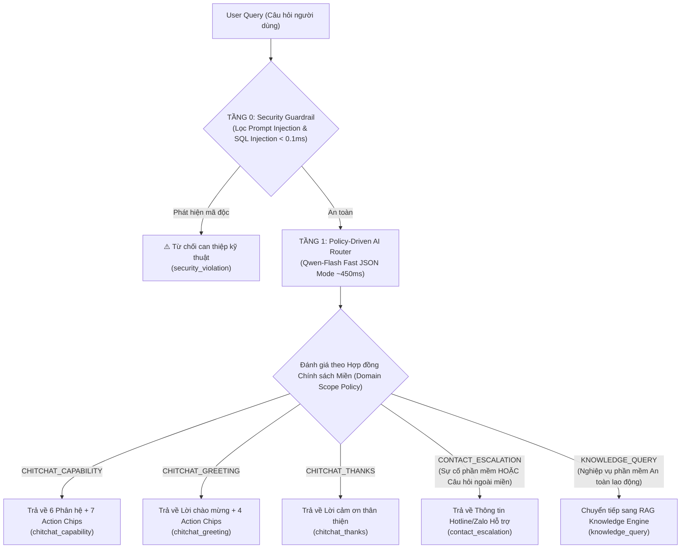

# MODULE 04: INTENT CLASSIFICATION & POLICY-DRIVEN ROUTER SERVICE

> **Tài liệu Kỹ thuật Chi tiết - Phân hệ Định tuyến Ý định Dựa trên Chính sách Miền (Policy-Driven Intent Router)**
> **Tài liệu gốc tham chiếu:** [SYSTEM_DOCUMENTATION.md](file:///c:/Users/Admin/HUIT%20-%20H%E1%BB%8Dc%20T%E1%BA%ADp/N%C4%83m%204/Chatbot_Project/Bussiness_Rules/docs/SYSTEM_DOCUMENTATION.md)
> **Quy chuẩn thiết kế:** [CHATBOT_SYSTEM_DESIGN_STANDARDS.md](file:///c:/Users/Admin/HUIT%20-%20H%E1%BB%8Dc%20T%E1%BA%ADp/N%C4%83m%204/Chatbot_Project/Bussiness_Rules/docs/CHATBOT_SYSTEM_DESIGN_STANDARDS.md)

---

## 1. Tổng quan & Kiến trúc Policy-Driven Router

Module **Intent Classification & Policy-Driven Router** loại bỏ hoàn toàn 100% sự phụ thuộc vào các từ khóa tĩnh (Hardcoded Regex) hoặc các ngưỡng khoảng cách Cosine nhân tạo (Vector Embedding Thresholds) vốn dễ bị bẫy bởi không gian vô hạn của các câu hỏi ngoài phạm vi (Out-of-Scope).

Hệ thống sử dụng **Hợp đồng Chính sách Miền (Domain Policy Contract)** kết hợp với khả năng suy luận ngữ cảnh và tri thức thế giới (World Knowledge) của mô hình ngôn ngữ lớn **Qwen-Flash**:

* **Tự động nhận diện Out-of-Scope (OOS):** Tự động hiểu các câu hỏi Toán học, Lịch sử, Thể thao, Thời tiết, Chuyện đời tư là nằm ngoài phạm vi nghiệp vụ và lập tức rẽ nhánh sang `contact_escalation` mà không cần người lập trình phải bổ sung từ điển từ vựng.
* **Không phụ thuộc Ngưỡng điểm ảo:** Phân loại dựa trên suy luận logic ngữ cảnh thay vì góc quay hình học của vector embedding.
* **Tối ưu hóa độ trễ & Chi phí:** Sử dụng chế độ Non-Thinking Fast JSON Mode kết hợp với kết nối HTTP/2 Session Pooling $\to$ Độ trễ trung bình $\approx 400 - 500\text{ ms}$, tiêu thụ cực ít token.

### Các tệp nguồn chính:

* [`app/services/intent_service.py`](file:///c:/Users/Admin/HUIT%20-%20H%E1%BB%8Dc%20T%E1%BA%ADp/N%C4%83m%204/Chatbot_Project/backend/app/services/intent_service.py): Lớp `IntentService` điều phối Policy-Driven Router.
* [`app/services/qwen_service.py`](file:///c:/Users/Admin/HUIT%20-%20H%E1%BB%8Dc%20T%E1%BA%ADp/N%C4%83m%204/Chatbot_Project/backend/app/services/qwen_service.py): Client kết nối persistent HTTP/2 với Qwen-Flash.
* [`app/models/chat.py`](file:///c:/Users/Admin/HUIT%20-%20H%E1%BB%8Dc%20T%E1%BA%ADp/N%C4%83m%204/Chatbot_Project/backend/app/models/chat.py): Pydantic Model `QuickActionChip` và `IntentResult`.

---

## 2. Logic Xử lý Phân tầng (Tiered Routing Pipeline)



---

## 3. Đặc tả Hợp đồng Chính sách Miền (Domain Policy Contract)

AI Router được vận hành dựa trên bản đặc tả chính sách phân loại duy nhất sau:

```text
Bạn là Bộ phân loại Ý định (Intent Router) cho Trợ lý AI Hướng dẫn Sử dụng Hệ thống Quản lý và Báo cáo An toàn Lao động Doanh nghiệp (Sở LĐ-TB&XH TP.HCM).

Hãy phân loại câu hỏi của người dùng vào ĐÚNG 1 nhãn duy nhất trong 5 nhãn sau:
1. "KNOWLEDGE_QUERY": Người dùng hỏi về các nghiệp vụ phần mềm (Đăng ký tài khoản, Đăng nhập, Đổi mật khẩu, Cập nhật thông tin DN, Nộp báo cáo TNLĐ, Báo cáo ATVSLĐ, Thống kê số liệu tai nạn, tra cứu biểu mẫu, ký số).
2. "CHITCHAT_GREETING": Lời chào hỏi xã giao mở đầu (xin chào, hello, hi, chúc ngày tốt lành...).
3. "CHITCHAT_CAPABILITY": Hỏi bot có chức năng gì, phạm vi năng lực hỗ trợ hoặc hướng dẫn cho người dùng mới.
4. "CHITCHAT_THANKS": Lời cảm ơn kết thúc (cảm ơn, thanks, đa tạ...).
5. "CONTACT_ESCALATION": Báo lỗi kỹ thuật phần mềm (treo máy, đứng hình, sập server, trắng màn hình) HOẶC các câu hỏi hoàn toàn nằm ngoài phạm vi phần mềm An toàn lao động (Toán học, Lịch sử, Thể thao, Thời tiết, Chuyện đời sống cá nhân, Lệnh không hợp lệ...).

Yêu cầu định dạng: Chỉ trả về JSON duy nhất (không giải thích thêm):
{"intent": "<NHÃN_CHỌN>", "reason": "<Lý do ngắn 3-6 từ>"}
```

---

## 4. Đặc tả Giao tiếp Input / Output (Data Contracts)

### 4.1. Input Specification
```python
def classify_intent(query: str) -> IntentResult:
    """
    query: Chuỗi văn bản truy vấn tự nhiên của người dùng.
    Hỗ trợ gọi đồng bộ (sync) và bất đồng bộ (classify_intent_async).
    """
```

### 4.2. Output Specification (`IntentResult`)
```python
class IntentResult:
    intent: str                               # Tên Intent ('chitchat_greeting', 'knowledge_query', 'contact_escalation'...)
    direct_answer: Optional[str]              # Câu trả lời trực tiếp (< 10ms) cho Chitchat/Security
    quick_action_chips: Optional[List[QuickActionChip]] # Danh sách chip gợi ý nếu có
    confidence_score: float                   # Điểm số tự tin (Mặc định 1.0)
    matched_exemplar: Optional[str]           # Lý do phân loại từ AI (Reasoning string)
    all_scores: Dict[str, float]              # Phân bố điểm
```

---

## 5. Hướng dẫn & Lệnh Chạy Kiểm thử (Testing Commands Suite)

Toàn bộ các bài kiểm thử của Module 4 được thực thi trực tiếp trên môi trường ảo Python `.venv`:

### 5.1. Chế độ Chat Tương tác Trực tiếp trên Terminal (Interactive Chat)
Cho phép người dùng gõ trực tiếp bất kỳ câu hỏi tự nhiên nào để kiểm tra khả năng định tuyến của Policy-Driven Router và xem phản hồi tức thì:

```powershell
.\.venv\Scripts\python.exe backend/tests/test_standalone_module_04.py
```
> *Trong màn hình chat, bạn có thể gõ:*
> * `sample`: Chạy tự động 13 mẫu kiểm thử tiêu chuẩn (bao gồm cả các câu Out-of-Scope).
> * `stats`: In bảng phân tích tỷ lệ phần trăm phân bố Intent và độ trễ.
> * `clear-logs`: Dọn sạch tệp nhật ký thực nghiệm cũ.
> * `exit` hoặc `q`: Thoát khỏi chương trình.

---

### 5.2. Chạy Bộ 13 Mẫu Kiểm thử Tự động Tiêu chuẩn (Sample Test Suite)
Đánh giá độ chính xác của Policy-Driven Router qua 13 tình huống câu hỏi thực tế:

```powershell
.\.venv\Scripts\python.exe backend/tests/test_standalone_module_04.py --sample
```

---

### 5.3. Kiểm thử Nhanh 1 Câu hỏi Cụ thể từ Dòng lệnh (Single Query CLI Test)
Kiểm tra nhanh nhãn Intent và lý do phân loại của AI cho một câu hỏi bất kỳ:

```powershell
# Test câu hỏi toán học ngoài phạm vi
.\.venv\Scripts\python.exe backend/tests/test_standalone_module_04.py -q "căn bậc 2 của 6 là bao nhiêu ?"

# Test câu hỏi lịch sử ngoài phạm vi
.\.venv\Scripts\python.exe backend/tests/test_standalone_module_04.py -q "Bác Hồ sinh ngày nào ?"

# Test câu hỏi thể thao ngoài phạm vi
.\.venv\Scripts\python.exe backend/tests/test_standalone_module_04.py -q "Tuần này có đá banh không ?"

# Test câu hỏi nghiệp vụ trong phạm vi
.\.venv\Scripts\python.exe backend/tests/test_standalone_module_04.py -q "Hướng dẫn tôi các bước nộp báo cáo tai nạn lao động"
```

---

### 5.4. Xem Báo cáo Thống kê & Phân tích Nhật ký Thực nghiệm (Analytics & Stats)
Trích xuất toàn bộ dữ liệu log từ tệp `backend/data/logs/test_module_04_history.jsonl` và in bảng tổng kết phân phối Intent:

```powershell
.\.venv\Scripts\python.exe backend/tests/test_standalone_module_04.py --stats
```

---

### 5.5. Xóa Sạch / Đặt lại Tệp Nhật ký Thực nghiệm (Clear Logs)
Dọn dẹp tệp log để bắt đầu phiên thực nghiệm đánh giá mới:

```powershell
.\.venv\Scripts\python.exe backend/tests/test_standalone_module_04.py --clear-logs
```

---

### 5.6. Chạy Kiểm thử Tích hợp Toàn bộ Luồng Định tuyến (Pipeline Routing Test)
Kiểm tra chuỗi liên hoàn từ Guardrails $\to$ Module 4 (Macro Intent) $\to$ Module 5 (Domain & Strategy Router):

```powershell
.\.venv\Scripts\python.exe backend/tests/test_module_04_intent.py --sample
```
