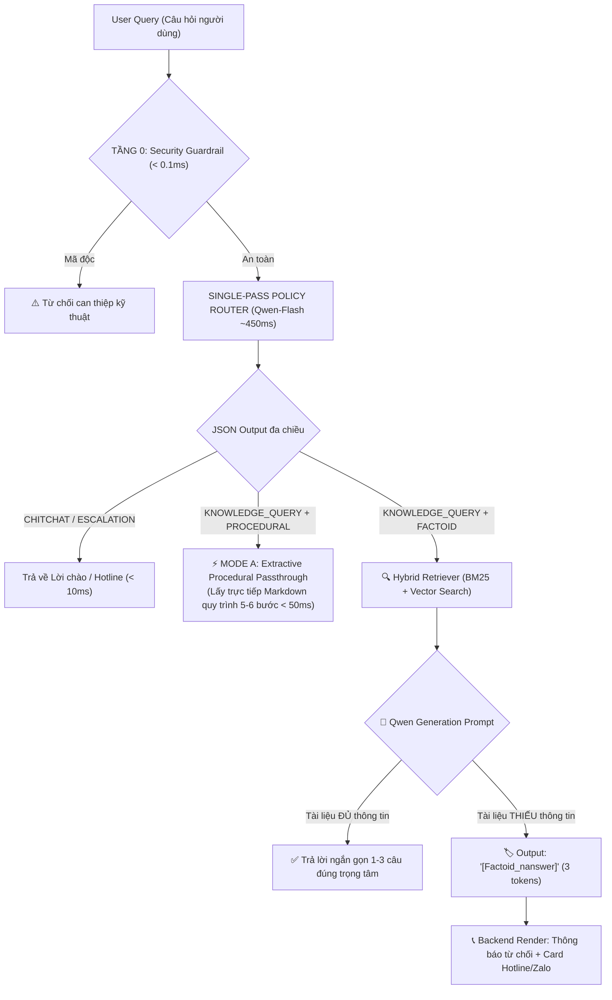

# MODULE 05: SINGLE-PASS MULTI-ASPECT STRATEGY & DOMAIN ROUTER

> **Đặc tả kiến trúc toàn diện:** [PROJECT_CANVAS_ARCHITECTURE.md](../PROJECT_CANVAS_ARCHITECTURE.md)

---

## 1. Tổng quan & Vị trí Module trong Codebase

Module **Single-Pass Multi-Aspect Strategy & Domain Router** là "bộ não điều hướng nghiệp vụ" (Domain Dispatcher) của hệ thống.

Sau đợt tái cấu trúc SOTA, Module 5 được **hợp nhất vận hành cùng Module 4** trong cùng **1 lượt gọi Qwen-Flash duy nhất ($\approx 450\text{ ms}$)** nhằm loại bỏ hoàn toàn 100% các biểu thức chính quy (Regex) và ma trận trọng số nhân tạo, đồng thời xác định chính xác 2 quyết định trọng yếu:

1. **Phân hệ Nghiệp vụ Mục tiêu (`target_module`)**: Ánh xạ câu hỏi vào đúng 1 trong 7 phân hệ chức năng trong tài liệu HDSD.
2. **Chiến lược Thực thi (`strategy`)**: Lựa chọn giữa **Mode A (`procedural_extractive`)** cho câu hỏi quy trình thao tác từ A-Z hoặc **Mode B (`targeted_qa`)** cho câu hỏi chi tiết/ngách/Factoid.

### Các tệp nguồn chính:

* [`app/services/intent_service.py`](file:///c:/Users/Admin/HUIT%20-%20H%E1%BB%8Dc%20T%E1%BA%ADp/N%C4%83m%204/Chatbot_Project/backend/app/services/intent_service.py): Single-Pass Policy Router thực hiện phân loại đa chiều.
* [`app/services/intent_router.py`](file:///c:/Users/Admin/HUIT%20-%20H%E1%BB%8Dc%20T%E1%BA%ADp/N%C4%83m%204/Chatbot_Project/backend/app/services/intent_router.py): Adapter kết nối và cung cấp API chuẩn cho toàn bộ RAG pipeline.
* [`app/services/rag_service.py`](file:///c:/Users/Admin/HUIT%20-%20H%E1%BB%8Dc%20T%E1%BA%ADp/N%C4%83m%204/Chatbot_Project/backend/app/services/rag_service.py): Điều phối Mode A (Trích xuất quy trình < 50ms) và Mode B (Targeted QA với cơ chế `Factoid_nanswer`).

---

## 2. Logic Xử lý & Phân luồng Tri-Modal



---

## 3. Danh sách 7 Phân hệ Nghiệp vụ Cốt lõi (`target_module`)

1. **`ĐĂNG KÝ`**: Đăng ký tài khoản doanh nghiệp mới bằng Mã số thuế.
2. **`ĐĂNG NHẬP`**: Đăng nhập vào hệ thống quản lý an toàn lao động.
3. **`THAY ĐỔI MẬT KHẨU`**: Đổi mật khẩu, quên mật khẩu, cấp lại mật khẩu.
4. **`THAY ĐỔI THÔNG TIN DOANH NGHIỆP`**: Cập nhật thông tin công ty, địa chỉ, người đại diện, số điện thoại.
5. **`BÁO CÁO ĐỊNH KỲ - 1. Tai nạn lao động`**: Khai báo, lập, nộp, in biểu mẫu báo cáo TNLĐ 6 tháng/năm.
6. **`BÁO CÁO ĐỊNH KỲ - 2. An toàn vệ sinh lao động`**: Lập và nộp báo cáo ATVSLĐ định kỳ hàng năm.
7. **`THỐNG KÊ`**: Tra cứu và xem số liệu thống kê tai nạn lao động theo kỳ/năm.

---

## 4. Cơ chế Xử lý Token-Efficient `Factoid_nanswer`

Đối với các câu hỏi ngách thuộc **Mode B (`targeted_qa`)**, nếu tài liệu HDSD hiện tại **không chứa thông tin** (ví dụ: người dùng hỏi *"Mức xử phạt hành chính khi không nộp báo cáo là bao nhiêu tiền?"*):

1. **Chỉ thị Prompt cho Qwen:**
   ```text
   QUY TẮC BẮT BUỘC: Nếu thông tin trong Context KHÔNG ĐỦ hoặc KHÔNG ĐỀ CẬP để trả lời câu hỏi, bạn BẮT BUỘC CHỈ ĐƯỢC PHÉP TRẢ VỀ ĐÚNG MÃ THẺ: `[Factoid_nanswer]` mà KHÔNG ĐƯỢC tự suy diễn, bịa đặt hay giải thích thêm bất kỳ từ nào khác.
   ```
2. **Xử lý tại Backend (`RAGService`):**
   * Backend nhận diện mã thẻ `[Factoid_nanswer]` $\to$ Tiết kiệm tối đa Output Tokens (chỉ tốn 3 tokens thay vì sinh một đoạn từ chối dài dòng).
   * Backend tự động render thông báo chuẩn và đính kèm **Card Hotline & Zalo Hỗ trợ Kỹ thuật**:
     ```markdown
     ⚠️ **Không tìm thấy thông tin trong tài liệu:** Nội dung chi tiết về vấn đề này hiện chưa được đề cập trong Tài liệu Hướng dẫn Sử dụng. Bạn vui lòng liên hệ trực tiếp Bộ phận Hỗ trợ Kỹ thuật của Sở Lao động - TB&XH theo thông tin bên dưới để được giải đáp:
     ```

---

## 5. Hướng dẫn & Lệnh Chạy Kiểm thử (Testing Commands Suite)

### 5.1. Chế độ Chat Tương tác Trực tiếp trên Terminal:

```powershell
.\.venv\Scripts\python.exe backend/tests/test_standalone_module_05.py
```

### 5.2. Chạy Bộ 11 Mẫu Kiểm thử Tiêu chuẩn:

```powershell
.\.venv\Scripts\python.exe backend/tests/test_standalone_module_05.py --sample
```

### 5.3. Kiểm thử Nhanh 1 Câu hỏi Cụ thể:

```powershell
# Test câu hỏi quy trình (Mode A)
.\.venv\Scripts\python.exe backend/tests/test_standalone_module_05.py -q "Hướng dẫn tôi cách nộp báo cáo tai nạn lao động"

# Test câu hỏi Factoid ngách (Mode B)
.\.venv\Scripts\python.exe backend/tests/test_standalone_module_05.py -q "Trường tổng quỹ lương khi báo cáo TNLĐ nhập đơn vị gì?"
```
