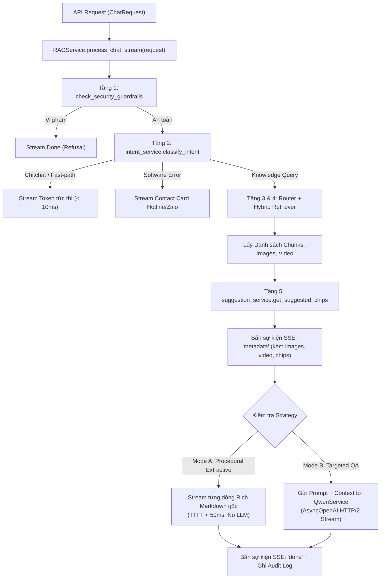

# MODULE 06: RAG SYNTHESIS, LLM ENGINE & FOLLOW-UP SUGGESTIONS
> **Tài liệu Kỹ thuật Chi tiết - Phân hệ Điều phối RAG, Tổng hợp LLM & Gợi ý Thông minh**  
> **Tài liệu gốc tham chiếu:** [SYSTEM_DOCUMENTATION.md](file:///c:/Users/Admin/HUIT%20-%20H%E1%BB%8Dc%20T%E1%BA%ADp/N%C4%83m%204/Chatbot_Project/Bussiness_Rules/docs/SYSTEM_DOCUMENTATION.md)  
> **Tài liệu nghiệp vụ liên kết:** [_AI_HDSD_ATLĐ (DN).v1_HCM_2026 (1).docx](file:///c:/Users/Admin/HUIT%20-%20H%E1%BB%8Dc%20T%E1%BA%ADp/N%C4%83m%204/Chatbot_Project/Bussiness_Rules/docs/_AI_HDSD_ATL%C4%90%20(DN).v1_HCM_2026%20(1).docx)

---

## 1. Tổng quan & Vị trí Module trong Codebase

Module **RAG Synthesis, LLM Engine & Follow-up Suggestions** là cỗ máy điều phối trung tâm (Master Orchestrator) của hệ thống chatbot. Module liên kết dữ liệu từ các tầng Guardrails, Intent Service, Strategy Router và Hybrid Retriever để:
1. **Thực thi Chế độ A (Procedural Extractive Stream)**: Trích xuất và phát luồng (Stream) nguyên văn tài liệu siêu tốc (< 50ms TTFT) mà không qua LLM.
2. **Thực thi Chế độ B (Targeted QA Stream)**: Tích hợp mô hình ngôn ngữ lớn **Qwen-3.7-Flash** (qua giao thức kết nối HTTP/2 persistent connection pool) để sinh câu trả lời súc tích.
3. **Sinh Gợi ý Hành động Tiếp theo (Follow-up Suggestion Chips)**: Dự đoán và tạo động 3 câu hỏi gợi ý phù hợp với ngữ cảnh vừa trả lời.

### Các tệp nguồn chính:
* [`app/services/rag_service.py`](file:///c:/Users/Admin/HUIT%20-%20H%E1%BB%8Dc%20T%E1%BA%ADp/N%C4%83m%204/Chatbot_Project/backend/app/services/rag_service.py): Điều phối toàn bộ luồng RAG, hỗ trợ cả REST JSON và SSE Streaming.
* [`app/services/qwen_service.py`](file:///c:/Users/Admin/HUIT%20-%20H%E1%BB%8Dc%20T%E1%BA%ADp/N%C4%83m%204/Chatbot_Project/backend/app/services/qwen_service.py): Giao tiếp với API Alibaba DashScope (Qwen-3.7-Flash) qua `AsyncOpenAI` với HTTP/2 Keep-Alive.
* [`app/services/suggestion_service.py`](file:///c:/Users/Admin/HUIT%20-%20H%E1%BB%8Dc%20T%E1%BA%ADp/N%C4%83m%204/Chatbot_Project/backend/app/services/suggestion_service.py): Quản lý ma trận gợi ý `SUGGESTION_MATRIX` theo từng phân hệ.
* [`app/utils/prompts.py`](file:///c:/Users/Admin/HUIT%20-%20H%E1%BB%8Dc%20T%E1%BA%ADp/N%C4%83m%204/Chatbot_Project/backend/app/utils/prompts.py): System Prompt và hàm format Context cho LLM.

---

## 2. Logic Xử lý Chi tiết (Detailed Processing Logic)



### 2.1. Cấu trúc Sự kiện SSE Streaming Chuẩn (`Server-Sent Events`)
Pipeline phát dữ liệu thời gian thực theo 3 sự kiện kế tiếp nhau:
1. **Event `metadata`**: Bắn ra ngay sau 50ms, cung cấp toàn bộ URL ảnh giao diện, link YouTube, thông tin liên hệ và danh sách 3 gợi ý.
2. **Event `token`**: Bắn từng token / dòng văn bản Markdown liên tục để giao diện hiển thị hiệu ứng gõ chữ mượt mà.
3. **Event `done`**: Báo hiệu kết thúc phản hồi, trả về toàn văn câu trả lời kèm chỉ số đo lường hiệu năng (`ttft_ms`, `total_time_ms`).

### 2.2. Kỹ thuật Quản lý Phiên Kết nối HTTP/2 (HTTP/2 Connection Pooling)
Trong [`qwen_service.py`](file:///c:/Users/Admin/HUIT%20-%20H%E1%BB%8Dc%20T%E1%BA%ADp/N%C4%83m%204/Chatbot_Project/backend/app/services/qwen_service.py), client duy trì một `httpx.AsyncClient` liên tục với kết nối HTTP/2:
* Loại bỏ độ trễ bắt tay TCP/TLS Handshake cho các lượt chat liên tiếp.
* Tự động kích hoạt cơ chế `warmup()` khi server khởi động để gửi gói tin ping giữ ấm kết nối.

### 2.3. Ma trận Gợi ý Hành động Tiếp theo (`SuggestionService`)
Dựa trên phân hệ hiện tại (`target_module`) và câu hỏi vừa xử lý, hệ thống tự động sinh 3 `QuickActionChip` có tính liên kết nghiệp vụ cao (ví dụ: vừa hỏi đăng ký xong sẽ gợi ý: *"Thời gian kích hoạt"*, *"Mã số thuế làm tài khoản"*, *"Hướng dẫn đăng nhập"*).

---

## 3. Đặc tả Giao tiếp Input / Output (Data Contracts)

### 3.1. Input Specification (`ChatRequest`)
```json
{
  "query": "Làm thế nào để đổi mật khẩu tài khoản?",
  "session_id": "8f3b6a9c-2d1e-4c3b-8a7f-9e5b1c3d7a2e",
  "history": [
    { "role": "user", "content": "Xin chào" },
    { "role": "assistant", "content": "Xin chào! Tôi có thể hỗ trợ gì cho bạn?" }
  ],
  "top_k": 2,
  "stream": true
}
```

### 3.2. Output Specification (`ChatResponse` - REST Mode)
```json
{
  "session_id": "8f3b6a9c-2d1e-4c3b-8a7f-9e5b1c3d7a2e",
  "answer": "Dưới đây là hướng dẫn chi tiết quy trình **THAY ĐỔI MẬT KHẨU** trên hệ thống:\n\n**Bước 1:** ...",
  "intent": "knowledge_query",
  "images": [
    "http://localhost:8000/static/images/..._img_6_rId21.png",
    "http://localhost:8000/static/images/..._img_7_rId43.png"
  ],
  "youtube_links": [],
  "quick_action_chips": [
    { "id": "sug_pwd_1", "label": "📞 Quên mật khẩu/Không vào được", "query_text": "Quên mật khẩu thì liên hệ ai?" }
  ],
  "source_chunks": [...]
}
```

---

## 4. Ma trận Liên kết Nghiệp vụ với Tài liệu `_AI_HDSD_ATLĐ (DN)`

| Tình huống Nghiệp vụ | Luồng Điều phối tại RAGService | Kết quả Trả về cho Doanh nghiệp |
| :--- | :--- | :--- |
| **Doanh nghiệp hỏi quy trình nộp báo cáo** | Chế độ A: Procedural Extractive. | Trả về trọn vẹn 6 bước, giữ nguyên định dạng in đậm, đính kèm đúng 8 ảnh chụp màn hình UI từ file Word gốc. |
| **Doanh nghiệp hỏi quy định/thời hạn** | Chế độ B: Targeted QA qua Qwen LLM. | Trả lời ngắn gọn trong 1–2 câu (VD: Nộp định kỳ trước ngày 05/7 cho 6 tháng đầu năm). |
| **Doanh nghiệp báo lỗi hệ thống** | Fast-path: Software Error. | Hiển thị Card số điện thoại Hotline và Zalo hỗ trợ kỹ thuật của Sở Lao động - TB&XH TP.HCM. |

---

## 5. Kịch bản & Mã Kiểm thử Độc lập (Unit Test Suite)

```python
import pytest
from app.models.chat import ChatRequest
from app.services.rag_service import rag_service
from app.services.suggestion_service import suggestion_service

@pytest.mark.asyncio
async def test_rag_service_procedural_flow():
    await rag_service.warmup()
    request = ChatRequest(
        query="Hướng dẫn các bước đăng ký tài khoản doanh nghiệp mới",
        stream=False
    )
    response = await rag_service.process_chat(request)
    
    assert response.intent == "knowledge_query"
    assert "**Bước 1:**" in response.answer
    assert len(response.images) >= 2
    assert len(response.quick_action_chips) == 3

def test_suggestion_service_matrix():
    chips = suggestion_service.get_suggested_chips(
        query="đăng ký tài khoản",
        target_module="ĐĂNG KÝ",
        limit=3
    )
    assert len(chips) == 3
    assert any("kích hoạt" in c.label for c in chips)
```
