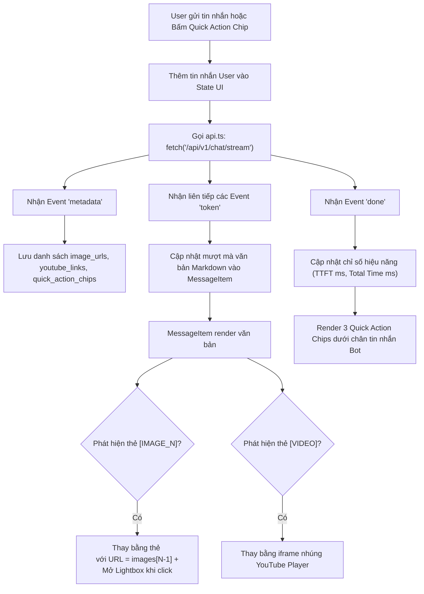

# MODULE 07: FRONTEND PRESENTATION & INTERACTIVE UI
> **Tài liệu Kỹ thuật Chi tiết - Phân hệ Giao diện Người dùng & Tương tác Đa phương tiện**  
> **Đặc tả kiến trúc toàn diện:** [PROJECT_CANVAS_ARCHITECTURE.md](../PROJECT_CANVAS_ARCHITECTURE.md)

---

## 1. Tổng quan & Vị trí Module trong Codebase

Module **Frontend Presentation & Interactive UI** phụ trách toàn bộ trải nghiệm người dùng cuối (User Experience - UX/UI). Được xây dựng trên nền tảng **Next.js 14 App Router** kết hợp phong cách thiết kế hiện đại với **Font chữ Montserrat** và **TailwindCSS**, module cung cấp:
1. **Trình phân tích luồng dữ liệu thời gian thực (SSE Stream Reader)**: Xử lý các sự kiện `metadata`, `token`, `done` với độ trễ phản hồi dưới 50ms.
2. **Cơ chế hiển thị Đa phương tiện Động (Dynamic Multimodal Markdown Renderer)**: Tự động phân giải các thẻ `[IMAGE_N]` thành ảnh có tính năng **Phóng to (Lightbox Preview)** và chuyển thẻ `[VIDEO]` thành khung phát video **YouTube nhúng**.
3. **Thanh Nút Gợi ý Tương tác (Interactive Quick Action Chips)**: Cho phép người dùng bấm một chạm để tiếp tục tra cứu các bước tiếp theo.

### Các tệp nguồn chính:
* [`frontend/src/app/page.tsx`](file:///c:/Users/Admin/HUIT%20-%20H%E1%BB%8Dc%20T%E1%BA%ADp/N%C4%83m%204/Chatbot_Project/frontend/src/app/page.tsx): Trang chính tích hợp Chatbot.
* [`frontend/src/components/chat/ChatContainer.tsx`](file:///c:/Users/Admin/HUIT%20-%20H%E1%BB%8Dc%20T%E1%BA%ADp/N%C4%83m%204/Chatbot_Project/frontend/src/components/chat/): Quản lý danh sách tin nhắn, trạng thái cuộn tự động và gọi API streaming.
* [`frontend/src/components/chat/MessageItem.tsx`](file:///c:/Users/Admin/HUIT%20-%20H%E1%BB%8Dc%20T%E1%BA%ADp/N%C4%83m%204/Chatbot_Project/frontend/src/components/chat/): Render từng tin nhắn Rich Markdown, thay thế slot `[IMAGE_N]` và `[VIDEO]`.
* [`frontend/src/lib/api.ts`](file:///c:/Users/Admin/HUIT%20-%20H%E1%BB%8Dc%20T%E1%BA%ADp/N%C4%83m%204/Chatbot_Project/frontend/src/lib/api.ts): Client gọi API backend với Fetch EventSource parser.

---

## 2. Logic Xử lý Chi tiết (Detailed Processing Logic)



### 2.1. Phân giải Thẻ Slot Đa phương tiện trong Markdown
Khi nhận văn bản Markdown từ Backend chứa các thẻ định danh vị trí:
* Gặp chuỗi `[IMAGE_N]` (ví dụ `[IMAGE_1]`, `[IMAGE_2]`): Thành phần React bóc tách số $N$, lấy phần tử `images[N - 1]` trong mảng `images` được gửi từ sự kiện `metadata` để render thẻ ảnh kèm nút bấm mở phóng to toàn màn hình.
* Gặp chuỗi `[VIDEO]`: Lấy phần tử đầu tiên trong `youtube_links` để hiển thị khung phát video YouTube chuẩn 16:9.

### 2.2. Xử lý Nút Bấm Hành động Nhanh (Quick Action Chips)
* Khi người dùng click vào một nút gợi ý (ví dụ: `📝 Đăng ký tài khoản`), hàm `handleChipClick` sẽ tự động đưa nội dung `query_text` vào ô nhập và kích hoạt luồng gửi câu hỏi mới, duy trì `session_id` để bảo toàn lịch sử hội thoại.

---

## 3. Đặc tả Giao tiếp Input / Output (Data Contracts)

### 3.1. Frontend Input State
```typescript
interface ChatMessage {
  id: string;
  role: "user" | "assistant";
  content: string;
  images?: string[];
  youtube_links?: string[];
  quick_action_chips?: QuickActionChip[];
  contact_support?: ContactSupportInfo;
  metrics?: {
    ttft_ms?: number;
    total_time_ms?: number;
  };
}

interface QuickActionChip {
  id: string;
  label: string;
  query_text: string;
}
```

### 3.2. SSE Stream Listener Logic
```typescript
const response = await fetch(`${API_BASE_URL}/chat/stream`, {
  method: "POST",
  headers: { "Content-Type": "application/json" },
  body: JSON.stringify({ query, session_id: sessionId, stream: true })
});

// Duyệt qua luồng Server-Sent Events
// Sự kiện "metadata": nạp images, youtube_links, chips
// Sự kiện "token": nối content vào tin nhắn
// Sự kiện "done": kết thúc loading
```

---

## 4. Ma trận Liên kết Nghiệp vụ với Tài liệu `_AI_HDSD_ATLĐ (DN)`

| Thành phần Giao diện | Tác dụng Nghiệp vụ đối với Doanh nghiệp |
| :--- | :--- |
| **Ảnh chụp màn hình UI + Phóng to (Lightbox)** | Giúp kế toán / chuyên viên nhân sự của doanh nghiệp nhìn rõ các nút bấm thực tế trên phần mềm (như icon Bút chì, nút Lưu, nút In báo cáo). |
| **YouTube Video Player** | Cung cấp video thao tác trực quan cho các quy trình phức tạp (như nộp báo cáo TNLĐ/ATVSLĐ). |
| **Card Hotline / Zalo** | Cung cấp đường dây nóng hỗ trợ khẩn cấp khi hệ thống báo lỗi không lưu được dữ liệu. |
| **Quick Action Chips** | Định hướng nhân viên doanh nghiệp đi tuần tự từ Đăng ký $\to$ Đăng nhập $\to$ Đổi mật khẩu $\to$ Nộp báo cáo. |

---

## 5. Kịch bản Kiểm thử Giao diện (UI Testing Checklist)

1. **Kiểm tra Hiển thị Token mượt mà:** Khi gửi câu hỏi, chữ hiển thị streaming từng dòng ngay lập tức (không bị đơ giao diện).
2. **Kiểm tra Click Phóng to Ảnh (Lightbox):** Nhấp chuột vào ảnh chụp màn hình trong tin nhắn $\to$ Màn hình mở popup phóng to ảnh chất lượng cao.
3. **Kiểm tra Nhúng Video YouTube:** Khi hỏi quy trình đăng ký $\to$ Khung video YouTube hiển thị đúng clip hướng dẫn.
4. **Kiểm tra Bấm Quick Action Chip:** Bấm vào chip *"🔑 Thay đổi mật khẩu"* $\to$ Tự động gửi câu hỏi và nhận về hướng dẫn đổi mật khẩu.
