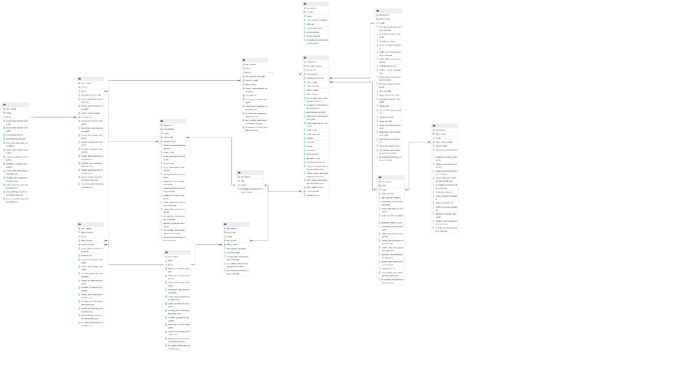

**PHẦN 1: KIẾN TRÚC DATAWAREHOUSE**

**1. Tổng quan Kiến trúc (Schema: dwh_internal)**

Hệ thống được thiết kế theo mô hình **Hybrid Schema** (kết hợp giữa Star Schema và Snowflake Schema) để tối ưu hóa việc lưu trữ dữ liệu lịch sử và báo cáo phân tích.

- **Bảng Fact:** Tập trung vào bảng fact_report_criteria.

- **Các bảng Dimension:** Bao gồm Mission, Criteria, Scope, Office, User, và Province.

**2. Chi tiết các nhóm bảng**

A. Nhóm Nghiệp vụ Chính (Core Business)

Nhóm này định nghĩa cấu trúc của các nhiệm vụ và tiêu chí đánh giá.

| **Tên bảng** | **Loại** | **Mô tả** |
|----|----|----|
| **mission** | Dimension | Lưu thông tin các nhiệm vụ/nhiệm vụ chiến lược. Kết nối với scope. |
| **criteria** | Dimension | Lưu danh mục các tiêu chí đánh giá. Có cấu trúc phân cấp (parent_id) và thuộc về một mission. |
| **criteria_group** | Dimension | Nhóm các tiêu chí lại để phục vụ cho các đợt cấu hình báo cáo cụ thể. |
| **scope** | Dimension | Phạm vi của nhiệm vụ hoặc báo cáo (ví dụ: cấp tỉnh, cấp bộ). |

**B. Nhóm Giao dịch & Báo cáo (Transactions & Facts)**

Đây là trung tâm của kho dữ liệu, nơi lưu trữ kết quả thực tế.

| **Tên bảng** | **Loại** | **Mô tả** |
|----|----|----|
| **fact_report_criteria** | **Fact (Current State)** | **Bảng quan trọng nhất.** Lưu trữ giá trị thống kê của từng tiêu chí dựa trên phiên bản báo cáo mới nhất. Chứa các thông tin tính toán (aggregate_fn, sum_to_parent). |
| **report** | Source Header | Lưu thông tin định danh và trạng thái hiện tại của một bản báo cáo. |
| **report_history** | SCD / Log | Lưu vết tất cả phiên bản thay đổi của báo cáo dưới dạng Snapshot (JSONB). |

**C. Nhóm Tổ chức & Người dùng (Organization & Metadata)**

Quản lý thực thể thực hiện nhiệm vụ.

| **Tên bảng** | **Mô tả** |
|----|----|
| **office** | Thông tin chi tiết các đơn vị/văn phòng thực hiện báo cáo. |
| **user** | Thông tin định danh người dùng trong hệ thống. |
| **office_user / mission** | Các bảng quan hệ nhiều-nhiều để phân công nhiệm vụ cho văn phòng hoặc cá nhân. |
| **province** | Danh mục đơn vị hành chính liên quan. |
|  |  |

**3. Đặc điểm kỹ thuật & Logic xử lý**

**1. Quy tắc lấy dữ liệu Fact (Latest Version Logic)**

Bảng fact_report_criteria không lưu trữ toàn bộ lịch sử mà chỉ lưu **trạng thái mới nhất** để tối ưu truy vấn:

- **Nếu báo cáo có lịch sử chỉnh sửa:** Hệ thống tự động chọn phiên bản có version lớn nhất từ report_history để đồng bộ vào Fact.

- **Nếu báo cáo chưa có chỉnh sửa:** Dữ liệu được lấy trực tiếp từ bản ghi gốc trong bảng report.

- **Mục tiêu:** Giúp BI Tool luôn hiển thị con số chính xác nhất mà không cần xử lý logic chồng chéo.

**2. Cấu trúc dữ liệu linh hoạt (Extensibility)**

- Sử dụng kiểu dữ liệu **JSONB** (config, report_data_snapshot) để lưu trữ các cấu hình tiêu chí động, giúp hệ thống không phải thay đổi cấu trúc bảng khi nghiệp vụ mở rộng.

**3. Khả năng giám sát (Audit Trail) & Đa khách hàng**

- **Dấu vết hệ thống:** Mọi bản ghi đều có trường etl_updated_at, created_by, modified_by để kiểm soát dữ liệu đầu vào.

- **Multi-tenancy:** Tách biệt dữ liệu tuyệt đối giữa các đơn vị thông qua tenant_code và department_code.

**4. Luồng dữ liệu chính (Data Flow)**

- **Thiết lập (Metadata):** Hệ thống định nghĩa cây danh mục Scope -\> Mission -\> Criteria.

- **Phân công (Allocation):** Giao nhiệm vụ cho các đơn vị qua office_mission và user_mission.

- **Thực thi & Lưu trữ (Transaction):** \* Người dùng nhập báo cáo (report).

  - Mỗi lần nhấn "Lưu/Cập nhật", phiên bản cũ được đẩy vào report_history.

- **Tổng hợp (Fact Processing):** ETL Job quét qua report và report_history, lọc ra các bản ghi có **Version mới nhất** để cập nhật giá trị vào fact_report_criteria.

**PHẦN 2: CHI TIẾT TỪNG BẢNG**

Dưới đây là bảng tra cứu chi tiết toàn bộ các bảng và cột trong schema **dwh_internal**,

**1. Bảng criteria (Danh mục Tiêu chí)**

Lưu trữ định nghĩa các chỉ tiêu cần thu thập dữ liệu.

| **Cột** | **Ý nghĩa** |
|----|----|
| **id** | Khóa chính (UUID) định danh tiêu chí2. |
| **year** | Năm áp dụng tiêu chí3. |
| **mission_id** | ID nhiệm vụ mà tiêu chí này trực thuộc4. |
| **parent_id** | ID của tiêu chí cấp cha (cho cấu trúc cây hierarchy)5. |
| **mission_name** | Tên nhiệm vụ liên quan (dữ liệu phi cấu trúc để truy vấn nhanh). |
| **scope_id** | ID lĩnh vực phụ trách của tiêu chí6. |
| **scope_name** | Tên lĩnh vực phụ trách (ví dụ: Y tế, Giáo dục)7. |
| **created_date** | Ngày giờ hệ thống tạo bản ghi8. |
| **modified_date** | Ngày giờ hệ thống chỉnh sửa bản ghi9. |
| **last_modified_date** | Thời điểm cập nhật cuối cùng đồng bộ từ hệ thống nguồn. |
| **etl_updated_at** | Thời điểm dữ liệu được đổ vào kho DWH (Metadata). |

**2. Bảng criteria_group (Nhóm Tiêu chí)**

**Mục đích**: Nhóm các tiêu chí thành bộ để gắn vào các biểu mẫu (form) hoặc cấu hình đánh giá.

| **Cột** | **Ý nghĩa** |
|----|----|
| **id** | Khóa chính (UUID) của nhóm11. |
| **created_date / modified_date / deleted_date** | Các mốc thời gian hệ thống ghi nhận12. |
| **created_by / modified_by / deleted_by** | Thông tin người thực hiện thao tác (dạng text). |
| **created_user_id / modified_user_id** | ID định danh người dùng tương ứng trong hệ thống. |
| **creator / modifier** | Tên hiển thị của người tạo/sửa bản ghi. |
| **used_ids (uuid\[\]) / used_id** | Danh sách các tiêu chí được sử dụng thực tế trong nhóm. |
| **description** | Mô tả mục đích hoặc nội dung của nhóm tiêu chí13. |
| **config (jsonb)** | Lưu trữ các cấu hình động, logic xử lý dưới dạng JSON. |
| **year_code** | Mã năm làm việc liên kết với nhóm tiêu chí. |
| **mission_ids (uuid\[\]) / scope_ids (uuid\[\])** | Danh sách các nhiệm vụ và lĩnh vực liên quan đến nhóm. |
| **tenant_code / department_code** | Mã tổ chức và phòng ban để phân quyền đa khách hàng. |
| **name** | Tên gọi của nhóm tiêu chí14. |
| **status** | Trạng thái của nhóm (draft, active, archived)15. |
| **last_modified_date / etl_updated_at** | Dấu vết đồng bộ dữ liệu kỹ thuật. |

**3. Bảng fact_report_criteria (Bảng Fact Thống kê)**

**Mục đích**: Lưu trữ giá trị thống kê từ **phiên bản báo cáo mới nhất** phục vụ báo cáo phân tích hiệu năng cao.

| **Cột** | **Ý nghĩa** |
|----|----|
| **fact_sk** | Khóa thay thế (Surrogate Key) duy nhất cho mỗi dòng dữ liệu Fact. |
| **criteria_id / criteria_group_id / report_id** | Các khóa ngoại liên kết đa chiều tới tiêu chí, nhóm và báo cáo gốc. |
| **report_date** | Ngày ghi nhận dữ liệu báo cáo. |
| **version** | Phiên bản lấy từ bản ghi mới nhất (history hoặc current report). |
| **value** | **Giá trị số thực tế** của tiêu chí tại bản báo cáo mới nhất16161616. |
| **year** | Năm của dữ liệu báo cáo. |
| **department_code / tenant_code** | Mã đơn vị và tổ chức chịu trách nhiệm số liệu. |
| **parent_id / parent_name** | Thông tin cấp cha của tiêu chí để hỗ trợ báo cáo phân cấp. |
| **code / name** | Mã và tên tiêu chí tại thời điểm ghi nhận (lưu vết lịch sử)17. |
| **role** | Vai trò của người hoặc đơn vị thực hiện báo cáo18. |
| **level** | Cấp độ của tiêu chí trong cây phân cấp (L1/L2/L3)19. |
| **mission_id** | ID nhiệm vụ tương ứng (dạng text). |
| **aggregate_fn** | Hàm tổng hợp (SUM, AVG...) dùng để tính toán số liệu báo cáo. |
| **sum_to_parent** | Cờ xác định giá trị có được cộng dồn lên cấp cha hay không. |
| **report_created_date / criteria_created_date** | Ngày tạo gốc của báo cáo và tiêu chí tại nguồn. |
| **report_delete_date / report_delete_by** | Thông tin ghi vết nếu báo cáo gốc bị xóa. |
| **created_by / updated_by** | ID người thực hiện tạo hoặc cập nhật dòng dữ liệu Fact này. |
| **last_modified_date / etl_updated_at** | Thời điểm dữ liệu được xử lý vào kho DWH. |

**4. Bảng mission (Nhiệm vụ)**

**Mục đích**: Định nghĩa các nhiệm vụ cụ thể thuộc về một Lĩnh vực (Scope).

| **Cột** | **Ý nghĩa** |
|----|----|
| **id** | Khóa chính (UUID) của nhiệm vụ21. |
| **year** | Năm thực hiện nhiệm vụ22. |
| **mission_code** | Mã định danh duy nhất của nhiệm vụ23. |
| **mission_name** | Tên gọi chi tiết của nhiệm vụ24. |
| **mission_status** | Trạng thái nhiệm vụ (Active/Inactive)25. |
| **scope_id** | ID lĩnh vực sở hữu nhiệm vụ này (FK)26. |
| **scope_name** | Tên lĩnh vực phụ trách liên quan (denormalized)27. |
| **department_code / tenant_code** | Phân quyền đơn vị quản lý nhiệm vụ. |
| **created_by / modified_by** | Người thực hiện tạo và cập nhật nhiệm vụ28. |
| **created_date / modified_date / deleted_date** | Các mốc thời gian hệ thống29. |
| **last_modified_date / etl_loaded_at** | Dấu vết đồng bộ dữ liệu kỹ thuật. |

**5. Bảng office (Phòng ban/Đơn vị)**

**Mục đích**: Biểu diễn cơ cấu tổ chức thực hiện các nhiệm vụ và báo cáo.

| **Cột** | **Ý nghĩa** |
|----|----|
| **id** | Khóa chính (UUID) định danh đơn vị31. |
| **office_year** | Mã năm làm việc liên kết với đơn vị (ví dụ: '2025')32. |
| **office_name** | Tên gọi chính thức của phòng ban/đơn vị33. |
| **tenant_code / department_code** | Định danh đơn vị cấp trên hoặc tổ chức đa khách hàng. |
| **created_date / modified_date / deleted_at** | Các mốc thời gian hệ thống34. |
| **created_by / modified_by / deleted_by** | Người thực hiện các thao tác (FK User)35. |
| **last_modified_date / etl_loaded_at** | Thời điểm đồng bộ dữ liệu vào kho DWH. |

**6. Bảng office_mission (Gán Nhiệm vụ cho Đơn vị)**

**Mục đích**: Liên kết đơn vị (Office) với nhiệm vụ (Mission) chịu trách nhiệm

| **Cột** | **Ý nghĩa** |
|----|----|
| **id** | Khóa chính (UUID)37. |
| **office_id** | ID đơn vị chịu trách nhiệm (FK)38. |
| **mission_id** | ID nhiệm vụ được gán (FK)39. |
| **mission_name / scope_id / scope_name** | Các thông tin phi cấu trúc để tăng tốc độ truy vấn. |
| **tenant_code / department_code** | Mã định danh phân tách dữ liệu theo tổ chức. |
| **created_by / modified_by** | Người thực hiện việc gán nhiệm vụ. |
| **created_date / modified_date / deleted_date** | Các mốc thời gian hệ thống. |
| **last_modified_date / etl_loaded_at** | Đồng bộ dữ liệu vào DWH. |

**7. Bảng office_user (Người dùng thuộc Đơn vị)**

**Mục đích**: Quản lý quan hệ người dùng thuộc về đơn vị nào với vai trò tương ứng.

| **Cột** | **Ý nghĩa** |
|----|----|
| **id** | Khóa chính (UUID)41. |
| **user_id** | ID người dùng (FK User)42. |
| **office_id** | ID văn phòng/đơn vị trực thuộc (FK Office)43. |
| **role** | Vai trò của người dùng tại đơn vị đó (ví dụ: Trưởng phòng)44. |
| **is_active** | Trạng thái hoạt động tại đơn vị (True = đang làm việc)45. |
| **assigned_date** | Ngày giờ chính thức được gán vào đơn vị. |
| **last_modified_date / etl_updated_at** | Dấu vết cập nhật hệ thống. |

**8. Bảng province (Danh mục Hành chính)**

**Mục đích**: Quản lý danh mục các tỉnh/thành phố liên quan đến báo cáo.

| **Cột**                  | **Ý nghĩa**                                     |
|--------------------------|-------------------------------------------------|
| **id**                   | Khóa chính (UUID).                              |
| **code**                 | Mã tỉnh/thành phố (ví dụ: 'HN', 'HCM').         |
| **name**                 | Tên đầy đủ của địa phương.                      |
| **is_activated**         | Trạng thái sử dụng của danh mục.                |
| **editable / deletable** | Cờ kiểm soát quyền chỉnh sửa hoặc xóa danh mục. |
| **etl_loaded_at**        | Thời điểm cập nhật dữ liệu vào DWH.             |

**9. Bảng report (Báo cáo hiện hành)**

**Mục đích**: Lưu trữ thông tin định danh và dữ liệu trạng thái mới nhất của báo cáo.

| **Cột** | **Ý nghĩa** |
|----|----|
| **id** | Khóa chính (UUID)47. |
| **report_date / year** | Ngày ghi nhận và năm của báo cáo48. |
| **department_code / tenant_code** | Phân tách dữ liệu theo phòng ban và tổ chức. |
| **status** | Trạng thái phê duyệt (draft, submitted, approved)49. |
| **evaluation_version_id** | Phiên bản quy trình duyệt đang áp dụng cho báo cáo50. |
| **created_by / modified_by** | Người thực hiện tạo và cập nhật bản báo cáo51. |
| **created_date / modified_date / deleted_date** | Các mốc thời gian hệ thống52. |
| **submitted_date** | Thời điểm báo cáo được gửi chính thức để duyệt53. |
| **report_data (jsonb)** | Toàn bộ dữ liệu chi tiết của báo cáo dưới dạng JSON. |
| **last_modified_date / etl_updated_at** | Đồng bộ dữ liệu kỹ thuật. |

**10. Bảng report_history (Lịch sử Báo cáo)**

**Mục đích**: Lưu trữ các phiên bản cũ của báo cáo phục vụ đối soát và phục hồi.

| **Cột** | **Ý nghĩa** |
|----|----|
| **id** | Khóa chính (UUID). |
| **report_record_id** | ID liên kết ngược về báo cáo gốc trong bảng report. |
| **version** | Số thứ tự phiên bản (1, 2, 3...)55. |
| **report_data_snapshot (jsonb)** | Ảnh chụp dữ liệu tại thời điểm của phiên bản đó. |
| **created_by / modified_by / deleted_by** | Thông tin người thực hiện thay đổi. |
| **created_user_id / modified_user_id** | ID người dùng thực hiện thao tác. |
| **creator / modifier** | Tên hiển thị của người thực hiện phiên bản. |
| **created_date / modified_date / deleted_date** | Các mốc thời gian ghi nhận phiên bản. |
| **last_modified_date / etl_loaded_at** | Dấu vết đồng bộ dữ liệu. |

**11. Bảng scope (Lĩnh vực)**

**Mục đích**: Lưu trữ danh mục các lĩnh vực quản lý trong hệ thống

| **Cột** | **Ý nghĩa** |
|----|----|
| **id** | Khóa chính (UUID)57. |
| **scope_code / scope_name** | Mã và tên của lĩnh vực phụ trách58. |
| **scope_status** | Trạng thái hoạt động của lĩnh vực59. |
| **year** | Năm liên kết lĩnh vực60. |
| **department_code / tenant_code** | Định danh đơn vị sở hữu dữ liệu. |
| **created_by / modified_by** | Người thực hiện tạo và sửa61. |
| **created_date / modified_date / deleted_date** | Các mốc thời gian hệ thống62. |
| **last_modified_date / etl_loaded_at** | Đồng bộ dữ liệu kỹ thuật. |

**12. Bảng user (Người dùng)**

**Mục đích**: Bảng định danh người dùng tối giản trong kho dữ liệu phục vụ liên kết.

| **Cột**           | **Ý nghĩa**                                  |
|-------------------|----------------------------------------------|
| **id**            | Khóa chính (UUID) định danh người dùng.      |
| **etl_loaded_at** | Thời điểm đồng bộ tài khoản vào kho dữ liệu. |

**13. Bảng user_mission (Người phụ trách Nhiệm vụ)**

**Mục đích**: Chỉ định cụ thể cá nhân chịu trách nhiệm cho từng nhiệm vụ.

| **Cột** | **Ý nghĩa** |
|----|----|
| **id** | Khóa chính (UUID)64. |
| **user_id** | ID người phụ trách (FK User)65. |
| **mission_id** | ID nhiệm vụ được giao (FK Mission)66. |
| **mission_name / scope_id / scope_name** | Các thông tin phi cấu trúc phục vụ báo cáo. |
| **office_id / office_name** | Đơn vị nơi người phụ trách đang công tác. |
| **tenant_code / department_code** | Phân quyền theo tổ chức. |
| **created_by / modified_by / deleted_by** | Người thực hiện gán nhiệm vụ. |
| **created_date / modified_date / deleted_date** | Các mốc thời gian hệ thống. |
| **last_modified_date / etl_updated_at** | Đồng bộ dữ liệu kỹ thuật. |

**Lưu ý kỹ thuật**:

- Các trường etl_updated_at hoặc etl_loaded_at dùng để kiểm soát thời điểm dữ liệu được nạp vào kho từ hệ thống nguồn.

- Các bảng Fact (fact_report_criteria) được thiết kế để chỉ lưu dữ liệu của phiên bản mới nhất, tối ưu cho các BI tool.

**PHẦN 3: KIẾN TRÚC VẬN HÀNH (AIRFLOW/DBT) VÀ ĐỒNG BỘ DỮ LIỆU TỔ CHỨC**

**1. Vị trí của repo vna_dwh_pipline trong kiến trúc tổng thể**

vna_dwh_pipline là tầng điều phối (orchestration), triển khai trên Astronomer/Airflow (base image astro-runtime:11.6.0). Repo này KHÔNG chứa logic biến đổi dữ liệu — logic đó nằm trong 2 dbt project riêng (vna_dwh_internal, vna_dwh_public) được nhúng dưới dags/dbt/ và được Airflow gọi thực thi qua thư viện astronomer-cosmos (DbtDag).

dbt được cài trong một virtualenv riêng (dbt_venv) tách khỏi virtualenv chính của Airflow, do Dockerfile tạo ra; các DAG dbt trỏ thẳng tới dbt_executable_path = {AIRFLOW_HOME}/dbt_venv/bin/dbt.

**2. Ba DAG chính**

| DAG (dag_id) | Lịch chạy | Vai trò |
|----|----|----|
| **sync_core_tenant** | 0 2 \* \* \* (2h sáng, hằng ngày) | Gọi các API tổ chức bên ngoài để đồng bộ tỉnh/thành, phường xã, phòng ban, người dùng vào schema staging; sau khi hoàn tất, trigger DAG vna_dwh_internal. |
| **vna_dwh_internal** | Không có lịch cố định — chỉ chạy khi được trigger | Thực thi toàn bộ dbt project vna_dwh_internal, build/refresh schema dwh_internal. |
| **vna_dwh_public** | \*/5 \* \* \* \* (mỗi 5 phút) | Thực thi dbt project vna_dwh_public một cách độc lập, không phụ thuộc lịch của 2 DAG trên. |

**3. Cơ chế đồng bộ dữ liệu tổ chức từ hệ thống ngoài**

Khác với các bảng nghiệp vụ (report, criteria, mission...) vốn được dbt đọc trực tiếp từ CSDL nguồn, nhóm dữ liệu tổ chức (tỉnh/thành, phường xã, phòng ban, người dùng) được đồng bộ theo cơ chế riêng, KHÔNG qua dbt mà qua các Airflow PythonOperator gọi REST API (plugins/core_tenant/).

Nguồn dữ liệu: core-tenant-dev.vnaapi.com (tỉnh/thành, phường xã, phòng ban) và core-user-dev.vnaapi.com (người dùng).

Xác thực: đăng nhập lấy Bearer token qua endpoint /auth/login, dùng thông tin khai báo trong Airflow Connection "core_user_api" (username/password/department/project).

Ghi dữ liệu: mỗi lần chạy đều TRUNCATE rồi INSERT lại toàn bộ (không phải incremental) vào staging.stage_province / stage_ward / stage_department / stage_user.

Danh sách người dùng cần lấy hồ sơ chi tiết được xác định từ chính public.office_user (bảng ứng dụng đang vận hành) — chỉ đồng bộ user đã có trong hệ thống, không kéo toàn bộ user của hệ thống định danh ngoài.

Việc gọi API tới core-user-dev.vnaapi.com/user/{id} (bước load_user) hiện dùng phiên requests không có Bearer token, khác với 3 bước còn lại — cần xác nhận lại với đội phát triển API xem endpoint này có yêu cầu xác thực hay không.

**4. Quan hệ với dbt project vna_dwh_public**

vna_dwh_public là một dbt project độc lập, build ra schema riêng dùng cho mục đích khai thác công khai — xem chi tiết cơ chế lọc quyền riêng tư (cột share_data) tại docs/public/tai_lieu.docx.

**5. Lưu ý kỹ thuật — khác biệt giữa tài liệu vật lý (code_dwh.sql) và hệ thống đang chạy**

code_dwh.sql hiện chưa khai báo 2 bảng deparment và ward — 2 bảng này đã tồn tại thực tế trong schema dwh_internal đang vận hành; cần export lại DDL để đồng bộ tài liệu.

Bộ giá trị enum khai trong code_dwh.sql (dạng chữ hoa, ví dụ DRAFT/PUBLISHED/CLOSED/ARCHIVED) không khớp với giá trị enum thực tế đang chạy trên CSDL (dạng chữ thường, ví dụ draft/active/archived/new) — DDL này chỉ nên dùng tham khảo cấu trúc bảng, không dùng làm nguồn xác nhận enum.

Bảng user_scope tồn tại vật lý trong schema nhưng model dbt tương ứng (dim/user_scope.sql) đang ở trạng thái enabled = false — bảng này hiện không còn được dbt cập nhật dữ liệu mới.

dbt project nhúng tại dags/dbt/vna_dwh_internal là một bản sao của workspace phát triển automation/vna_dwh_internal, cần được đồng bộ lại (thủ công hoặc qua CI) mỗi khi workspace gốc thay đổi, để tránh lệch pha giữa 2 nơi.
