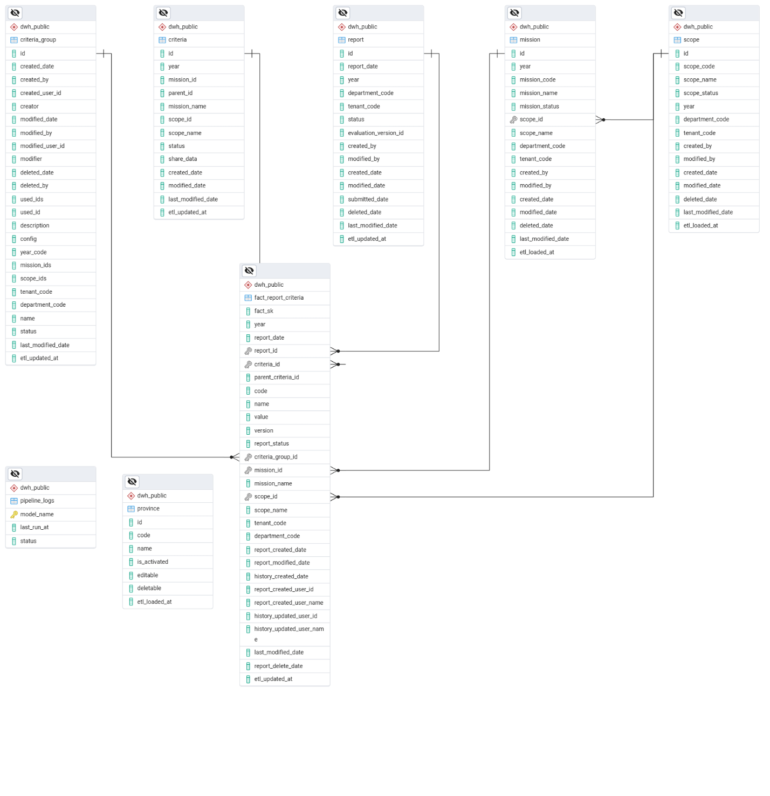

**TÀI LIỆU DATAWAREHOUSE PUBLIC VERSION**

# **PHẦN 1: TỔNG QUAN HỆ THỐNG**

**1. Tổng quan hệ thống**

Phiên bản **Public** của Data Warehouse được tinh gọn để phục vụ mục đích khai thác dữ liệu báo cáo công khai. Điểm khác biệt lớn nhất so với bản Internal là việc loại bỏ các bảng trung gian về User/Office chi tiết và tập trung vào bảng Fact tổng hợp đầy đủ thông tin ngữ cảnh (Denormalized) để tối ưu hiệu suất truy vấn BI.

- **Schema:** dwh_public

- **Mô hình:** Star Schema (Sơ đồ hình sao) mở rộng.

- **Bảng Fact trung tâm:** fact_report_criteria.

**2. Chi tiết các bảng dữ liệu**

A. Bảng Fact (Trung tâm)

Bảng này lưu trữ kết quả thống kê cuối cùng của các chỉ tiêu từ những báo cáo mới nhất.

| **Tên bảng** | **Ý nghĩa** |
|----|----|
| **fact_report_criteria** | Lưu trữ giá trị (value) của từng tiêu chí. Bảng này đã được denormalized (phẳng hóa) để chứa sẵn tên nhiệm vụ, tên lĩnh vực, và thông tin người cập nhật gần nhất từ lịch sử, giúp việc tạo báo cáo không cần join quá nhiều bảng. |

**B. Nhóm Dimension (Kích thước)**

Định nghĩa các chiều phân tích dữ liệu.

| **Tên bảng** | **Ý nghĩa** |
|----|----|
| **criteria** | Danh mục tiêu chí đánh giá. Có thêm cột share_data để kiểm soát quyền công khai dữ liệu. |
| **criteria_group** | Nhóm các tiêu chí theo từng bộ chỉ số hoặc biểu mẫu. |
| **mission** | Danh mục các nhiệm vụ cụ thể. |
| **scope** | Phân loại lĩnh vực phụ trách (Phạm vi). |
| **report** | Header của báo cáo, chứa trạng thái và ngày nộp. |
| **province** | Danh mục đơn vị hành chính tỉnh/thành phố. |

**C. Nhóm Giám sát (Monitoring)**

| **Tên bảng** | **Ý nghĩa** |
|----|----|
| **pipeline_logs** | Theo dõi lịch sử vận hành của các luồng ETL (tên model, thời gian chạy cuối, trạng thái thành công/thất bại). |

# **PHẦN 2: CHI TIẾT CÁC BẢNG**

**1. Bảng criteria (Danh mục Tiêu chí)**

Lưu trữ thông tin định nghĩa các chỉ tiêu thu thập dữ liệu.

| **Tên cột** | **Kiểu dữ liệu** | **Ý nghĩa** |
|----|----|----|
| **id** | uuid | Khóa chính định danh tiêu chí. |
| **year** | varchar(4) | Năm áp dụng tiêu chí. |
| **mission_id** | uuid | ID nhiệm vụ chứa tiêu chí này. |
| **parent_id** | uuid | ID tiêu chí cấp cha (dùng cho cấu trúc cây). |
| **mission_name** | varchar(255) | Tên nhiệm vụ liên quan (lưu trực tiếp để truy vấn nhanh). |
| **scope_id** | uuid | ID lĩnh vực của tiêu chí. |
| **scope_name** | varchar(50) | Tên lĩnh vực của tiêu chí. |
| **status** | enum | Trạng thái tiêu chí (collection_criteria_status_enum). |
| **share_data** | boolean | Cờ xác định có công khai dữ liệu này hay không. |
| **created_date** | timestamp | Ngày giờ tạo bản ghi. |
| **modified_date** | timestamp | Ngày giờ chỉnh sửa bản ghi. |
| **last_modified_date** | timestamp | Thời điểm cập nhật cuối cùng đồng bộ từ nguồn. |
| **etl_updated_at** | timestamp | Thời điểm dữ liệu được nạp vào kho DWH. |

**2. Bảng criteria_group (Nhóm Tiêu chí)**

Nhóm các bộ tiêu chí phục vụ cho các đợt cấu hình báo cáo.

| **Tên cột** | **Kiểu dữ liệu** | **Ý nghĩa** |
|----|----|----|
| **id** | uuid | Khóa chính định danh nhóm. |
| **created_date / modified_date** | timestamp | Ngày giờ tạo và chỉnh sửa nhóm. |
| **created_by / modified_by** | varchar(256) | Định danh người tạo/người sửa (dạng text). |
| **created_user_id / modified_user_id** | uuid | ID người dùng tương ứng trong hệ thống. |
| **creator / modifier** | varchar(256) | Tên hiển thị của người tạo/người sửa. |
| **deleted_date / deleted_by** | timestamp / varchar | Thông tin xóa bản ghi (nếu có). |
| **used_ids / used_id** | uuid\[\] / varchar | Danh sách các tiêu chí thành viên trong nhóm. |
| **description** | varchar(500) | Mô tả chi tiết về nhóm tiêu chí. |
| **config** | jsonb | Cấu hình động cho nhóm (thứ tự, thuộc tính...). |
| **year_code** | varchar(4) | Mã năm làm việc. |
| **mission_ids / scope_ids** | uuid\[\] | Danh sách các nhiệm vụ/lĩnh vực liên quan đến nhóm. |
| **tenant_code / department_code** | varchar(64) | Mã tổ chức và mã đơn vị sở hữu dữ liệu. |
| **name** | varchar(120) | Tên gọi của nhóm tiêu chí. |
| **status** | enum | Trạng thái nhóm (criteria_group_status_enum). |
| **last_modified_date / etl_updated_at** | timestamp | Dấu vết đồng bộ dữ liệu kỹ thuật. |

**3. Bảng fact_report_criteria (Sự thật Báo cáo - Trọng tâm)**

Lưu trữ giá trị cuối cùng của từng chỉ tiêu, bao gồm thông tin ngữ cảnh và người cập nhật.

| **Tên cột** | **Kiểu dữ liệu** | **Ý nghĩa** |
|----|----|----|
| **fact_sk** | text | Khóa thay thế (Surrogate Key) duy nhất cho mỗi dòng Fact. |
| **year** | varchar(4) | Năm của dữ liệu báo cáo. |
| **report_date** | date | Ngày ghi nhận báo cáo. |
| **report_id** | uuid | ID bản ghi báo cáo gốc. |
| **criteria_id** | uuid | ID tiêu chí tương ứng. |
| **parent_criteria_id** | uuid | ID tiêu chí cha (hỗ trợ phân cấp báo cáo). |
| **code / name** | text | Mã và tên tiêu chí tại thời điểm ghi nhận. |
| **value** | numeric | **Giá trị thực tế** của tiêu chí. |
| **version** | integer | Phiên bản báo cáo (lấy từ bản ghi mới nhất). |
| **report_status** | varchar(32) | Trạng thái hiện tại của báo cáo (ví dụ: approved). |
| **criteria_group_id** | uuid | ID nhóm tiêu chí áp dụng cho báo cáo này. |
| **mission_id / mission_name** | uuid / varchar | Thông tin nhiệm vụ thực hiện. |
| **scope_id / scope_name** | uuid / varchar | Thông tin lĩnh vực thực hiện. |
| **tenant_code / department_code** | varchar(64) | Mã tổ chức và mã đơn vị thực hiện báo cáo. |
| **report_created_date / modified_date** | timestamp | Thời gian tạo và sửa báo cáo tại nguồn. |
| **history_created_date** | timestamp | Thời điểm tạo phiên bản trong lịch sử. |
| **report_created_user_id / name** | uuid / varchar | ID và tên người tạo báo cáo gốc. |
| **history_updated_user_id / name** | uuid / varchar | **ID và tên người cập nhật số liệu cuối cùng** (từ history). |
| **last_modified_date / report_delete_date** | timestamp | Dấu vết chỉnh sửa cuối và thời gian xóa (nếu có). |
| **etl_updated_at** | timestamp | Thời điểm dữ liệu được nạp vào kho Public. |

**4. Bảng mission (Nhiệm vụ)**

Danh mục các nhiệm vụ đã được phân công.

| **Tên cột** | **Kiểu dữ liệu** | **Ý nghĩa** |
|----|----|----|
| **id** | uuid | Khóa chính định danh nhiệm vụ. |
| **year** | varchar(4) | Năm thực hiện nhiệm vụ. |
| **mission_code / mission_name** | varchar | Mã và tên của nhiệm vụ. |
| **mission_status** | boolean | Trạng thái (True = đang hoạt động). |
| **scope_id / scope_name** | uuid / varchar | Liên kết lĩnh vực phụ trách. |
| **department_code / tenant_code** | varchar(64) | Mã đơn vị và tổ chức quản lý nhiệm vụ. |
| **created_by / modified_by** | varchar(256) | Người tạo và người sửa bản ghi. |
| **created_date / modified_date / deleted_date** | timestamp | Các mốc thời gian hệ thống. |
| **last_modified_date / etl_loaded_at** | timestamp | Đồng bộ dữ liệu vào kho DWH. |

**5. Bảng report (Báo cáo hiện hành)**

Header của báo cáo thu thập dữ liệu.

| **Tên cột** | **Kiểu dữ liệu** | **Ý nghĩa** |
|----|----|----|
| **id** | uuid | Khóa chính định danh báo cáo. |
| **report_date / year** | date / varchar | Ngày ghi nhận và năm của báo cáo. |
| **department_code / tenant_code** | varchar(64) | Mã đơn vị và tổ chức thực hiện báo cáo. |
| **status** | varchar(32) | Trạng thái phê duyệt báo cáo. |
| **evaluation_version_id** | uuid | Phiên bản quy trình duyệt đang áp dụng. |
| **created_by / modified_by** | varchar(256) | Người tạo và người sửa báo cáo. |
| **created_date / modified_date** | timestamp | Thời gian tạo và sửa báo cáo. |
| **submitted_date** | timestamptz | Thời điểm báo cáo được gửi đi. |
| **deleted_date** | timestamp | Thời điểm xóa báo cáo (nếu có). |
| **last_modified_date / etl_updated_at** | timestamp | Dấu vết đồng bộ dữ liệu. |

**6. Bảng scope (Lĩnh vực)**

Phạm vi/lĩnh vực phụ trách của các nhiệm vụ.

| **Tên cột** | **Kiểu dữ liệu** | **Ý nghĩa** |
|----|----|----|
| **id** | uuid | Khóa chính định danh lĩnh vực. |
| **scope_code / scope_name** | varchar(50) | Mã và tên của lĩnh vực. |
| **scope_status** | boolean | Trạng thái hoạt động. |
| **year** | varchar(4) | Năm liên kết lĩnh vực. |
| **department_code / tenant_code** | varchar(64) | Mã đơn vị và tổ chức quản lý. |
| **created_by / modified_by / created_date / modified_date** | \- | Thông tin người thực hiện và thời gian tạo/sửa. |
| **deleted_date** | timestamp | Thời điểm xóa bản ghi. |
| **last_modified_date / etl_loaded_at** | timestamp | Dấu vết đồng bộ dữ liệu kỹ thuật. |

**7. Bảng pipeline_logs & province (Giám sát & Địa phương)**

**Bảng pipeline_logs**: Theo dõi hoạt động ETL.

- **model_name** (text, PK): Tên bảng dữ liệu.

- **last_run_at** (timestamptz): Lần cuối cùng chạy đồng bộ.

- **status** (text): Trạng thái (Success/Failed).

**Bảng province**: Danh mục đơn vị hành chính.

- **id / code / name**: Khóa chính, mã và tên tỉnh/thành phố.

- **is_activated / editable / deletable**: Các cờ kiểm soát trạng thái và quyền hạn.

- **etl_loaded_at**: Thời điểm cập nhật vào kho Public.

**PHẦN 3: NGUỒN DỮ LIỆU, LỊCH CHẠY VÀ CƠ CHẾ KIỂM SOÁT CÔNG KHAI**

**1. Vị trí trong kiến trúc tổng thể**

vna_dwh_public là một dbt project độc lập với vna_dwh_internal, cùng chạy trên nền Airflow/Cosmos của repo vna_dwh_pipline. DAG tương ứng (dag_id: vna_dwh_public) chạy theo lịch cố định \*/5 \* \* \* \* (mỗi 5 phút), không phụ thuộc lịch 2h sáng của DAG đồng bộ tổ chức (sync_core_tenant) hay việc trigger DAG vna_dwh_internal.

**2. Cơ chế kiểm soát công khai dữ liệu (Privacy filter)**

Việc một chỉ tiêu có được hiển thị giá trị (value) trên bản Public hay không được quyết định hoàn toàn bởi cột share_data của bảng criteria (mục A ở trên): model fact_report_criteria join tới criteria và chỉ giữ lại giá trị value khi share_data = true ở bản ghi tương ứng; ngược lại value được trả về NULL. Đây là cơ chế duy nhất kiểm soát việc công khai số liệu — không có tầng lọc nào khác ở phía DAG hay ứng dụng đọc dữ liệu Public.

**3. Lưu ý kỹ thuật cần xác minh**

\- Cấu hình profile của DAG vna_dwh_public (dags/vna_dwh_public.py) hiện khai schema="dwh_internal" giống hệt DAG vna_dwh_internal — nhiều khả năng là sao chép nhầm từ DAG kia. Cần xác minh lại dbt project vna_dwh_public có đang thực sự build đúng vào schema dwh_public hay đang ghi đè lên schema dwh_internal.
