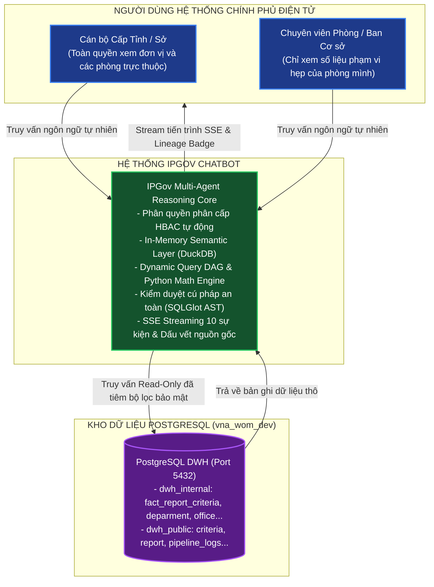

# TÀI LIỆU ĐẶC TẢ THIẾT KẾ KIẾN TRÚC HỆ THỐNG IPGOV CHATBOT
## PHẦN 00: BỐI CẢNH HỆ THỐNG, PHÂN TÍCH THẤT BẠI CỦA GOVGRAPH VÀ CÁC ĐỘNG LỰC KIẾN TRÚC (ARCHITECTURAL DRIVERS)

> **Tiêu chuẩn áp dụng:** Arc42 (Phần 1: Introduction and Goals, Phần 2: Architecture Constraints, Phần 3: Context and Scope) & IEEE Std 1016-2009 (Context Viewpoint).  
> **Trạng thái tài liệu:** Baseline System Design Document (SDD).  
> **Phạm vi áp dụng:** Dự án Trợ lý ảo Tra cứu Dữ liệu Kho DWH Chính phủ điện tử (`IPGov_Chatbot`).  
> **Quy chuẩn hiển thị:** 100% biểu đồ được định dạng bằng mã Mermaid chuẩn.

---

### 1. BỐI CẢNH VÀ TỔNG QUAN HỆ THỐNG (SYSTEM CONTEXT)

Hệ thống Kho dữ liệu (`vna_wom_dev`) phục vụ công tác quản lý, giám sát và báo cáo số liệu kinh tế - xã hội, an toàn lao động, y tế và hành chính công trên phạm vi đa cấp (Tỉnh/Thành phố $\to$ Sở/Ban/Ngành $\to$ Phòng/Ban chuyên môn trực thuộc).

Mục tiêu của `IPGov_Chatbot` là cung cấp giao diện hội thoại thông minh cho phép cán bộ quản lý và chuyên viên nghiệp vụ truy vấn số liệu phân tích, tổng hợp báo cáo từ CSDL quan hệ PostgreSQL mà không cần kỹ năng viết SQL, đồng thời **bảo đảm tuyệt đối nguyên tắc phân quyền phân cấp dữ liệu** và **truy xuất nguồn gốc chứng cứ (data lineage)**.

---

### 2. PHÂN TÍCH NGUYÊN NHÂN THẤT BẠI CỦA HỆ THỐNG CŨ (GOVGRAPH ROOT CAUSE ANALYSIS)

Dự án tiền nhiệm (`GovGraph`) đã thất bại toàn tập trong giai đoạn thử nghiệm thực tế. Qua phân tích kỹ thuật trên toàn bộ mã nguồn cũ và nhật ký thực thi, các nguyên nhân gốc rễ (Root Causes) được xác định như sau:

| Mã Lỗi | Thành Phần | Hiện Trạng Thất Bại của GovGraph | Hậu Quả Thực Tế | Bài Học Kiến Trúc Cho IPGov_Chatbot |
| :--- | :--- | :--- | :--- | :--- |
| **RC-01** | **Text-to-SQL Architecture** | Sử dụng mô hình Naive Prompting: Ném toàn bộ chuỗi DDL của 57 bảng vào context của LLM và yêu cầu LLM sinh trực tiếp mã SQL. | • Token context bị tràn (>32k tokens), chi phí cao. • Tỷ lệ ảo giác (hallucination) bảng và cột vượt quá 45%. • LLM tự chế ra các bảng không tồn tại. | Phải phân tầng: Sử dụng **In-Memory Semantic Layer** và **Schema Pruning** để chỉ nạp metadata của các bảng thực sự liên quan đến câu hỏi. |
| **RC-02** | **Security & Guardrails** | Không có bộ phân tích cú pháp tĩnh (AST Parser). Mã SQL do LLM sinh ra được gửi trực tiếp xuống CSDL qua kết nối người dùng. | • Rủi ro SQL Injection qua prompt hacking. • LLM có thể sinh lệnh `DROP`, `DELETE`, `UPDATE` phá hủy dữ liệu. | Tách biệt hoàn toàn tầng sinh mã và tầng thực thi. Cưỡng chế kiểm tra an toàn bằng **SQLGlot AST Validator** trước khi kết nối DB. |
| **RC-03** | **Access Control (HBAC)** | Phân quyền chỉ được mô tả bằng câu chữ trong system prompt (`"Chỉ được trả lời dữ liệu của Sở Nội vụ"`). | LLM hoàn toàn bỏ qua ràng buộc prompt khi người dùng hỏi các câu gián tiếp hoặc jailbreak, dẫn đến rò rỉ số liệu liên cơ quan. | Phân quyền phân cấp phải được **cưỡng chế mang tính tất định (Deterministic Enforcement)**: Tự động inject mệnh đề `WHERE tenant_code = ... AND department_code = ...` ở tầng AST. |
| **RC-04** | **Data Type & Aggregation** | Bỏ qua đặc thù dữ liệu: Cột `value` trong `fact_report_criteria` là `TEXT` chứa chuỗi rỗng `''` và `NULL`. | Lệnh `SUM(value)` gây lỗi runtime tức thì: `invalid input syntax for type numeric: ""`. Hệ thống crash 100% khi tính toán. | Chuẩn hóa toàn bộ biểu thức tổng hợp qua Semantic Layer: Ép buộc dùng `NULLIF(TRIM(value), '')::numeric`. |
| **RC-05** | **Double-Counting** | Truy vấn `fact_report_criteria` mà không lọc cấp bậc chỉ tiêu trong cây `criteria`. | Tổng hợp số liệu bị nhân đôi/nhân ba do cộng dồn cả chỉ tiêu cha và các chỉ tiêu con trực thuộc. | Bổ sung thuật toán phát hiện và chỉ tính toán trên các **nút lá (Leaf Criteria)** hoặc các cấp chỉ tiêu tương đương. |
| **RC-06** | **Stateful Context & UX** | Truyền toàn bộ lịch sử chat vào prompt mà không có cấu trúc quản lý frame; không có cơ chế streaming tiến trình. | • Người dùng đợi 15-20s với màn hình loading quay tròn. • LLM bị nhầm lẫn giữa các điều kiện lọc của các lượt chat trước. | Sử dụng **Hierarchical Dialogue Frame Tracker (H-DFT)** và giao thức **Server-Sent Events (SSE) 10-Event Progressive Streaming**. |

---

### 3. CÁC THUỘC TÍNH CHẤT LƯỢNG VÀ RÀNG BUỘC KIẾN TRÚC (QUALITY ATTRIBUTES & CONSTRAINTS)

Tuân thủ tiêu chuẩn quốc tế **ISO/IEC 25010** về chất lượng phần mềm, kiến trúc `IPGov_Chatbot` được định hình bởi các chỉ số định lượng sau:

#### 3.1. Ràng buộc Phi chức năng (Non-Functional Requirements - NFRs)

1. **Tính Chính Xác & Độ Tin Cậy Thực Thi (Functional Accuracy & Reliability):**
   * Hệ thống Text-to-SQL dựa trên LLM mang tính xác suất, do đó hệ thống thiết lập mục tiêu thực nghiệm dựa trên các chuẩn benchmark học thuật (Spider, BIRD-SQL):
     * **Valid SQL Rate (VA):** $\ge 98\%$ câu lệnh SQL sinh ra đúng cú pháp PostgreSQL 16 và hợp lệ về mặt ngữ nghĩa schema.
     * **Execution Accuracy (EX):** $\ge 85\%$ câu truy vấn trên tập kiểm thử nghiệp vụ cho ra kết quả trùng khớp với Ground Truth.
     * **Error Budget:** Chấp nhận tỷ lệ lỗi nghiệp vụ tối đa $15\%$ đối với các truy vấn quá mơ hồ hoặc thiếu dữ liệu, trong đó $100\%$ các trường hợp lỗi phải được kích hoạt cơ chế phục hồi suy thoái (Graceful Fallback), không bao giờ trả về lỗi hệ thống 500 cho người dùng.
2. **An Toàn Bảo Mật Tuyệt Đối (Security & Access Control):**
   * **Tỷ lệ vi phạm dữ liệu chéo (Cross-tenant/Cross-dept Leakage Rate):** **Tuyệt đối 0%**. Mọi truy vấn bắt buộc phải đi qua AST Rewriter để gắn bộ lọc phạm vi quyền hạn.
   * **Bảo vệ toàn vẹn dữ liệu:** Tài khoản kết nối CSDL từ Chatbot Backend chỉ có quyền `SELECT` (Read-Only), tuyệt đối cấm mọi thao tác `INSERT`, `UPDATE`, `DELETE`, `DROP`, `ALTER`.
3. **Hiệu Năng & Độ Trễ (Performance & Perceived Latency):**
   * **P95 Latency (Single SQL):** $\le 2.5\text{ giây}$ từ lúc nhận câu hỏi đến khi stream xong bảng kết quả.
   * **P95 Latency (Complex Multi-step DAG):** $\le 6.0\text{ giây}$.
   * **Time-to-First-Event (TTFE):** $\le 600\text{ ms}$ (Gửi sự kiện SSE đầu tiên `intent_classified` về giao diện người dùng để triệt tiêu độ trễ nhận thức).
4. **Khả Năng Kiểm Toán & Truy Vết (Auditability & Data Lineage):**
   * $100\%$ các câu trả lời chứa số liệu báo cáo bắt buộc phải đính kèm Dấu vết Nguồn gốc (Provenance Badge): Tên cơ quan báo cáo, Tên phòng ban nộp, Ngày chốt dữ liệu, và Mốc thời gian cập nhật ETL gần nhất.

---

### 4. THUẬT NGỮ VÀ KHÁI NIỆM CỐT LÕI (GLOSSARY)

* **DWH (Data Warehouse):** Kho dữ liệu tập trung lưu trữ các bảng sự kiện (Fact) và chiều (Dimension) phục vụ phân tích báo cáo.
* **HBAC (Hierarchical Role-Based Access Control):** Mô hình phân quyền kế thừa theo cấu trúc cây phân cấp hành chính (Cấp Tỉnh $\to$ Cấp Sở $\to$ Cấp Phòng ban).
* **AST (Abstract Syntax Tree):** Cây cú pháp trừu tượng đại diện cho cấu trúc của câu lệnh SQL, cho phép phân tích và chỉnh sửa mã SQL bằng thuật toán xác định.
* **Semantic Layer:** Tầng trung gian chuyển đổi các khái niệm ngôn ngữ tự nhiên thành các định nghĩa bảng, cột, phép tính và quan hệ JOIN chính xác trong CSDL.
* **H-DFT (Hierarchical Dialogue Frame Tracker):** Bộ theo dõi khung ngữ cảnh hội thoại có cấu trúc, lưu trữ phạm vi đơn vị, thời gian và chỉ tiêu giữa các lượt hỏi mà không cần nhồi toàn bộ lịch sử chat vào LLM.
* **SSE (Server-Sent Events):** Giao thức truyền dữ liệu một chiều thời gian thực từ server về client qua kết nối HTTP liên tục.
* **Provenance / Data Lineage:** Thông tin định danh nguồn gốc, xuất xứ và quy trình hình thành nên một con số báo cáo.
