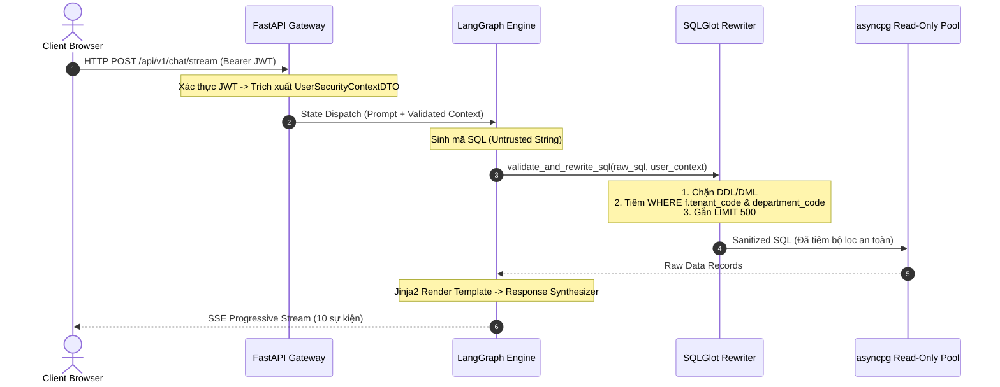

# TÀI LIỆU ĐẶC TẢ THIẾT KẾ KIẾN TRÚC HỆ THỐNG IPGOV CHATBOT
## PHẦN 01: NGĂN XẾP CÔNG NGHỆ (TECH STACK) VÀ KIẾN TRÚC TỔNG THỂ CONTAINER

> **Tiêu chuẩn áp dụng:** Arc42 (Phần 4: Solution Strategy, Phần 7: Deployment View) & C4 Model (Level 2: Container Diagram).  
> **Trạng thái tài liệu:** Baseline System Design Document (SDD).  
> **Phạm vi áp dụng:** Ngăn xếp kỹ thuật và phân tầng dịch vụ hệ thống `IPGov_Chatbot`.  
> **Quy chuẩn hiển thị:** 100% biểu đồ được định dạng bằng mã Mermaid chuẩn.

---

### 1. SƠ ĐỒ KIẾN TRÚC CONTAINER (C4 MODEL - LEVEL 2)

Hệ thống được thiết kế theo kiến trúc phân tầng phi tập trung, phân tách rạch ròi giữa tầng giao tiếp (API Gateway), tầng điều phối Multi-Agent, tầng kiểm soát an toàn tất định (AST Engine) và kho dữ liệu DWH:

```mermaid
flowchart TD
    CLIENT["CLIENT APPLICATION<br/>(Web App React / Next.js)<br/>Kết nối SSE nhận stream tiến trình"]
    
    subgraph BACKEND["HỆ THỐNG BACKEND IPGOV CHATBOT"]
        API["CONTAINER 1: API GATEWAY (FastAPI)<br/>- JWT Authentication<br/>- User Security Context Extraction<br/>- SSE Event Stream Dispatcher"]
        
        AGENT["CONTAINER 2: REASONING ENGINE (LangGraph)<br/>- 2-Tier Quest State Machine (H-DFT)<br/>- Intent & Complexity Router (OpenRouter Gated LLM Gateway)<br/>- Text-to-SQL Generator (DIN-SQL / MAC-SQL)<br/>- Python Math Engine (NumPy Delta/YoY)"]
        
        REDIS[("CONTAINER 5: REDIS SESSION STORE (ipgov-redis)<br/>- ActiveQuestFrame & temp_memory<br/>- Sliding Window Messages (LTRIM 3 turns)<br/>- Tier 0.3 Decision Cache (< 50ms)")]
        
        CATALOG["IN-MEMORY CATALOG & SEARCH (DuckDB & NetworkX)<br/>- Lean 2-Stage Schema Engine: DuckDB Native FTS (BM25)<br/>- RapidFuzz C++ Entity Matching<br/>- NetworkX Minimal Steiner Tree & Hierarchy Graph"]
        
        AST["CONTAINER 3: AST ENFORCER (SQLGlot)<br/>- PostgreSQL Dialect Validator<br/>- DDL/DML Rejection Gate<br/>- Deterministic HBAC WHERE Injector"]
    end
    
    DB[("CONTAINER 4: DWH POSTGRESQL (vna_wom_dev)<br/>- Schemas: dwh_internal, dwh_public<br/>- Core Fact: fact_report_criteria<br/>- Port: 5432 (asyncpg Read-Only Pool)")]

    CLIENT -->|HTTP POST / JSON & SSE Stream| API
    API -->|Dispatch State & Context| AGENT
    AGENT <-->|Đọc/Ghi Context & Decision Cache O(1)| REDIS
    AGENT <-->|Tra cứu siêu dữ liệu & FTS BM25 < 2ms| CATALOG
    AGENT -->|Untrusted SQL String| AST
    AST -->|"Sanitized SQL (HBAC Injected)"| DB
    DB -->|Raw Data Rows| AGENT

    classDef clientNode fill:#1f2937,stroke:#9ca3af,stroke-width:2px,color:#fff;
    classDef apiNode fill:#1e3a8a,stroke:#3b82f6,stroke-width:2px,color:#fff;
    classDef agentNode fill:#14532d,stroke:#22c55e,stroke-width:2px,color:#fff;
    classDef redisNode fill:#c2410c,stroke:#ea580c,stroke-width:2px,color:#fff;
    classDef securityNode fill:#7c2d12,stroke:#f97316,stroke-width:2px,color:#fff;
    classDef dbNode fill:#581c87,stroke:#a855f7,stroke-width:2px,color:#fff;

    class CLIENT clientNode;
    class API apiNode;
    class AGENT,CATALOG agentNode;
    class REDIS redisNode;
    class AST securityNode;
    class DB dbNode;
```

---

### 2. CHI TIẾT NGĂN XẾP CÔNG NGHỆ (TECH STACK SPECIFICATION)

Toàn bộ các thành phần công nghệ được lựa chọn dựa trên nguyên tắc: **Tính tất định cao (Determinism)**, **Tốc độ thực thi thấp (Low Latency)**, và **Độ an toàn cấp doanh nghiệp (Enterprise Security)**.

| Thành Phần Kỹ Thuật | Công Nghệ Lựa Chọn | Phiên Bản | Vai Trò Kiến Trúc & Lý Do Kỹ Thuật |
| :--- | :--- | :--- | :--- |
| **API Framework** | **FastAPI** | $\ge 0.110.0$ | Xây dựng REST API bất đồng bộ (Asynchronous), hỗ trợ native typing, OpenAPI 3.1, và streaming response hiệu năng cao. |
| **ASGI Server** | **Uvicorn** | $\ge 0.28.0$ | Máy chủ web production hiệu năng cao cho ứng dụng bất đồng bộ Python. |
| **Agent Orchestration** | **LangGraph** | $\ge 0.0.30$ | Khung điều phối Multi-Agent dạng đồ thị trạng thái (StateGraph). Tích hợp **2-Tier Quest State Machine**: Quản lý slot dở dang trong RAM (0 tokens LLM) và Background Worker chắt lọc thông tin phiên vào `temp_memory`. |
| **LLM Gateway & Abstract Fallback Layer** | **IPGov LLMGateway (`IPGov_Chatbot/core/llm_gateway.py`)** | Core Module | Tầng trừu tượng hóa cuộc gọi LLM theo mẫu Strategy/Facade Pattern, tích hợp Ponytail Helper `call_structured_with_fallback[T: BaseModel]()` (đồng bộ & bất đồng bộ). Hỗ trợ OpenRouter (OpenAI SDK), Google GenAI SDK (`google-genai`), tự động ghi nhận metadata logging chi tiết (`data/logs/llm_usage.jsonl`), tự động kiểm tra `confidence_score < 0.7`, chạy `invariant_validator`, và fallback linh hoạt giữa các model/provider. |
| **Router LLM & Lightweight Structured Tasks** | **OpenRouter API (`google/gemini-2.5-flash-lite`)** | Cloud API | Primary Model cho suy luận phân loại ý định, trích xuất slot và sinh cấu trúc nhẹ (Module 03 Router, Schema Linking Module 04, Fast Synthesis Module 05). Tối ưu hóa chi phí siêu tiết kiệm (~$0.0001/call), độ trễ thấp, tích hợp `thought_scratchpad` CoT ở đầu schema, cầu dao an toàn `max_tokens=800`. |
| **Heavy Fallback & Complex Tasks LLM** | **OpenRouter API (`google/gemini-3.8-flash`)** | Cloud API | Heavy Fallback Model chuyên trách tự động kích hoạt khi: (1) Mô hình chính tự đánh giá độ tự tin thấp (`confidence_score < 0.7`), (2) Lỗi Pydantic schema validation, hoặc (3) Vi phạm kiểm tra bất biến logic (`invariant_validator` trả về `False`). Kế thừa và tái sử dụng nhất quán trên Module 03, Module 04 (Text-to-SQL phức tạp), và Module 05 (Response Synthesizer đa chiều). |
| **AST Parser & Rewriter** | **SQLGlot** | $\ge 23.0.0$ | Bộ phân tích cú pháp SQL tĩnh, dịch phương ngữ (transpiler) và duyệt cây AST. Đảm bảo 100% mã SQL sinh ra không chứa mã độc và tự động inject điều kiện phân quyền HBAC mà không phụ thuộc vào LLM. |
| **In-Memory DB & BM25 Search** | **DuckDB (FTS Extension)** | $\ge 0.10.0$ | CSDL phân tích nhúng chạy trong RAM tích hợp bộ tìm kiếm toàn văn Native FTS (BM25). Thực hiện **Giai đoạn 1 của Lean 2-Stage Retrieval**: lọc thô Top-K bảng/cột ứng viên với độ trễ $< 2\text{ms}$, triệt tiêu tải CSDL chính và loại bỏ nhu cầu dựng Vector DB riêng. |
| **Entity Hierarchy & Schema Graph** | **NetworkX** | $\ge 3.2.0$ | Cấu trúc dữ liệu đồ thị. Đảm nhận 2 vai trò: (1) Quản lý cây phân cấp `tenant` $\to$ `deparment` $\to$ `office` và `criteria` để tìm Leaf Criteria; (2) **Giai đoạn 2 của Lean 2-Stage Retrieval**: giải thuật Minimal Steiner Tree kết nối Schema subgraph, tự động bù đắp các bảng cầu nối (Bridge Tables). |
| **Entity Matching** | **RapidFuzz** | $\ge 3.6.0$ | Thuật toán so khớp chuỗi mờ (Fuzzy matching) bằng C++ tốc độ cao. Dùng để ánh xạ tên phòng ban, sở ngành trong câu hỏi tự nhiên với danh mục chuẩn. |
| **PostgreSQL Driver** | **asyncpg** | $\ge 0.29.0$ | Thư viện kết nối PostgreSQL bất đồng bộ nhanh nhất trong hệ sinh thái Python, hỗ trợ Prepared Statements và Connection Pooling. |
| **Data Contracts** | **Pydantic v2** | $\ge 2.6.0$ | Định nghĩa dữ liệu truyền nhận (DTOs), xác thực dữ liệu đầu vào/đầu ra với tốc độ xử lý viết bằng Rust. |
| **Template Engine** | **Jinja2** | $\ge 3.1.3$ | Động cơ render văn bản mẫu chuẩn hóa (đã có sẵn trong dependency của FastAPI). Render template câu trả lời trong $< 0.05\text{ms}$, hỗ trợ filter định dạng số (`{{ val \| format_currency }}`) và rẽ nhánh logic ``, thay thế toàn bộ mã regex custom theo triết lý Ponytail. |
| **Math & Aggregations**| **Database-First (PostgreSQL / DuckDB SQL)** | Native C++ | Đẩy toàn bộ tính toán thống kê (Mean, Median, Percentile, YoY, MoM, Ranking) vào SQL Window Functions và Aggregate Functions. Python chỉ đóng vai trò đường ống dẫn (piping). |
| **DWH Database** | **PostgreSQL** | `16.x` | Kho dữ liệu quan hệ (`vna_wom_dev`) chứa các schema nghiệp vụ công. |
| **Observability & Tracing**| **Langfuse / OpenTelemetry** | Latest Stable | Theo dõi toàn diện từng bước suy luận của Agent, đo lường độ trễ (latency), tiêu thụ token và bắt vết lỗi truy vấn vào Dead-Letter-Queue. |

---

### 2.1. MẪU THIẾT KẾ GATED 2-STAGE CONFIDENCE FALLBACK & LỚP TRỪU TƯỢNG PONYTAIL (SSOT PATTERN)

Để giải quyết triệt để sự đánh đổi giữa **Chi Phí Tối Ưu** và **Độ Chính Xác Cao** mà không làm phức tạp hóa codebase bằng các lớp wrapper hay factory cồng kềnh, toàn bộ các module trong hệ sinh thái IPGov Chatbot áp dụng thống nhất mẫu thiết kế **Gated 2-Stage Pipeline** thông qua hàm generic helper duy nhất tại `IPGov_Chatbot/core/llm_gateway.py`:

```mermaid
flowchart TD
    INPUT([Đầu Vào Tác Vụ: Module 03 / 04 / 05]) --> STAGE1[Stage 1: Primary Model<br/>google/gemini-2.5-flash-lite<br/>• Tiết kiệm chi phí: ~$0.0001/call<br/>• thought_scratchpad: CoT 1-2 câu đầu JSON<br/>• confidence_score: Tự đánh giá 0.0 - 1.0]

    STAGE1 --> GATE_DECISION{Cổng Đánh Giá Điều Kiện Fallback<br/>1. Pydantic Schema Validation lỗi?<br/>2. confidence_score < 0.7?<br/>3. invariant_validator callback trả về False?}

    GATE_DECISION -->|Thỏa mãn toàn bộ (Confident & Valid)| RAM_GATE[Stage 3: Deterministic Invariant Gates<br/>Kiểm soát an toàn nghiệp vụ trong RAM]
    
    GATE_DECISION -->|Vi phạm 1 trong 3 điều kiện| STAGE2[Stage 2: Heavy Fallback Model<br/>google/gemini-3.8-flash<br/>• Tự động kích hoạt khi task phức tạp<br/>• Khả năng lập luận đa chiều & sinh CTE/SQL khó<br/>• Tự động ánh xạ tương thích provider]
    
    STAGE2 --> RAM_GATE
    RAM_GATE --> OUTPUT([Kết Quả Đầu Ra Hợp Lệ DTO])

    classDef stage1 fill:#1e3a8a,stroke:#3b82f6,stroke-width:2px,color:#fff;
    classDef stage2 fill:#7c2d12,stroke:#f97316,stroke-width:2px,color:#fff;
    classDef gateNode fill:#14532d,stroke:#22c55e,stroke-width:2px,color:#fff;
    classDef ioNode fill:#1f2937,stroke:#9ca3af,stroke-width:2px,color:#fff;

    class STAGE1 stage1;
    class STAGE2 stage2;
    class GATE_DECISION,RAM_GATE gateNode;
    class INPUT,OUTPUT ioNode;
```

#### Hợp Đồng Giao Diện Generic Helper (`IPGov_Chatbot/core/llm_gateway.py`):
```python
def call_structured_with_fallback(
    prompt: str,
    schema: Type[T],
    system_prompt: Optional[str] = None,
    primary_model: Optional[str] = None,        # Mặc định: google/gemini-2.5-flash-lite
    fallback_model: Optional[str] = None,       # Mặc định: google/gemini-3.8-flash
    min_confidence: float = 0.7,                # Ngưỡng kích hoạt fallback
    confidence_attr: str = "confidence_score",  # Thuộc tính tự đánh giá độ tự tin
    invariant_validator: Optional[Callable[[T], bool]] = None, # Cổng kiểm tra logic bất biến
    temperature: float = 0.0,
    provider: Optional[str] = None,
) -> Tuple[T, str, Dict[str, Any], float]:
    ...
```

* **Nguyên tắc kế thừa cho các module phía sau:**
  1. **Module 03 (Router):** Inject `invariant_validator` kiểm tra mốc năm và chống False-DAG.
  2. **Module 04 (Text-to-SQL):** Inject `invariant_validator` kiểm tra cú pháp AST qua `sqlglot.parse_one` và xác nhận bảng thuộc DWH Catalog; nếu fail hoặc confidence < 0.7 thì fallback sang `gemini-3.8-flash` để sinh SQL CTEs phức tạp.
  3. **Module 05 (Synthesizer):** Inject `invariant_validator` kiểm tra tính chính xác của số liệu trích dẫn đối chiếu với kết quả trả về từ DB (Data Reconciliation); nếu phát hiện số liệu hallucinate thì fallback sang `gemini-3.8-flash` để lập luận lại.

---

### 3. MA TRẬN PHÂN QUYỀN VÀ BIÊN AN TOÀN LIÊN DỊCH VỤ (INTER-SERVICE BOUNDARIES)

Để đảm bảo nguyên tắc Zero-Trust, các dịch vụ giao tiếp với nhau qua các giao thức và hợp đồng dữ liệu chuẩn hóa:



1. **Biên Giới Client - API Gateway:**
   * Mọi request bắt buộc phải có Bearer Token JWT. Gateway giải mã token để xác định `tenant_code`, `department_code`, `office_id` và `role_level`.
   * Giao tiếp hai chiều: Request qua HTTP POST `/api/v1/chat/stream`, Response phản hồi qua kết nối Server-Sent Events (SSE).
2. **Biên Giới Agent - AST Rewriter:**
   * Chuỗi SQL sinh ra từ LLM được xem là **Untrusted String (Mã nguồn chưa xác thực)**.
   * Cấm tuyệt đối việc truyền trực tiếp Untrusted SQL vào driver kết nối CSDL.
   * Chuỗi SQL bắt buộc phải đi qua hàm `validate_and_rewrite_sql(raw_sql, user_context)` của SQLGlot. Nếu câu lệnh chứa bất kỳ dấu hiệu DDL/DML nào hoặc không tương thích dialect PostgreSQL, luồng xử lý bị chặn đứng và ném ngoại lệ an toàn.
3. **Biên Giới Backend - DWH PostgreSQL:**
   * Kết nối CSDL sử dụng tài khoản chuyên dụng với quyền hạn tối thiểu: `GRANT SELECT ON ALL TABLES IN SCHEMA dwh_internal, dwh_public TO ipgov_readonly;`.
   * Cấu hình Connection Pool (`asyncpg`): `min_size = 5`, `max_size = 20`, `timeout = 10s`.

---

### 4. NGUYÊN TẮC THIẾT KẾ KIẾN TRÚC TINH GIẢN PONYTAIL (PONYTAIL LEAN ARCHITECTURE)

Hệ thống kiên quyết tuân thủ triết lý tinh giản phần mềm (Ponytail Philosophy — *"The best code is the code never written"*):

1. **Nguyên Tắc Zero-Extra-Services (Không Bổ Sung Container Ngoại Vi):**
   * Giữ nguyên bộ khung tối giản 4 container cốt lõi: Web Client, FastAPI Gateway, LangGraph + DuckDB Core Backend, và PostgreSQL DWH.
   * Tuyệt đối không triển khai thêm các dịch vụ trung gian cồng kềnh từ bên ngoài (như Cube.js, Metabase, Superset, LlamaIndex SQL pack) để tránh phát sinh nợ kỹ thuật ngẫu sinh (Accidental Complexity), suy giảm bảo mật AST và làm phân tán tài nguyên khỏi mục tiêu độ chính xác logic.
2. **Nguyên Tắc Database-First (Push Computation Down To Database):**
   * Toàn bộ các phép toán thống kê tập hợp (Roll-up, Drill-down, Tăng trưởng YoY/MoM, Xếp hạng Top-K, Phân vị Median/Percentile) phải được thực thi trực tiếp bên trong SQL của PostgreSQL và DuckDB thông qua Window Functions (`DENSE_RANK()`, `PERCENTILE_CONT`, `SUM() OVER ()`).
   * Động cơ C/C++ của CSDL xử lý hàng nghìn bản ghi chỉ trong $0.2\text{ms}$ và trả về đúng 1 dòng kết quả. Python chỉ đóng vai trò đường ống dẫn (piping) từ CSDL sang Jinja2, loại bỏ hoàn toàn các vòng lặp duyệt mảng thủ công trong Python.
3. **Nguyên Tắc Dùng Chuẩn Thị Trường & Stdlib Thay Vì Tự Chế Bánh Xe:**
   * Thay thế toàn bộ mã regex tự chế (`re.sub`) bằng **`Jinja2`** (hoặc `string.Template` của stdlib) để render câu trả lời.
   * Duyệt cây phân cấp hành chính và lọc nút lá bằng **`WITH RECURSIVE`** của SQL thay vì tự viết hàm đệ quy trong Python.
4. **Nguyên Tắc YAGNI Ở Tầng Multi-Agent (Triệt Tiêu Agent Bloat):**
   * Thu gọn luồng điều phối LangGraph thành StateGraph 3 Node tối giản: Node 1 (Router / Semantic Compiler) $\to$ Node 2 (Worker Fork/Join: DB Query + Draft Template) $\to$ Node 3 (Jinja2 Slot Filling & SSE Streamer). Không đẻ thêm các agent rườm rà.
