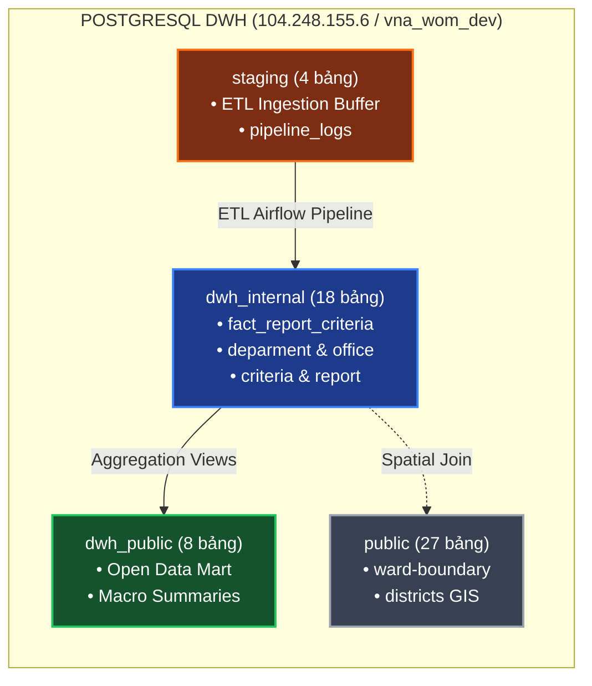
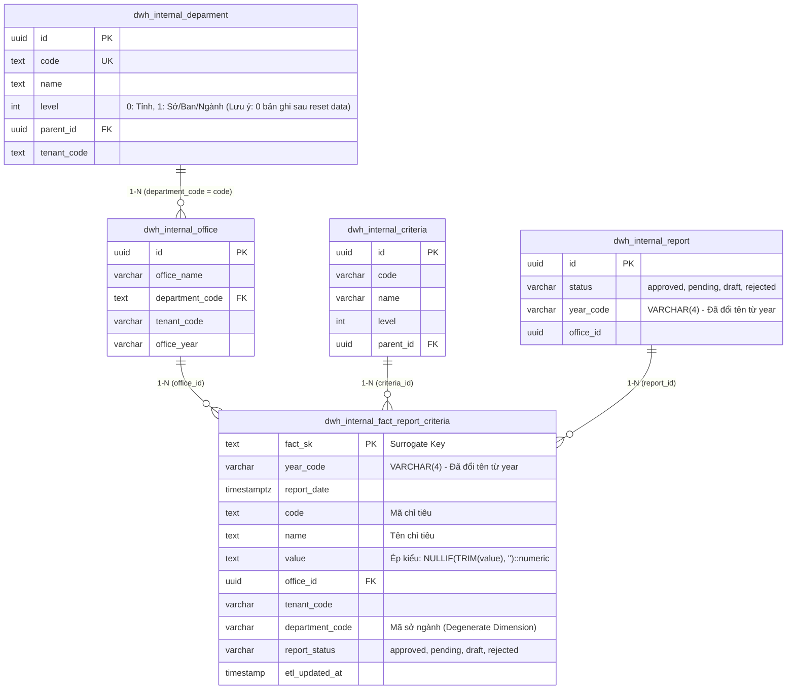
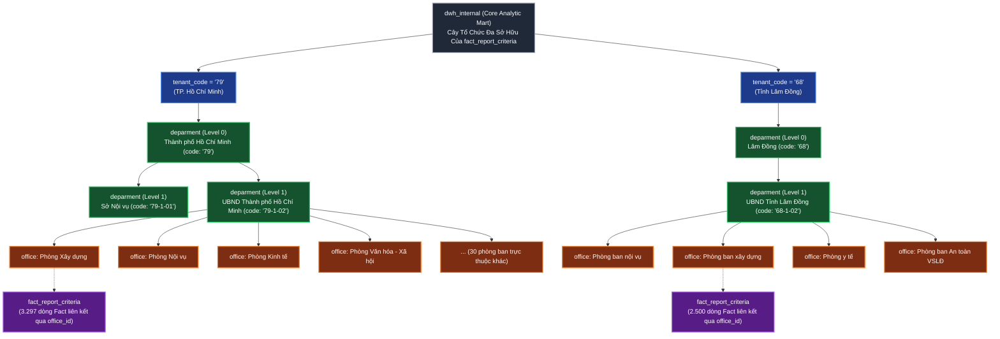
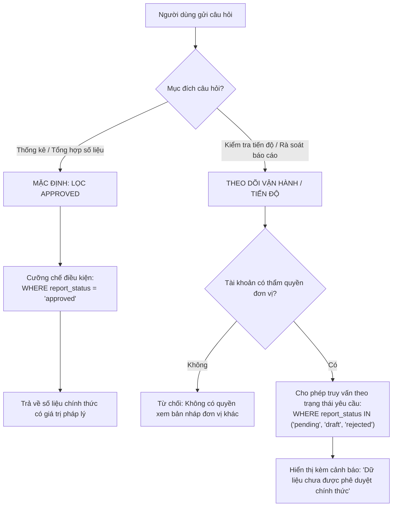

# TÀI LIỆU ĐẶC TẢ THIẾT KẾ KIẾN TRÚC HỆ THỐNG IPGOV CHATBOT
## PHẦN 02: KIẾN TRÚC DỮ LIỆU KHO DWH, CÂY THỰC THỂ VÀ QUY TẮC XỬ LÝ TRẠNG THÁI BÁO CÁO (REPORT STATUS)

> **Tiêu chuẩn áp dụng:** Arc42 (Phần 8: Cross-cutting Concepts / Data View) & IEEE Std 1016-2009 (Information Viewpoint).  
> **Căn cứ dữ liệu thực nghiệm:** Cơ sở dữ liệu PostgreSQL (`vna_wom_dev`) trên máy chủ phân tích trung tâm (`104.248.155.6:5432/vna_wom_dev`).  
> **Quy chuẩn hiển thị:** 100% biểu đồ được định dạng bằng mã Mermaid chuẩn.

---

### 1. KIẾN TRÚC PHÂN VÙNG VẬT LÝ KHO DỮ LIỆU (PHYSICAL SCHEMA ARCHITECTURE)

Kho dữ liệu DWH phục vụ hệ thống gồm **4 schema vật lý** với **57 bảng** và được phân tách thành 4 phân vùng chức năng độc lập:

1. **`dwh_internal` (Core Analytic Data Mart - 18 bảng):**  
   Vùng lưu trữ dữ liệu nghiệp vụ trọng yếu nhất của hệ thống. Chứa các bảng Fact báo cáo kinh tế - xã hội (`fact_report_criteria`), chiều cơ quan hành chính (`deparment`, `office`), chiều chỉ tiêu (`criteria`), và vòng đời báo cáo (`report`). Hơn **$95\%$ các truy vấn phân tích của Chatbot** được định tuyến trực tiếp vào schema này.
   *Lưu ý kiến trúc đặc biệt:* Sau đợt thiết lập lại dữ liệu kho công ty, bảng `deparment` hiện thời có 0 bản ghi. Chatbot áp dụng nguyên tắc cô lập `deparment`, không thực hiện SQL JOIN trực tiếp tới bảng này mà khai thác chiều suy biến (Degenerate Dimension) `f.department_code` trên `fact_report_criteria` kết hợp DuckDB Semantic Catalog In-Memory để phân giải ngữ nghĩa tên đơn vị.
2. **`dwh_public` (Open Data Mart - 8 bảng):**  
   Vùng lưu trữ các số liệu đã được tổng hợp vĩ mô, đóng gói sẵn để phục vụ tra cứu mở cho người dân và doanh nghiệp mà không cần phân quyền chi tiết.
3. **`public` (Shared GIS & Master Data - 27 bảng):**  
   Vùng lưu trữ danh mục ranh giới địa lý hành chính dùng chung (`ward-boundary`, `districts`) và các bảng cấu hình xác thực người dùng.
4. **`staging` (ETL Ingestion Buffer - 4 bảng):**  
   Vùng đệm trung chuyển tiếp nhận dữ liệu tải lên từ phần mềm tác nghiệp trước khi làm sạch và nạp vào DWH; đồng thời chứa bảng giám sát pipeline (`pipeline_logs`) phục vụ xác minh mốc tươi mới của dữ liệu.



#### 1.1. Lược Đồ Thực Thể Quan Hệ (ERD) Vùng Dữ Liệu Trọng Yếu `dwh_internal`

Bên trong schema `dwh_internal`, mô hình dữ liệu được thiết kế theo dạng Star/Snowflake Schema xoay quanh bảng Fact trung tâm `fact_report_criteria`:



---

### 2. CÂY THỰC THỂ TỔ CHỨC ĐA SỞ HỮU TRONG SCHEMA DWH_INTERNAL (MULTI-TENANT ORGANIZATIONAL DATA TREE)

Để hiểu được cách thức số liệu trong `fact_report_criteria` được phân bổ và truy vấn, hệ thống không xem các dòng dữ liệu là một khối phẳng. Thay vào đó, dữ liệu báo cáo trong schema `dwh_internal` phản ánh chính xác **Mô hình Cây Tổ chức Đa sở hữu (Multi-Tenant Organizational Hierarchy)** của bộ máy hành chính nhà nước.

Mối liên kết giữa các bảng trong schema `dwh_internal` tạo thành cây dữ liệu 4 tầng phân cấp:
* **Tầng 1 - Mã Phân Vùng Đơn Vị Hành Chính (`tenant_code`):** Tách biệt dữ liệu cấp Tỉnh/Thành phố trực thuộc Trung ương (Ví dụ: `79` cho TP. Hồ Chí Minh, `68` cho Tỉnh Lâm Đồng).
* **Tầng 2 - Cơ Quan Chủ Quản (`dwh_internal.deparment`):** Mô hình hóa cấp Tỉnh (`level = 0`, ví dụ: UBND Thành phố Hồ Chí Minh) và các Sở/Ban/Ngành trực thuộc (`level = 1`, ví dụ: Sở Nội vụ, Sở Xây dựng).
* **Tầng 3 - Phòng Ban Nghiệp Vụ Cơ Sở (`dwh_internal.office`):** Các đơn vị trực tiếp nhập liệu và lập báo cáo (Ví dụ: Phòng Xây dựng, Phòng Nội vụ, Phòng An toàn VSLĐ).
* **Tầng 4 - Dòng Số Liệu Báo Cáo Fact (`dwh_internal.fact_report_criteria`):** Mức hạt chi tiết nhất (Grain) của số liệu gắn chặt với `office_id`. Mọi thao tác Roll-up (Tổng hợp lên cấp Sở/Tỉnh) hay Drill-down (Chi tiết hóa xuống từng phòng) đều được tính toán dựa trên các nút thuộc cây này.



---

### 3. ĐẶC TẢ VÀ CHÍNH SÁCH XỬ LÝ TRẠNG THÁI BÁO CÁO (REPORT STATUS POLICY)

#### 3.1. Hiện trạng phân bổ thực tế trong CSDL `vna_wom_dev`
Trường `report_status` trong bảng `dwh_internal.fact_report_criteria` và trường `status` trong `dwh_internal.report` lưu trữ vòng đời kiểm duyệt của một báo cáo với các trạng thái định danh:

*Lưu ý snapshot kho dữ liệu hiện hành (`104.248.155.6`):* Sau đợt reset dữ liệu, bảng `fact_report_criteria` hiện có **463 bản ghi thực tế**, toàn bộ thuộc **năm 2026 (`year_code = '2026'`)**, mã tỉnh Lâm Đồng (`tenant_code = '68'`), và đơn vị `68-1-01`. Phân bổ trạng thái gồm:
- **`approved`**: **342 bản ghi (73.9%)** — Số liệu chính thức có giá trị pháp lý.
- **`draft`**: **121 bản ghi (26.1%)** — Bản nháp tác nghiệp.

Dưới đây là bảng định nghĩa 4 trạng thái chuẩn của hệ thống:

| Trạng Thái (`report_status`) | Tỷ Lệ Chuẩn | Ý Nghĩa Nghiệp Vụ Hành Chính |
| :--- | :---: | :--- |
| **`approved`** | **Chính thức** | **ĐÃ PHÊ DUYỆT CHÍNH THỨC:** Báo cáo đã được lãnh đạo có thẩm quyền thẩm định, ký số và đóng dấu nghiệp vụ. Đây là dữ liệu có giá trị pháp lý đầy đủ. |
| **`pending`** | **Nội bộ** | **ĐANG CHỜ DUYỆT:** Đơn vị cơ sở đã nộp báo cáo hoàn chỉnh nhưng cấp quản lý (Sở/UBND) đang trong quá trình rà soát, chưa phê duyệt. |
| **`draft`** | **Tác nghiệp** | **BẢN NHÁP:** Đơn vị cơ sở đang trong quá trình nhập liệu hoặc lưu tạm thời, số liệu chưa chốt, có thể thay đổi bất cứ lúc nào. |
| **`rejected`** | **Hoàn thiện** | **BỊ TỪ CHỐI:** Báo cáo bị cơ quan quản lý trả về do sai lệch số liệu, thiếu biên bản kiểm tra hoặc không đúng quy cách. |

#### 3.2. Chính sách truy vấn của Chatbot đối với từng trạng thái (Query Policy)



1. **Quy Tắc Mặc Định (Default Rule for Analytics):**
   * Đối với toàn bộ các câu hỏi phân tích, tính toán, so sánh hoặc trích xuất số liệu kinh tế - xã hội (Ví dụ: *"Năm 2025 có bao nhiêu vụ tai nạn lao động?"*), hệ thống **bắt buộc $100\%$ tự động tiêm điều kiện:**
     $$\text{f.report\_status = 'approved'}$$
   * Tuyệt đối không tính dồn các bản ghi `draft`, `pending`, hoặc `rejected` vào các chỉ tiêu báo cáo chính thức, nhằm loại bỏ rủi ro sai lệch số liệu pháp lý.
2. **Quy Tắc Ngoại Lệ (Operational Tracking Rule):**
   * Chỉ khi người dùng hỏi đích danh về tiến độ nộp hoặc tình trạng duyệt của đơn vị mình (Ví dụ: *"Đơn vị tôi có báo cáo nào đang chờ duyệt không?"* hoặc *"Báo cáo quý 1 của phòng đã được phê duyệt chưa?"*), hệ thống mới chuyển hướng sang truy vấn `dwh_internal.report` với điều kiện tương ứng.
   * Khi trả lời các câu hỏi này, Chatbot bắt buộc phải đính kèm dòng cảnh báo nổi bật:  
     > *⚠️ Cảnh báo: Các số liệu ở trạng thái 'Đang chờ duyệt' (Pending) hoặc 'Bản nháp' (Draft) chỉ mang tính chất tham khảo nội bộ và chưa có giá trị báo cáo chính thức.*

---

### 4. BÀI TOÁN DOUBLE-COUNTING VÀ THUẬT TOÁN DUYỆT CÂY VỚI SQL `WITH RECURSIVE` (DATABASE-FIRST)

Khi người dùng hỏi tổng hợp vĩ mô (Cấp Tỉnh hoặc Cấp Sở), hệ thống đối mặt với 2 rủi ro nhân đôi số liệu (Double-Counting):
1. **Cây chỉ tiêu (`dwh_internal.criteria`):** Chứa các chỉ tiêu cha (nhóm tổng) và các chỉ tiêu con (thành phần). Nếu cộng gộp cả cha lẫn con sẽ làm sai lệch dữ liệu gấp đôi.
2. **Cây đơn vị hành chính (`dwh_internal.deparment` & `office`):** Các phòng ban nộp số liệu cơ sở, trong khi một số sở ngành cũng có dòng số liệu tổng hợp.

Thay vì kéo toàn bộ cây dữ liệu về Python để duyệt đệ quy (gây tốn RAM và rủi ro đệ quy vô hạn), hệ thống tuân thủ triết lý **Ponytail (Database-First)**: Đẩy toàn bộ tác vụ duyệt cây xuống C++ engine của PostgreSQL và DuckDB bằng **`WITH RECURSIVE`**, đạt thời gian thực thi **$< 0.5\text{ms}$** trên cây 10.000 nút.

#### 4.1. Câu Lệnh SQL Chuẩn Hóa Duyệt Nút Lá (Leaf-Node Only Roll-up)

```sql
-- 1. Tìm toàn bộ các nút lá thuộc cây chỉ tiêu mục tiêu bằng CTE đệ quy
WITH RECURSIVE criteria_tree AS (
    -- Anchor: Nút gốc của chỉ tiêu được hỏi
    SELECT c.id, c.code, c.name, c.parent_id, 1 AS depth
    FROM dwh_internal.criteria c
    WHERE c.code ILIKE '%tai_nan_lao_dong%'
    
    UNION ALL
    
    -- Recursive member: Duyệt sâu xuống toàn bộ các nút con cháu
    SELECT child.id, child.code, child.name, child.parent_id, ct.depth + 1
    FROM dwh_internal.criteria child
    INNER JOIN criteria_tree ct ON child.parent_id = ct.id
),
leaf_criteria AS (
    -- Lọc chỉ lấy các nút lá thực sự (không có bất kỳ nút con nào kế thừa)
    SELECT ct.id, ct.code, ct.name
    FROM criteria_tree ct
    WHERE NOT EXISTS (
        SELECT 1 
        FROM dwh_internal.criteria sub 
        WHERE sub.parent_id = ct.id
    )
)
-- 2. Thực hiện tổng hợp số liệu duy nhất trên các nút lá
SELECT 
    f.year_code AS year,
    SUM(NULLIF(TRIM(f.value), '')::numeric) AS total_val,
    COUNT(DISTINCT f.office_id) AS total_reporting_offices
FROM dwh_internal.fact_report_criteria f
INNER JOIN leaf_criteria lc ON f.criteria_id = lc.id
WHERE f.year_code = '2026'
  AND f.report_status = 'approved' -- Cưỡng chế trạng thái đã duyệt
GROUP BY f.year_code;
```

#### 4.2. Lợi Điểm Hiệu Năng So Với Xử Lý Bằng Mã Python

| Tiêu Chí So Sánh | Tự Viết Script Duyệt Cây Bằng Python | SQL `WITH RECURSIVE` (Database-First) |
| :--- | :--- | :--- |
| **Thời gian thực thi** | $15\text{ms} - 35\text{ms}$ (Network latency + Python object allocation) | **$< 0.5\text{ms}$** (Thực thi trực tiếp trong engine C++) |
| **Tiêu thụ bộ nhớ RAM** | Hàng nghìn đối tượng dict/object nạp vào Python process | **Zero Python memory footprint** (Chỉ trả về 1 dòng kết quả) |
| **Rủi ro đệ quy (Stack Overflow)** | Nguy cơ crash tiến trình nếu dữ liệu chu trình (cyclic reference) | CSDL hỗ trợ `CYCLE` detection và giới hạn đệ quy an toàn |
| **Độ phức tạp mã nguồn (LOC)** | $> 80$ dòng code traversal, DFS/BFS, unit test | **$0$ dòng mã Python** (Triệt tiêu hoàn toàn mã tự chế) |
