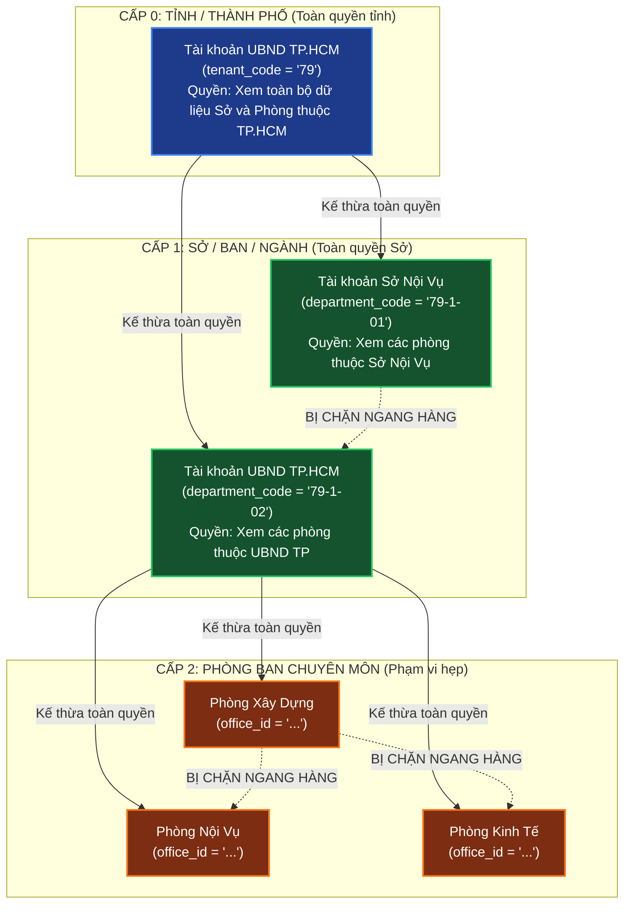
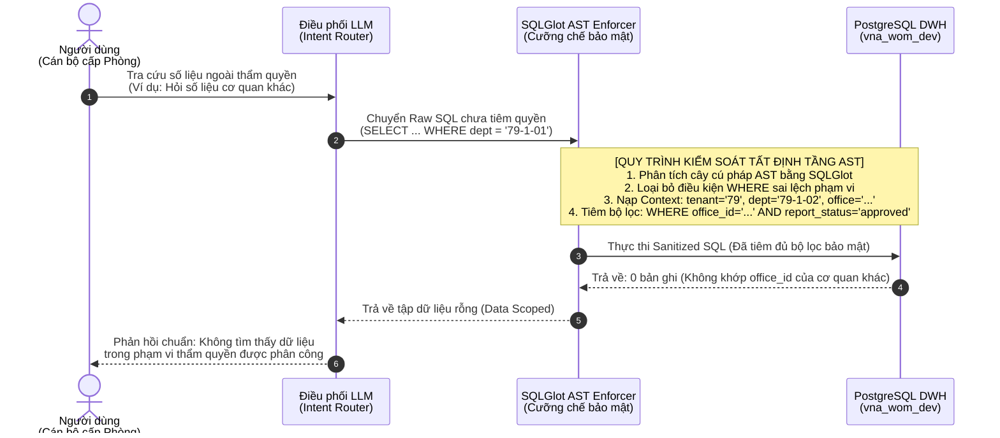

# TÀI LIỆU ĐẶC TẢ THIẾT KẾ KIẾN TRÚC HỆ THỐNG IPGOV CHATBOT
## PHẦN 03: MÔ HÌNH PHÂN QUYỀN PHÂN CẤP THEO CÂY THỰC THỂ (TREE-BASED HBAC)

> **Tiêu chuẩn áp dụng:** Arc42 (Phần 9: Architectural Decisions & Cross-cutting Security) & IEEE Std 1016-2009 (Security Viewpoint).  
> **Nguyên tắc an toàn:** Không bao giờ tin tưởng câu lệnh SQL do LLM sinh ra (Zero-Trust Prompting); cưỡng chế phân quyền bằng bộ lọc tất định (Deterministic Filter Injection).  
> **Quy chuẩn hiển thị:** 100% biểu đồ được định dạng bằng mã Mermaid chuẩn.

---

### 1. NGUYÊN LÝ PHÂN QUYỀN HÀNH CHÍNH PHÂN CẤP (TREE HBAC MODEL)

Hệ thống `IPGov_Chatbot` phục vụ các cơ quan hành chính nhà nước với cấu trúc quyền hạn dạng cây nghiêm ngặt: **Cấp cao hơn có quyền xem toàn bộ dữ liệu của các đơn vị cấp dưới trực thuộc, nhưng tuyệt đối không được xem dữ liệu của nhánh ngang hàng hoặc cấp trên.**



---

### 2. MA TRẬN PHẠM VI DỮ LIỆU ĐƯỢC PHÉP TRUY VẤN (PERMISSION BOUNDARY MATRIX)

Dựa trên cấu trúc thực tế của cây CSDL `vna_wom_dev`, bảng dưới đây quy định ranh giới dữ liệu cho từng loại tài khoản:

| Cấp Bậc Tài Khoản | Đơn Vị Đại Diện | Dữ Liệu Được Phép Truy Vấn | Dữ Liệu Bị Chặn Tuyệt Đối (Security Denial) |
| :--- | :--- | :--- | :--- |
| **Level 0 (Cấp Tỉnh)** | Lãnh đạo TP. Hồ Chí Minh (`tenant = '79'`) | • Tất cả các Sở: Sở Nội vụ (`79-1-01`), UBND TP (`79-1-02`).<br>• Tất cả 36 phòng ban chuyên môn trực thuộc TP.HCM. | • Toàn bộ dữ liệu của Tỉnh Lâm Đồng (`tenant = '68'`) hoặc các tỉnh thành khác. |
| **Level 1 (Cấp Sở/Ban)** | Cán bộ UBND TP. Hồ Chí Minh (`dept = '79-1-02'`) | • Dữ liệu của cơ quan `79-1-02`.<br>• Dữ liệu của 36 phòng ban trực thuộc (`Phòng Xây dựng`, `Phòng Kinh tế`, `Phòng Nội vụ`...). | • Dữ liệu của Sở Nội vụ (`79-1-01`).<br>• Dữ liệu của các Sở khác hoặc tỉnh thành khác. |
| **Level 2 (Cấp Phòng)** | Chuyên viên Phòng Xây dựng (thuộc UBND TP) | • **Chỉ duy nhất** dữ liệu báo cáo của `Phòng Xây dựng` (gắn với `office_id` cụ thể). | • Dữ liệu của các phòng ban ngang hàng (`Phòng Kinh tế`, `Phòng Nội vụ`...).<br>• Dữ liệu cấp cơ quan chủ quản hoặc cơ quan khác. |

---

### 3. CƠ CHẾ CƯỠNG CHẾ BỘ LỌC TẤT ĐỊNH Ở TẦNG AST (DETERMINISTIC AST ENFORCEMENT)

Hệ thống **tuyệt đối không để LLM tự quyết định việc áp dụng phân quyền**. Quy trình cưỡng chế an toàn diễn ra độc lập ở tầng AST:



#### Mã nguồn SQL thực tế sau khi được AST tiêm bảo mật:
```sql
-- Câu lệnh an toàn được thực thi trên PostgreSQL
SELECT 
    f.name AS criteria_name,
    SUM(NULLIF(TRIM(f.value), '')::numeric) AS total_val
FROM dwh_internal.fact_report_criteria f
WHERE f.year = '2025'
  AND f.report_status = 'approved' -- Cưỡng chế trạng thái chốt
  AND f.tenant_code = '79'         -- Cưỡng chế cấp tỉnh
  AND f.department_code = '79-1-02'-- Cưỡng chế cấp cơ quan
  AND f.office_id = '3c9f3cb2-30b2-42ed-9fd0-35e6bce92ac4'; -- Cưỡng chế phòng ban
```
