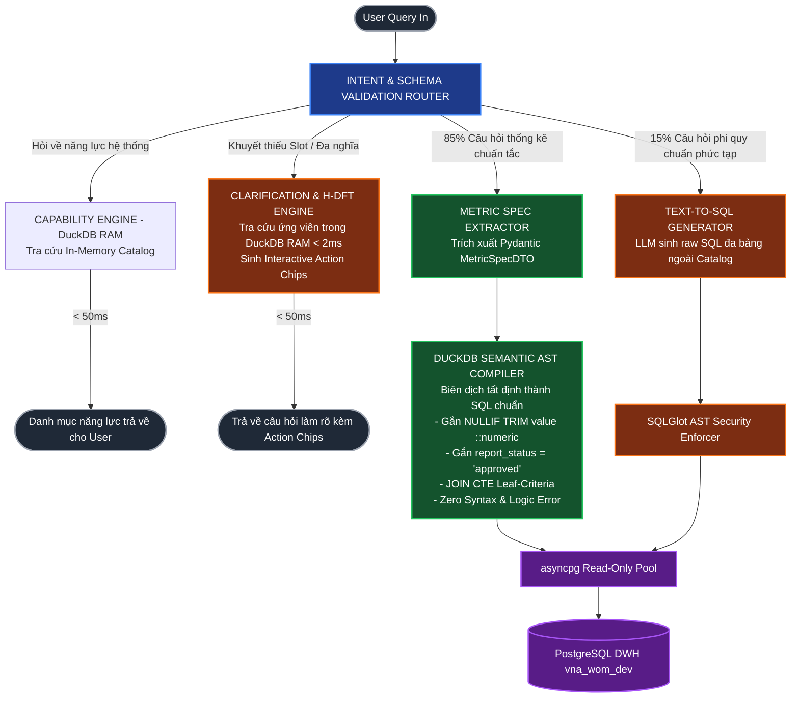
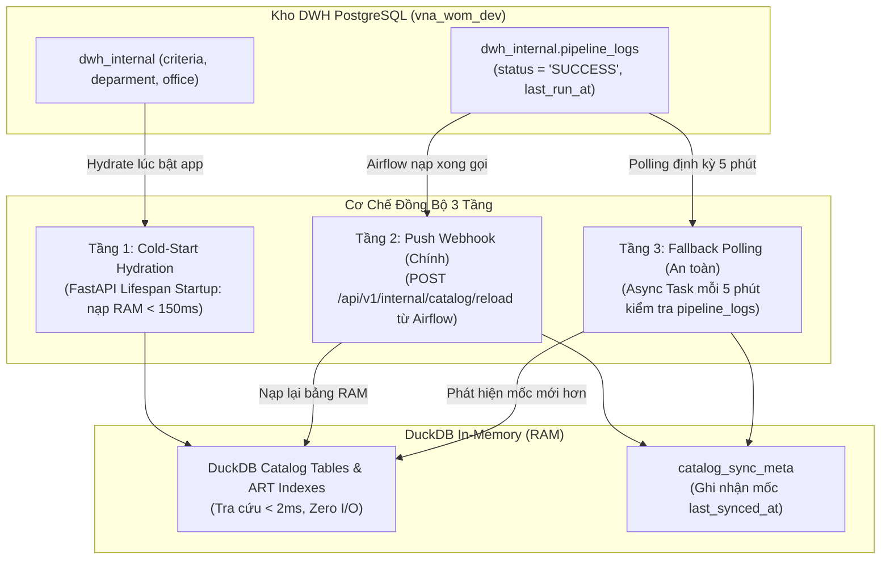

# TÀI LIỆU ĐẶC TẢ THIẾT KẾ KIẾN TRÚC HỆ THỐNG IPGOV CHATBOT
## PHẦN 04: TẦNG NGỮ NGHĨA (SEMANTIC LAYER), IN-MEMORY CATALOG VÀ BỘ BIÊN DỊCH HYBRID SEMANTIC COMPILER

> **Tiêu chuẩn áp dụng:** Arc42 (Phần 5: Building Block View - Semantic Engine) & C4 Model (Level 3: Component Diagram).  
> **Công nghệ sử dụng:** DuckDB In-Memory Engine, RapidFuzz, Pydantic v2.  
> **Trạng thái tài liệu:** Baseline System Design Document (SDD).  
> **Quy chuẩn hiển thị:** 100% biểu đồ được định dạng bằng mã Mermaid chuẩn.

---

### 1. VAI TRÒ CỦA TẦNG NGỮ NGHĨA (SEMANTIC LAYER OVERVIEW)

Tầng ngữ nghĩa (Semantic Layer) đóng vai trò là "Bộ từ điển thông dịch kỹ thuật", nằm giữa giao diện ngôn ngữ tự nhiên của người dùng và mô hình dữ liệu vật lý của PostgreSQL. Nó giải quyết triệt để vấn đề:
1. **Tránh ảo giác Schema (Schema Hallucination):** Không nạp toàn bộ 57 bảng vào prompt. Chỉ trích xuất schema tối thiểu liên quan (Schema Pruning).
2. **Chuẩn hóa công thức đo lường (Standardized Measures):** Đóng gói quy tắc ép kiểu số `NULLIF(TRIM(value), '')::numeric` và điều kiện `report_status = 'approved'`.
3. **Tự khám phá năng lực (Capability Self-Discovery):** Trả lời các câu hỏi về danh mục thông tin hệ thống cung cấp trực tiếp từ In-Memory Catalog mà không phải quét bảng Fact hàng chục nghìn dòng.
4. **Biên dịch chỉ tiêu tất định (Deterministic Metric Compilation):** Thay vì để LLM tự do viết SQL (dễ sinh lỗi cú pháp hoặc join sai), hệ thống chuyển đổi câu hỏi thành JSON Metric Spec và biên dịch trực tiếp sang SQL chuẩn.



---

### 2. ĐẶC TẢ MÔ HÌNH NGỮ NGHĨA (SEMANTIC MODEL DEFINITION)

Mô hình ngữ nghĩa được định nghĩa dưới dạng cấu trúc Pydantic cấu hình hóa trong bộ nhớ:

```python
from pydantic import BaseModel, Field
from typing import List, Dict, Optional, Literal

class DimensionDefinition(BaseModel):
    name: str
    physical_column: str
    data_type: str
    description: str

class MeasureDefinition(BaseModel):
    name: str
    expression: str
    aggregation: str
    description: str

class SemanticTable(BaseModel):
    table_name: str
    schema_name: str
    primary_key: str
    dimensions: List[DimensionDefinition]
    measures: List[MeasureDefinition]
    join_paths: Dict[str, str]

# Định nghĩa Semantic Model cho fact_report_criteria
FACT_REPORT_CRITERIA_MDL = SemanticTable(
    table_name="fact_report_criteria",
    schema_name="dwh_internal",
    primary_key="fact_sk",
    dimensions=[
        DimensionDefinition(name="year", physical_column="year", data_type="VARCHAR(4)", description="Năm báo cáo"),
        DimensionDefinition(name="tenant", physical_column="tenant_code", data_type="VARCHAR(64)", description="Mã tỉnh/thành"),
        DimensionDefinition(name="department", physical_column="department_code", data_type="VARCHAR(64)", description="Mã sở ban ngành"),
        DimensionDefinition(name="office", physical_column="office_id", data_type="UUID", description="Định danh phòng ban"),
        DimensionDefinition(name="criteria_code", physical_column="code", data_type="TEXT", description="Mã chỉ tiêu"),
        DimensionDefinition(name="criteria_name", physical_column="name", data_type="TEXT", description="Tên chỉ tiêu")
    ],
    measures=[
        MeasureDefinition(
            name="total_numeric_value",
            expression="SUM(NULLIF(TRIM(f.value), '')::numeric)",
            aggregation="SUM",
            description="Tổng giá trị số lượng báo cáo (đã xử lý chuỗi rỗng và null an toàn)"
        ),
        MeasureDefinition(
            name="reporting_offices_count",
            expression="COUNT(DISTINCT f.office_id)",
            aggregation="COUNT",
            description="Tổng số phòng ban đã nộp báo cáo"
        )
    ],
    join_paths={
        "criteria": "f.criteria_id = criteria.id",
        "office": "f.office_id = office.id",
        "deparment": "f.department_code = deparment.code"
    }
)
```

#### 2.2. Cấu hình Độ nhạy Thống kê & Triệt tiêu Small Base Effect (IndicatorConfig)

Để loại trừ triệt để hiện tượng phản trực giác thống kê khi đánh giá biến động (ví dụ: số vụ tai nạn từ 1 lên 2 bị dán nhãn sai lầm là "tăng đột biến +100%"), mỗi chỉ tiêu trong Semantic Catalog được gắn một đối tượng cấu hình độ nhạy `IndicatorConfig`:

```python
from enum import Enum

class MetricType(str, Enum):
    RARE_EVENT_COUNT = "RARE_EVENT_COUNT"      # Sự kiện hiếm (TNLĐ, khiếu nại tố cáo vượt cấp)
    STANDARD_COUNT = "STANDARD_COUNT"          # Đếm thông thường (Hồ sơ DVC, biên chế công chức)
    PERCENTAGE_RATE = "PERCENTAGE_RATE"        # Tỷ lệ % (Tỷ lệ giải quyết đúng hạn, tỷ lệ giải ngân)
    CURRENCY_AMOUNT = "CURRENCY_AMOUNT"        # Tài chính / Ngân sách (Chi đầu tư công, thu ngân sách)

class Polarity(str, Enum):
    HIGHER_IS_BETTER = "HIGHER_IS_BETTER"      # Tăng là tích cực
    LOWER_IS_BETTER = "LOWER_IS_BETTER"        # Giảm là tích cực
    TARGET_NEUTRAL = "TARGET_NEUTRAL"          # Ổn định theo kế hoạch

class IndicatorConfig(BaseModel):
    metric_code: str
    metric_name: str
    metric_type: MetricType
    unit: str
    base_threshold: float                      # Ngưỡng quy mô nền triệt tiêu Small Base Effect (ví dụ: 5 vụ)
    min_meaningful_delta: float                # Chênh lệch tuyệt đối tối thiểu để xét biến động (ví dụ: 2 vụ)
    delta_tiers: Dict[str, float]              # Ngưỡng tuyệt đối: {"mild": 2.0, "significant": 5.0, "extreme": 10.0}
    relative_tiers: Dict[str, float]           # Ngưỡng tương đối regularized: {"mild": 0.30, "significant": 0.60, "extreme": 1.00}
    direction_polarity: Polarity = Polarity.TARGET_NEUTRAL

# Ví dụ cấu hình cho 4 họ chỉ tiêu DWH vna_wom_dev
INDICATOR_SENSITIVITY_REGISTRY: Dict[str, IndicatorConfig] = {
    "tai_nan_lao_dong_2": IndicatorConfig(
        metric_code="tai_nan_lao_dong_2",
        metric_name="Tai nạn lao động",
        metric_type=MetricType.RARE_EVENT_COUNT,
        unit="vụ",
        base_threshold=5.0,
        min_meaningful_delta=2.0,
        delta_tiers={"mild": 2.0, "significant": 5.0, "extreme": 10.0},
        relative_tiers={"mild": 0.30, "significant": 0.60, "extreme": 1.00},
        direction_polarity=Polarity.LOWER_IS_BETTER
    ),
    "tl_giai_quyet_dung_han": IndicatorConfig(
        metric_code="tl_giai_quyet_dung_han",
        metric_name="Tỷ lệ giải quyết đúng hạn",
        metric_type=MetricType.PERCENTAGE_RATE,
        unit="%",
        base_threshold=50.0,
        min_meaningful_delta=2.0, # 2.0 điểm phần trăm (pp)
        delta_tiers={"mild": 2.0, "significant": 5.0, "extreme": 10.0},
        relative_tiers={"mild": 0.0, "significant": 0.0, "extreme": 0.0}, # Xét theo pp
        direction_polarity=Polarity.HIGHER_IS_BETTER
    ),
    "ho_so_dvc": IndicatorConfig(
        metric_code="ho_so_dvc",
        metric_name="Hồ sơ dịch vụ công tiếp nhận",
        metric_type=MetricType.STANDARD_COUNT,
        unit="hồ sơ",
        base_threshold=500.0,
        min_meaningful_delta=100.0,
        delta_tiers={"mild": 100.0, "significant": 500.0, "extreme": 2000.0},
        relative_tiers={"mild": 0.15, "significant": 0.30, "extreme": 0.60},
        direction_polarity=Polarity.HIGHER_IS_BETTER
    ),
    "ns_chi_dau_tu": IndicatorConfig(
        metric_code="ns_chi_dau_tu",
        metric_name="Chi đầu tư công",
        metric_type=MetricType.CURRENCY_AMOUNT,
        unit="tỷ VNĐ",
        base_threshold=50.0,
        min_meaningful_delta=10.0,
        delta_tiers={"mild": 10.0, "significant": 50.0, "extreme": 200.0},
        relative_tiers={"mild": 0.10, "significant": 0.25, "extreme": 0.50},
        direction_polarity=Polarity.HIGHER_IS_BETTER
    )
}
```

---

### 3. CATALOG TRONG BỘ NHỚ (DUCKDB IN-MEMORY METADATA CATALOG)

Khi ứng dụng khởi động, hệ thống nạp toàn bộ cấu trúc Schema, danh mục nhóm chỉ tiêu (`criteria_group`), danh mục chỉ tiêu (`criteria`), danh mục sở ngành (`deparment`) và danh mục phòng ban (`office`) vào cơ sở dữ liệu **DuckDB chạy trong RAM**:

#### 3.1. Cấu trúc DDL Bảng và ART Indexes trong DuckDB RAM
Cấu trúc các bảng tạm trong bộ nhớ DuckDB được chuẩn hóa tương thích tuyệt đối với PostgreSQL `vna_wom_dev`:

```sql
-- 1. Bảng Danh mục Chỉ tiêu Báo cáo (Criteria Catalog)
CREATE TABLE catalog_criteria (
    id BIGINT PRIMARY KEY,
    code VARCHAR NOT NULL,
    name VARCHAR NOT NULL,
    parent_id BIGINT,
    unit VARCHAR,
    level INTEGER NOT NULL,
    is_leaf BOOLEAN NOT NULL DEFAULT TRUE
);

-- 2. Bảng Danh mục Sở Ban Ngành (Department Catalog - lưu ý chính tả không chữ 't' thứ 2)
CREATE TABLE catalog_departments (
    code VARCHAR PRIMARY KEY,
    name VARCHAR NOT NULL,
    tenant_code VARCHAR NOT NULL,
    level INTEGER NOT NULL
);

-- 3. Bảng Danh mục Phòng ban Trực thuộc (Office Catalog)
CREATE TABLE catalog_offices (
    id UUID PRIMARY KEY,
    name VARCHAR NOT NULL,
    code VARCHAR,
    department_code VARCHAR NOT NULL,
    tenant_code VARCHAR NOT NULL,
    level INTEGER NOT NULL
);

-- 4. Bảng Siêu dữ liệu Quản lý Đồng bộ (Sync Metadata)
CREATE TABLE catalog_sync_meta (
    last_synced_at TIMESTAMP NOT NULL,
    dwh_pipeline_run_at TIMESTAMP NOT NULL,
    total_criteria INTEGER NOT NULL,
    total_offices INTEGER NOT NULL,
    status VARCHAR NOT NULL
);

-- Tạo Index ART (Adaptive Radix Tree) trên DuckDB để tối ưu tốc độ tra cứu exact/prefix < 1ms
CREATE INDEX idx_criteria_code ON catalog_criteria(code);
CREATE INDEX idx_criteria_name ON catalog_criteria(name);
CREATE INDEX idx_office_name ON catalog_offices(name);

-- Khởi tạo view Catalog siêu dữ liệu tổng hợp phục vụ truy vấn năng lực
CREATE VIEW catalog_capabilities AS
SELECT 
    c.id AS criteria_id,
    c.code AS criteria_code,
    c.name AS criteria_name,
    c.unit AS criteria_unit,
    c.level AS criteria_level,
    c.is_leaf,
    d.code AS department_code,
    d.name AS department_name,
    d.tenant_code
FROM catalog_criteria c
CROSS JOIN catalog_departments d;
```

#### 3.2. Chiến lược Đồng bộ Dữ liệu Đa Tầng (3-Tier Hybrid Sync Strategy)
Dữ liệu danh mục hành chính và chỉ tiêu báo cáo thuộc loại **Slowly Changing Dimensions (SCD Type 1/2)** trong kho DWH. Thay vì sử dụng cơ chế CDC (Debezium/Kafka) gây lãng phí tài nguyên và phức tạp hóa kiến trúc không cần thiết, hệ thống triển khai **Chiến lược Đồng bộ 3 Tầng**:



1. **Tầng 1: Khởi tạo khi Bật Ứng dụng (Cold-Start Hydration):**  
   Tại thời điểm FastAPI Backend khởi động (`@asynccontextmanager async def lifespan(app: FastAPI)`), ứng dụng thực hiện truy vấn nạp toàn bộ danh mục từ PostgreSQL `vna_wom_dev` vào bộ nhớ DuckDB RAM. Thời gian nạp hoàn tất chỉ từ $80\text{ms} - 150\text{ms}$.
2. **Tầng 2: Webhook Thông báo Đẩy (Push Notification - Kênh chính):**  
   Cung cấp endpoint nội bộ an toàn (yêu cầu khóa bí mật `X-Internal-Secret`): `POST /api/v1/internal/catalog/reload`. Khi quy trình ETL (Airflow/Prefect) tải xong dữ liệu vào kho DWH, bước cuối cùng của DAG sẽ gọi webhook này để DuckDB nạp lại dữ liệu trong RAM trong $< 100\text{ms}$.
3. **Tầng 3: Polling Kiểm tra Định kỳ (Background Fallback Polling - Lưới an toàn):**  
   Một Async Background Task định kỳ chạy mỗi $5\text{ phút}$ thực hiện truy vấn nhẹ:
   ```sql
   SELECT MAX(last_run_at) AS latest_etl_run 
   FROM dwh_internal.pipeline_logs 
   WHERE status = 'SUCCESS';
   ```
   Nếu `latest_etl_run > last_synced_at` trong bảng `catalog_sync_meta`, hệ thống tự động kích hoạt nạp lại RAM để tránh rủi ro Webhook thất bại do sự cố mạng nội bộ.

#### 3.3. Hiệu năng & RapidFuzz Semantic Matching
* **Hiệu năng:** Tra cứu thông tin metadata qua DuckDB In-Memory chỉ mất từ **$0.8\text{ms}$ đến $2\text{ms}$**, nhanh hơn 100 lần so với truy vấn đĩa trên CSDL PostgreSQL chính.
* **RapidFuzz Semantic Matching:** Khi người dùng nhắc đến một tên chỉ tiêu viết tắt hoặc sai dấu nhẹ (ví dụ: *"tai nan lđ"*), RapidFuzz tính toán Levenshtein Distance trên danh mục DuckDB để trả về `criteria_code = 'tai_nan_lao_dong_2'` với độ chính xác cao trước khi chuyển sang bước biên dịch.

#### 3.4. Động Cơ Phân Giải Khe Khuyết Đa Dạng & Tra Cứu Ứng Viên H-DFT Trong RAM (< 2ms)

Khi câu hỏi của người dùng khuyết thiếu một hoặc nhiều chiều thông tin (Slot-filling) hoặc chứa danh từ chung đa nghĩa, hệ thống **không đoán mò hay tự điền giá trị tùy tiện**. Thay vào đó, Clarification Engine tận dụng DuckDB In-Memory Catalog để tra cứu tức thì các ứng viên hợp lệ trong **$< 2\text{ms}$** và sinh danh sách Interactive Action Chips:
1. **Thiếu kỳ thời gian (Temporal Slot):** Truy vấn `SELECT DISTINCT year FROM catalog_criteria_metadata` $\to$ Gợi ý ngay các năm thực tế có dữ liệu: `[Năm 2025]`, `[Năm 2026]`, `[Xem cả 2 năm]`.
2. **Thiếu mã chỉ tiêu chi tiết (Metric Slot):** Khi người dùng chỉ nêu tên nhóm chung (ví dụ: *"khuyến công"*, *"thương mại"*, *"lao động"*), DuckDB truy vấn nhanh các lá `WHERE is_leaf = true AND group_name ILIKE '%khuyến công%'` $\to$ Gợi ý Action Chips: `[Số người được đào tạo khuyến công]`, `[Kinh phí khuyến công địa phương]`, `[Số cơ sở CNNT được hỗ trợ]`.
3. **Thiếu đơn vị hành chính (Admin Entity Slot):** Quét `catalog_departments` và `catalog_offices` trong RAM phù hợp với User Context $\to$ Gợi ý các phạm vi cấp dưới trực thuộc.
4. **Phân giải thực thể đa nghĩa (Disambiguation):** Khi tên đơn vị khớp nhiều UUID (ví dụ: *"Phòng Văn hoá"* có 3 phòng ban khác nhau trên DWH), DuckDB trả về danh sách kèm cơ quan chủ quản để người dùng xác nhận 1 chạm.

#### 3.5. Cơ Chế Rút Tỉa & Liên Kết Schema 2 Giai Đoạn Tinh Giản (Lean 2-Stage Schema Pruning & Linking Engine)

Để khắc phục triệt để nhược điểm "nghẽn nhập liệu thủ công" của Semantic Dictionary khi phát sinh bảng mới từ ETL, đồng thời loại bỏ nguy cơ gãy quan hệ JOIN của các mô hình Vector Embedding độc lập, hệ thống triển khai **Cơ chế 2 Giai đoạn Tinh giản (Lean 2-Stage In-Process Retrieval)**:

```mermaid
flowchart TD
    Q([Câu hỏi tự nhiên của User]) --> STAGE1[GIAI ĐOẠN 1: IN-PROCESS COARSE RETRIEVAL<br/>• DuckDB Native FTS Extension: BM25 quét catalog_tables & catalog_columns<br/>• RapidFuzz C++: So khớp mờ mã & tên thực thể<br/>• Độ trễ < 2ms, Không cần Vector DB ngoại vi]
    
    STAGE1 -->|Tập bảng ứng viên Terminals T_cand| STAGE2[GIAI ĐOẠN 2: NETWORKX MINIMAL STEINER TREE<br/>• Đồ thị Schema DWH G_V_E với cạnh là quan hệ Foreign Keys<br/>• Thuật toán Steiner Tree tìm cây con liên thông có tổng trọng số nhỏ nhất<br/>• Tự động bổ sung các Bridge Tables bị thiếu]
    
    STAGE2 -->|Connected Subgraph Schema| STAGE3[GIAI ĐOẠN 3: DATA CONTRACTS & AST INJECTION<br/>• Tiêm ràng buộc ép kiểu: NULLIF TRIM value ::numeric<br/>• Tiêm điều kiện bắt buộc: report_status = 'approved'<br/>• Tiêm CTE nút lá chống double-counting: leaf_criteria]
    
    STAGE3 -->|Minimal Safe Slice Schema Prompt| LLM[LLM Text-to-SQL Generator<br/>(15% câu hỏi phi quy chuẩn)]
    LLM --> AST[SQLGlot AST Security Enforcer]
    AST --> EXEC[(PostgreSQL asyncpg Pool)]

    classDef stageNode fill:#1e3a8a,stroke:#3b82f6,stroke-width:2px,color:#fff;
    classDef contractNode fill:#14532d,stroke:#22c55e,stroke-width:2px,color:#fff;
    classDef execNode fill:#581c87,stroke:#a855f7,stroke-width:2px,color:#fff;

    class STAGE1,STAGE2 stageNode;
    class STAGE3,LLM,AST contractNode;
    class EXEC execNode;
```

##### Quy trình 3 bước thực thi của Lean 2-Stage Schema Engine:
1. **Giai đoạn 1: Lọc thô trong bộ nhớ bằng DuckDB Native FTS BM25 & RapidFuzz:**
   * Khi khởi tạo, DuckDB RAM lập chỉ mục Full-Text Search trên bảng siêu dữ liệu:
     ```sql
     -- Tạo BM25 Index trên siêu dữ liệu bảng và cột trong DuckDB RAM
     PRAGMA create_fts_index('catalog_schema_metadata', 'table_name', 'column_name', 'column_description');
     ```
   * Khi nhận câu hỏi, DuckDB thực thi truy vấn BM25 kết hợp điểm số tương đồng token của RapidFuzz:
     ```sql
     SELECT table_name, score
     FROM (
         SELECT table_name, fts_main_catalog_schema_metadata.match_bm25(table_name, column_description, 'tai nạn lao động sở xây dựng') AS score
         FROM catalog_schema_metadata
     ) WHERE score > 0.5 ORDER BY score DESC LIMIT 5;
     ```
   * Kết quả trả về tập bảng ứng viên thô ($T_{\text{cand}}$) chỉ trong **$< 1.5\text{ms}$**, triệt tiêu hoàn toàn chi phí gọi embedding model và độ trễ mạng của Vector DB ngoại vi.

2. **Giai đoạn 2: Bù đắp bảng cầu nối bằng NetworkX Minimal Steiner Tree:**
   * Một vấn đề cốt tử của tìm kiếm BM25/Vector là chúng chỉ tìm thấy các bảng chứa từ khóa (ví dụ: `office` và `fact_report_criteria`) nhưng **bỏ qua bảng trung gian** (ví dụ: bảng `deparment` nằm giữa nếu không có quan hệ trực tiếp).
   * NetworkX mô hình hóa Schema DWH thành đồ thị vô hướng $G = (V, E)$, trong đó $V$ là các bảng, $E$ là các ràng buộc khóa ngoại (Foreign Keys). Thuật toán **Minimal Steiner Tree** tìm cây con liên thông nhỏ nhất chứa toàn bộ các đỉnh $T_{\text{cand}}$:
     ```python
     import networkx as nx
     from networkx.algorithms.approximation.steinertree import steiner_tree

     def resolve_connected_schema_subgraph(schema_graph: nx.Graph, candidate_tables: List[str]) -> List[str]:
         # Tìm cây khung nhỏ nhất kết nối toàn bộ các bảng ứng viên
         subgraph = steiner_tree(schema_graph, candidate_tables, weight="weight")
         # Trả về danh sách đầy đủ gồm cả bảng ứng viên và các bảng cầu nối (Bridge Tables)
         return list(subgraph.nodes())
     ```
   * Cơ chế này đảm bảo đường dẫn `JOIN` luôn liên thông $100\%$, ngăn chặn hoàn toàn lỗi gãy câu truy vấn SQL đa bảng.
   * **Bảo toàn Fact NULL `office_id` (Ground Truth Preservation):** Đồ thị Schema thiết lập 2 tuyến liên kết:
     - Tuyến chi tiết cấp phòng ban: `fact_report_criteria` $\leftrightarrow$ `office` $\leftrightarrow$ `deparment` (trọng số 1.0) khi câu hỏi yêu cầu cụ thể tên phòng ban (`office`).
     - Tuyến trực tiếp cấp Sở/Tỉnh: `fact_report_criteria` $\leftrightarrow$ `deparment` (trọng số 1.1, liên kết `{fact}.department_code = {deparment}.code`) khi câu hỏi chỉ định cấp Sở/Tỉnh mà không có phòng ban. Tuyến này bảo toàn nguyên vẹn **34 dòng Fact có `office_id IS NULL`** trong CSDL Live PostgreSQL `vna_wom_dev`.
   * **Khế ước Giao tiếp Đa hình (Polymorphic Interface Contract):** Hàm `SchemaPruner.prune_schema(input_data: Union[str, RouterOutputDTO], ...)` chấp nhận cả chuỗi văn bản thuần túy và đối tượng `RouterOutputDTO` của Module 3, kế thừa trực tiếp ngữ cảnh slot thực thể (`admin_entity`, `temporal_val`) mà không làm suy thoái thông tin.

3. **Giai đoạn 3: Tiêm Ràng buộc Hợp đồng Dữ liệu (Data Contracts Injection):**
   * Schema rút gọn (Slice Schema) sau khi lấy từ Steiner Tree không ném trực tiếp cho LLM tự do diễn giải, mà được **đóng gói kèm các Business Data Contracts** đã chuẩn hóa:
     * Quy tắc ép kiểu số: Cột `value` bắt buộc phải bọc trong `NULLIF(TRIM(f.value), '')::numeric`.
     * Quy tắc trạng thái: Mọi bảng báo cáo bắt buộc phải có điều kiện `report_status = 'approved'`.
     * Quy tắc chống trùng lặp: Nếu xuất hiện bảng `criteria`, bắt buộc phải liên kết qua CTE `leaf_criteria`.

---

### 4. CƠ CHẾ TỰ KHÁM PHÁ NĂNG LỰC HỆ THỐNG (CAPABILITY SELF-DISCOVERY)

Khi người dùng đặt các câu hỏi tổng quát (*"Chatbot có thể cung cấp cho tôi những thông tin gì?"*, *"Có dữ liệu về những lĩnh vực nào?"*), Intent Router chuyển hướng trực tiếp sang Capability Engine:
* **Không sinh mã SQL vào Fact:** Bỏ qua hoàn toàn bảng `fact_report_criteria` (tiết kiệm I/O đĩa).
* **Truy vấn In-Memory Catalog:** Quét trực tiếp DuckDB RAM và trả lời trong $<50\text{ms}$ danh mục toàn bộ 8 lĩnh vực chuyên môn (Nội vụ & Lao động, Xây dựng, Công thương, Y tế, Giáo dục, Văn hóa, Nông nghiệp, Tài nguyên), các nhóm chỉ tiêu chi tiết và các năm có sẵn số liệu (`2025`, `2026`).

---

### 5. BỘ BIÊN DỊCH HYBRID SEMANTIC AST COMPILER (85% METRIC SPEC VS 15% RAW SQL)

Để khắc phục nhược điểm cốt tử của các hệ thống Text-to-SQL truyền thống (nơi LLM tự viết SQL dẫn đến sai lệch cú pháp hoặc nhầm lẫn phép JOIN), kiến trúc thiết lập **Bộ biên dịch Hybrid Semantic AST Compiler**:

#### 5.1. Định dạng Hợp đồng Chỉ tiêu (MetricSpecDTO)
Đối với $85\%$ các câu hỏi thống kê thông thường, Router ép LLM trả về cấu trúc **MetricSpecDTO** được ràng buộc chặt chẽ:

```python
class MetricFilter(BaseModel):
    field: str                      # 'year', 'department_code', 'office_id'
    operator: Literal["eq", "in", "gte", "lte"]
    value: Any                      # '2025', ['2024', '2025'], v.v.

class MetricSpecDTO(BaseModel):
    metric_code: str                # 'tai_nan_lao_dong_2'
    aggregation_func: Literal["SUM", "COUNT", "AVG"] = "SUM"
    grain: Literal["leaf_criteria", "department", "office"] = "leaf_criteria"
    filters: List[MetricFilter] = []
    group_by: List[str] = ["year"]  # Mặc định gom nhóm theo năm
```

#### 5.2. Thuật toán Biên dịch Tất định (Deterministic Compiler Engine)
Thay vì để LLM tự viết SQL, **DuckDB Semantic Compiler** biên dịch trực tiếp `MetricSpecDTO` thành câu lệnh SQL PostgreSQL hoàn chỉnh theo thuật toán:

```python
def compile_metric_spec_to_sql(spec: MetricSpecDTO, user_ctx: Dict[str, Any]) -> str:
    # 1. Khởi tạo CTE lọc nút lá (Leaf Criteria) chống double-counting
    sql = """
    WITH leaf_criteria AS (
        SELECT c.id, c.code, c.name
        FROM dwh_internal.criteria c
        WHERE NOT EXISTS (
            SELECT 1 FROM dwh_internal.criteria sub WHERE sub.parent_id = c.id
        )
    )
    SELECT 
        f.year,
        SUM(NULLIF(TRIM(f.value), '')::numeric) AS total_val,
        COUNT(DISTINCT f.office_id) AS total_reporting_offices
    FROM dwh_internal.fact_report_criteria f
    INNER JOIN leaf_criteria lc ON f.criteria_id = lc.id
    WHERE f.report_status = 'approved'
    """
    # 2. Gắn điều kiện chỉ tiêu nghiệp vụ
    sql += f" AND lc.code = '{spec.metric_code}'"
    
    # 3. Gắn các bộ lọc thời gian từ spec
    for flt in spec.filters:
        if flt.field == "year":
            sql += f" AND f.year = '{flt.value}'"
            
    # 4. Tiêm bộ lọc phân quyền HBAC tất định từ User Context
    sql += f" AND f.tenant_code = '{user_ctx['tenant_code']}'"
    if user_ctx.get("department_code"):
        sql += f" AND f.department_code = '{user_ctx['department_code']}'"
    if user_ctx.get("office_id"):
        sql += f" AND f.office_id = '{user_ctx['office_id']}'"
        
    sql += " GROUP BY f.year ORDER BY f.year ASC;"
    return sql
```

* **Ưu điểm vượt trội:**
  * **Zero Syntax Error:** Cú pháp SQL sinh ra đạt tỷ lệ đúng $100\%$, không bao giờ bị lỗi chính tả tên cột hay cú pháp Postgres.
  * **Zero Double-Counting:** Luôn tự động gắn CTE lọc nút lá `leaf_criteria`.
  * **An Toàn Tuyệt Đối:** Mọi ràng buộc phân quyền HBAC và điều kiện `report_status = 'approved'` được gắn cứng ở tầng compiler, không phụ thuộc vào LLM.

#### 5.3. Ranh giới Phân định 85% Metric Spec vs 15% Raw Text-to-SQL
Hệ thống sử dụng cơ chế **Schema Validation tại Router** để phân định luồng:
* **Luồng 1 ($85\%$ - Metric Spec Compiler):** Khi các thực thể trích xuất từ câu hỏi khớp hoàn toàn với danh mục trong DuckDB Catalog (`metric_code`, `dimensions`, `temporal_filters`). Không gọi LLM viết SQL; DuckDB AST Compiler tự sinh mã SQL chuẩn tất định.
* **Luồng 2 ($15\%$ - Raw Text-to-SQL Generator):** Kích hoạt khi câu hỏi yêu cầu liên kết các bảng phi chuẩn ngoài Semantic Catalog (ví dụ: liên kết bảng không gian `ward-boundary`, bảng phân tích lịch sử phê duyệt đa bảng). Luồng này tự động kích hoạt **Lean 2-Stage Schema Retriever (Mục 3.5)** để trích xuất lát cắt Schema liên thông tối thiểu (Connected Slice Schema) kèm Data Contracts cho LLM, sau đó mã SQL sinh ra bắt buộc phải đi qua **5 tầng kiểm duyệt của SQLGlot AST Enforcer**.

#### 5.4. Đẩy Phép Toán Phức Tạp Xuống Database Bằng SQL Window Functions (Push-Down Aggregations)
Theo triết lý **Ponytail (Database-First)**, Semantic Compiler biên dịch trực tiếp các chỉ tiêu phân tích phái sinh thành **SQL Window Functions** thực thi trực tiếp trên engine C++ của DuckDB hoặc PostgreSQL, thay vì kéo dữ liệu mảng thô về Python:

1. **Xếp Hạng Phân Vị (Ranking Top-K):**
   ```sql
   SELECT 
       o.office_name,
       SUM(NULLIF(TRIM(f.value), '')::numeric) AS val,
       DENSE_RANK() OVER (ORDER BY SUM(NULLIF(TRIM(f.value), '')::numeric) DESC) AS rank_pos,
       MAX(SUM(NULLIF(TRIM(f.value), '')::numeric)) OVER () - MIN(SUM(NULLIF(TRIM(f.value), '')::numeric)) OVER () AS spread_val,
       AVG(SUM(NULLIF(TRIM(f.value), '')::numeric)) OVER () AS mean_val
   FROM dwh_internal.fact_report_criteria f
   JOIN dwh_internal.office o ON f.office_id = o.id
   WHERE f.year = '2025' AND f.report_status = 'approved'
   GROUP BY o.office_name;
   ```
2. **Tỷ Trọng Cấu Phần Trên Tổng Thể (Part-to-Whole Share):**
   ```sql
   SELECT 
       o.office_name,
       SUM(NULLIF(TRIM(f.value), '')::numeric) AS target_val,
       SUM(SUM(NULLIF(TRIM(f.value), '')::numeric)) OVER () AS grand_total,
       ROUND((SUM(NULLIF(TRIM(f.value), '')::numeric) / SUM(SUM(NULLIF(TRIM(f.value), '')::numeric)) OVER ()) * 100.0, 2) AS share_pct
   FROM dwh_internal.fact_report_criteria f
   JOIN dwh_internal.office o ON f.office_id = o.id
   WHERE f.year = '2025' AND f.report_status = 'approved'
   GROUP BY o.office_name;
   ```
3. **So Sánh Chuỗi Thời Gian (Temporal Delta):**
   Sử dụng `LAG(total_val) OVER (ORDER BY year)` để tính Delta và Regularized Delta trực tiếp trong SQL.

Kết quả trả về từ database là các giá trị phái sinh đã được tính toán chính xác tuyệt đối trong $< 0.5\text{ms}$. Python hoàn toàn không cần chạy vòng lặp tính toán mà chỉ đóng vai trò truyền dữ liệu vào Jinja2.
