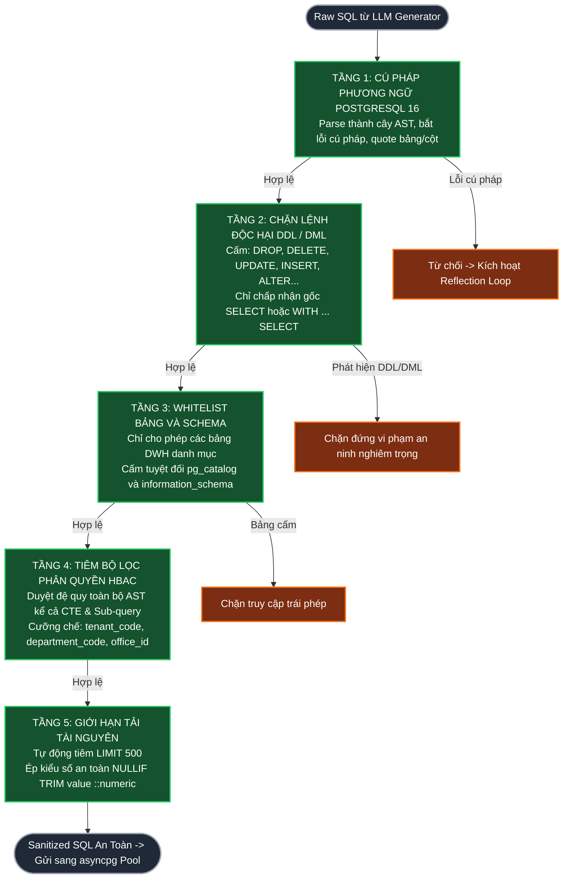

# TÀI LIỆU ĐẶC TẢ THIẾT KẾ KIẾN TRÚC HỆ THỐNG IPGOV CHATBOT
## PHẦN 05: HÀNG RÀO BẢO MẬT VÀ CƯỠNG CHẾ AN TOÀN TẦNG AST (SECURITY GUARDRAILS & AST ENFORCEMENT)

> **Tiêu chuẩn áp dụng:** Arc42 (Phần 9: Architectural Decisions & Cross-cutting Concepts) & IEEE Std 1016-2009 (Security Viewpoint).  
> **Thư viện cốt lõi:** SQLGlot (Dialect: `postgres`).  
> **Trạng thái tài liệu:** Baseline System Design Document (SDD).  
> **Quy chuẩn hiển thị:** 100% biểu đồ được định dạng bằng mã Mermaid chuẩn.

---

### 1. NGUYÊN TẮC THỰC THI KHÔNG TIN CẬY (ZERO-TRUST EXECUTION MODEL)

Trong các hệ thống Text-to-SQL truyền thống, mã SQL sinh ra từ LLM thường được truyền thẳng vào cơ sở dữ liệu. Đây là lỗ hổng chí mạng (nguyên nhân khiến `GovGraph` thất bại) vì LLM có bản chất xác suất, dễ bị tấn công qua kỹ thuật Prompt Injection hoặc Jailbreaking.

Kiến trúc `IPGov_Chatbot` thiết lập nguyên tắc: **Mọi câu lệnh SQL từ LLM đều là "Untrusted String" (Chuỗi ký tự chưa xác thực)**. Câu lệnh này bắt buộc phải vượt qua **5 tầng kiểm duyệt AST tất định** của SQLGlot trước khi được phép mở kết nối tới PostgreSQL:



---

### 2. HIỆN THỰC HÓA BẰNG SQLGLOT PYTHON

Mô-đun kiểm soát an toàn được hiện thực hóa bằng thuật toán duyệt AST thuần túy (không sử dụng RegEx để tránh bị bypass):

```python
import sqlglot
from sqlglot import exp
from sqlglot.optimizer.scope import traverse_scope
from typing import Dict, Any

ALLOWED_TABLES = {
    "fact_report_criteria", "deparment", "office", 
    "criteria", "criteria_group", "pipeline_logs", "ward-boundary"
}

FORBIDDEN_EXPRESSIONS = (
    exp.Insert, exp.Update, exp.Delete, exp.Drop, exp.Alter, 
    exp.Command, exp.Create, exp.Truncate, exp.Grant, exp.Revoke
)

class SecurityEnforcementError(Exception):
    pass

def sanitize_and_enforce_sql(raw_sql: str, user_ctx: Dict[str, Any]) -> str:
    # TẦNG 1: Parse AST theo dialect Postgres
    try:
        expression = sqlglot.parse_one(raw_sql, read="postgres")
    except Exception as e:
        raise SecurityEnforcementError(f"Cú pháp SQL không hợp lệ: {str(e)}")

    # TẦNG 2: Chặn lệnh DDL/DML độc hại
    for forbidden in FORBIDDEN_EXPRESSIONS:
        if expression.find(forbidden):
            raise SecurityEnforcementError(f"Phát hiện hành vi cấm: Câu lệnh chứa {forbidden.__name__}")

    # Chỉ cho phép câu lệnh SELECT hoặc CTE kết thúc bằng SELECT
    if not isinstance(expression, (exp.Select, exp.With)):
        raise SecurityEnforcementError("Chỉ chấp nhận các câu lệnh truy vấn dữ liệu (SELECT).")

    # TẦNG 3: Kiểm tra Whitelist bảng và schema
    for table in expression.find_all(exp.Table):
        tbl_name = table.name.lower().replace('"', '')
        if tbl_name not in ALLOWED_TABLES:
            raise SecurityEnforcementError(f"Truy cập trái phép vào bảng không thuộc danh mục: {tbl_name}")
        schema_name = table.db.lower() if table.db else ""
        if schema_name in ("pg_catalog", "information_schema"):
            raise SecurityEnforcementError("Cấm truy cập vào bảng siêu dữ liệu hệ thống PostgreSQL.")

    # TẦNG 4: Tiêm điều kiện phân quyền HBAC đệ quy cho CTE & Subquery (Recursive Scope Visitor)
    TARGET_TABLES = {"fact_report_criteria", "report"}
    for scope in traverse_scope(expression):
        for alias, source in scope.sources.items():
            if isinstance(source, exp.Table) and source.name.lower() in TARGET_TABLES:
                table_ref = alias if alias else source.name
                hbac_conditions = [
                    f"{table_ref}.tenant_code = '{user_ctx['tenant_code']}'",
                    f"{table_ref}.report_status = 'approved'"
                ]
                if user_ctx.get("department_code"):
                    hbac_conditions.append(f"{table_ref}.department_code = '{user_ctx['department_code']}'")
                if user_ctx.get("office_id"):
                    hbac_conditions.append(f"{table_ref}.office_id = '{user_ctx['office_id']}'")
                
                predicate_exp = sqlglot.parse_one(" AND ".join(hbac_conditions))
                scope.expression.where(predicate_exp, copy=False)

    # TẦNG 5: Giới hạn số dòng tối đa tránh tràn bộ nhớ
    if not expression.find(exp.Limit):
        expression = expression.limit(500)

    return expression.sql(dialect="postgres")
```

---

### 3. THUẬT TOÁN DUYỆT PHẠM VI ĐỆ QUY (RECURSIVE SCOPE VISITOR CHO CTE & SUBQUERIES)

#### 3.1. Rủi ro cú pháp khi tiêm WHERE ở cấp Root
Khi LLM sinh ra các câu truy vấn phức tạp sử dụng Common Table Expressions (CTE) dạng:
```sql
WITH ranked_reports AS (
    SELECT f.office_id, f.value, f.year
    FROM dwh_internal.fact_report_criteria f
)
SELECT year, SUM(value::numeric) FROM ranked_reports GROUP BY year;
```
Nếu bộ tiền xử lý chỉ tìm kiếm các node `exp.Table` và tiêm `WHERE` vào node `SELECT` cấp root ngoài cùng, SQLGlot sẽ chèn vị từ vào bảng trung gian không có các cột metadata:
`SELECT ... FROM ranked_reports WHERE fact_report_criteria.tenant_code = '79'`  
$\to$ Gây ra lỗi nghiêm trọng từ PostgreSQL: **ERROR: missing FROM-clause entry for table "fact_report_criteria"**.

#### 3.2. Cơ chế Giải quyết bằng Scope Tree Traverser
Sử dụng `sqlglot.optimizer.scope.traverse_scope` để phân rã cây AST thành các phạm vi con biệt lập:
1. **Cô lập Scope con (Scope Isolation):** Thuật toán duyệt qua từng CTE và Sub-query độc lập theo đồ thị DAG.
2. **Nhận diện Bí danh cục bộ (Local Aliasing):** Xác định chính xác bảng nhạy cảm (`fact_report_criteria` hoặc `report`) đang được tham chiếu bằng alias nào trong phạm vi hiện hành (ví dụ: `f`).
3. **Tiêm Cục bộ (Local In-Place Injection):** Gọi trực tiếp `scope.expression.where(...)` để gắn các vị từ `tenant_code`, `department_code`, `office_id` và `report_status = 'approved'` vào đúng mệnh đề `WHERE` của scope chứa bảng vật lý đó.
4. **Bảo toàn Cú pháp Tuyệt đối:** Không làm xáo trộn các phép toán gom nhóm (`GROUP BY`), lọc kết tập (`HAVING`) hay sắp xếp (`ORDER BY`) ở câu lệnh `SELECT` ngoài cùng.

---

### 4. CƠ CHẾ PHÒNG THỦ TẤN CÔNG PROMPT INJECTION & JAILBREAKING

Bên cạnh bộ lọc AST, tầng giao tiếp với mô hình ngôn ngữ (LLM) được bảo vệ bằng các nguyên tắc:
1. **Ép Buộc Định Dạng Đầu Ra Có Cấu Trúc (Structured Output Only):**
   * LLM được thiết lập `response_format={"type": "json_object"}`.
   * LLM chỉ được phép trả về JSON theo schema: `{"sql": "...", "confidence": 0.95, "assumptions": "..."}`.
   * Mọi câu trả lời chứa mã script, HTML, hoặc markdown tự do đều bị Pydantic Validator từ chối ngay tại đầu ra.
2. **Loại Bỏ Hoàn Toàn Kỹ Thuật Dynamic Evaluation:**
   * Hệ thống không bao giờ sử dụng hàm `eval()` hoặc `exec()` đối với bất kỳ chuỗi văn bản nào do người dùng cung cấp hoặc do LLM sinh ra.
   * Toàn bộ mã SQL sau khi làm sạch được gửi sang `asyncpg` qua giao thức Prepared Statement có tham số hóa.
