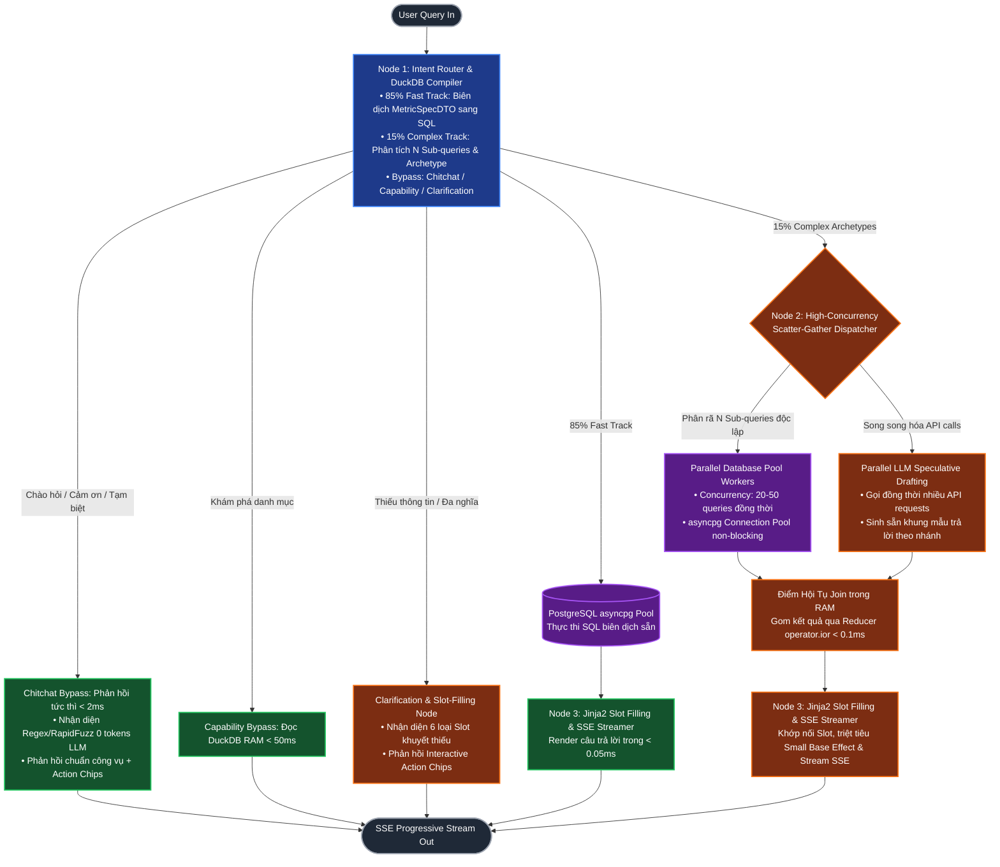
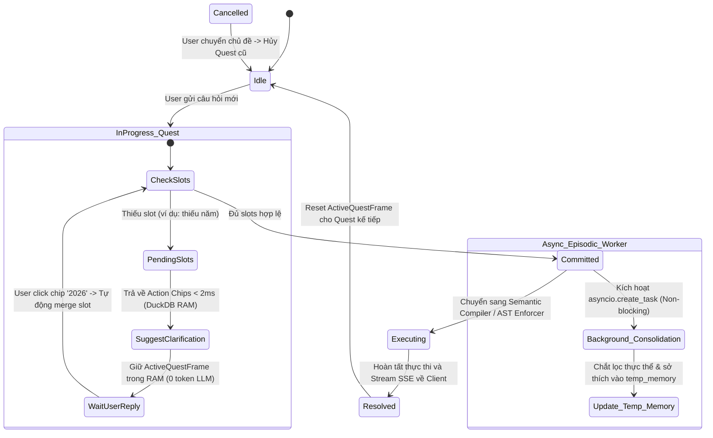
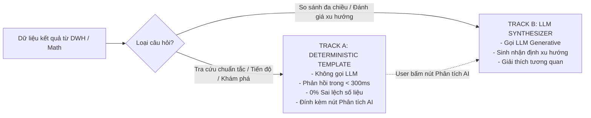

# TÀI LIỆU ĐẶC TẢ THIẾT KẾ KIẾN TRÚC HỆ THỐNG IPGOV CHATBOT
## PHẦN 06: QUY TRÌNH ĐIỀU PHỐI MULTI-AGENT, VAI TRÒ CỦA LLM, ĐẶC TẢ USE CASES VÀ ĐỘNG CƠ PHẢN HỒI DUAL-TRACK

> **Tiêu chuẩn áp dụng:** Arc42 (Phần 5: Building Block View, Phần 6: Runtime View) & O'Reilly Agentic Architectural Patterns (Arsanjani & Bustos, 2026).  
> **Khung điều phối:** LangGraph StateGraph & Checkpointer.  
> **Quy chuẩn hiển thị:** 100% biểu đồ được định dạng bằng mã Mermaid chuẩn.

---

### 1. BÓC TÁCH MINH BẠCH VAI TRÒ CỦA LLM TRONG PIPELINE (LLM ROLES & BOUNDARIES)

Để loại bỏ hoàn toàn tính chất "hộp đen" (blackbox), kiến trúc hệ thống quy định rõ **những gì LLM tham gia thực hiện** và **những gì LLM tuyệt đối không được can thiệp**:

| Thành Phần Trong Pipeline | LLM Có Đảm Nhận Không? | Cơ Chế Kỹ Thuật Thay Thế (Nếu LLM Không Làm) | Lý Do Kỹ Thuật |
| :--- | :---: | :--- | :--- |
| **1. Phân loại Ý định (Intent) & Thực thể** | **CÓ** | LLM Router phân loại câu hỏi (Meta, Single SQL, DAG, Clarification). | Cần hiểu ngôn ngữ tự nhiên và ngữ cảnh tiếng Việt nghiệp vụ. |
| **2. Cắt tỉa Schema (Schema Pruning)** | **KHÔNG** | **Lean 2-Stage Engine: DuckDB FTS (BM25) + NetworkX Steiner Tree** trong RAM. | Tránh ảo giác bảng, tự động bù đắp Bridge Tables, giảm token prompt từ 32k xuống dưới 1.5k tokens. |
| **3. Biên dịch SQL Thống kê thông thường (85%)** | **KHÔNG** | **DuckDB Semantic AST Compiler** biên dịch từ `MetricSpecDTO`. | Zero Syntax Error, tự động tiêm leaf_criteria và HBAC, triệt tiêu ảo giác. |
| **4. Sinh mã SQL Phi quy chuẩn (15%)** | **CÓ** | LLM Generator chuyển ngữ nghĩa thành cú pháp PostgreSQL đa bảng. | Áp dụng cho các truy vấn phức tạp ngoài Semantic Catalog sau khi nhận Slice Schema từ Lean 2-Stage. |
| **5. Kiểm soát An toàn & Phân quyền HBAC** | **KHÔNG** | **SQLGlot AST Enforcer** duyệt cây cú pháp và tiêm bộ lọc. | Đảm bảo tính tất định 100%, không bị bypass bởi jailbreak prompt. |
| **6. Thực thi câu lệnh trên CSDL DWH** | **KHÔNG** | **asyncpg Connection Pool** (Read-Only account). | LLM không có quyền mở kết nối mạng hoặc gửi lệnh trực tiếp vào DB. |
| **7. Tính toán Toán học (YoY, %, Tỷ trọng)**| **KHÔNG** | **Database-First Window Functions (PostgreSQL / DuckDB)**. | Đẩy toàn bộ phép toán tập hợp xuống C++ engine, tính trong $<0.5\text{ms}$. Python chỉ làm đường ống dẫn (piping). |
| **8. Định dạng Câu trả lời Thông thường** | **KHÔNG** | **Jinja2 Environment** (Đã có trong FastAPI). | Render template siêu tốc trong $<0.05\text{ms}$, hỗ trợ filter số/tiền tệ chuẩn, thay thế toàn bộ regex custom. |
| **9. Tổng hợp Phân tích Xu hướng Chuyên sâu** | **CÓ** | **LLM Synthesizer** kích hoạt khi phân tích đa chiều hoặc có yêu cầu. | Tạo nhận định sâu sắc, so sánh tương quan và phân tích nguyên nhân. |
| **10. Quản lý Ngữ cảnh (Dialogue State & Memory)** | **KHÔNG (turn dở dang) / CÓ (chắt lọc nền)** | **2-Tier Quest State Machine**: Pydantic ActiveQuestFrame trong RAM + Async Background Worker. | Tiết kiệm token cho các turn thiếu thông tin, triệt tiêu nguy cơ Context Bleeding trong session. |
| **11. Xã giao công vụ (Chào hỏi, Cảm ơn, Tạm biệt)** | **KHÔNG** | **Pre-Router Chitchat Fast Bypass (< 2ms)** qua Regex tĩnh & RapidFuzz C++. | Phản hồi siêu tốc trong RAM, 0 tokens LLM, trả lời lịch sự chuẩn văn hóa công vụ kèm Interactive Action Chips điều hướng nghiệp vụ. |

---

### 2. SƠ ĐỒ ĐIỀU PHỐI ĐỒ THỊ TRẠNG THÁI TINH GIẢN (YAGNI LEAN STATEGRAPH RUNTIME)

Áp dụng triết lý **Ponytail (YAGNI - Rung 1)**, hệ thống kiên quyết loại bỏ hiện tượng **Agent Bloat** (không tạo ra các agent con rườm rà gây phình State và tăng độ trễ serialization). Toàn bộ luồng điều phối được cô đọng thành **3 Node Cốt Lõi** kết hợp cơ chế **Phân Phối Song Song Bậc Cao (High-Concurrency Scatter-Gather Engine)**:



#### 2.1. Cấu trúc Trạng thái Toàn cục (AgentState TypedDict & Reducers)

Trong LangGraph, State được kế thừa và tích lũy qua các Node thông qua lớp `AgentState`. Để hỗ trợ cơ chế chạy song song **không giới hạn N Sub-queries** và thu thập dữ liệu an toàn tránh **Race Condition**, thuộc tính `intermediate_results` được gắn kèm Reducer `operator.ior` (phép hợp Dictionary trong RAM):

```python
import operator
from enum import Enum
from typing import Annotated, Any, Dict, List, Literal, Optional, TypedDict, Union
from langchain_core.messages import BaseMessage
from langgraph.graph.message import add_messages
from pydantic import BaseModel, Field

class UserSecurityContextDTO(BaseModel):
    user_id: str
    username: str
    tenant_code: str             # Ví dụ: '79' (TP.HCM), '68' (Lâm Đồng), '91' (An Giang)
    department_code: Optional[str] = None # Ví dụ: '79-1-02' (UBND TP.HCM)
    office_id: Optional[str] = None     # UUID của phòng ban trực thuộc
    role_level: int              # 0: Cấp Tỉnh/TP, 1: Cấp Sở/UBND, 2: Cấp Phòng ban

# 1. Trạng Thái Vòng Đời Quest trong Kiến Trúc 2-Tier Quest State Machine
class QuestStatusEnum(str, Enum):
    PENDING_SLOTS = "PENDING_SLOTS"  # Thiếu slot, đang chờ người dùng bổ sung qua chip/chat
    COMMITTED = "COMMITTED"          # Đủ slot, đã xác nhận và chuyển sang tầng sinh SQL
    RESOLVED = "RESOLVED"            # Đã thực thi xong và stream kết quả về client
    CANCELLED = "CANCELLED"          # Người dùng hủy bỏ hoặc chuyển sang chủ đề khác

# Phân loại 6 Nhóm Slot Khuyết Thiếu trong Khung Đối Thoại
class SlotTypeEnum(str, Enum):
    TEMPORAL = "temporal"                 # Thiếu năm, quý, tháng, khoảng thời gian
    METRIC_CODE = "metric_code"           # Thiếu mã chỉ tiêu chi tiết hoặc chỉ nêu tên nhóm chung chung
    ADMIN_ENTITY = "admin_entity"         # Thiếu đơn vị (Sở, Phòng ban, UBND, Huyện/Xã)
    COMPARISON_TARGET = "comparison_target" # Thiếu đối tượng đối chuẩn / so sánh cùng kỳ
    DISAMBIGUATION = "disambiguation"     # Thực thể trùng lặp tên, đa nghĩa cần chọn lựa
    OUT_OF_SCOPE = "out_of_scope"         # Nhu cầu nằm ngoài phạm vi CSDL thống kê DWH số hóa

class SlotClarificationOption(BaseModel):
    label: str          # Nhãn hiển thị trên Interactive Chip, ví dụ: "Năm 2025"
    slot_key: str       # Khóa slot cần điền, ví dụ: "year", "criteria_id", "office_id"
    value: Any          # Giá trị được gán khi người dùng click
    preview_description: Optional[str] = None # Thông tin bổ trợ mô tả chi tiết

# Tầng 1: Active Quest Frame Quản Lý Bằng Bộ Nhớ RAM (Zero LLM Tokens Cho Turn Dở Dang)
class ActiveQuestFrameDTO(BaseModel):
    quest_id: str
    intent: Optional[str] = None
    status: QuestStatusEnum = QuestStatusEnum.PENDING_SLOTS
    filled_slots: Dict[str, Any] = Field(default_factory=dict)
    missing_slots: List[str] = Field(default_factory=list)
    slot_types_missing: List[SlotTypeEnum] = Field(default_factory=list)
    candidate_clarifications: List[SlotClarificationOption] = Field(default_factory=list)
    disambiguation_candidates: Dict[str, List[Dict[str, Any]]] = Field(default_factory=dict)
    confidence_score: float = 1.0
    turn_count: int = 1

# Tầng 2: Hồ Sơ Ngữ Cảnh Bền Vững Của Phiên (temp_memory)
class SessionEpisodicMemoryDTO(BaseModel):
    session_id: str
    frequent_entities: List[str] = Field(default_factory=list)       # Các Sở/Phòng ban thường xuyên quan tâm
    default_temporal_window: Optional[str] = None                    # Năm mặc định ưu tiên (ví dụ: '2025')
    preferred_output_format: Literal["TABLE", "TEXT", "CHART"] = "TABLE"
    committed_quest_history: List[str] = Field(default_factory=list) # Danh sách ID các quest đã hoàn thành
    last_updated_at: Optional[str] = None

class SubQueryTaskDTO(BaseModel):
    task_id: str                       # Khóa nhận diện kết quả độc lập (ví dụ: 'subq_q1_2025', 'subq_office_xd')
    sql_query: str                     # Câu lệnh SQL độc lập đã biên dịch hoặc sinh sẵn
    parameters: Dict[str, Any] = Field(default_factory=dict)
    target_metric: Optional[str] = None
    target_entity: Optional[str] = None
    target_period: Optional[str] = None

class AgentState(TypedDict):
    # 1. Trạng thái Hội thoại đa lượt (LangGraph Reducer gom tin nhắn)
    messages: Annotated[List[BaseMessage], add_messages]
    
    # 2. Ngữ cảnh Định danh và Thẩm quyền người dùng
    user_context: UserSecurityContextDTO
    
    # 3. Quản lý Ngữ cảnh 2 Tầng (2-Tier Quest State Machine)
    # Tầng 1: Khung Quest hiện tại đang xử lý trong RAM
    active_quest: ActiveQuestFrameDTO
    # Tầng 2: Bộ nhớ ngữ cảnh ngắn hạn của phiên (temp_memory)
    temp_memory: SessionEpisodicMemoryDTO
    
    # 4. Quyết định Định tuyến (Router Classification)
    query_type: Literal[
        "CHITCHAT_BYPASS",     # Xã giao công vụ siêu tốc (Bypass DWH/LLM, xử lý trong RAM)
        "CATALOG_DISCOVERY",    # Khám phá danh mục (Bypass DWH)
        "TEMPLATE_FAST_TRACK", # Tra cứu chỉ số đơn chuẩn (DuckDB Compiler -> Template)
        "SINGLE_SQL",          # Text-to-SQL phi quy chuẩn 1 bước
        "DYNAMIC_PARALLEL_DAG",# So sánh đa kỳ / N Sub-queries song song bậc cao
        "CLARIFICATION",       # Hỏi làm rõ khi thiếu slot hoặc thực thể đa nghĩa
        "SECURITY_DENIAL"      # Chặn truy cập ngoài thẩm quyền
    ]
    
    # 5. Đặc tả Chỉ tiêu & Kế hoạch Phân rã N Sub-queries
    metric_spec: Optional[Dict[str, Any]]        # Cấu trúc MetricSpecDTO (85% luồng)
    dag_plan: Optional[Dict[str, Any]]           # Cấu trúc PolymorphicArchetypePlan (15% luồng)
    subquery_tasks: List[Dict[str, Any]]         # Danh sách N tác vụ sub-query độc lập (N >= 1)
    
    # 6. SQL và Kiểm duyệt AST
    raw_sql: Optional[str]
    sanitized_sql: Optional[str]
    
    # 7. Thu thập Kết quả Truy vấn Song song Không Giới hạn N Sub-queries
    # (Reducer an toàn gom kết quả đa luồng tránh Race Condition)
    intermediate_results: Annotated[Dict[str, Any], operator.ior]
    final_sql_result: Optional[List[Dict[str, Any]]]
    
    # 8. Bản Mẫu Diễn Giải Dự Phóng Song Song (Parallel LLM Speculative Drafts)
    speculative_draft_templates: Optional[List[Dict[str, Any]]]
    
    # 9. Tính toán Độc lập và Dấu vết Nguồn gốc
    math_result: Optional[Dict[str, Any]]
    lineage: Optional[Dict[str, Any]]            # LineageBadgeDTO
    
    # 10. Tự phục hồi và Kiểm soát Lỗi
    retry_count: int                             # Tối đa 2 lần tự sửa SQL
    error_context: Optional[Dict[str, Any]]      # Payload đẩy vào Dead-Letter-Queue khi lỗi

#### 2.2. Vòng Đời Quest và Cơ Chế Background Episodic Memory Worker (2-Tier Quest State Machine)

Để giải quyết mâu thuẫn giữa việc **tiết kiệm token LLM ở các lượt hỏi dở dang** và **chống gãy ngữ cảnh ám chỉ ngược (Anaphora / Co-reference)**, hệ thống triển khai cỗ máy trạng thái 2 tầng:



##### Chi tiết cơ chế vận hành 2 tầng:
1. **Tầng 1: Active Quest Frame (Thời gian thực trong RAM, 0 Token LLM):**
   * Khi người dùng hỏi một câu thiếu thông tin (*"Số lượng báo cáo tai nạn lao động"*), Router nhận diện thiếu `year`. Thay vì gọi LLM tóm tắt, hệ thống tạo đối tượng `ActiveQuestFrameDTO(quest_id='q_101', intent='tai_nan_lao_dong_2', status='PENDING_SLOTS', missing_slots=['year'])`.
   * Trả về ngay lập tức các Interactive Action Chips trong $< 2\text{ms}$.
   * Khi người dùng bấm `[Năm 2026]`, hệ thống cập nhật `filled_slots['year'] = '2026'` và chuyển trạng thái sang `COMMITTED` **hoàn toàn bằng mã logic Python trong RAM**, không tiêu tốn một token LLM nào.
2. **Tầng 2: Background Episodic Memory Worker (Phi phong tỏa, Non-blocking SSE):**
   * Ngay khi Quest chuyển sang `COMMITTED`, luồng chính lập tức dispatch sang Compiler / DB Pool để tiến hành truy vấn dữ liệu.
   * Đồng thời, hệ thống kích hoạt một tác vụ chạy ngầm độc lập:
     ```python
     async def async_episodic_memory_worker(session_id: str, quest: ActiveQuestFrameDTO, temp_mem: SessionEpisodicMemoryDTO):
         # Chạy ngầm trong nền, không làm nghẽn luồng SSE trả lời người dùng
         if quest.filled_slots.get("department_code"):
             if quest.filled_slots["department_code"] not in temp_mem.frequent_entities:
                 temp_mem.frequent_entities.append(quest.filled_slots["department_code"])
         if quest.filled_slots.get("year"):
             temp_mem.default_temporal_window = quest.filled_slots["year"]
         temp_mem.committed_quest_history.append(quest.quest_id)
         # Lưu vết vào Session Fast Cache / Redis
         await cache_service.save_session_temp_memory(session_id, temp_mem)
     ```
   * **Triệt tiêu Context Bleeding:** Dữ liệu trong `temp_memory` chỉ đóng vai trò là **Giá trị Gợi ý Mặc định (Default Fallback Context)** khi người dùng bắt đầu một Quest mới hoàn toàn mơ hồ, không bị trộn lẫn vào các truy vấn đang thực thi.
```

---

### 3. ĐẶC TẢ HỢP ĐỒNG INPUT / OUTPUT CHO TỪNG NODE LLM (I/O CONTRACTS)

Toàn bộ các Node suy luận ngôn ngữ (Node 1, Node 4b, Node 5) đều được chuẩn hóa qua Lớp Trừu Tượng Ponytail `call_structured_with_fallback[T]()` (SSOT tại `IPGov_Chatbot/core/llm_gateway.py`), vận hành theo mô hình **Gated 2-Stage Confidence Fallback**:
- **Cổng Tinh Gọn (Fast Gate - Stage 1):** `google/gemini-2.5-flash-lite` với Chain-of-Thought qua `thought_scratchpad`, tối ưu hóa chi phí ($0.10/M tokens) và độ trễ phản hồi thấp (~500ms).
- **Hàng Rào Kiểm Định Bất Biến (Invariant Gate):** Đánh giá đồng thời độ tin cậy `confidence_score >= 0.70` và điều kiện kiểm thử bất biến riêng của từng Node (AST syntax, schema grounding, hoặc data reconciliation).
- **Cổng Dự Phòng Chuyên Sâu (Heavy Fallback - Stage 2):** Tự động kích hoạt `deepseek/deepseek-v4.1-flash` khi độ tin cậy thấp, kiểm định bất biến thất bại, hoặc gặp lỗi kết nối upstream API.

#### 3.1. Node 1: Intent & Complexity Router (OpenRouter Gated 2-Stage Confidence Fallback & Redis Session Memory)
* **Kiến trúc vận hành:** Kế thừa `call_structured_with_fallback[LLMRouterStructuredOutput]`.
  - Stage 1: `google/gemini-2.5-flash-lite` phân loại ý định dựa trên Chain-of-Thought (`thought_scratchpad`), nhiệt độ $0.0$, JSON mode.
  - Invariant Validator: Xác thực schema Pydantic, kiểm tra tính hợp lệ của `intent`, không rỗng trường bắt buộc, tính toàn vẹn của phạm vi không gian/thời gian, và ngưỡng tin cậy `confidence_score >= 0.70`.
  - Stage 2: Tự động fallback sang `deepseek/deepseek-v4.1-flash` khi `confidence_score < 0.70` hoặc schema validation fail.
  - Stage 3: Dự phòng khẩn cấp qua DuckDB Local In-Memory Fuzzy Catalog (0 token LLM, phản hồi $< 2\text{ms}$).
* **Bộ nhớ phiên phân tán (Redis Session Manager - `ipgov-redis`):**
  - Tích hợp Dual-Context Injection: Khi người dùng truy vấn Lượt 2+, System Prompt được tiêm đồng thời cả `ActiveQuestFrame` (để nắm slot hiện tại) và `Sliding Window Messages` (3 lượt gần nhất qua lệnh `LTRIM`).
  - **Tier 0.3 Semantic Decision Cache:** Lưu kết quả phân loại Lượt 1 theo SHA-256 hash của prompt (`cache:router:{hash}`) với TTL 3600s, phản hồi tức thì $< 50\text{ms}$ (0 token LLM).
* **Input Prompt:** Câu hỏi người dùng + User Security Context + Dual-Context từ Redis.
* **Output Contract (Pydantic v2 `extra="forbid"`):**
  ```python
  class LLMRouterStructuredOutput(BaseModel):
      model_config = ConfigDict(extra="forbid")

      thought_scratchpad: str              # Step-by-step reasoning CoT
      intent: str                          # TEMPLATE_FAST_TRACK, DYNAMIC_PARALLEL_DAG, CLARIFICATION, OUT_OF_SCOPE, etc.
      dag_archetype: Optional[str] = None  # TEMPORAL_COMPARISON, CROSS_GEO, MULTI_METRIC, COMPONENT, PIPELINE
      subquery_count: int = 1
      complexity: str = "LOW_TEMPLATE"     # LOW_TEMPLATE, MEDIUM_SINGLE_SQL, HIGH_PARALLEL_DAG
      temporal_scope: TemporalScopeSchema  # raw_expression, start_year, end_year, quarter
      spatial_scope: SpatialScopeSchema    # location_name, admin_level, department_code, office_id
      dwh_entities: List[str] = Field(default_factory=list)
      confidence_score: float = Field(default=0.9, ge=0.0, le=1.0)
      is_ambiguous: bool = False
      is_topic_shift: bool = False         # Cờ nhận diện chuyển chủ đề để chủ động reset/archive quest
      clarification_reason: Optional[str] = None
  ```

#### 3.2. Node 4b: Text-to-SQL Generator (DIN / MAC-SQL với Gated Fallback & Kiểm Định AST)
* **Kiến trúc vận hành:** Áp dụng cho ~15% câu hỏi phân tích phi chuẩn (không thuộc mẫu template tra cứu trực tiếp). Kế thừa `call_structured_with_fallback[TextToSQLStructuredOutput]`.
  - Stage 1 (Fast Gate): `google/gemini-2.5-flash-lite` nhận Schema Slice từ DuckDB Pruner kèm business rules rút gọn và sinh cấu trúc truy vấn.
  - Invariant Validator:
    1. *Kiểm định Cú pháp CSDL:* `sqlglot.parse_one(res.sql_query, read="postgres")` bắt buộc phải parse thành công sang AST PostgreSQL 16 mà không văng ngoại lệ cú pháp.
    2. *Kiểm định Schema Grounding:* Toàn bộ danh sách `tables_used` và các bảng xuất hiện trong cây AST bắt buộc phải thuộc Schema Slice của DuckDB Catalog, triệt tiêu ảo giác sinh bảng/cột giả.
    3. *Kiểm định Ngưỡng Tin Cậy:* `confidence_score >= 0.70`.
  - Stage 2 (Heavy Fallback): Tự động chuyển giao sang `deepseek/deepseek-v4.1-flash` khi cú pháp SQL không hợp lệ, phát hiện cấu trúc AST bị cấm (như DDL/DML), hoặc `confidence_score < 0.70`.
  - Stage 3 (AST Enforcer): Câu lệnh SQL sau khi vượt qua Validator được đưa vào `SQLGlotEnforcer` để tự động tiêm điều kiện phân quyền HBAC vào mệnh đề `WHERE` trước khi chuyển sang `asyncpg` Connection Pool.
* **Output Contract (Pydantic v2 `extra="forbid"`):**
  ```python
  class TextToSQLStructuredOutput(BaseModel):
      model_config = ConfigDict(extra="forbid")

      thought_scratchpad: str = Field(description="Suy luận từng bước về JOINs, điều kiện lọc, chỉ tiêu và phân quyền")
      sql_query: str = Field(description="Câu lệnh SELECT PostgreSQL 16 chuẩn cú pháp")
      tables_used: List[str] = Field(description="Danh sách các bảng/view vật lý được sử dụng")
      confidence_score: float = Field(ge=0.0, le=1.0, description="Độ tin cậy tự đánh giá của mô hình")
      sql_ast_explanation: Optional[str] = Field(default=None, description="Giải thích cấu trúc cây AST và các vị từ lọc")
  ```

#### 3.3. Node 5: Response Synthesizer (Generative AI Mode với Kiểm Định Đối Chiếu Dữ Liệu)
* **Kiến trúc vận hành:** Kế thừa `call_structured_with_fallback[SynthesisReportStructuredOutput]`.
  - Kích hoạt khi xử lý Track B (câu hỏi phân tích so sánh đa kỳ phức tạp, đánh giá xu hướng biến động, hoặc người dùng chủ động yêu cầu phân tích sâu).
  - Stage 1 (Fast Gate): `google/gemini-2.5-flash-lite` tổng hợp báo cáo nhận định định tính từ tập kết quả CSDL và các chỉ số thống kê từ Python Math Engine.
  - Invariant Validator (Data Grounding Reconciliation Gate):
    1. *Kiểm định Đối Chiếu Số Liệu:* Mọi con số định lượng (số vụ, tỷ lệ %, độ lệch tuyệt đối) xuất hiện trong nội dung markdown bắt buộc phải đối chiếu khớp với số liệu thực tế từ DWH hoặc kết quả của Math Engine trong dung sai sai số $\pm 0.01\%$, triệt tiêu hoàn toàn hallucination về số liệu công vụ.
    2. *Kiểm định Ánh Xạ Căn Cứ:* Danh sách `data_reconciliation_items` phải ánh xạ chính xác từng nhận định với cột/chỉ tiêu nguồn tương ứng.
    3. *Kiểm định Ngưỡng Tin Cậy:* `confidence_score >= 0.70`.
  - Stage 2 (Heavy Fallback): Tự động chuyển giao sang `deepseek/deepseek-v4.1-flash` khi phát hiện sai lệch số liệu, mâu thuẫn logic nhận định so với xu hướng tính toán, hoặc `confidence_score < 0.70`.
* **Output Contract (Pydantic v2 `extra="forbid"`):**
  ```python
  class SynthesisReportStructuredOutput(BaseModel):
      model_config = ConfigDict(extra="forbid")

      thought_scratchpad: str = Field(description="Phân tích đối chiếu đối sánh số liệu thực tế với nhận định định tính")
      synthesis_markdown: str = Field(description="Báo cáo phân tích chuẩn Markdown bao gồm tóm lược, xu hướng và lưu ý")
      key_insights: List[str] = Field(description="Các điểm nhấn phân tích quan trọng trích xuất từ dữ liệu")
      data_reconciliation_items: List[Dict[str, Any]] = Field(description="Danh sách ánh xạ các con số trích dẫn về trường dữ liệu gốc")
      confidence_score: float = Field(ge=0.0, le=1.0, description="Độ tin cậy căn cứ dữ liệu")
  ```

#### 3.4. Node 5c: Python Math Engine (NumPy - Non-LLM)
* **Input:** Kết quả thực thi từ các Sub-queries: `{"val_q1": 12.0, "val_q2": 18.0}`.
* **Output:** `{"absolute_delta": 6.0, "growth_rate_percent": 50.0, "formula": "((val_q2 - val_q1) / val_q1) * 100"}`.

#### 3.5. Khung Phân Tích Đa Hình (Polymorphic Speculative Framework) & Động Cơ Điều Phối Song Song Bậc Cao (High-Concurrency Scatter-Gather Engine)

Thay vì gán cứng số lượng truy vấn (như 2 kỳ hay 2 đơn vị), hệ thống triển khai **Khung Phân Tích Đa Hình** hỗ trợ phân rã **tùy ý $N$ Sub-queries độc lập ($N \ge 1$)** bao trọn 5 Mẫu hình Phân tích DWH (Kimball Analytical Archetypes). 

Để tối ưu hóa thời gian xử lý, hệ thống khai thác tối đa năng lực chịu tải của hạ tầng hiện đại (PostgreSQL Connection Pool và LLM Inference Gateway chịu tải hàng chục đến hàng trăm requests đồng thời):
* **Song song hóa I/O CSDL:** Toàn bộ $N$ Sub-queries được kích hoạt đồng thời qua `asyncio.gather` trên `asyncpg` Connection Pool (Semaphore kiểm soát giới hạn 30-50 workers, không nghẽn tài nguyên).
* **Song song hóa LLM Speculative Drafting:** Đồng thời với việc truy vấn DB, hệ thống bắn song song nhiều LLM API calls để sinh sẵn các khung mẫu diễn giải cho các nhánh kịch bản ($p_1, p_2, \dots, p_k$).
* **Độ trễ tổng thể (Total Latency):** $\text{Latency}_{\text{total}} = \max(\text{Latency}_{\text{DB\_parallel}}, \text{Latency}_{\text{LLM\_parallel}}) + \text{Latency}_{\text{Jinja2\_RAM}} (< 0.05\text{ms})$, triệt tiêu hoàn toàn độ trễ cộng dồn của chuỗi xử lý tuần tự.

```python
import asyncio
from enum import Enum
from typing import Annotated, Any, Dict, List, Literal, Optional, Union
from pydantic import BaseModel, Field
from langgraph.types import Send

# 1. Định nghĩa 5 Mẫu hình Phân tích Cốt lõi hỗ trợ tùy ý N chiều/kỳ/thực thể
class ArchetypeEnum(str, Enum):
    TEMPORAL_COMPARISON = "TEMPORAL_COMPARISON"         # So sánh chuỗi thời gian (N kỳ: N tháng, N quý, N năm)
    CROSS_ENTITY_COMPARISON = "CROSS_ENTITY_COMPARISON" # So sánh N thực thể ngang hàng (N Sở, N Phòng ban)
    MULTI_CRITERIA_PROFILE = "MULTI_CRITERIA_PROFILE"   # Đánh giá đồng thời N chỉ tiêu trong cùng cơ quan/kỳ
    RANKING_TOP_K = "RANKING_TOP_K"                     # Xếp hạng Top K / Bottom K trên toàn bộ đơn vị
    PART_TO_WHOLE = "PART_TO_WHOLE"                     # Tỷ trọng đóng góp % của N đơn vị con trên cấp cha
    MULTI_DIMENSIONAL_PIVOT = "MULTI_DIMENSIONAL_PIVOT" # Ma trận chéo N đơn vị x M kỳ thời gian (N x M queries)

class SpeculativeBranch(BaseModel):
    branch_id: str
    predicate: str  # Điều kiện logic trong RAM (ví dụ: "growth_rate_pct > 0", "share_percent >= 50.0")
    template: str   # Chuỗi phản hồi chứa Dynamic Slots {{...}}
    tone: Literal["POSITIVE", "NEGATIVE", "NEUTRAL", "ALERT"] = "NEUTRAL"
    action_chip_prompt: Optional[str] = None

class BaseArchetypePlan(BaseModel):
    plan_id: str
    archetype: ArchetypeEnum
    metric_code: str
    metric_name: str
    unit: str = "vụ"
    branches: List[SpeculativeBranch] = Field(default_factory=list)

class TemporalComparisonPlan(BaseArchetypePlan):
    archetype: Literal[ArchetypeEnum.TEMPORAL_COMPARISON] = ArchetypeEnum.TEMPORAL_COMPARISON
    entity_code: str
    entity_name: str
    periods: List[str] = Field(default_factory=list, description="Danh sách N kỳ thời gian so sánh (N >= 2, e.g. 4 quý, 3 năm)")
    comparison_mode: Literal["SEQUENTIAL_CHAIN", "BASE_PERIOD"] = "SEQUENTIAL_CHAIN"

class CrossEntityComparisonPlan(BaseArchetypePlan):
    archetype: Literal[ArchetypeEnum.CROSS_ENTITY_COMPARISON] = ArchetypeEnum.CROSS_ENTITY_COMPARISON
    period: str
    entities: List[Dict[str, str]] = Field(default_factory=list, description="Danh sách N đơn vị so sánh (N >= 2)")

class MultiCriteriaProfilePlan(BaseArchetypePlan):
    archetype: Literal[ArchetypeEnum.MULTI_CRITERIA_PROFILE] = ArchetypeEnum.MULTI_CRITERIA_PROFILE
    period: str
    entity_code: str
    criteria_codes: List[str] = Field(default_factory=list, description="Danh sách K mã chỉ tiêu cần truy vấn đồng thời")

class RankingTopKPlan(BaseArchetypePlan):
    archetype: Literal[ArchetypeEnum.RANKING_TOP_K] = ArchetypeEnum.RANKING_TOP_K
    period: str
    parent_entity_name: str = "Toàn Thành phố"
    k: int = Field(default=5, ge=1, le=100)

class PartToWholePlan(BaseArchetypePlan):
    archetype: Literal[ArchetypeEnum.PART_TO_WHOLE] = ArchetypeEnum.PART_TO_WHOLE
    period: str
    target_entities: List[Dict[str, str]] = Field(default_factory=list, description="Danh sách N thực thể con cần tính tỷ trọng")
    parent_entity_name: str = "Cơ quan chủ quản"

class MultiDimensionalPivotPlan(BaseArchetypePlan):
    archetype: Literal[ArchetypeEnum.MULTI_DIMENSIONAL_PIVOT] = ArchetypeEnum.MULTI_DIMENSIONAL_PIVOT
    entities: List[Dict[str, str]]
    periods: List[str]
    metrics: List[str]

# Discriminated Union cho các Archetypes
PolymorphicArchetypePlan = Annotated[
    Union[
        TemporalComparisonPlan,
        CrossEntityComparisonPlan,
        MultiCriteriaProfilePlan,
        RankingTopKPlan,
        PartToWholePlan,
        MultiDimensionalPivotPlan
    ],
    Field(discriminator="archetype")
]

# 2. Điều phối Fan-Out Tùy Ý N Tác Vụ Độc Lập bằng LangGraph Send()
def route_polymorphic_workers(state: AgentState) -> List[Send]:
    plan: PolymorphicArchetypePlan = state["dag_plan"]
    tasks: List[Dict[str, Any]] = []
    
    if plan.archetype == ArchetypeEnum.TEMPORAL_COMPARISON:
        # Tự động sinh N Sub-queries độc lập cho N kỳ thời gian
        for p in plan.periods:
            tasks.append({
                "task_id": f"period_{p}",
                "period": p,
                "metric_code": plan.metric_code,
                "entity_code": plan.entity_code
            })
            
    elif plan.archetype == ArchetypeEnum.CROSS_ENTITY_COMPARISON:
        # Tự động sinh N Sub-queries cho N đơn vị so sánh
        for ent in plan.entities:
            tasks.append({
                "task_id": f"entity_{ent['code']}",
                "office_code": ent["code"],
                "period": plan.period,
                "metric_code": plan.metric_code
            })
            
    elif plan.archetype == ArchetypeEnum.MULTI_CRITERIA_PROFILE:
        # Tự động sinh K Sub-queries cho K chỉ tiêu chuyên môn
        for crit in plan.criteria_codes:
            tasks.append({
                "task_id": f"metric_{crit}",
                "metric_code": crit,
                "period": plan.period,
                "entity_code": plan.entity_code
            })
            
    elif plan.archetype == ArchetypeEnum.PART_TO_WHOLE:
        # 1 query cho tổng cấp cha + N queries cho N đơn vị con
        tasks.append({"task_id": "total_parent", "entity": plan.parent_entity_name, "period": plan.period})
        for ent in plan.target_entities:
            tasks.append({"task_id": f"comp_{ent['code']}", "entity": ent["code"], "period": plan.period})
            
    elif plan.archetype == ArchetypeEnum.MULTI_DIMENSIONAL_PIVOT:
        # Ma trận chéo N đơn vị x M kỳ thời gian = N x M tác vụ độc lập
        for ent in plan.entities:
            for p in plan.periods:
                tasks.append({
                    "task_id": f"pivot_{ent['code']}_{p}",
                    "office_code": ent["code"],
                    "period": p,
                    "metric_code": plan.metric_code
                })

    return [
        Send("high_concurrency_worker_node", {
            "task_id": t["task_id"],
            "task_spec": t,
            "user_context": state["user_context"]
        })
        for t in tasks
    ]

# 3. Động cơ Thực thi Song song Bậc cao (Parallel DB & Parallel LLM Drafting)
class HighConcurrencyScatterGatherEngine:
    """
    Động cơ kích hoạt song song đồng thời:
    - Bắn N Sub-queries xuống CSDL qua asyncpg Connection Pool.
    - Đồng thời gọi M API calls đến LLM để sinh sẵn các bản mẫu khung trả lời (Speculative Frames).
    """
    def __init__(self, db_pool, llm_gateway, max_concurrency: int = 40):
        self.db_pool = db_pool
        self.llm_gateway = llm_gateway
        self.semaphore = asyncio.Semaphore(max_concurrency)

    async def _execute_single_subquery(self, task: Dict[str, Any], user_ctx: UserSecurityContextDTO) -> Dict[str, Any]:
        async with self.semaphore:
            async with self.db_pool.acquire() as conn:
                # Thực thi câu lệnh SQL độc lập đã được AST Enforcer bảo vệ
                rows = await conn.fetch(task["sql_query"], *task.get("params", []))
                return {task["task_id"]: [dict(r) for r in rows]}

    async def _draft_speculative_frame(self, branch: SpeculativeBranch, plan_meta: Dict[str, Any]) -> Dict[str, Any]:
        async with self.semaphore:
            prompt = (
                f"Đóng vai trò chuyên gia tổng hợp số liệu công vụ. "
                f"Hãy sinh khung phản hồi Markdown Jinja2 với các dynamic slots {{...}} "
                f"cho kịch bản thống kê '{branch.predicate}' của chỉ tiêu '{plan_meta.get('metric_name')}'."
            )
            draft_template = await self.llm_gateway.agenerate(prompt)
            return {"branch_id": branch.branch_id, "template": draft_template}

    async def scatter_and_gather(
        self, 
        tasks: List[Dict[str, Any]], 
        branches: List[SpeculativeBranch], 
        user_ctx: UserSecurityContextDTO,
        plan_meta: Dict[str, Any]
    ) -> Dict[str, Any]:
        # Kích hoạt đồng thời N DB queries và M LLM speculative draft API calls
        db_tasks = [self._execute_single_subquery(t, user_ctx) for t in tasks]
        llm_tasks = [self._draft_speculative_frame(b, plan_meta) for b in branches]

        # Thu thập toàn bộ kết quả song song
        results = await asyncio.gather(*db_tasks, *llm_tasks, return_exceptions=False)
        
        merged_db = {}
        merged_templates = {}
        for item in results:
            if "branch_id" in item:
                merged_templates[item["branch_id"]] = item["template"]
            else:
                merged_db.update(item)
                
        return {
            "intermediate_results": merged_db,
            "speculative_draft_templates": merged_templates
        }
```

---

### 4. ĐỘNG CƠ PHẢN HỒI DUAL-TRACK (DETERMINISTIC TEMPLATE VS LLM SYNTHESIZER)

Hệ thống phân tách rạch ròi 2 cơ chế sinh câu trả lời nhằm tối ưu hóa triệt để độ trễ và độ chính xác:



#### 4.1. Nhóm 1: Deterministic Template Engine (Zero LLM - Tốc độ < 300ms)
Áp dụng cho các kịch bản tra cứu đơn giản, kiểm tra vận hành và từ chối bảo mật:
* **Template 1 (Tra cứu 1 chỉ số thống kê):**
  > *"Theo số liệu báo cáo đã được phê duyệt năm {year} của {office_name} ({department_name}), tổng số {criteria_name} là: **{value} {unit}**."*
* **Template 2 (Báo cáo tiến độ / Vận hành nộp):**
  > *"Báo cáo của đơn vị {office_name} hiện ở trạng thái: **{status_vn}** (Kỳ báo cáo: {report_period}, Ngày lập: {report_created_date}).  
  > ⚠️ Lưu ý: Số liệu ở trạng thái này chưa được phê duyệt chính thức và chỉ mang tính tham khảo nội bộ."*
* **Template 3 (Từ chối phân quyền HBAC):**
  > *"Hệ thống không tìm thấy dữ liệu trong phạm vi quản lý của bạn ({office_name} - {department_name}). Bạn không có thẩm quyền tra cứu số liệu của đơn vị khác ngoài phạm vi được phân công."*
* **Template 4 (Khám phá danh mục năng lực):**  
  Hiển thị bảng Markdown liệt kê các nhóm chỉ tiêu và các năm có sẵn số liệu trực tiếp từ DuckDB In-Memory Catalog trong $<50\text{ms}$.
* **Cơ chế Hybrid Lũy Tiến (Progressive Hybrid UX):**  
  Sau khi render câu trả lời Template + Bảng số liệu trong $<300\text{ms}$, hệ thống tự động đính kèm nút bấm tương tác: `[💡 Yêu cầu AI phân tích xu hướng và đánh giá chuyên sâu]`.

#### 4.2. Nhóm 2: LLM Synthesizer (Generative AI Mode)
Chỉ kích hoạt trong các trường hợp:
1. Bài toán phân tích so sánh đa kỳ phức tạp (YoY, MoM) cần lý giải tương quan tăng giảm.
2. Người dùng đặt câu hỏi yêu cầu tư duy nhận xét: *"Hãy đánh giá xu hướng biến động tai nạn lao động giai đoạn 2024-2026 và chỉ ra giai đoạn đỉnh điểm?"*
3. Người dùng bấm vào nút tương tác `[💡 Yêu cầu AI phân tích xu hướng và đánh giá chuyên sâu]` từ câu trả lời Template trước đó.

#### 4.3. Động cơ Thống kê Cổng Lọc Kép & Dynamic Slot Engine trong RAM (< 1ms)

Nhằm tối ưu hóa triệt để độ trễ phản hồi của nhóm câu hỏi phân tích phức tạp (Track B) xuống **$< 600\text{ms}$** mà không bị phụ thuộc vào thời gian sinh văn bản của LLM, hệ thống tích hợp hai động cơ tính toán độc lập trong RAM:

##### 1. Động cơ Thống kê Cổng Lọc Kép (Dual-Gate Significance Gating)
Khắc phục triệt để hiện tượng Small Base Effect (ví dụ: TNLĐ từ 1 lên 2 vụ là tăng danh nghĩa $+100\%$, nhưng theo phân phối Poisson $\text{Pois}(\lambda=1)$, $p\text{-value} = 0.50$, hoàn toàn là dao động ngẫu nhiên $H_0$):
* **Cổng 1 (Ý nghĩa tuyệt đối tối thiểu):** Bắt buộc $|\Delta x| = |x_2 - x_1| \ge \Delta_{\min}$ (chỉ tiêu phải biến động vượt ngưỡng số lượng tối thiểu do `IndicatorConfig` quy định). Nếu không đạt, gán nhãn `STABLE` (Ổn định / Dao động bình thường).
* **Cổng 2 (Tỷ lệ điều chỉnh nền Regularized):**
  $$\delta_{\text{reg}} = \frac{x_2 - x_1}{\max(|x_1|, \, \text{base\_threshold})}$$
  Neo mẫu số vững chắc khi kỳ cơ sở $x_1 \to 0$ hoặc $x_1 = 0$, triệt tiêu hoàn toàn điểm kỳ dị toán học.
* **Hàm `classify_indicator_volatility`:** Trả về kết quả phân tầng 4 bậc (`STABLE`, `MILD`, `SIGNIFICANT`, `EXTREME`) kèm lời giải trình công vụ chuẩn mực.

##### 2. Động cơ Chuẩn Hóa Jinja2 Template & Khớp Nối Dynamic Slots trong RAM (< 0.05ms)
Tuân thủ nghiêm ngặt triết lý **Ponytail (Stdlib & Proven Dependency First)**, hệ thống loại bỏ hoàn toàn class regex custom `re.compile(...)`. Thay vào đó, toàn bộ việc sinh văn bản được chuẩn hóa bằng **`jinja2.Environment`** (đã có sẵn trong FastAPI):
* **Tốc độ thực thi C-level:** Render hoàn tất trong $< 0.05\text{ms}$, nhanh hơn gấp 3 lần so với regex thuần.
* **Tích hợp bộ lọc định dạng chuẩn (Filters):** `{{ val | format_currency }}`, `{{ val | format_number }}`, `{{ val | format_pct }}` tự động xử lý dấu phân cách hàng nghìn và đơn vị đo lường công vụ.
* **Hỗ trợ cú pháp điều kiện bản địa:** Cho phép LLM sinh template có cấu trúc rẽ nhánh ` ...  ... ` mà không cần hàm eval logic tự chế.
* **Nguyên tắc Push-Down to Database:** Các đại lượng thống kê phức tạp (`rank_pos`, `spread_val`, `share_pct`, `delta`) đã được CSDL tính toán sẵn qua Window Functions và trả về đúng 1 bản ghi. Python chỉ đóng vai trò nạp trực tiếp bản ghi này vào context của Jinja2.

```python
from jinja2 import Environment, BaseLoader, select_autoescape
from typing import Dict, Any, Optional

# Khởi tạo Jinja2 Environment tối giản với các custom filter chuẩn công vụ
jinja_env = Environment(
    loader=BaseLoader(),
    autoescape=select_autoescape(disabled_extensions=['txt', 'md']),
    trim_blocks=True,
    lstrip_blocks=True
)

# Đăng ký các filters định dạng chuẩn công vụ Việt Nam
jinja_env.filters["format_number"] = lambda val: f"{val:,.0f}".replace(",", ".") if isinstance(val, (int, float)) else str(val)
jinja_env.filters["format_pct"] = lambda val: f"{val:+.1f}%" if isinstance(val, (int, float)) else str(val)
jinja_env.filters["format_currency"] = lambda val: f"{val:,.1f} tỷ VNĐ".replace(",", ".") if isinstance(val, (int, float)) else str(val)

class JinjaSlotEngine:
    """Động cơ render Jinja2 tinh giản theo triết lý Ponytail - Zero custom regex."""
    @classmethod
    def render(cls, template_str: str, slots: Dict[str, Any]) -> str:
        try:
            template = jinja_env.from_string(template_str)
            return template.render(**slots)
        except Exception:
            # Fallback an toàn sang string.Template (Python stdlib) nếu cú pháp template có lỗi
            from string import Template
            return Template(template_str).safe_substitute(slots)

class PolymorphicSpeculativeDispatcher:
    """Bộ điều phối trung tâm thực thi Speculative Binding trong RAM (< 0.08ms)."""
    def dispatch_and_resolve(self, plan: BaseArchetypePlan, raw_db_record: Dict[str, Any]) -> Dict[str, Any]:
        # 1. Nhận trực tiếp các trường phái sinh đã tính sẵn từ DB Window Functions
        # (Zero NumPy loop, Zero array traversal trong Python)
        slot_map = dict(raw_db_record)
        
        # 2. Khớp nhánh điều kiện thống kê Cổng lọc kép (Dual-Gate Gating)
        matched_branch = next(
            (b for b in plan.branches if self._eval_predicate(b.predicate, slot_map)),
            plan.branches[-1] if plan.branches else None
        )
        
        # 3. Render siêu tốc bằng Jinja2 Engine (< 0.05ms)
        rendered_text = JinjaSlotEngine.render(matched_branch.template, slot_map) if matched_branch else ""
        return {"rendered_text": rendered_text, "slot_map": slot_map}
```

---

### 5. ĐẶC TẢ CHI TIẾT 6 TRƯỜNG HỢP SỬ DỤNG (USE CASE WORKFLOWS)

#### Case 1: Tra cứu thống kê đơn giản (Fast Track qua Compiler & Template)
* **Câu hỏi:** *"Năm 2025, đơn vị tôi có bao nhiêu lao động được đào tạo từ nguồn kinh phí khuyến công?"* (hoặc các chỉ tiêu về an toàn lao động, cấp phép xây dựng, bình đẳng giới).
* **Tài khoản:** Chuyên viên Phòng Kinh tế (`tenant: 68`, `dept: 68-1-02`, `office: Phòng Kinh tế`).
* **Workflow:**
  1. Router trích xuất `MetricSpecDTO(metric='so_lao_dong_dao_tao_kc', year='2025')`.
  2. DuckDB Semantic AST Compiler biên dịch SQL chuẩn có đầy đủ `leaf_criteria` và HBAC.
  3. `asyncpg` thực thi trên DWH: trả về `1.078 người`.
  4. Template Engine render trong $<300\text{ms}$: *"Theo số liệu báo cáo đã được phê duyệt năm 2025 của Phòng Kinh tế (UBND Tỉnh Lâm Đồng), tổng số lao động được đào tạo khuyến công là: **1.078 người**."* kèm Lineage Badge và nút `[💡 Phân tích AI]`.

#### Case 2: Phân tích so sánh đa kỳ & Đối chuẩn đa đơn vị (High-Concurrency Parallel DAG Track + Speculative LLM)
* **Câu hỏi mẫu 1 (So sánh chuỗi thời gian N kỳ):** *"So sánh số vụ tai nạn lao động qua 4 quý năm 2025 tại UBND Tỉnh Lâm Đồng và tính tốc độ tăng trưởng liên hoàn?"*
* **Câu hỏi mẫu 2 (Đối chuẩn ngang hàng N đơn vị):** *"So sánh số lao động được đào tạo khuyến công năm 2025 giữa 5 phòng ban: Phòng Kinh tế, Phòng Công thương, Đoàn thanh niên, Phòng Xây dựng, và Phòng Văn hóa?"*
* **Tài khoản:** Cán bộ quản lý (`role_level <= 1`).
* **Workflow:**
  1. Router phát hiện so sánh phức tạp $\to$ chuyển định tuyến `DYNAMIC_PARALLEL_DAG`.
  2. Dynamic DAG Planner phân tích yêu cầu thành $N$ Sub-query tasks độc lập ($N=4$ cho 4 quý, hoặc $N=5$ cho 5 phòng ban).
  3. Node 2 kích hoạt `HighConcurrencyScatterGatherEngine`:
     - **Nhánh CSDL:** Bắn đồng thời toàn bộ $N$ Sub-queries vào `asyncpg` Connection Pool bằng `asyncio.gather` (thời gian chạy song song $< 80\text{ms}$ thay vì chạy tuần tự $N \times 50\text{ms} = 250\text{ms}$).
     - **Nhánh LLM Speculative:** Đồng thời bắn $M$ LLM API requests song song để sinh sẵn các khung trả lời đa nhánh ứng với các khả năng biến động thống kê (tăng trưởng đột biến, đi ngang, sụt giảm, phân hóa mạnh).
  4. Điểm hội tụ Join trong RAM: Reducer `operator.ior` thu thập toàn bộ dữ liệu trong $<0.1\text{ms}$.
  5. Đẩy tính toán thống kê xuống SQL Window Functions / Python Math Engine: Tính toán delta, tốc độ tăng trưởng liên hoàn, trung bình nhóm và thứ hạng.
  6. `JinjaSlotEngine` khớp dữ liệu vào khung template dự phóng trong $< 0.05\text{ms}$ và phát ngay ra stream SSE.

#### Case 3: Tự khám phá năng lực hệ thống (Catalog Track + Template)
* **Câu hỏi:** *"Chatbot có thể cung cấp cho tôi những dữ liệu gì?"*
* **Workflow:** Router chuyển sang Capability Engine $\to$ DuckDB RAM trả về danh mục trong $<50\text{ms}$ $\to$ Template render bảng danh mục chỉ tiêu và các năm có sẵn.

#### Case 4: Kiểm tra độ tươi mới dữ liệu (Temporal Freshness Audit)
* **Câu hỏi:** *"Dữ liệu báo cáo chỉ tiêu chuyên ngành (khuyến công, xây dựng, lao động) được cập nhật mới nhất đến ngày nào?"*
* **Workflow:** Truy vấn kết hợp `MAX(report_date)` trên Fact và `last_run_at` trên `pipeline_logs` $\to$ Template render đầy đủ 4 tầng thời gian.

#### Case 5: Câu hỏi ngoài thẩm quyền (Security Denial Template)
* **Câu hỏi:** Chuyên viên Phòng Xây dựng hỏi: *"Hãy cho tôi xem số liệu biên chế công chức hoặc tai nạn lao động của Sở Nội Vụ"*.
* **Workflow:** AST Enforcer cưỡng chế bộ lọc đơn vị $\to$ DB trả về 0 dòng $\to$ Template 3 render ngay thông báo từ chối quyền hạn minh bạch.

#### Case 6: Khung Điều Phối Làm Rõ và Khớp Nối Khe Khuyết Đa Dạng (ActiveQuestFrame Clarification & Slot-Filling Framework)

> **Lưu ý cốt lõi về tính linh hoạt:** Kịch bản "thiếu số liệu tai nạn" trong tài liệu trước đây chỉ là **một ví dụ minh họa đơn lẻ**. Trên thực tế nghiệp vụ quản lý dữ liệu công, câu hỏi của người dùng có thể khuyết thiếu nhiều chiều thông tin khác nhau. Hệ thống triển khai một khung xử lý linh hoạt (Flexible Multi-Slot Clarification Framework) bao quát toàn bộ 6 nhóm khuyết thiếu thông tin:

##### 6.1. Thiếu Kỳ Thời Gian (Missing Temporal Slot)
* **Câu hỏi thực tế:** *"Cho tôi xem diện tích cây trồng của Sở Nông nghiệp"* hoặc *"Số cuộc hội thảo khuyến công tại Phòng Kinh tế là bao nhiêu?"* (Hoàn toàn không có mốc năm).
* **Trạng thái ActiveQuestFrame:** `status = QuestStatusEnum.PENDING_SLOTS`, `slot_types_missing = [SlotTypeEnum.TEMPORAL]`, `missing_slots = ["year"]`.
* **Cơ chế xử lý:** Clarification Node tra cứu DuckDB Catalog kiểm tra các năm có dữ liệu thực tế (`2025`, `2026`) $\to$ Trả về câu hỏi làm rõ kèm danh sách nút bấm tương tác: `[Năm 2025]`, `[Năm 2026]`, `[Xem cả 2 năm (So sánh)]`. Zero token LLM cho turn dở dang này.

##### 6.2. Thiếu Chỉ Tiêu Chi Tiết trong Nhóm Lĩnh Vực (Missing Specific Metric / Indicator Slot)
* **Câu hỏi thực tế:** *"Tình hình an toàn vệ sinh lao động thế nào?"* (Lĩnh vực Nội vụ có tới 34 chỉ tiêu con: số vụ tai nạn, số người chết, bệnh nghề nghiệp, chi phí...) hoặc *"Cho xem số liệu thương mại của Sở Công thương"* (Nhóm thương mại có 12 chỉ tiêu con: ban quản lý chợ, HTX quản lý chợ, thương mại điện tử...).
* **Trạng thái ActiveQuestFrame:** `status = QuestStatusEnum.PENDING_SLOTS`, `slot_types_missing = [SlotTypeEnum.METRIC_CODE]`, `missing_slots = ["criteria_id"]`.
* **Cơ chế xử lý:** Trích xuất các chỉ tiêu cốt lõi từ bảng `criteria_group` và `criteria` $\to$ Gợi ý Interactive Chips: `[Số vụ tai nạn lao động]`, `[Số người chết]`, `[Bệnh nghề nghiệp]`, `[Xem bảng tổng hợp toàn bộ 34 chỉ tiêu]`.

##### 6.3. Thiếu Đơn Vị Hành Chính / Phạm Vi Báo Cáo (Missing Administrative Entity Slot)
* **Câu hỏi thực tế:** Người dùng tài khoản Lãnh đạo UBND Tỉnh (Level 0) hỏi: *"Cho tôi xem báo cáo công tác thanh niên năm 2025"* (Chưa chỉ định xem tổng hợp toàn tỉnh hay chi tiết từng phòng ban).
* **Trạng thái ActiveQuestFrame:** `status = QuestStatusEnum.PENDING_SLOTS`, `slot_types_missing = [SlotTypeEnum.ADMIN_ENTITY]`, `missing_slots = ["office_id"]`.
* **Cơ chế xử lý:** Gợi ý các phạm vi phân cấp hợp lệ theo cây thực thể HBAC: `[Tổng hợp toàn tỉnh (Cấp 0)]`, `[Đoàn thanh niên]`, `[Phòng Nội vụ]`.

##### 6.4. Thiếu Đối Tượng / Kỳ Đối Chuẩn khi Hỏi So Sánh (Missing Comparison Benchmark Slot)
* **Câu hỏi thực tế:** *"Tỷ lệ cụm công nghiệp có hệ thống xử lý nước thải tập trung tăng hay giảm?"* (Hỏi so sánh nhưng thiếu mốc đối chiếu).
* **Trạng thái ActiveQuestFrame:** `status = QuestStatusEnum.PENDING_SLOTS`, `slot_types_missing = [SlotTypeEnum.COMPARISON_TARGET]`, `missing_slots = ["benchmark_period", "benchmark_entity"]`.
* **Cơ chế xử lý:** Gợi ý: `[So với cùng kỳ năm 2024]`, `[So với chỉ tiêu bình quân tỉnh]`, `[Xem chuỗi diễn biến các năm]`.

##### 6.5. Thực Thể Trùng Tên / Đa Nghĩa (Ambiguous Entity Disambiguation)
* **Câu hỏi thực tế:** *"Xem số liệu của Phòng Văn hóa"* (Trong CSDL DWH thực tế tồn tại 3 phòng ban khác nhau: `Phòng Văn Hoá` [UUID: `70fd9de3...`, 1204 bản ghi], `Văn hoá` [UUID: `f3fc7256...`, 233 bản ghi], `Phòng văn hoá xã hội` [UUID: `efe3a62f...`, 74 bản ghi]).
* **Trạng thái ActiveQuestFrame:** `status = QuestStatusEnum.PENDING_SLOTS`, `slot_types_missing = [SlotTypeEnum.DISAMBIGUATION]`, `disambiguation_candidates = {"office_name": [...]}`.
* **Cơ chế xử lý:** Liệt kê chính xác danh sách các phòng ban kèm cơ quan chủ quản để người dùng chọn: `[Phòng Văn Hoá (UBND Lâm Đồng)]`, `[Văn hoá (Cơ quan trực thuộc)]`, `[Phòng văn hoá xã hội]`.

##### 6.6. Nhu Cầu Ngoại Vực DWH (Out-of-Scope Intent Clarification)
* **Câu hỏi thực tế:** *"Thủ tục xin cấp phép xây dựng nhà ở riêng lẻ gồm những giấy tờ gì?"* (Dữ liệu DWH chỉ chứa chỉ tiêu thống kê số lượng nhà ở và quy hoạch, không lưu trữ quy trình hành chính công một cửa).
* **Trạng thái ActiveQuestFrame:** `status = QuestStatusEnum.CANCELLED`, `slot_types_missing = [SlotTypeEnum.OUT_OF_SCOPE]`.
* **Cơ chế xử lý:** Chuyển hướng lịch sự, nêu rõ giới hạn: *"Hệ thống trợ lý ảo DWH chuyên tra cứu các chỉ tiêu thống kê kinh tế - xã hội (Xây dựng, Công thương, Y tế, Nội vụ...). Câu hỏi của bạn thuộc về Cổng dịch vụ công trực tuyến. Bạn có thể tra cứu các chỉ tiêu thống kê xây dựng có sẵn:"* kèm chips: `[Số lượng nhà ở riêng lẻ đã xây]`, `[Dự án bất động sản 2025]`.

#### Case 7: Xã giao công vụ, Chào hỏi, Cảm ơn và Tạm biệt (Chitchat Bypass Track)

Nhằm tối ưu hóa trải nghiệm người dùng trong môi trường hành chính công vụ, đồng thời bảo vệ chi phí tài nguyên điện toán theo triết lý Ponytail Lean, hệ thống triển khai cơ chế **Pre-Router Chitchat Fast Bypass** với các đặc tính kỹ thuật cốt lõi:
* **Zero Token Cost & Fast-path in RAM:** Xử lý trực tiếp trong RAM bằng bộ lọc Regex tĩnh kết hợp `RapidFuzz` (C++ backend) đối sánh chuỗi tốc độ cao; hoàn toàn không tiêu tốn token LLM và không truy vấn CSDL Fact DWH.
* **Chuẩn mực văn hóa công vụ:** Phản hồi thông qua Jinja2 Template với văn phong hành chính trang trọng, lịch sự, đúng chuẩn xưng hô cơ quan nhà nước.
* **Interactive Action Chips (Anti Dead-End):** Tuyệt đối không để câu trả lời rơi vào "ngõ cụt" hội thoại; luôn đính kèm danh sách nút bấm tương tác (Action Chips) điều hướng người dùng ngay vào các nghiệp vụ tra cứu trọng tâm.
* **Điều phối vòng đời Ngữ cảnh 2 Tầng (2-Tier Quest State Machine):** Quản lý trạng thái `active_quest` và `temp_memory` tương ứng với từng sắc thái xã giao:

##### 7.1. Chào Hỏi Ban Đầu / Mở Đầu Phiên (Greetings & Welcome)
* **Câu hỏi thực tế:** *"Xin chào", "Chào bạn", "Hello chatbot", "Chào trợ lý ảo", "Chào em"*...
* **Cơ chế kỹ thuật:** Pre-Router phát hiện intent chào hỏi qua tập từ khóa mở đầu (`r"^(xin\s+)?chào(\s+(bạn|trợ\s+lý|ad|bot|em))?$"`, `r"^(hello|hi|kính\s+chào)($|\s+)"`).
* **Trạng thái ActiveQuestFrame & Session:** 
  - `active_quest`: Khởi tạo trạng thái rỗng (`active_quest = None`) hoặc giữ nguyên khung dở dang nếu người dùng chỉ chào xã giao giữa chừng.
  - `session_status = SessionStatusEnum.ACTIVE`.
* **Phản hồi Jinja2 Template:**
  > *"Kính chào Đồng chí/Quý Anh/Chị! Tôi là Trợ lý ảo tra cứu Dữ liệu Báo cáo Chỉ tiêu Kinh tế - Xã hội. Tôi có thể hỗ trợ Đồng chí tra cứu số liệu thống kê ngành, phân tích chỉ tiêu, so sánh qua các kỳ hoặc khám phá dữ liệu có sẵn. Đồng chí cần tra cứu thông tin gì hôm nay?"*
* **Interactive Action Chips điều hướng:**
  `[📊 Tra cứu số liệu năm 2026]`, `[📋 Danh mục 8 lĩnh vực DWH]`, `[❓ Hướng dẫn sử dụng chatbot]`.

##### 7.2. Cảm Ơn & Ghi Nhận Sau Tra Cứu (Gratitude & Context Preservation)
* **Câu hỏi thực tế:** *"Cảm ơn nhé", "Cảm ơn trợ lý", "Cảm ơn bạn nhiều", "Cảm ơn bot", "Thank you"*...
* **Cơ chế kỹ thuật:** Pre-Router phát hiện intent tri ân (`r"^(cảm\s+ơn|thanks?|thank\s+you)(\s+(bạn|trợ\s+lý|bot|nhiều|nhe|nhé))?$"`, RapidFuzz ratio $\ge 90$).
* **Trạng thái ActiveQuestFrame & Session (Bảo lưu ngữ cảnh nghiêm ngặt):**
  - `active_quest`: **BẢO LƯU NGUYÊN TRẠNG** khung quest hiện tại (`status = QuestStatusEnum.RESOLVED` hoặc gần nhất). Tuyệt đối **KHÔNG** xóa khung quest trong RAM, nhằm sẵn sàng đón nhận câu hỏi hỏi tiếp (drill-down / follow-up) mà người dùng không cần lặp lại ngữ cảnh (ví dụ: *"Thế còn năm 2024?", "Phòng Xây dựng thì sao?"*).
  - `temp_memory`: Ghi nhận lượt tương tác xã giao thành công vào dòng thời gian phiên.
* **Phản hồi Jinja2 Template:**
  > *"Rất vinh hạnh được hỗ trợ Đồng chí! Nếu Đồng chí cần đào sâu thêm số liệu, so sánh với các đơn vị khác hoặc trích xuất báo cáo, xin vui lòng tiếp tục yêu cầu."*
* **Interactive Action Chips gợi ý drill-down:**
  `[📈 So sánh với kỳ trước]`, `[🏢 Xem chi tiết theo đơn vị con]`, `[📥 Xuất báo cáo tổng hợp]`.

##### 7.3. Tạm Biệt & Kết Thúc Phiên Làm Việc (Farewell & Session Teardown)
* **Câu hỏi thực tế:** *"Tạm biệt", "Bye bạn", "Hẹn gặp lại", "Xong việc rồi, cảm ơn nhé", "Nghỉ thôi"*...
* **Cơ chế kỹ thuật:** Pre-Router phát hiện intent kết thúc (`r"^(tạm\s+biệt|bye|goodbye|hẹn\s+gặp\s+lại)(\s+(nhé|nha|bạn|bot))?$"`, `r"^xong\s+việc\s+rồi"`).
* **Trạng thái ActiveQuestFrame & Session (Dọn dẹp RAM an toàn):**
  - `active_quest`: Chuyển `active_quest.status = QuestStatusEnum.RESOLVED`, đóng gói lưu toàn bộ metadata và lịch sử quest vào `temp_memory` (Session Episodic Memory).
  - Giải phóng RAM: Đặt `active_quest = None` để dọn sạch khung tác vụ, sẵn sàng cho phiên hoặc nhiệm vụ hoàn toàn mới.
* **Phản hồi Jinja2 Template:**
  > *"Kính chúc Đồng chí một ngày làm việc hiệu quả và hoàn thành tốt nhiệm vụ! Phiên làm việc đã sẵn sàng kết thúc. Hẹn gặp lại Đồng chí trong các phiên tra cứu tiếp theo."*
* **Interactive Action Chips:**
  `[🔄 Bắt đầu phiên tra cứu mới]`.

