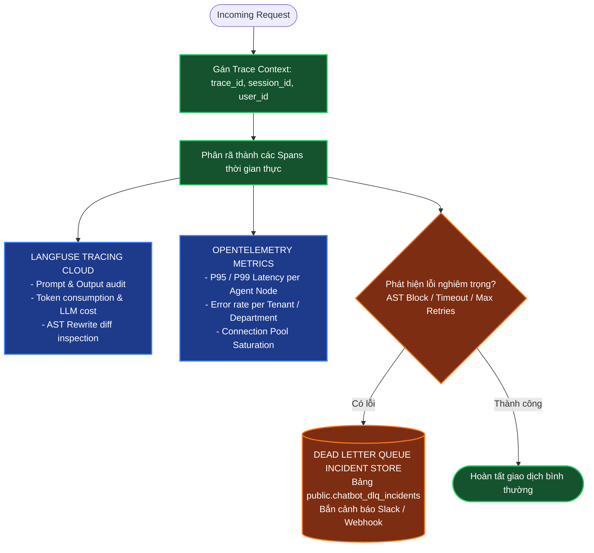

# TÀI LIỆU ĐẶC TẢ THIẾT KẾ KIẾN TRÚC HỆ THỐNG IPGOV CHATBOT
## PHẦN 07: HỆ THỐNG QUAN SÁT (OBSERVABILITY), TRACING, DEAD-LETTER-QUEUE VÀ KHUNG ĐÁNH GIÁ CHẤT LƯỢNG

> **Tiêu chuẩn áp dụng:** Arc42 (Phần 10: Quality Requirements, Phần 11: Risks and Technical Debt) & IEEE Std 1016-2009.  
> **Công nghệ giám sát:** OpenTelemetry SDK, Langfuse Tracing, PostgreSQL DLQ Store.  
> **Trạng thái tài liệu:** Baseline System Design Document (SDD).  
> **Quy chuẩn hiển thị:** 100% biểu đồ được định dạng bằng mã Mermaid chuẩn.

---

### 1. KIẾN TRÚC GIÁM SÁT PHÂN TÁN (DISTRIBUTED TRACING & OBSERVABILITY)

Để vận hành một hệ thống Multi-Agent phức tạp phục vụ cơ quan nhà nước, mọi quyết định suy luận và câu lệnh SQL sinh ra bắt buộc phải được **quan sát minh bạch $100\%$**:



Mỗi yêu cầu từ người dùng được cấp một `trace_id` duy nhất và chia thành các Span thời gian thực:
1. `Span_Router`: Thời gian phân loại Intent và phát hiện độ phức tạp (Mục tiêu: $< 300\text{ms}$).
2. `Span_Catalog_Prune`: Thời gian tìm kiếm mờ và cắt tỉa Schema trong DuckDB (Mục tiêu: $< 20\text{ms}$).
3. `Span_SQL_Gen`: Thời gian gọi LLM sinh mã SQL (Mục tiêu: $< 1200\text{ms}$).
4. `Span_AST_Enforce`: Thời gian kiểm tra và tiêm bộ lọc bảo mật SQLGlot (Mục tiêu: $< 5\text{ms}$).
5. `Span_DWH_Exec`: Thời gian thực thi truy vấn trên PostgreSQL `vna_wom_dev` (Mục tiêu: $< 400\text{ms}$).
6. `Span_Synthesis`: Thời gian LLM định dạng văn bản câu trả lời (Mục tiêu: $< 500\text{ms}$).

---

### 2. HÀNG ĐỢI XỬ LÝ LỖI TRUY VẤN (DEAD-LETTER-QUEUE - DLQ)

Khi một câu truy vấn thất bại sau khi đã thử cơ chế Self-Correction (vượt quá 2 lần) hoặc bị chặn bởi bộ lọc bảo mật AST, hệ thống tự động đẩy toàn bộ ngữ cảnh sự cố vào bảng `chatbot_dlq_incidents`:

```sql
CREATE TABLE IF NOT EXISTS public.chatbot_dlq_incidents (
    incident_id UUID PRIMARY KEY DEFAULT gen_random_uuid(),
    trace_id VARCHAR(64) NOT NULL,
    user_id UUID NOT NULL,
    tenant_code VARCHAR(64) NOT NULL,
    department_code VARCHAR(64),
    raw_prompt TEXT NOT NULL,
    generated_sql TEXT,
    error_stage VARCHAR(32) NOT NULL, -- 'ROUTER', 'SQL_GEN', 'AST_SECURITY', 'DB_EXEC'
    error_message TEXT NOT NULL,
    created_at TIMESTAMP WITH TIME ZONE DEFAULT CURRENT_TIMESTAMP,
    resolved BOOLEAN DEFAULT FALSE
);
```

* **Ý nghĩa thực tiễn:** Bảng DLQ là nguồn dữ liệu quý giá để đội ngũ kỹ sư phân tích các ca truy vấn bất thường (Edge Cases), cập nhật từ điển từ đồng nghĩa trong Semantic Layer và nâng cấp bộ Test Suite mà không làm ảnh hưởng đến người dùng cuối.

---

### 3. KHUNG ĐÁNH GIÁ ĐỘ CHÍNH XÁC THỰC THI (EVALUATION BENCHMARK SUITE)

Hệ thống loại bỏ hoàn toàn các nhận định cảm tính về độ chính xác, thay thế bằng **bộ chỉ số đo lường chuẩn mực quốc tế** dựa trên phương pháp của benchmark **Spider** và **BIRD-SQL**:

| Chỉ Số Đánh Giá | Công Thức Tính Toán | Mục Tiêu Thiết Kế (MVP vs Phase 2) | Ý Nghĩa Kỹ Thuật |
| :--- | :--- | :--- | :--- |
| **Valid SQL Rate (VA)** | $\frac{\text{Số câu SQL đúng cú pháp Postgres}}{\text{Tổng số câu SQL được sinh ra}} \times 100\%$ | $\ge \mathbf{98\%}$ (Trọng tâm MVP) | Đảm bảo mã SQL sinh ra không bị lỗi cú pháp, tương thích hoàn toàn với CSDL PostgreSQL 16. |
| **Execution Accuracy (EX)** | $\frac{\text{Số câu SQL cho kết quả đúng với Ground Truth}}{\text{Tổng số câu hỏi kiểm thử}} \times 100\%$ | $\ge \mathbf{85\%}$ (Trọng tâm MVP) | Đánh giá độ chính xác về mặt số liệu thực tế trên tập Golden Dataset nghiệp vụ DWH. |
| **Security Violation Rate** | $\frac{\text{Số truy vấn lọt mã độc hoặc xem trái phép}}{\text{Tổng số truy vấn đã xử lý}} \times 100\%$ | **Tuyệt đối $\mathbf{0.0\%}$** (Trọng tâm MVP) | Đảm bảo tính toàn vẹn và bảo mật thông qua bộ lọc AST tất định của SQLGlot. |
| **P95 Latency (Single SQL)** | Điểm phân vị thứ 95 của thời gian phản hồi | Tham chiếu $\le \mathbf{2.5\text{s}}$ (Tối ưu Phase 2) | Chỉ số tham chiếu trải nghiệm người dùng; không làm rào cản cổng chặn (non-blocking) giai đoạn MVP. |
| **P95 Latency (Complex DAG)** | Điểm phân vị thứ 95 của truy vấn đa bước | Tham chiếu $\le \mathbf{6.0\text{s}}$ (Tối ưu Phase 2) | Chỉ số tham chiếu giai đoạn 2; giai đoạn MVP tập trung tối đa cho tính đúng đắn logic của đồ thị DAG. |

---

### 4. MA TRẬN CHẾ ĐỘ LỖI VÀ CHIẾN LƯỢC SUY THOÁI (FAILURE MODES & RECOVERY STRATEGY)

Tuân thủ quy trình phân tích rủi ro kỹ thuật **FMEA (Failure Modes and Effects Analysis)**:

| Chế Độ Lỗi (Failure Mode) | Nguyên Nhân Gốc | Mức Độ Nghiêm Trọng | Chiến Lược Phục Hồi Suy Thoái (Graceful Degradation) |
| :--- | :--- | :--- | :--- |
| **1. Kết quả rỗng do bộ lọc HBAC (Empty Scope)** | Người dùng hỏi số liệu của đơn vị khác ngoài phạm vi được phân công. | Thấp | Không báo lỗi hệ thống; trả về phản hồi giải thích rõ phạm vi quyền hạn của tài khoản và gợi ý các chỉ tiêu có thể xem. |
| **2. Truy vấn DWH quá tải ($>5\text{s}$)** | Câu query quét quá nhiều dòng hoặc thiếu index trên bảng Fact. | Trung bình | `asyncpg` tự động hủy câu lệnh qua `statement_timeout = 5000`; chatbot đề xuất người dùng thu hẹp khoảng thời gian tra cứu. |
| **3. Không xác định được thực thể (Entity Ambiguity)** | Tên phòng ban hoặc chỉ tiêu người dùng nhập quá mơ hồ hoặc viết tắt lạ. | Thấp | Kích hoạt cơ chế Clarification: Chatbot trả về danh sách các lựa chọn gợi ý (Clickable Chips) từ DuckDB Catalog để người dùng bấm chọn. |
| **4. Lỗi sinh SQL sau 2 lần tự sửa** | Cấu trúc câu hỏi quá phức tạp vượt ngoài khả năng sinh của mô hình. | Trung bình | Kích hoạt Fallback: Trả lời lịch sự *"Hệ thống chưa thể tổng hợp câu hỏi này bằng câu lệnh tự động"*, đồng thời ghi log vào DLQ để kỹ sư bổ sung Semantic Model. |
