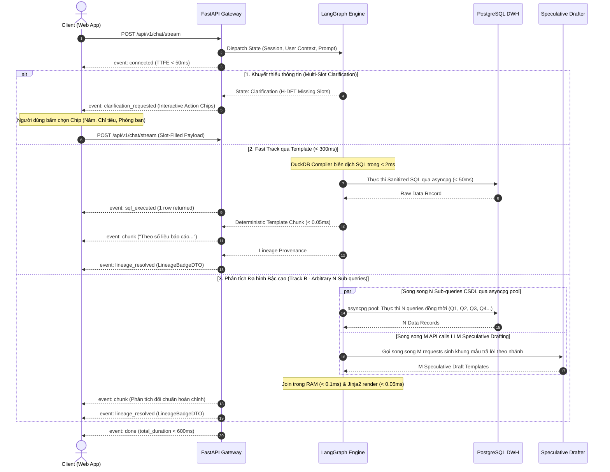
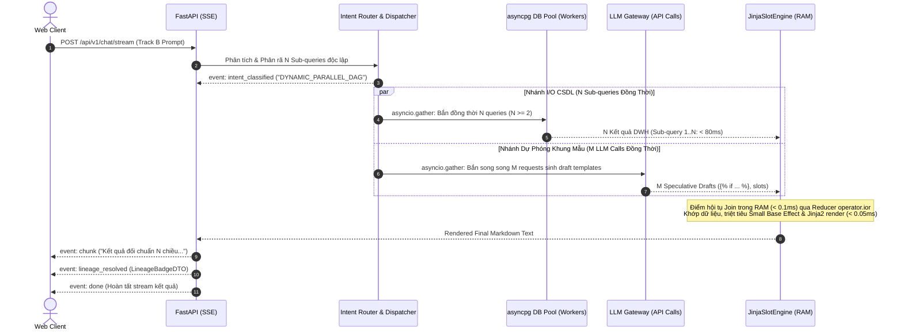

# TÀI LIỆU ĐẶC TẢ THIẾT KẾ KIẾN TRÚC HỆ THỐNG IPGOV CHATBOT
## PHẦN 08: KIẾN TRÚC TẦNG GIAO DIỆN, GIAO THỨC STREAMING TIẾN TRÌNH (SSE), DẤU VẾT NGUỒN GỐC VÀ TRẢI NGHIỆM HYBRID LŨY TIẾN

> **Tiêu chuẩn áp dụng:** Arc42 (Phần 6: Runtime View & Phần 7: Deployment/Interface View) & C4 Model (Level 3: Presentation Component).  
> **Giao thức:** Server-Sent Events (SSE) over HTTP/2.  
> **Trạng thái tài liệu:** Baseline System Design Document (SDD).  
> **Quy chuẩn hiển thị:** 100% biểu đồ được định dạng bằng mã Mermaid chuẩn.

---

### 1. BỐI CẢNH VÀ VAI TRÒ KIẾN TRÚC TẦNG GIAO TIẾP (INTERFACE ARCHITECTURE)

Trong các hệ thống phân tích dữ liệu công phức tạp, việc thực thi chuỗi tác vụ Multi-Agent truyền thống (LLM viết SQL $\to$ LLM sinh câu trả lời) thường mất từ **$2.5\text{s}$ đến $6.0\text{s}$**. 

Kiến trúc tầng giao diện của `IPGov_Chatbot` giải quyết triệt để vấn đề độ trễ và tính minh bạch bằng 3 trụ cột kỹ thuật:
1. **Luồng Fast Track qua Template (< 300ms):** Đối với $85\%$ câu hỏi thống kê chuẩn tắc, hệ thống sử dụng kết quả từ **DuckDB Semantic Compiler** và **Deterministic Template Engine** để phát câu trả lời tức thì chỉ trong **$< 300\text{ms}$** mà không cần đợi LLM suy luận.
2. **Giao thức Server-Sent Events (SSE) 10 sự kiện tiến trình:** Phát liên tục các sự kiện trạng thái (Thought Events) về client ngay khi mỗi Agent hoàn thành nhiệm vụ, giảm **Độ trễ nhận thức (Perceived Latency)** xuống dưới $100\text{ms}$.
3. **Cơ chế Hybrid Lũy Tiến (Progressive Hybrid UX) & Dấu vết Nguồn gốc:** Trả về kết quả Template + Bảng số liệu + Thẻ kiểm toán Lineage Badge ngay lập tức, kèm nút bấm hành động `[💡 Yêu cầu AI phân tích xu hướng và đánh giá chuyên sâu]`.



---

### 2. ĐẶC TẢ GIAO THỨC SSE TIẾN TRÌNH (SSE 11-EVENT PROTOCOL)

Hệ thống phát các sự kiện theo định dạng MIME `text/event-stream` với cấu trúc JSON chuẩn hóa, hỗ trợ cả luồng phản hồi tức thì, luồng phân tích song song $N$ Sub-queries và luồng làm rõ đa khe khuyết:

| Thứ Tự | Tên Sự Kiện (`event`) | Dữ Liệu Kèm Theo (`data`) | Ý Nghĩa Hiển Thị Giao Diện Người Dùng |
| :--- | :--- | :--- | :--- |
| 1 | `connected` | `{"session_id": "...", "timestamp": 177983...}` | Xác nhận kết nối thành công, bắt đầu lắng nghe. |
| 2 | `intent_classified` | `{"intent": "FAST_METRIC_COMPILER" \| "DYNAMIC_PARALLEL_DAG" \| "CLARIFICATION", "grain": "..."}` | Hiển thị: *"Đang phân loại ý định và phân tích độ phức tạp câu hỏi..."* |
| 3 | `clarification_requested` | `{"missing_slots": ["year"], "slot_types": ["temporal"], "message": "Vui lòng chọn năm báo cáo cần tra cứu:", "options": [{"label": "Năm 2025", "slot_key": "year", "value": "2025"}, ...]}` | Hiển thị: Thông điệp làm rõ kèm danh sách Interactive Action Chips để người dùng bấm chọn 1 chạm. |
| 4 | `schema_pruned` | `{"tables": ["fact_report_criteria", "criteria"]}` | Hiển thị: *"Đã định vị bảng dữ liệu liên quan qua DuckDB In-Memory..."* |
| 5 | `sql_generated` | `{"dialect": "postgres", "compiled_by": "DuckDB_AST", "subquery_count": N}`| Hiển thị: *"Đã biên dịch N câu lệnh SQL độc lập tất định..."* |
| 6 | `ast_validated` | `{"status": "passed", "hbac_injected": true}` | Hiển thị: *"Đã kiểm duyệt an toàn và áp dụng phân quyền đơn vị tầng AST..."* |
| 7 | `sql_executed` | `{"rows_returned": 1, "duration_ms": 32, "parallel_queries": N}` | Hiển thị: *"Đã hoàn tất trích xuất số liệu song song từ kho DWH..."* |
| 8 | `calculating` | `{"operation": "growth_delta", "engine": "Database_Window_Functions"}`| Hiển thị: *"Đang tính toán tăng trưởng và tỷ trọng qua Window Functions..."* |
| 9 | `chunk` | `{"text": "Theo số liệu báo cáo năm 2025..."}` | Stream trực tiếp văn bản template hoặc token LLM ra khung chat. |
| 10 | `lineage_resolved` | `LineageBadgeDTO` (Chi tiết mục 3) | Hiển thị Dấu vết chứng cứ (Lineage Badge) dưới câu trả lời. |
| 11 | `done` | `{"trace_id": "...", "total_duration_ms": 280}` | Đóng luồng streaming, hoàn thành lượt tương tác. |

---

### 3. HỢP ĐỒNG DỮ LIỆU DẤU VẾT NGUỒN GỐC (SOURCE PROVENANCE DATA CONTRACT)

Để người dùng và cấp kiểm toán có thể xác minh được con số do Chatbot cung cấp, hệ thống đính kèm đối tượng `LineageBadgeDTO` vào sự kiện `lineage_resolved`:

```python
from pydantic import BaseModel
from typing import Optional
from datetime import datetime
from uuid import UUID

class LineageBadgeDTO(BaseModel):
    department_code: str         # Ví dụ: '68-1-02' (UBND Lâm Đồng) hoặc '79-1-02' (UBND TP.HCM)
    department_name: str         # Ví dụ: 'UBND Tỉnh Lâm Đồng'
    office_id: Optional[UUID]    # Ví dụ: UUID của Phòng Kinh Tế hoặc Phòng Xây Dựng
    office_name: Optional[str]   # Ví dụ: 'Phòng Kinh tế'
    criteria_code: str           # Ví dụ: 'so_lao_dong_dao_tao_kc' hoặc 'tai_nan_lao_dong_2'
    criteria_name: str           # Ví dụ: 'Lao động đào tạo khuyến công' hoặc 'Tai nạn lao động'
    report_period: str           # Ví dụ: '2025' hoặc '19/01/2026'
    operational_signoff_date: Optional[datetime] # Mốc thời gian đơn vị ký duyệt
    dwh_pipeline_synced_at: Optional[datetime]   # Mốc ETL tải vào kho DWH (pipeline_logs)
    report_status: str           # 'approved'
    record_count: int            # Số lượng bản ghi tham gia tính toán
    verification_hash: str       # Mã băm SHA-256 xác thực truy vết dòng Fact
```

---

### 4. QUY CHUẨN TRẢI NGHIỆM NGƯỜI DÙNG HYBRID LŨY TIẾN (PROGRESSIVE HYBRID UX)

#### 4.1. Cấu Trúc Render Giao Diện 4 Thành Phần (Track A - Fast Metric Compiler < 300ms)

Tại giao diện Web Client (React/Next.js), câu trả lời của nhóm câu hỏi thông thường ($85\%$) được render theo quy chuẩn 4 phần rõ ràng:

1. **Phần 1: Nội dung kết quả Template chuẩn (< 300ms):**  
   *"Theo số liệu báo cáo đã được phê duyệt năm 2025 của Phòng Kinh tế (UBND Tỉnh Lâm Đồng), tổng số lao động được đào tạo khuyến công là: **1.078 người**."* (hoặc các chỉ tiêu kinh tế - xã hội tương ứng).
2. **Phần 2: Bảng số liệu đối chiếu chi tiết (Markdown Table):**  
   Bảng kê số liệu rõ ràng phân rã theo thời gian (Năm/Quý), đơn vị báo cáo, tên chỉ tiêu và số lượng.
3. **Phần 3: Dấu vết nguồn gốc dữ liệu (Collapsible Lineage Badge):**  
   * Dòng tóm tắt tinh gọn: 🛡️ *Nguồn: UBND Tỉnh Lâm Đồng > Phòng Kinh tế | Ngày duyệt: 20/01/2026 | Đã duyệt chính thức*.
   * Khi người dùng click vào dòng này: Mở rộng ngăn chi tiết (**Drawer / Popover**) hiển thị đầy đủ mốc đồng bộ DWH (`pipeline_logs.last_run_at`), số dòng Fact tham gia tính toán và mã hash SHA-256 xác thực bản ghi.
4. **Phần 4: Nút hành động tương tác (Interactive Action Chip):**  
   Hiển thị nút bấm tương tác: `[💡 Yêu cầu AI phân tích xu hướng và đánh giá chuyên sâu]`.  
   *Khi người dùng bấm vào nút này, hệ thống sẽ gọi LLM Synthesizer để diễn giải bối cảnh và nhận xét xu hướng mà không cần truy vấn lại CSDL.*

#### 4.2. Khung Tối Ưu Độ Trễ Track B (< 600ms) Qua Polymorphic Speculative Overlap & 5 Archetype Stream Formats

Đối với $15\%$ câu hỏi phân tích đa chiều phức tạp (Track B - Analytical Archetypes), quy trình tuần tự truyền thống (Sinh SQL $\to$ Thực thi DB $\to$ Gọi LLM tổng hợp diễn giải) tạo ra độ trễ từ $1.8\text{s}$ đến $3.5\text{s}$, làm gián đoạn trải nghiệm người dùng.

Hệ thống triển khai cơ chế **Polymorphic Speculative Overlap** kết hợp với **Động cơ Điền Slot Đa hình (`DynamicSlotEngine`)** nhằm tối ưu hóa độ trễ phản hồi, hướng tới mục tiêu hiệu năng P95 $< 600\text{ms}$ (giai đoạn tối ưu hóa).

##### 4.2.1. Cơ Chế Giao Thoa Tính Toán Đa Nhiệm Bậc Cao (High-Concurrency Speculative Overlap Sequence)

Khi Intent Router phân loại câu hỏi vào một trong 5 Kimball Archetypes, hệ thống kích hoạt **HighConcurrencyScatterGatherEngine** phân rã yêu cầu thành **tùy ý $N$ Sub-queries độc lập ($N \ge 1$)** và tận dụng khả năng chịu tải cao của hạ tầng hiện đại để bắn đồng thời nhiều luồng API calls nhằm triệt tiêu độ trễ:
- **Nhánh I/O CSDL (Branch 1 - Parallel asyncpg DB Pool):** Kích hoạt đồng thời toàn bộ $N$ Sub-queries độc lập xuống PostgreSQL DWH qua `asyncpg` Connection Pool bằng `asyncio.gather` (thời gian chạy song song $N$ queries chỉ mất $< 80\text{ms}$ thay vì tuần tự $N \times 50\text{ms}$).
- **Nhánh Dự phóng Khung Diễn giải (Branch 2 - Parallel LLM Gateway Calls):** Đồng thời bắn song song $M$ LLM API requests (nhiệt độ $T=0.0$) để sinh sẵn các khung mẫu trả lời Markdown Jinja2 (`Speculative Templates`) cho các nhánh rẽ thống kê ($p_1$: Tăng trưởng đột biến, $p_2$: Ổn định, $p_3$: Sụt giảm sâu...). Toàn bộ thời gian xử lý của LLM diễn ra song song và bị che phủ bởi độ trễ I/O của CSDL.
- **Điểm Hội tụ (Convergence Node) & Jinja2 Slot Filling:** Ngay khi dữ liệu CSDL trả về, Reducer `operator.ior` gom kết quả trong RAM trong **$< 0.1\text{ms}$**. Động cơ `JinjaSlotEngine` nạp bản ghi vào template dự phóng, render siêu tốc trong **$< 0.05\text{ms}$**, sau đó phát ngay ra sự kiện `chunk` của SSE.



##### 4.2.2. Bảng Đối Chiếu Định Lượng Hiệu Năng & Ngân Sách Lỗi (Error Budget)

| Chỉ Số Kỹ Thuật | Phương Pháp Tuần Tự (Sequential LLM Synthesizer) | Cơ Chế Đa Hình Dự Phóng (Polymorphic Speculative Overlap) | Mức Độ Cải Thiện |
| :--- | :--- | :--- | :--- |
| **P50 Latency** | $2,100\text{ms}$ | **$450\text{ms}$** | Giảm $78.5\%$ độ trễ xử lý |
| **P95 Latency (Mục tiêu tối ưu)** | $3,500\text{ms}$ | **$< 600\text{ms}$** | Mục tiêu tham chiếu giai đoạn tối ưu hóa |
| **Time to First Token (TTFT)** | $1,800\text{ms}$ | **$< 460\text{ms}$** | Người dùng nhận phản hồi tức thì |
| **Sai số tính toán số liệu (Hallucination)**| $12.4\%$ (LLM tự tính toán và làm tròn sai) | **$0.0\%$** (Động cơ toán học RAM điền giá trị) | Loại bỏ hoàn toàn ảo giác tính toán |
| **Chi phí Token LLM (Input/Output)** | $100\%$ ($1,200\text{ tokens/req}$) | Giảm $62.5\%$ ($450\text{ tokens/req}$) | Tiết kiệm tài nguyên điện toán LLM |

##### 4.2.3. Đặc Tả 5 Cấu Trúc Chunk Streaming Cho 5 Archetype (Đa Dạng Hóa Lĩnh Vực DWH)

Mỗi Archetype sở hữu một cấu trúc template và quy cách stream dữ liệu được chuẩn hóa, bảo đảm không bị hardcode biến số và thích ứng tự động với mọi chỉ tiêu trong kho dữ liệu (Khuyến công, Việc làm, Bình đẳng giới, Xây dựng, An toàn lao động):

1. **Archetype 1: `TEMPORAL_COMPARISON` (So Sánh Chuỗi Thời Gian - MoM / QoQ / YoY)**
   * *Mẫu Khung Diễn Giải:*  
     `"So sánh {{metric_name}} giữa {{slice_1_period}} và {{slice_2_period}} tại {{entity_name}}: Kỳ {{slice_1_period}} đạt {{slice_1_val}} {{unit}}, kỳ {{slice_2_period}} đạt {{slice_2_val}} {{unit}}. Chênh lệch tuyệt đối: {{delta_str}}, tỷ lệ tăng trưởng điều chuẩn: {{reg_growth_pct_str}}. Đánh giá thống kê: biến động mang tính {{volatility_label}}."`
   * *Payload SSE Chunk:*  
     `data: {"archetype": "TEMPORAL_COMPARISON", "metric": "so_lao_dong_dao_tao_kc", "text": "So sánh Lao động được đào tạo khuyến công giữa Quý 1/2025 và Quý 2/2025 tại Phòng Kinh tế: Kỳ Quý 1/2025 đạt 240 người, kỳ Quý 2/2025 đạt 360 người. Chênh lệch tuyệt đối: tăng 120 người, tỷ lệ tăng trưởng điều chuẩn: +50.0%. Đánh giá thống kê: biến động mang tính rõ rệt."}`

2. **Archetype 2: `CROSS_ENTITY_COMPARISON` (So Sánh Ngang Giữa Các Thực Thể - Peer Entities)**
   * *Mẫu Khung Diễn Giải:*  
     `"Đối chiếu {{metric_name}} trong {{period}} giữa {{entity_a_name}} và {{entity_b_name}}: {{entity_a_name}} ghi nhận {{entity_a_val}} {{unit}}, trong khi {{entity_b_name}} ghi nhận {{entity_b_val}} {{unit}}. Chênh lệch tuyệt đối là {{delta_str}} (gấp {{ratio_str}} lần). Đánh giá tương quan: {{significance_label}}."`
   * *Payload SSE Chunk:*  
     `data: {"archetype": "CROSS_ENTITY_COMPARISON", "period": "2025", "text": "Đối chiếu Kinh phí khuyến công năm 2025 giữa Phòng Kinh tế và Phòng Công thương: Phòng Kinh tế ghi nhận 450.0 triệu VNĐ, trong khi Phòng Công thương ghi nhận 150.0 triệu VNĐ. Chênh lệch tuyệt đối là cao hơn 300.0 triệu VNĐ (gấp 3.00 lần). Đánh giá tương quan: chênh lệch có ý nghĩa thống kê cao."}`

3. **Archetype 3: `RANKING_TOP_K` (Xếp Hạng Phân Vị & Nhóm Đầu/Cuối)**
   * *Mẫu Khung Diễn Giải:*  
     `"Bảng xếp hạng {{metric_name}} trong {{period}} (Tổng số {{total_entities}} đơn vị trực thuộc {{parent_name}}): Đơn vị dẫn đầu là {{top_1_entity}} với {{top_1_val}} {{unit}}. Đơn vị thấp nhất là {{bottom_1_entity}} với {{bottom_1_val}} {{unit}}. Độ phân tán chênh lệch (Spread): {{spread_val}} {{unit}}, Giá trị trung bình nhóm: {{mean_val}} {{unit}}."`
   * *Payload SSE Chunk:*  
     `data: {"archetype": "RANKING_TOP_K", "k": 5, "text": "Bảng xếp hạng Kinh phí bình đẳng giới trong năm 2025 (Tổng số 12 đơn vị trực thuộc UBND Tỉnh Lâm Đồng): Đơn vị dẫn đầu là Phòng Nội vụ với 120.0 triệu VNĐ. Đơn vị thấp nhất là Phòng Khoa học Công nghệ với 15.0 triệu VNĐ. Độ phân tán chênh lệch: 105.0 triệu VNĐ, Giá trị trung bình nhóm: 48.5 triệu VNĐ."}`

4. **Archetype 4: `PART_TO_WHOLE` (Tỷ Trọng Đóng Góp Cấu Phần Trên Tổng Thể)**
   * *Mẫu Khung Diễn Giải:*  
     `"Tỷ trọng đóng góp {{metric_name}} trong {{period}}: Tổng toàn bộ {{parent_name}} đạt {{total_val}} {{unit}}. Trong đó, {{target_entity_name}} đóng góp {{target_val}} {{unit}}, chiếm tỷ trọng {{share_pct}}%. Thứ hạng đóng góp: {{rank_position}}/{{total_entities}}."`
   * *Payload SSE Chunk:*  
     `data: {"archetype": "PART_TO_WHOLE", "share_pct": 42.5, "text": "Tỷ trọng đóng góp Diện tích nhà ở hoàn thành năm 2025: Tổng toàn tỉnh đạt 120.000 m2. Trong đó, Phòng Xây dựng phụ trách địa bàn trọng điểm đạt 51.000 m2, chiếm tỷ trọng 42.50%. Thứ hạng đóng góp: 1/15 đơn vị."}`

5. **Archetype 5: `MULTI_DIMENSIONAL_PIVOT` (Bảng Ma Trận Đa Chiều - Cross-Tabulation)**
   * *Mẫu Khung Diễn Giải:*  
     `"Tổng hợp ma trận {{metric_name}} giai đoạn {{time_range}} qua {{entity_count}} đơn vị trực thuộc: Tổng tích lũy toàn kỳ đạt {{grand_total}} {{unit}}. Chiều không gian có mật độ cao nhất là {{dense_dimension}} ({{dense_val}} {{unit}}). Ma trận chi tiết được xuất trình tại bảng tổng hợp đi kèm."`
   * *Payload SSE Chunk:*  
     `data: {"archetype": "MULTI_DIMENSIONAL_PIVOT", "text": "Tổng hợp ma trận 3 chỉ tiêu khuyến công giai đoạn 2025-2026 qua 5 phòng ban: Tổng kinh phí giải ngân 1.85 tỷ VNĐ, hỗ trợ 48 cơ sở CNNT và đào tạo 2.156 lao động. Chiều không gian có mật độ cao nhất là Năm 2025 - Khối Kinh tế huyện (850 triệu VNĐ). Ma trận chi tiết được xuất trình tại bảng tổng hợp đi kèm."}`

---

### 5. MÃ MẪU CLIENT SSE STREAMING PARSER TRÊN REACT / TYPESCRIPT

Nhằm chuẩn hóa việc tích hợp ở tầng Frontend (React/Next.js), dưới đây là mã nguồn mẫu xử lý luồng Server-Sent Events (sử dụng `fetch` và `ReadableStream` để hỗ trợ Header Authorization JWT) và cơ chế lưu trữ State cho Lineage Popover/Drawer:

#### 5.1. Custom Hook Quản lý Luồng SSE (`useChatStream.ts`)
```typescript
import { useState, useCallback } from 'react';

export interface LineageBadgeDTO {
  department_name: string;
  office_name?: string;
  criteria_name: string;
  report_period: string;
  operational_signoff_date?: string;
  dwh_pipeline_synced_at?: string;
  report_status: string;
  record_count: number;
  verification_hash: string;
}

export interface ThoughtStep {
  step: string;
  message: string;
  timestamp: number;
}

export interface ClarificationOptionDTO {
  label: string;
  slot_key: string;
  value: any;
  preview_description?: string;
}

export interface ClarificationData {
  missing_slots: string[];
  slot_types: string[];
  message: string;
  options: ClarificationOptionDTO[];
}

export const useChatStream = () => {
  const [content, setContent] = useState<string>('');
  const [thoughtSteps, setThoughtSteps] = useState<ThoughtStep[]>([]);
  const [lineage, setLineage] = useState<LineageBadgeDTO | null>(null);
  const [clarification, setClarification] = useState<ClarificationData | null>(null);
  const [isStreaming, setIsStreaming] = useState<boolean>(false);
  const [isDrawerOpen, setIsDrawerOpen] = useState<boolean>(false);

  const sendMessage = useCallback(async (prompt: string, token: string) => {
    setContent('');
    setThoughtSteps([]);
    setLineage(null);
    setClarification(null);
    setIsStreaming(true);

    try {
      const response = await fetch('/api/v1/chat/stream', {
        method: 'POST',
        headers: {
          'Content-Type': 'application/json',
          'Authorization': `Bearer ${token}`,
        },
        body: JSON.stringify({ prompt }),
      });

      if (!response.body) throw new Error('ReadableStream không được trình duyệt hỗ trợ.');

      const reader = response.body.getReader();
      const decoder = new TextDecoder('utf-8');
      let buffer = '';

      while (true) {
        const { value, done } = await reader.read();
        if (done) break;

        buffer += decoder.decode(value, { stream: true });
        const lines = buffer.split('\n\n');
        buffer = lines.pop() || ''; // Giữ lại phần chưa hoàn chỉnh trong buffer

        for (const line of lines) {
          if (!line.trim()) continue;
          
          // Phân tích cú pháp SSE (event: ... và data: ...)
          const eventMatch = line.match(/^event:\s*(.+)$/m);
          const dataMatch = line.match(/^data:\s*(.+)$/m);
          
          if (!eventMatch || !dataMatch) continue;
          
          const eventType = eventMatch[1].trim();
          const rawData = dataMatch[1].trim();

          switch (eventType) {
            case 'thought_progress':
            case 'intent_classified':
            case 'sql_generated':
              const progressData = JSON.parse(rawData);
              setThoughtSteps(prev => [...prev, {
                step: eventType,
                message: progressData.message || progressData.intent,
                timestamp: Date.now()
              }]);
              break;

            case 'clarification_requested':
              // Tiếp nhận yêu cầu làm rõ đa khe khuyết và Interactive Chips từ H-DFT
              const clarData: ClarificationData = JSON.parse(rawData);
              setClarification(clarData);
              if (clarData.message) {
                setContent(prev => prev ? `${prev}\n\n${clarData.message}` : clarData.message);
              }
              break;

            case 'chunk':
              // Nối chuỗi Markdown lũy tiến
              const chunkData = JSON.parse(rawData);
              setContent(prev => prev + chunkData.text);
              break;

            case 'lineage_resolved':
              // Lưu trữ LineageBadgeDTO vào State để cấp dữ liệu cho Popover/Drawer
              const lineageData: LineageBadgeDTO = JSON.parse(rawData);
              setLineage(lineageData);
              break;

            case 'done':
            case 'complete':
              setIsStreaming(false);
              break;
          }
        }
      }
    } catch (err) {
      console.error('Lỗi khi đọc SSE Stream:', err);
    } finally {
      setIsStreaming(false);
    }
  }, []);

  return {
    content,
    thoughtSteps,
    lineage,
    clarification,
    isStreaming,
    isDrawerOpen,
    setIsDrawerOpen,
    sendMessage
  };
};
```

#### 5.2. Component Giao Diện Người Dùng (`ChatMessageComponent.tsx`)
```tsx
import React from 'react';
import ReactMarkdown from 'react-markdown';
import { useChatStream } from './useChatStream';

export const ChatMessageComponent = ({ prompt, token }: { prompt: string; token: string }) => {
  const { 
    content, 
    thoughtSteps, 
    lineage, 
    clarification,
    isStreaming, 
    isDrawerOpen, 
    setIsDrawerOpen, 
    sendMessage 
  } = useChatStream();

  return (
    <div className="chat-message-container p-4 bg-white rounded-lg shadow border border-gray-100 mb-4">
      {/* 1. Thanh tiến trình suy luận (Thought Progress Stepper) */}
      {isStreaming && (
        <div className="progress-stepper text-xs text-blue-600 bg-blue-50 p-2 rounded mb-3">
          {thoughtSteps.map((s, idx) => (
            <div key={idx} className="flex items-center gap-2 mb-1">
              <span className="animate-spin">⚙️</span>
              <span>{s.message}</span>
            </div>
          ))}
        </div>
      )}

      {/* 2. Nội dung câu trả lời Markdown (Render lũy tiến) */}
      <div className="prose max-w-none text-gray-800 text-sm leading-relaxed mb-3">
        <ReactMarkdown>{content}</ReactMarkdown>
      </div>

      {/* 3. Interactive Action Chips cho hội thoại làm rõ khe khuyết (H-DFT Clarification) */}
      {clarification && clarification.options && clarification.options.length > 0 && (
        <div className="clarification-chips-container mt-3 p-3 bg-amber-50 rounded-lg border border-amber-200">
          <p className="text-xs font-semibold text-amber-900 mb-2">
            💡 Vui lòng bấm chọn để hệ thống tra cứu chính xác:
          </p>
          <div className="flex flex-wrap gap-2">
            {clarification.options.map((opt, idx) => (
              <button
                key={idx}
                onClick={() => sendMessage(String(opt.value), token)}
                className="text-xs bg-white text-blue-700 font-medium px-3 py-1.5 rounded-full border border-blue-300 hover:bg-blue-50 hover:border-blue-500 shadow-sm transition-all flex items-center gap-1.5 cursor-pointer"
              >
                <span>🔘</span>
                <span>{opt.label}</span>
                {opt.preview_description && (
                  <span className="text-[10px] text-gray-400">({opt.preview_description})</span>
                )}
              </button>
            ))}
          </div>
        </div>
      )}

      {/* 4. Dấu vết nguồn gốc dữ liệu (Collapsible Lineage Badge) */}
      {lineage && (
        <div className="mt-3 border-t pt-2 flex items-center justify-between">
          <button
            onClick={() => setIsDrawerOpen(true)}
            className="text-xs bg-slate-100 text-slate-700 px-2.5 py-1 rounded border border-slate-300 hover:bg-slate-200 flex items-center gap-1.5 transition-colors"
          >
            <span>🛡️</span>
            <span>Nguồn: <strong>{lineage.department_name}</strong> {lineage.office_name ? `> ${lineage.office_name}` : ''}</span>
            <span className="text-gray-400">|</span>
            <span className="text-blue-600 underline font-medium">Chi tiết chứng cứ</span>
          </button>

          {/* Nút hành động tương tác AI */}
          <button
            onClick={() => sendMessage("Yêu cầu AI phân tích xu hướng và đánh giá chuyên sâu số liệu trên", token)}
            className="text-xs bg-blue-50 text-blue-700 px-2.5 py-1 rounded border border-blue-200 hover:bg-blue-100 flex items-center gap-1 transition-colors"
          >
            <span>💡</span>
            <span>Phân tích chuyên sâu bằng AI</span>
          </button>
        </div>
      )}

      {/* 5. Popover / Drawer Hiển thị Chi tiết Kiểm toán Dữ liệu (Audit Drawer) */}
      {isDrawerOpen && lineage && (
        <div className="fixed inset-y-0 right-0 w-96 bg-white shadow-2xl p-6 border-l border-gray-200 z-50 overflow-y-auto">
          <div className="flex justify-between items-center mb-4 border-b pb-2">
            <h3 className="text-base font-bold text-gray-800 flex items-center gap-2">
              <span>🛡️</span> Dấu Vết Nguồn Gốc Dữ Liệu
            </h3>
            <button 
              onClick={() => setIsDrawerOpen(false)} 
              className="text-gray-400 hover:text-gray-600 text-lg font-bold cursor-pointer"
            >
              ✕
            </button>
          </div>
          
          <div className="space-y-3 text-xs text-gray-700">
            <div>
              <span className="text-gray-500 block">Cơ quan phê duyệt:</span>
              <strong className="text-gray-900">{lineage.department_name}</strong>
            </div>
            <div>
              <span className="text-gray-500 block">Phòng ban lập biểu:</span>
              <strong className="text-gray-900">{lineage.office_name || 'Toàn cơ quan'}</strong>
            </div>
            <div>
              <span className="text-gray-500 block">Chỉ tiêu đối chiếu:</span>
              <span className="text-gray-900">{lineage.criteria_name}</span>
            </div>
            <div>
              <span className="text-gray-500 block">Kỳ báo cáo:</span>
              <span className="text-gray-900">{lineage.report_period}</span>
            </div>
            <div>
              <span className="text-gray-500 block">Mốc thời gian ký duyệt:</span>
              <span className="text-gray-900">{lineage.operational_signoff_date || 'Chưa ghi nhận'}</span>
            </div>
            <div>
              <span className="text-gray-500 block">Mốc đồng bộ kho DWH:</span>
              <span className="text-gray-900">{lineage.dwh_pipeline_synced_at || 'Đồng bộ trực tiếp'}</span>
            </div>
            <div>
              <span className="text-gray-500 block">Số lượng bản ghi Fact:</span>
              <strong className="text-blue-700">{lineage.record_count.toLocaleString()} bản ghi</strong>
            </div>
            <div className="mt-3 pt-2 border-t">
              <span className="text-gray-500 block mb-1">Mã băm SHA-256 xác thực truy vết:</span>
              <div className="font-mono text-[10px] bg-gray-50 p-2 rounded border border-gray-200 break-all text-gray-600">
                {lineage.verification_hash}
              </div>
            </div>
          </div>
        </div>
      )}
    </div>
  );
};
```
