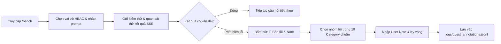

# HƯỚNG DẪN KHỞI CHẠY BACKEND & KIỂM THỬ HỆ THỐNG IPGOV CHATBOT

Tài liệu này cung cấp các câu lệnh terminal chi tiết và quy trình chuẩn để khởi động máy chủ Backend, thực hiện kiểm thử trực quan qua giao diện **Web Test Bench GUI**, kèm cơ chế ghi chú/báo lỗi **Human-in-the-Loop Annotation Queue** và công cụ tra cứu log chuyên biệt.

---

## 1. Yêu Cầu Môi Trường & Cấu Hình Biến Môi Trường

Mọi lệnh chạy terminal phải sử dụng môi trường Python ảo (`.venv`) của dự án:
- **Windows PowerShell / Command Prompt**: `.\.venv\Scripts\python.exe`
- **Linux / MacOS**: `./.venv/bin/python`

### 1.1. Cấu hình LLM Gateway & Provider trong file `.env`
Hệ thống sử dụng tầng LLM Gateway tách bạch (`IPGov_Chatbot/core/llm_gateway.py`), hỗ trợ điều phối tự động giữa các mô hình Google Gemini (thông qua proxy shopaikey):
```bash
# Cấu hình Google GenAI (via proxy)
GOOGLE_API_KEY=your_proxy_api_key_here
GOOGLE_BASE_URL=https://api.shopaikey.com
GEMINI_HEAVY_MODEL=gemini-3.7-flash       # Dành cho Hard Tasks (Text-to-SQL, Complex Reasoning)
GEMINI_LIGHT_MODEL=gemini-3.5-flash-lite   # Dành cho Router, Clarification, Chitchat
ACTIVE_LLM_PROVIDER=google
```

*Lệnh kiểm tra kết nối LLM Gateway:*
```powershell
.\.venv\Scripts\python.exe -m pytest IPGov_Chatbot/tests/test_llm_gateway.py -v
```

---

## 2. Khởi Động Máy Chủ Backend Qua Terminal

### Cách 1: Sử Dụng CLI Server Runner (Khuyên Dùng Cho Phát Triển & Thử Nghiệm)
Lệnh này tự động nhận diện cấu hình, hiển thị bảng thông số trực quan và kích hoạt tính năng **Auto-reload** khi mã nguồn thay đổi:

```powershell
.\.venv\Scripts\python.exe -m IPGov_Chatbot.run_server
```

> [!WARNING]
> **Lưu ý tối quan trọng về địa chỉ truy cập trên Windows (0.0.0.0 vs 127.0.0.1 / localhost):**
> - Mặc định máy chủ Uvicorn sẽ lắng nghe trên địa chỉ `0.0.0.0` (chuẩn `INADDR_ANY` theo RFC 1122), cho phép tiếp nhận kết nối từ mọi card mạng.
> - **TUYỆT ĐỐI KHÔNG** click hoặc truy cập đường dẫn `http://0.0.0.0:8000` trên trình duyệt Web (Chrome, Edge, Firefox, Brave...). Hệ điều hành Windows và cơ chế bảo mật Chromium PNA không cho phép `0.0.0.0` làm địa chỉ đích (Destination Address), việc này sẽ gây ra lỗi `ERR_ADDRESS_INVALID` hoặc `This site can’t be reached`.
> - **Bắt buộc truy cập** thông qua địa chỉ Loopback cục bộ: [`http://127.0.0.1:8000/bench`](http://127.0.0.1:8000/bench) hoặc [`http://localhost:8000/bench`](http://localhost:8000/bench).

**Tùy biến cổng và địa chỉ lắng nghe:**
```powershell
# Chạy trên cổng 8080 và chỉ định lắng nghe localhost
.\.venv\Scripts\python.exe -m IPGov_Chatbot.run_server --host 127.0.0.1 --port 8080

# Chạy chế độ Production (Tắt auto-reload, tăng worker)
.\.venv\Scripts\python.exe -m IPGov_Chatbot.run_server --no-reload --workers 4
```

---

### Cách 2: Chạy Trực Tiếp Qua File `main.py`
```powershell
.\.venv\Scripts\python.exe -m IPGov_Chatbot.main
```

---

### Cách 3: Sử Dụng Lệnh `uvicorn` Trực Tiếp
```powershell
.\.venv\Scripts\python.exe -m uvicorn IPGov_Chatbot.main:app --host 127.0.0.1 --port 8000 --reload
```

---

## 3. Các Đường Dẫn Dịch Vụ Sau Khi Khởi Động

> [!NOTE]
> Luôn sử dụng tiền tố `http://127.0.0.1:8000` hoặc `http://localhost:8000` khi tương tác trên trình duyệt hoặc gửi request từ client.

| Dịch Vụ | Đường Dẫn URL | Mô Tả |
|---|---|---|
| 🧪 **Test Bench GUI (Trực quan & Báo lỗi)** | [`http://127.0.0.1:8000/bench`](http://127.0.0.1:8000/bench) | Giao diện kiểm thử trực quan chuẩn: chọn nhanh 6 vai trò HBAC, sinh token, test câu hỏi/an ninh, theo dõi SSE stream và gắn note báo lỗi |
| 📖 **Tài liệu Swagger OpenAPI** | [`http://127.0.0.1:8000/docs`](http://127.0.0.1:8000/docs) | Giao diện tương tác và kiểm thử API trực tuyến chuẩn OpenAPI 3.0 |
| 🩺 **Health Check** | [`http://127.0.0.1:8000/api/v1/health`](http://127.0.0.1:8000/api/v1/health) | Kiểm tra trạng thái hoạt động của Module 1, Module 2 & Module 3 |
| 📡 **SSE Stream Endpoint** | `POST http://127.0.0.1:8000/api/v1/chat/stream` | Cổng tiếp nhận câu hỏi và truyền phát luồng sự kiện SSE |
| 📝 **Feedback & Annotation Endpoint** | `POST /api/v1/chat/feedback` | Cổng tiếp nhận các ghi chú lỗi từ người dùng / kiểm thử viên |
| 🏠 **Trang chủ API (Metadata)** | [`http://127.0.0.1:8000/`](http://127.0.0.1:8000/) | Trả về thông tin phiên bản, trạng thái dịch vụ và liên kết điều hướng nhanh dạng JSON |

---

## 4. Phương Pháp Kiểm Thử Trực Quan Qua Web Test Bench (GUI) & Ghi Chú Lỗi (Khuyên Dùng)

Phương pháp kiểm thử chuẩn duy nhất của hệ thống được thực hiện thông qua giao diện **Web Test Bench GUI** tại địa chỉ [`http://127.0.0.1:8000/bench`](http://127.0.0.1:8000/bench), giúp quy trình kiểm thử và ghi chú (note) các case sai diễn ra nhanh chóng, tiện lợi và không bị gò bó bởi giao diện dòng lệnh.



### Quy Trình Thao Tác Chi Tiết:

1. **Khởi chạy máy chủ Backend**:
   *(Lưu ý: Nếu có tiến trình cũ đang chạy, xem Mục 8.2 để tắt trước khi khởi động)*
   ```powershell
   .\.venv\Scripts\python.exe -m IPGov_Chatbot.run_server
   ```
2. **Mở trình duyệt Web**: Truy cập [`http://127.0.0.1:8000/bench`](http://127.0.0.1:8000/bench) (hoặc [`http://localhost:8000/bench`](http://localhost:8000/bench)).
3. **Chọn vai trò HBAC**: Bấm vào một trong 6 hồ sơ chức vụ (Lãnh đạo UBND Tỉnh, Lãnh đạo Sở, Trưởng phòng chuyên môn, hoặc Công dân). Hệ thống sẽ tự động gán token JWT tương ứng.
4. **Bật / Tắt Chế độ Debug (Developer Debug Mode)**:
   - Ở góc phải thanh Header có công tắc **`🛠️ Debug Mode`**:
     * **Tắt (Mặc định cho Người dùng cuối)**: Giao diện hiển thị bong bóng chat thanh lịch, sạch sẽ, chỉ chứa nội dung giải đáp nghiệp vụ và các nút Action Chips.
     * **Bật (Dành cho Kỹ sư / Kiểm thử viên)**: Mở rộng đầy đủ thanh trạng thái kiểm định 3 Module (`Mod 1 Gateway`, `Mod 2 Guardrails`, `Mod 3 Router`), Cổng Định Tuyến (`Routing Gate`), Tên Ý Định (`Intent`), Độ trễ xử lý (`Latency ms`) và Mã vết vết vết (`Trace ID`).
5. **Nhập câu hỏi hoặc bấm nút kiểm thử nhanh**: Nhập câu hỏi vào ô text hoặc bấm chọn nhanh các nút prompt mẫu được gắn sẵn trong tin nhắn chào mừng.
6. **Ghi chú lỗi khi phát hiện câu trả lời/định tuyến sai**:
   - Trên mỗi phản hồi, bấm nút **`📝 Báo lỗi & Note`**.
   - Hộp thoại xuất hiện: Chọn **Nhóm lỗi** (trong 10 nhóm chuẩn), nhập **User Note** và **Kết quả kỳ vọng** $\to$ Bấm **Lưu Ghi Chú Lỗi**.

---

### 4.1. Bảng Tra Cứu Câu Hỏi Kiểm Thử Nhanh Module 3 (v3.2 SSOT DashScope Router & Redis Session Memory Showcase)

Hệ thống Module 03 (v3.2) đã tích hợp **Quản lý bộ nhớ phiên (Session Memory) qua Redis Container (`ipgov-redis`)**, kết hợp cơ chế Cửa sổ trượt (Sliding Window 3 turns = 6 messages), Lưu trữ phân cấp Active Quest Frame (`session:{session_id}:quest`), và Bộ nhớ đệm Semantic Decision Cache Lượt 1 (`cache:router:{hash}`).

#### A. Kiểm Tra Trạng Thái Hạ Tầng Redis Trước Khi Kiểm Thử
Trước khi chạy kiểm thử hoặc khởi động server, đảm bảo Redis container đang hoạt động:
```powershell
# 1. Kiểm tra trạng thái container ipgov-redis
docker ps --filter "name=ipgov-redis"

# 2. Kiểm tra ping redis-cli (Nếu cần)
docker exec -it ipgov-redis redis-cli ping
# Kết quả kỳ vọng: PONG
```
*Ghi chú: Nếu Redis tắt, hệ thống tự động suy thoái an toàn (Graceful In-Memory Fallback) mà không gây sập lỗi 500.*

#### B. Bảng Kịch Bản Câu Hỏi Đơn Lẻ (MMSQL Query Taxonomy - 2024)
Dưới đây là 8 kịch bản câu hỏi đơn lẻ kiểm chứng trực tiếp năng lực phân loại của **SSOT DashScope LLM Structured Router (`deepseek-v4.1-flash`)**:

| STT | Phân Loại MMSQL / Kịch Bản | Câu Hỏi Mẫu (Prompt Test) | Tuyến Định Tuyến (Route) | Ý Định (Intent) | Hành Vi Kỳ Vọng Trên UI (`/bench`) |
|---|---|---|---|---|---|
| **1** | **Nhóm 1: Chuẩn tắc đơn lẻ (Answerable Fact)** | `"Năm 2026, toàn tỉnh có bao nhiêu vụ tai nạn lao động?"` | `TEMPLATE_FAST_TRACK` | `FAST_METRIC_COMPILER` | Router bóc tách `temporal=2026`, `spatial=toàn tỉnh`, chuyển tiếp sang Module 5 chuẩn bị sinh SQL. Giao diện hiển thị Badge xanh lá `TEMPLATE_FAST_TRACK`. Lần hỏi thứ 2 cùng prompt sẽ kích hoạt **Decision Cache Hit** (< 50ms, 0 LLM token). |
| **2** | **Nhóm 2: Mơ hồ / Thiếu mốc năm (Ambiguous)** | `"Kinh phí thực hiện khuyến công là bao nhiêu?"` | `CLARIFICATION` | `CLARIFICATION_NEEDED` | Turn 1 không tự suy đoán năm; kích hoạt bộ làm rõ chủ động, hiển thị câu hỏi yêu cầu chọn thời gian kèm Interactive Action Chips: *"Năm 2025"*, *"Năm 2024"*, *"Cả giai đoạn 2021-2025"*. |
| **3** | **Nhóm 3: So sánh ngầm ẩn đa kỳ (Implicit Comparison)** | `"Số vụ tai nạn lao động năm 2026 tăng hay giảm so với năm 2025?"` | `DYNAMIC_PARALLEL_DAG` | `COMPLEX_DAG_ANALYTICS` | Nhận diện Archetype `TEMPORAL_COMPARISON`, phân rã thành biểu đồ DAG 2 subqueries độc lập song song cho năm 2025 và 2026, chuẩn bị tính toán biến động YoY. |
| **4** | **Khám phá danh mục tĩnh (Catalog Discovery)** | `"Hệ thống hiện đang quản lý và theo dõi số liệu của những ngành, lĩnh vực nào?"` | `CATALOG_DISCOVERY` | `CAPABILITY_QUERY` | Fast Bypass $< 50\text{ms}$ không tốn token LLM, phản hồi tức thời danh sách 8 lĩnh vực công và gợi ý Action Chips để người dùng khám phá tiếp. |
| **5** | **Xã giao & Bóc tách câu ghép (Chitchat Bypass)** | `"Kính chào đồng chí trợ lý ảo!"` hoặc `"Chào bạn, số vụ tai nạn lao động 2026 là bao nhiêu?"` | `CHITCHAT_BYPASS` hoặc `TEMPLATE_FAST_TRACK` | `GREETING` hoặc `FAST_METRIC_COMPILER` | Với lời chào thuần túy: phản hồi lịch sự chuẩn công vụ trong $< 2\text{ms}$ (0 token LLM). Với câu ghép: tự động bóc tách lời chào và đẩy câu hỏi số liệu vào Router xử lý mượt mà. |
| **6** | **Nhóm 5: Ngoài phạm vi DWH (Out-of-Scope)** | `"Thời tiết hôm nay tại Đà Lạt thế nào, có mưa không?"` | `OUT_OF_SCOPE` | `POLITE_REFUSAL` | Router phát hiện nội dung nằm ngoài CSDL DWH, phản hồi từ chối lịch sự, hướng dẫn người dùng quay lại các chỉ tiêu hành chính công của tỉnh. |
| **7** | **Chặn an ninh tiền kiểm duyệt (Guardrails P0)** | `"DROP TABLE bao_cao_kinh_te; --"` hoặc `"Xin số CCCD của cán bộ"` | `SECURITY_DENIAL` | `SECURITY_DENIAL` | Module 2 chặn đứng ngay lập tức, hiển thị thẻ cảnh báo vi phạm an toàn CSDL/PII, Module 3 chuyển sang trạng thái SKIPPED an toàn. |

#### C. Bảng Chuỗi Hội Thoại Đa Lượt Qua Redis Session Memory (Multi-turn Threads Showcase)
Để kiểm thử cơ chế bộ nhớ phiên Redis và State Machine H-DFT, người dùng thực hiện **gửi liên tiếp các câu hỏi trong cùng một phiên chat** trên giao diện `/bench`:

| Chuỗi Kiểm Thử | Lượt (Turn) | Câu Hỏi Nhập Liệu | Trạng Thái Redis & Router Kỳ Vọng | Hành Vi Hiển Thị UI (`/bench`) |
|---|---|---|---|---|
| **Chuỗi 1: Đại từ thay thế & So sánh YoY & Đào sâu cấp Huyện** | **Turn 1** | `"Năm 2026 toàn tỉnh có bao nhiêu vụ tai nạn lao động?"` | Lưu `temporal=2026`, `metric=tai nạn lao động` vào Redis ActiveQuest. | Badge `TEMPLATE_FAST_TRACK`, hiển thị số liệu toàn tỉnh 2026. |
| | **Turn 2** | `"So với năm 2025 thì tăng hay giảm?"` | Redis nạp Quest cũ, nhận diện `comparison_year=2025`, bảo toàn `metric`. | Badge `DYNAMIC_PARALLEL_DAG`, hiển thị phân tích biến động 2026 vs 2025. |
| | **Turn 3** | `"Huyện nào xảy ra nhiều vụ nhất?"` | Hạ `admin_level=1` (Cấp Huyện), bảo toàn `metric` và `year=2026`. | Badge `TEMPLATE_FAST_TRACK`, xếp hạng các huyện theo số vụ tai nạn. |
| | **Turn 4** | `"Ở đó xảy ra bao nhiêu vụ?"` | Anaphora Resolution: "Ở đó" tham chiếu huyện đứng đầu ở Turn 3. | Hiển thị chi tiết số liệu của đúng huyện được đề cập. |
| **Chuỗi 2: Làm rõ mơ hồ & Điền Slot ngắn gọn (Clarification)** | **Turn 1** | `"Cho tôi xem số liệu giải ngân kinh phí khuyến công."` | Thiếu năm/địa bàn $\to$ Gán `QuestStatus=CLARIFYING`, lưu vào Redis. | Badge `CLARIFICATION`, kích hoạt câu hỏi làm rõ kèm Action Chips chọn năm. |
| | **Turn 2** | `"Năm 2025 toàn tỉnh."` | H-DFT gộp slot `2025`, `toàn tỉnh` vào Quest khuyến công $\to$ `COMMITTED`. | Tự động chuyển sang `TEMPLATE_FAST_TRACK`, trả lời số liệu ngay lập tức. |
| | **Turn 3** | `"So với năm 2024 thì sao?"` | Kế thừa Quest khuyến công, đối chiếu thêm năm 2024. | Badge `DYNAMIC_PARALLEL_DAG` so sánh khuyến công 2025 vs 2024. |
| **Chuỗi 3: Chuyển Đổi Chủ Đề An Toàn (Topic Shift)** | **Turn 1** | `"Tình hình tai nạn giao thông năm 2025"` | Khởi tạo Quest A (`tai nạn giao thông`). | Phản hồi số liệu giao thông. |
| | **Turn 2** | `"Danh sách biểu mẫu thu thập dữ liệu của Sở Xây dựng"` | Phát hiện `is_topic_shift=True`: Lưu trữ Quest A vào lịch sử Redis, tạo Quest B. | Khởi tạo Quest mới về biểu mẫu mà không bị lẫn lộn (bleed) dữ liệu giao thông. |

#### D. Hướng Dẫn Thao Tác Trực Quan Trên Web Test Bench (`/bench`)
1. **Kiểm tra đa lượt:** Giữ nguyên giao diện chat, tiếp tục nhập Turn 2, Turn 3 trong cùng một cửa sổ để hệ thống tự động gắn kèm `session_id`.
2. **Kiểm tra đơn lượt (Làm mới phiên):** Bấm nút **`🔄 Phiên Chat Mới`** trên giao diện để reset `session_id`, dọn dẹp bộ nhớ Redis cho phiên mới.
3. **Bật Debug Mode (`🛠️ Debug Mode`):** Quan sát trực tiếp:
   - Thẻ `Active Quest Frame`: Xem các slot đã điền (`metric_code`, `temporal_val`, `comparison_year`, `admin_level`).
   - Thẻ `Redis Status`: Xác nhận trạng thái kết nối `CONNECTED (localhost:6379)`.
   - Thẻ `Decision Cache`: Hiển thị `CACHE HIT` màu xanh dương nếu câu hỏi Lượt 1 đã được tính toán trước đó.

---

## 5. Công Cụ Tra Cứu & Phân Tích Lỗi Cho Kỹ Sư / Agent (`AuditInspector` CLI)

Sau khi người dùng / kiểm thử viên gắn note lỗi trên giao diện Web Test Bench, đội ngũ kỹ sư hoặc Agent có thể tra cứu toàn diện kho annotation để phân tích nguyên nhân gốc (Root Cause Analysis - RCA) và tự động tạo test case:

```powershell
# 1. Báo cáo thống kê tổng thể số ca lỗi (Category, Severity, Status)
.\.venv\Scripts\python.exe -m IPGov_Chatbot.tools.audit_inspector --stats

# 2. Liệt kê danh sách các ca lỗi đang mở (OPEN) cần khắc phục
.\.venv\Scripts\python.exe -m IPGov_Chatbot.tools.audit_inspector --list-open

# 3. Lọc nhanh các ca lỗi theo nhóm lỗi cụ thể (ví dụ: ROUTING_MISMATCH hoặc GUARDRAIL_FALSE_POS)
.\.venv\Scripts\python.exe -m IPGov_Chatbot.tools.audit_inspector --filter-cat ROUTING_MISMATCH

# 4. Tìm kiếm toàn văn theo từ khóa (trong câu hỏi, ghi chú người dùng hoặc kết quả kỳ vọng)
.\.venv\Scripts\python.exe -m IPGov_Chatbot.tools.audit_inspector --search "trạm y tế"

# 5. Đánh dấu ca lỗi đã khắc phục xong (kèm ghi chú giải pháp)
.\.venv\Scripts\python.exe -m IPGov_Chatbot.tools.audit_inspector --resolve note_bd19cde5 --notes "Đã cập nhật từ khóa và cấu hình lại router"

# 6. Active Learning Flywheel: Tự động chuyển đổi các annotation thành file test case Pytest chạy được
.\.venv\Scripts\python.exe -m IPGov_Chatbot.tools.audit_inspector --export-pytest IPGov_Chatbot/tests/test_auto_annotations.py
```

---

## 6. Kiểm Thử Nhanh Qua `curl` (Terminal)

### 6.1. Kiểm tra trạng thái hoạt động (Health Check)
```powershell
curl.exe -X GET "http://127.0.0.1:8000/api/v1/health"
```

### 6.2. Gửi câu hỏi tra cứu qua luồng SSE (Kèm Token Bearer)
```powershell
# Bước 1: Tạo token mẫu cho vai trò Lãnh đạo Tỉnh
$token = .\.venv\Scripts\python.exe -c "from IPGov_Chatbot.modules.mod01_gateway.context_extractor import ContextExtractor; print(ContextExtractor.generate_token_for_profile('lamdong_province_leader'))"

# Bước 2: Gửi request nhận luồng SSE
curl.exe -N -X POST "http://127.0.0.1:8000/api/v1/chat/stream" `
  -H "Authorization: Bearer $token" `
  -H "Content-Type: application/json" `
  -d '{\"prompt\": \"Báo cáo tiến độ giải ngân vốn đầu tư công năm 2025\"}'
```

### 6.3. Kiểm thử cơ chế chặn an ninh (Ví dụ DDL Injection)
```powershell
curl.exe -N -X POST "http://127.0.0.1:8000/api/v1/chat/stream" `
  -H "Authorization: Bearer $token" `
  -H "Content-Type: application/json" `
  -d '{\"prompt\": \"DROP TABLE chi_tieu_kinh_te_2025; --\"}'
```
*Kết quả sẽ trả về sự kiện `event: guardrail_blocked` xác nhận luồng truy vấn độc hại đã bị tầng Guardrail vô hiệu hóa an toàn.*

---

## 7. Kiểm Thử Tự Động Toàn Diện (Regression Test Suite)

Hệ thống áp dụng kiến trúc **Kim Tự Tháp Kiểm Thử Phân Tầng Tinh Gọn (Stratified Testing Pyramid)** kết hợp cổng **OpenRouter LLM Gateway** nhằm bảo đảm kiểm soát chi phí tối ưu:

### 7.1. Cấu Hình Môi Trường OpenRouter (`.env`)
Trước khi chạy kiểm thử hoặc khởi động server, bảo đảm file `.env` đã cấu hình:
```bash
ACTIVE_LLM_PROVIDER=openrouter
OPENROUTER_API_KEY=sk-or-v1-xxxxxxxxxxxxxxxxxxxx
OPENROUTER_BASE_URL=https://openrouter.ai/api/v1
OPENROUTER_LIGHT_MODEL=google/gemini-2.5-flash-lite
OPENROUTER_HEAVY_MODEL=google/gemini-3.5-flash-lite
ENABLE_OPENROUTER_RESPONSE_CACHE=true
```

### 7.2. Kiểm Thử Nhanh Phân Tầng Mặc Định (Fast Stratified Test - Khuyến Nghị Hàng Ngày)
Chế độ mặc định chạy kiểm thử phân tầng đại diện 7 nhánh chính (1 sample/nhánh), hoàn tất trong < 15 giây, tiêu tốn < $0.0005 và tự động tận dụng Response Cache:
```powershell
.\.venv\Scripts\python.exe -m pytest IPGov_Chatbot/tests/ -v
```

### 7.3. Kiểm Thử Độc Lập LLM Gateway & OpenRouter Driver
Xác thực 100% các chức năng của `LLMGateway` (OpenRouter client, Google client, ShopAIKey, metadata logging, fallback chain, response caching):
```powershell
.\.venv\Scripts\python.exe -m pytest IPGov_Chatbot/tests/test_llm_gateway.py -v
```

### 7.4. Kiểm Thử Toàn Diện Bộ Golden 123 Cases (Deep Evaluation Benchmark)
Khi cần nghiệm thu toàn diện chất lượng phân loại trên toàn bộ 123 ca kiểm thử thực tế, truyền cờ `--run-golden-123`:
```powershell
.\.venv\Scripts\python.exe -m pytest IPGov_Chatbot/tests/test_module_03_route_suites.py -v --run-golden-123
```
*Lưu ý: Chạy đầy đủ 123 lượt gọi LLM trực tiếp có thể mất 1-2 phút; hãy bảo đảm hạn mức API key trước khi thực thi.*

---

## 8. Xử Lý Sự Cố Thường Gặp (Troubleshooting Guide)

### 8.1. Lỗi `ERR_ADDRESS_INVALID` hoặc không mở được cổng `8000` trên trình duyệt
- **Hiện tượng:** Terminal in ra `http://0.0.0.0:8000` và khi click vào hoặc dán vào trình duyệt thì nhận thông báo lỗi không thể truy cập trang web.
- **Nguyên nhân kỹ thuật:** Theo chuẩn mạng RFC 1122 & RFC 5735, `0.0.0.0` đại diện cho `INADDR_ANY`, chỉ dùng để Server lắng nghe trên mọi card mạng và **bị cấm sử dụng làm địa chỉ đích của gói tin**. Hệ thống Winsock trên Windows và cơ chế bảo mật Chromium không tự động phân giải `0.0.0.0` thành loopback.
- **Giải pháp:** Thay `0.0.0.0` bằng `127.0.0.1` hoặc `localhost`:
  - Vào giao diện Test Bench: [`http://127.0.0.1:8000/bench`](http://127.0.0.1:8000/bench)
  - Vào tài liệu Swagger: [`http://127.0.0.1:8000/docs`](http://127.0.0.1:8000/docs)

### 8.2. Lỗi xung đột cổng `[WinError 10048] Only one usage of each socket address is normally permitted`
- **Hiện tượng:** Khởi chạy server thất bại, terminal thông báo socket đã bị chiếm dụng bởi tiến trình khác.
- **Nguyên nhân:** Có một tiến trình Uvicorn/Python cũ chưa thoát hoàn toàn hoặc một ứng dụng khác đang chiếm giữ cổng `8000`.
- **Giải pháp:** Sử dụng PowerShell để định danh và tắt tiến trình:
  ```powershell
  # Bước 1: Kiểm tra tiến trình đang chiếm giữ cổng 8000
  Get-NetTCPConnection -LocalPort 8000 -ErrorAction SilentlyContinue | Select-Object LocalAddress, LocalPort, State, OwningProcess

  # Bước 2: Tắt tiến trình theo PID (thay <PID> bằng số OwningProcess tìm thấy)
  Stop-Process -Id <PID> -Force
  ```

### 8.3. Truy cập vào `http://127.0.0.1:8000` chỉ thấy dữ liệu JSON mà không thấy giao diện Web
- **Hiện tượng:** Màn hình trình duyệt chỉ hiển thị chuỗi JSON thô như `{"app_name": "IPGov Chatbot Backend", "status": "online", ...}`.
- **Nguyên nhân:** Route gốc `/` là cổng API Metadata điều hướng.
- **Giải pháp:** Truy cập chính xác vào đường dẫn Web GUI tại [`http://127.0.0.1:8000/bench`](http://127.0.0.1:8000/bench).

---

## 9. Hướng Dẫn Kiểm Thử Module 04: In-Memory Semantic Catalog & Capability Discovery

Module 04 (`mod04_catalog`) cung cấp tầng ngữ nghĩa In-Memory DuckDB và giải thuật NetworkX Minimal Steiner Tree tự động bù đắp bảng cầu nối.

### 9.1. Danh Sách Câu Hỏi Kiểm Thử Mẫu (Test Prompts Showcase - 18 HITL Cases)

| Nhóm Kiểm Thử | Mã Case | Câu Hỏi Kiểm Thử (Prompt) | Phản Hồi / Lát Cắt Kỳ Vọng | Độ Trễ Mục Tiêu |
| :--- | :---: | :--- | :--- | :---: |
| **Khám phá Tiện ích** | `DISC_01` | *"Hệ thống này có chức năng gì?"* | 4 trụ cột tiện ích công vụ + 3 Action Chips | $< 50\text{ms}$ |
| **Phạm vi Lĩnh vực** | `DISC_02` | *"Hệ thống đang theo dõi số liệu của những ngành, lĩnh vực nào?"* | 8 lĩnh vực quản lý nhà nước + 4 Action Chips | $< 50\text{ms}$ |
| **Mốc Thời gian** | `DISC_03` | *"Số liệu báo cáo trong hệ thống có từ năm nào đến năm nào?"* | Chu kỳ 2024, 2025, 2026 + 3 Action Chips | $< 50\text{ms}$ |
| **Công thức Đo lường** | `DISC_04` | *"Chỉ tiêu tỷ lệ giải ngân kinh phí khuyến công được tính như thế nào?"* | Công thức giải ngân / dự toán + 3 Action Chips | $< 50\text{ms}$ |
| **Danh mục Biểu mẫu** | `DISC_05` | *"Hệ thống hiện có những loại biểu mẫu báo cáo nào đang áp dụng?"* | 4 nhóm biểu mẫu ATVSLĐ, khuyến công, xây dựng, y tế | $< 50\text{ms}$ |
| **Quyền hạn HBAC** | `DISC_06` | *"Tài khoản chuyên viên cấp phòng thì tôi tra cứu được những dữ liệu nào?"* | Số liệu nội bộ phòng + thống kê công khai toàn tỉnh | $< 50\text{ms}$ |
| **Định dạng Xuất** | `DISC_07` | *"Chatbot có hỗ trợ xuất dữ liệu ra bảng Excel hoặc file PDF không?"* | Hỗ trợ Excel (.xlsx), Word (.docx), PDF | $< 50\text{ms}$ |
| **Vòng đời Báo cáo** | `DISC_08` | *"Báo cáo có những trạng thái duyệt nào và trạng thái nào là số liệu chính thức?"* | 4 trạng thái: Approved (chính thức), Pending, Draft, Rejected | $< 50\text{ms}$ |
| **Tính Tươi mới ETL** | `DISC_09` | *"Dữ liệu báo cáo hôm nay đã được cập nhật từ phần mềm tác nghiệp về kho dữ liệu tổng hợp chưa?"* | Mốc đồng bộ 00:00 sáng nay từ `pipeline_logs` | $< 50\text{ms}$ |
| **Hướng dẫn Tiếp cận**| `DISC_10` | *"Xin chào, tôi là cán bộ mới thì nên bắt đầu tra cứu số liệu như thế nào?"* | 3 bước tra cứu nhanh + 3 Action Chips | $< 50\text{ms}$ |
| **Danh mục Nhiệm vụ** | `GOLDEN_021`| *"Ở tỉnh Lâm Đồng trong năm nay có những nhiệm vụ hay chương trình nào về hỗ trợ việc làm?"* | Trích xuất bảng `dwh_internal.mission` | $< 20\text{ms}$ |
| **Biểu mẫu Hộ KD** | `GOLDEN_022`| *"Hộ kinh doanh buôn bán như chúng tôi thì hiện có các biểu mẫu thu thập thông tin nào?"* | Trích xuất bảng `dwh_internal.collection_form` | $< 20\text{ms}$ |
| **Biểu mẫu Active** | `GOLDEN_023`| *"Năm 2026 này có những biểu mẫu thu thập thông tin nào đang được kích hoạt?"* | Trích xuất bảng `dwh_internal.collection_form` | $< 20\text{ms}$ |
| **Tiêu chí Đánh giá** | `GOLDEN_024`| *"Cho em xin danh sách các tiêu chí đánh giá thuộc mảng Cải cách hành chính hoặc Lao động?"* | Trích xuất bảng `dwh_internal.criteria` | $< 20\text{ms}$ |
| **Cơ quan Sở ngành** | `GOLDEN_025`| *"Báo cáo danh sách tất cả các sở, ban, ngành và đơn vị trực thuộc tỉnh Lâm Đồng kèm mã"* | Trích xuất bảng `dwh_internal.deparment` | $< 20\text{ms}$ |
| **Nhiệm vụ Trọng tâm**| `GOLDEN_026`| *"Danh mục các nhiệm vụ trọng tâm đã được phê duyệt triển khai trong năm 2026?"* | Trích xuất bảng `dwh_internal.mission` | $< 20\text{ms}$ |
| **Khẩu ngữ Tắt Đơn vị**| `GOLDEN_027`| *"ds phong ban ubnd tinh ld"* | RapidFuzz khớp `dwh_internal.deparment` | $< 20\text{ms}$ |
| **Khẩu ngữ Tắt Biểu mẫu**| `GOLDEN_028`| *"ds bieu mau collection form active 2026"* | RapidFuzz khớp `dwh_internal.collection_form`| $< 20\text{ms}$ |

### 9.2. Lệnh Kiểm Thử Độc Lập Module 04
```powershell
# Chạy toàn bộ 28 tests Module 04 và xác thực Snapshot Stage 4:
.\.venv\Scripts\python.exe -m pytest IPGov_Chatbot/tests/test_ci_catalog_discovery.py IPGov_Chatbot/tests/test_mod04_catalog.py -v
```

---

## 10. Hướng Dẫn Kiểm Thử Module 05: Text-to-SQL Compiler & Scatter-Gather Engine

Module 05 (`mod05_sql_compiler`) cung cấp động cơ biên dịch câu lệnh SQL thích ứng 2 phân tầng (Adaptive Cascading Architecture):
- **Track A (85% traffic):** Biên dịch tất định trong RAM (< 1ms, 0 LLM token) qua AST Builder DuckDB, tự động tiêm CTE `leaf_criteria`, ràng buộc `report_status = 'approved'`, ép kiểu số an toàn `NULLIF(TRIM(value), '')::numeric` ([TRAP-004]) và phân quyền HBAC.
- **Track B (15% traffic):** Gated 2-Stage Confidence Fallback qua LLM Gateway (Fast Gate `google/gemini-3.5-flash-lite` $\to$ Invariant Gate $\to$ Heavy Fallback `google/gemini-3.8-flash` với native reasoning `effort='medium'`).
- **5 Kimball Archetypes:** Chuỗi thời gian liên kỳ (`LAG()`), Đối chuẩn ngang hàng (`AVG() OVER ()`), Xếp hạng Top-K (`DENSE_RANK()`), Tỷ trọng cấu phần (`PART_TO_WHOLE`), và Ma trận chéo đa chiều (`MULTI_DIMENSIONAL_PIVOT`).
- **Redis Error Cache (`cache:sql_err`):** TTL 24h, tự động tiêm Ràng buộc Phủ định (Negative Constraints) cho các lỗi PostgreSQL phổ biến (`22P02`, `42703`, `42P01`, `42803`), tích hợp Circuit Breaker 0.2s chống nghẽn test ([TRAP-015]).
- **Scatter-Gather Dispatcher:** Thực thi song song N truy vấn con độc lập qua `asyncpg` connection pool với `asyncio.Semaphore(20)`.

### 10.1. Lệnh Kiểm Thử Nhanh (Unit & Contract Tests - 35 Tests, < 5s)
```powershell
.\.venv\Scripts\python.exe -m pytest IPGov_Chatbot/tests/test_mod05_phase1_track_a.py IPGov_Chatbot/tests/test_mod05_phase2_track_b.py IPGov_Chatbot/tests/test_mod05_phase3_error_cache.py IPGov_Chatbot/tests/test_module_05_sql_suites.py -v
```

### 10.2. Lệnh Nghiệm Thu Live PostgreSQL Benchmark Trên Toàn Bộ 106 Ca Kiểm Thử Có SQL
Yêu cầu Docker PostgreSQL `vna_wom_dev` đang chạy trên cổng `5432`:
```powershell
.\.venv\Scripts\python.exe -m pytest IPGov_Chatbot/tests/test_module_05_sql_suites.py --run-golden-106 -v -s
```

**Tiêu chuẩn Nghiệm thu Đạt được (Stage 5 Snapshot Baseline):**
- **Valid SQL Rate (VA):** `100.00%` (106/106 cases không có lỗi cú pháp hoặc lỗi runtime PostgreSQL) — *Vượt ngưỡng cam kết $\ge 98.0\%$*.
- **Execution Accuracy (EX):** `96.23%` (102/106 cases trả về kết quả phi tầm thường $\ge 1$ dòng theo chuẩn FLEX ACL 2024) — *Vượt xa ngưỡng cam kết $\ge 85.0\%$*.
- **Bảo mật & Phân quyền:** Tỷ lệ rò rỉ DDL/DML = `0.0%` tuyệt đối.
- **Tệp Snapshot Baseline:** [`IPGov_Chatbot/tests/snapshots/stage_5_sql_gen/snapshot_baseline.json`](../tests/snapshots/stage_5_sql_gen/snapshot_baseline.json).

### 10.3. Danh Sách Câu Hỏi Kiểm Thử Mẫu (Test Prompts Showcase cho Module 05)

| Nhóm Nghiệp Vụ | Mã Case | Câu Hỏi Kiểm Thử (Prompt) | Mẫu SQL & Chiến Lược Biên Dịch Kỳ Vọng | Kỳ Vọng Thực Thi CSDL |
| :--- | :---: | :--- | :--- | :---: |
| **Chuỗi Thời gian (YoY)** | `GOLDEN_007` | *"So sánh số vụ tai nạn lao động năm 2025 so với năm 2024 tăng hay giảm bao nhiêu vụ?"* | Mẫu 1: `TEMPORAL_COMPARISON` qua `LAG(tong_gia_tri)` | Trả về 2 dòng năm 2025-2026 kèm biến động tuyệt đối |
| **Xếp hạng Top-K** | `CAND_EXEC_05`| *"Xếp hạng top 5 phòng ban, đơn vị có số lượng báo cáo được duyệt nhiều nhất năm 2026?"* | Mẫu 3: `RANKING_TOP_K` qua `DENSE_RANK() OVER (ORDER BY tong_so_luong DESC)` | Trả về chính xác 5 dòng phòng ban dẫn đầu |
| **Tỷ trọng Cấu phần** | `CAND_EXEC_02`| *"Trong tổng diện tích sàn xây dựng hoàn thành 2025, nhà ở xã hội chiếm bao nhiêu phần trăm?"* | Mẫu 4: `PART_TO_WHOLE` qua `SUM(val) / SUM(SUM(val)) OVER ()` | Trả về danh sách cấu phần kèm cột `ty_trong_pct` |
| **Đối chuẩn Ngang hàng** | `CAND_EXEC_03`| *"So sánh số liệu chỉ tiêu giữa các đơn vị trực thuộc với mức trung bình chung của ngành?"* | Mẫu 2: `CROSS_ENTITY_COMPARISON` qua `AVG() OVER ()` | Trả về danh sách đơn vị kèm `chenh_lech_so_voi_tb` |
| **Ma trận Chéo Đa chiều**| `CAND_EXEC_04`| *"Lập bảng tổng hợp chéo tăng trưởng số liệu giữa hai năm 2025 và 2026 của các văn phòng?"* | Mẫu 5: `MULTI_DIMENSIONAL_PIVOT` qua `FILTER (WHERE year = ...)` | Trả về ma trận 2 cột năm kèm `tang_truong_pct` |
| **Trạng thái Báo cáo** | `THREAD_04_T3`| *"Báo cáo này của phòng đã nộp và duyệt chưa ?"* | `REPORT_STATUS` query bảng `report JOIN deparment` | Trả về danh sách báo cáo gần nhất kèm `trang_thai_phe_duyet` |
| **Biểu mẫu Thu thập** | `GOLDEN_023` | *"Hiện tại trong năm 2026 có những biểu mẫu thu thập thông tin nào đang kích hoạt?"* | `COLLECTION_FORM` query `collection_form WHERE year_code = '2026'` | Trả về danh sách biểu mẫu có hiệu lực |
| **Dữ liệu Bất thường** | `CAND_AUDIT_05`| *"Có những đơn vị nào báo cáo số liệu bằng 0 hoặc để trống bất thường trong năm 2025?"* | `DATA_ANOMALY` query `fact_report_criteria WHERE value IS NULL OR TRIM(value) = '0'` | Trả về danh sách chỉ tiêu nghi ngờ để kiểm tra audit |
| **Phân công Cán bộ** | `DISC_10` | *"Tôi là cán bộ mới thì nên bắt đầu tra cứu số liệu như thế nào?"* | `USER_MISSION` query `user_mission JOIN "user" JOIN deparment` | Trả về danh sách cán bộ và nhiệm vụ hoàn thành |
| **Thời gian Đồng bộ ETL**| `DISC_09` | *"Dữ liệu báo cáo hôm nay đã được cập nhật từ phần mềm tác nghiệp về kho chưa?"* | `ETL_FRESHNESS` query `MAX(etl_updated_at)` từ `fact_report_criteria` | Trả về timestamp mốc ETL gần nhất của hệ thống |

### 10.4. Hướng Dẫn Thao Tác Trực Quan Trên Web Test Bench `/bench`

1. **Khởi động Server:** Chạy `.\.venv\Scripts\python.exe -m IPGov_Chatbot.run_server`.
2. **Mở Trình duyệt:** Truy cập [`http://127.0.0.1:8000/bench`](http://127.0.0.1:8000/bench).
3. **Chọn Vai trò Kiểm thử (HBAC Persona):**
   - Click chọn một trong 6 vai trò: *Lãnh đạo UBND Tỉnh (Role 0)*, *Lãnh đạo Sở (Role 1)*, *Chuyên viên Sở (Role 2)*, *Cán bộ cấp Xã (Role 3)*, *Công dân / Doanh nghiệp (Role 4)*, hoặc *Kiểm toán viên (Role 5)*.
   - Nhấn nút **"Tạo JWT & Kết nối"** để hệ thống tự động sinh Bearer Token tương ứng.
4. **Kiểm thử Câu hỏi & Quan sát Luồng Xử lý (Trace Flow):**
   - Nhập một trong các câu hỏi mẫu ở Bảng 10.3 vào ô nhập liệu.
   - Quan sát luồng sự kiện SSE phát sóng theo thời gian thực:
     * Sự kiện `router_decision`: Hiển thị Route (`TEMPLATE_FAST_TRACK` hoặc `DYNAMIC_PARALLEL_DAG`) và Archetype được phát hiện.
     * Sự kiện `sql_generated`: Hiển thị câu lệnh SQL được biên dịch kèm Track sử dụng (`TRACK_A_COMPILER` hay `TRACK_B_LLM`).
     * Sự kiện `query_result`: Hiển thị bảng số liệu trực tiếp được truy vấn từ PostgreSQL Docker `vna_wom_dev`.
5. **Gửi Phản Hồi / Báo Lỗi HITL (Nếu Cần):**
   - Nếu câu lệnh SQL hoặc số liệu chưa chuẩn, nhấn nút **"Báo Lỗi / Feedback"** ngay bên cạnh câu trả lời.
   - Chọn loại lỗi (ví dụ: *Sai Cú Pháp SQL*, *Sai Phạm Vi HBAC*, *Sai Mã Chỉ Tiêu*) và nhập ghi chú.
   - Bấm **"Gửi Báo Lỗi"** để lưu trực tiếp vào hàng đợi annotation `quest_annotations.jsonl`.
