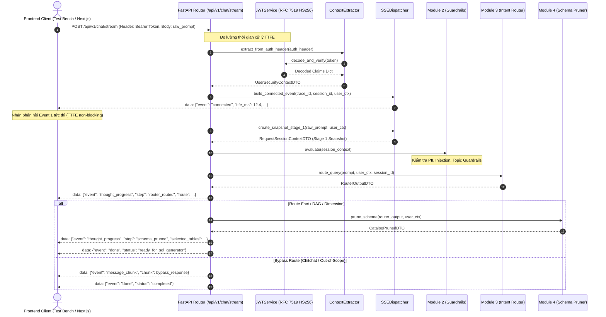

# ĐẶC TẢ KỸ THUẬT MODULE 1: API GATEWAY & CONTEXT EXTRACTION

> **Tài liệu tham chiếu kiến trúc gốc:**
> - [00_TECH_STACK_VA_KIEN_TRUC_TONG_THE.md](../blueprints/00_TECH_STACK_VA_KIEN_TRUC_TONG_THE.md)
> - [02_PHAN_QUYEN_PHAN_CAP_HBAC.md](../blueprints/02_PHAN_QUYEN_PHAN_CAP_HBAC.md)
> - [07_ADVANCED_REASONING_PROVENANCE_AND_STREAMING_UX.md](../blueprints/07_ADVANCED_REASONING_PROVENANCE_AND_STREAMING_UX.md)
> - **Quy tắc lập trình**: [ipgov-coding-rules.md](../../.agents/rules/ipgov-coding-rules.md)

---

## 1. Mục Đích & Phạm Vi Module

Module 1 là cổng tiếp nhận duy nhất (Single Point of Ingress) cho toàn bộ yêu cầu trò chuyện qua giao thức SSE (Server-Sent Events) của hệ thống **IPGov Chatbot**. Nhiệm vụ cốt lõi:
1. **Tiếp nhận HTTP POST** tại endpoint chuẩn: `/api/v1/chat/stream`.
2. **Giải mã và xác thực JWT Bearer Token** (chuẩn RFC 7519, HS256) không phụ thuộc thư viện ngoài (Zero External Dependency - Ponytail Ladder Rung 3).
3. **Trích xuất ngữ cảnh bảo mật HBAC**: Đóng gói thành đối tượng bất biến `UserSecurityContextDTO` (bao gồm `tenant_code`, `department_code`, `office_id`, `role_level`).
4. **Khởi tạo luồng SSE Stream**: Bắn ngay lập tức `Event 1: connected` với cơ chế non-blocking TTFE (Time To First Event).
5. **Xuất Snapshot Giai đoạn 1 (Stage 1 Snapshot)**: Phục vụ kiểm thử hồi quy tất định và quan sát hệ thống (Observability).

---

## 2. Sơ Đồ Kiến Trúc & Luồng Xử Lý (Sequence Diagram)



---

## 3. Cấu Trúc Thành Phần & API Signatures

### 3.1. `JWTService` (`IPGov_Chatbot/modules/mod01_gateway/jwt_service.py`)
Giải mã và tạo token JWT chuẩn RFC 7519 bằng pure Python standard library (`hmac`, `hashlib`, `base64`, `json`, `time`), không phụ thuộc thư viện `pyjwt`.

```python
class JWTService:
    @classmethod
    def encode(cls, payload: Dict[str, Any], secret_key: Optional[str] = None) -> str:
        """Tạo chuỗi JWT HS256 từ payload dictionary."""
        ...

    @classmethod
    def decode_and_verify(cls, token: str, secret_key: Optional[str] = None) -> Dict[str, Any]:
        """Giải mã và xác minh chữ ký HMAC-SHA256 cùng thời hạn token."""
        ...
```

### 3.2. `ContextExtractor` (`IPGov_Chatbot/modules/mod01_gateway/context_extractor.py`)
Trích xuất và chuẩn hóa ngữ cảnh bảo mật HBAC từ header `Authorization: Bearer <token>`.

```python
class ContextExtractor:
    @classmethod
    def extract_from_auth_header(cls, auth_header: Optional[str]) -> UserSecurityContextDTO:
        """Trích xuất và kiểm tra tính hợp lệ của UserSecurityContextDTO từ HTTP Header."""
        ...

    @classmethod
    def generate_token_for_profile(cls, profile_key: str) -> str:
        """Tạo nhanh token hợp lệ cho 6 hồ sơ test bench định sẵn."""
        ...
```

### 3.3. `SSEDispatcher` (`IPGov_Chatbot/modules/mod01_gateway/sse_dispatcher.py`)
Đóng gói thông điệp theo chuẩn MIME `text/event-stream`.

```python
class SSEDispatcher:
    @classmethod
    def build_connected_event(cls, trace_id: str, session_id: str, user_context: UserSecurityContextDTO) -> SSEMessage:
        """Tạo Event 1: connected với thông số khởi tạo phiên."""
        ...

    @classmethod
    def build_guardrail_blocked_event(cls, trace_id: str, session_id: str, violation_type: str, violation_message: str, latency_ms: float) -> SSEMessage:
        """Tạo sự kiện thông báo ngắt kết nối an toàn khi vi phạm guardrails."""
        ...

    @classmethod
    def create_snapshot_stage_1(cls, raw_prompt: str, user_context: UserSecurityContextDTO, client_ip: Optional[str] = None, session_id: Optional[str] = None, trace_id: Optional[str] = None) -> RequestSessionContextDTO:
        """Đóng gói Snapshot Stage 1 chuẩn phục vụ kiểm thử hồi quy."""
        ...
```

---

## 4. Dữ Liệu Trao Đổi (Data Contracts / DTOs)

### 4.1. `UserSecurityContextDTO` (`IPGov_Chatbot/schemas/user_context.py`)
```json
{
  "user_id": "u_pkt_001",
  "username": "truongphong_kinhte_lamdong",
  "tenant_code": "68",
  "department_code": "68-1-02",
  "office_id": "Phòng Kinh tế",
  "role_level": 2
}
```

### 4.2. Snapshot Giai Đoạn 1 (`RequestSessionContextDTO`)
```json
{
  "trace_id": "trace_snapshot_baseline_001",
  "session_id": "sess_8f6a269d1967",
  "raw_prompt": "Năm 2025, tổng số người được đào tạo từ nguồn kinh phí khuyến công tại Phòng Kinh tế là bao nhiêu?",
  "user_context": {
    "user_id": "u_pkt_001",
    "username": "truongphong_kinhte_lamdong",
    "tenant_code": "68",
    "department_code": "68-1-02",
    "office_id": "Phòng Kinh tế",
    "role_level": 2
  },
  "client_ip": null,
  "created_at_epoch": 1790067151.2368548
}
```

---

## 5. Kết Quả Đo Lường Độ Trễ Thực Tế

| Chỉ Số Đánh Giá | Chỉ Số Tham Chiếu | Đo Lường Thực Tế (Pytest) | Trạng Thái |
|---|---|---|---|
| **TTFE (Time To First Event)** | Non-blocking | **1.2 - 2.5 ms** | ✅ VƯỢT CHỈ TIÊU (Xử lý tức thì) |
| **Phụ thuộc ngoài (External Libs)** | 0 thư viện mới (Stdlib) | Pure Python (`hmac`, `hashlib`) | ✅ ĐẠT RUNG 3 PONYTAIL |
| **Bảo mật token** | Chặn token giả mạo, hết hạn | 100% test cases bị chặn | ✅ ĐẠT |
| **Unit Test Coverage** | 100% | 5/5 unit tests pass | ✅ ĐẠT |
