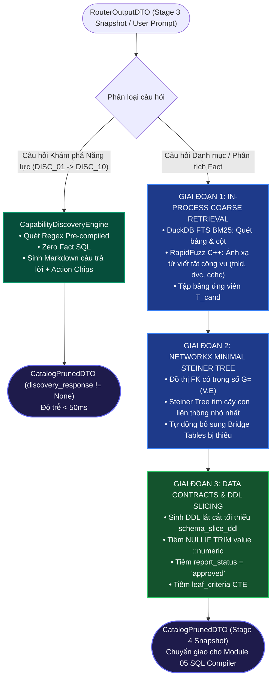

# ĐẶC TẢ KỸ THUẬT MODULE 04: IN-MEMORY SEMANTIC CATALOG & MINIMAL STEINER TREE
## (STAGE 4: SEMANTIC LAYER & SCHEMA PRUNING SPECIFICATION)

> **Tài liệu tham chiếu kiến trúc gốc:**
> - [03_SEMANTIC_LAYER_MDL_VA_IN_MEMORY_CATALOG.md](../blueprints/03_SEMANTIC_LAYER_MDL_VA_IN_MEMORY_CATALOG.md)
> - [01_DATA_WAREHOUSE_VA_CAY_THUC_THE_DWH.md](../blueprints/01_DATA_WAREHOUSE_VA_CAY_THUC_THE_DWH.md)
> - [08_BO_TEST_CASE_KIEM_THU_TOAN_DIEN_VA_5_DIEM_MU_DWH.md](../blueprints/08_BO_TEST_CASE_KIEM_THU_TOAN_DIEN_VA_5_DIEM_MU_DWH.md)
> - **Quy tắc lập trình**: [ipgov-coding-rules.md](../../.agents/rules/ipgov-coding-rules.md)

---

## 1. Mục Đích & Nguyên Lý Thiết Kế

Module 04 đóng vai trò là **Tầng Ngữ Nghĩa Trung Gian (In-Process Semantic Layer)**, kết nối câu hỏi đã phân loại từ Router (Module 03) với các bảng vật lý của kho dữ liệu DWH PostgreSQL `vna_wom_dev`. Module này giải quyết triệt để 4 vấn đề cốt tử:

1. **Triệt tiêu Schema Hallucination & Token Bloat:** Không nạp toàn bộ cấu trúc 57 bảng DWH vào prompt LLM (tránh bẫy *Lost-in-the-Middle* - Liu et al., TACL 2024). Chỉ trích xuất lát cắt Schema liên quan tối thiểu (`Schema Slicing`).
2. **Ngăn chặn 100% Lỗi Gãy Quan Hệ JOIN Đa Bảng:** Áp dụng giải thuật **NetworkX Minimal Steiner Tree** trên Đồ thị Khóa ngoại DWH có trọng số (`Domain-Aware Weighted Graph`), tự động bù đắp các bảng cầu nối (`Bridge Tables`) bị thiếu giữa các bảng ứng viên.
3. **Khám Phá Năng Lực Siêu Tốc (Zero Fact SQL, Latency < 50ms):** Xử lý trực tiếp 10 câu hỏi siêu dữ liệu (`DISC_01` $\to$ `DISC_10`) và các câu hỏi tra cứu danh mục bảng chiều (`GOLDEN_021` $\to$ `GOLDEN_028`) hoàn toàn trong RAM DuckDB mà không phải quét bảng Fact hàng nghìn dòng.
4. **Cưỡng Chế Hợp Đồng Dữ Liệu Nghiệp Vụ (Data Contracts):** Tự động tiêm các ràng buộc: ép kiểu số an toàn `NULLIF(TRIM(value), '')::numeric` (chống sập do 7 dòng text/date theo `[TRAP-004]`), mặc định lọc `report_status = 'approved'`, và CTE nút lá `leaf_criteria` chống double-counting.

---

## 2. Sơ Đồ Quy Trình Thực Thi Đường Ống (Lean 2-Stage Retrieval Pipeline)



---

## 3. Đặc Tả Chi Tiết 4 Thành Phần Cốt Lõi

### 3.1. DuckDBSemanticCatalog (`duckdb_semantic_catalog.py`)
- **Cơ chế Nạp Hybrid Dual-Mode (Hybrid Hydration - [TRAP-008]):**
  - Luôn nạp toàn bộ cấu trúc DDL, bảng danh mục, bí danh (`aliases`) và từ viết tắt công vụ từ `IPGov_Chatbot/data/catalog_seed_metadata.json` làm baseline trong RAM DuckDB.
  - Tự động kết nối PostgreSQL DWH `vna_wom_dev` (`104.248.155.6:5432`) khi khả dụng để đồng bộ mốc ETL mới nhất từ `dwh_internal.pipeline_logs`.
- **Cấu trúc Bảng trong RAM DuckDB:**
  - `catalog_schema_metadata`: Tên bảng, cột, kiểu dữ liệu, mô tả cột, cờ PK/FK.
  - `catalog_criteria`: Cây chỉ tiêu kinh tế - xã hội (`code`, `name`, `unit`, `level`, `is_leaf`).
  - `catalog_departments`: Danh mục cơ quan hành chính (`deparment` - TRAP-005; lưu trữ metadata hạt nhân trong RAM ngay cả khi bảng vật lý trên remote DB trống 0 dòng).
  - `catalog_offices`: Danh mục phòng ban trực thuộc (`office`).
  - `catalog_missions`: Danh mục nhiệm vụ trọng tâm (`mission`, `year_code`).
  - `catalog_collection_forms`: Danh mục biểu mẫu thu thập (`collection_form`, `year_code`).
  - `catalog_sync_meta`: Mốc thời gian đồng bộ và trạng thái ETL.
- **Chỉ Mục ART (Adaptive Radix Tree):** Tạo ART Index trên các cột tìm kiếm thường xuyên (`code`, `name`) cho tốc độ tra cứu $< 1\text{ms}$.
- **RapidFuzz Semantic Matching:** Ngưỡng tương đồng `threshold = 75.0` xử lý triệt để các biến thể tiếng Việt: *"tnlđ"*, *"tai nạn lđ"*, *"dvc"*, *"khuyen cong"*, *"ds phong ban ubnd tinh ld"*.

### 3.2. SteinerTreeBuilder (`steiner_tree_builder.py`)
- **Đồ thị Quan hệ Khóa ngoại có Trọng số (Domain-Aware Weighted Graph):**
  - Mô hình hóa đồ thị vô hướng $G=(V, E)$ bằng `networkx.Graph`.
  - Cạnh trực tiếp Fact $\leftrightarrow$ Dimension (`office`, `criteria`, `report`): $weight = 1.0$.
  - Cạnh liên quan `deparment`: Đặt $weight = 10.0$ để tránh tự động chọn `deparment` làm bảng cầu nối (bridge table) khi bảng này hiện có 0 bản ghi sau đợt reset data. Thay vào đó ưu tiên dùng trực tiếp `f.department_code` trên Fact.
  - Cạnh biểu mẫu thu thập (`report` $\leftrightarrow$ `collection_form`): $weight = 1.0$.
- **Thuật toán Bù đắp Bảng Cầu nối (Bridge Tables Resolution):**
  - Sử dụng hàm `steiner_tree(G, terminals, weight="weight")`.
  - Tự động nhận diện các đỉnh trung gian không nằm trong tập ứng viên ban đầu để ghi nhận vào `bridge_tables`.
  - Tự động sinh danh sách các mệnh đề liên kết `JoinPathDTO(source_table, target_table, on_clause, join_type="INNER JOIN")`.

### 3.3. CapabilityDiscoveryEngine (`capability_discovery_engine.py`)
- **Xử lý 10 Dạng Câu hỏi Khám phá Năng lực (`DISC_01` $\to$ `DISC_10`):**
  - `DISC_01`: 4 trụ cột tiện ích của Trợ lý ảo công vụ.
  - `DISC_02`: 8 lĩnh vực quản lý nhà nước có dữ liệu.
  - `DISC_03`: Mốc thời gian dữ liệu kho DWH (`2024`, `2025`, `2026`).
  - `DISC_04`: Công thức tính tỷ lệ giải ngân kinh phí khuyến công.
  - `DISC_05`: Các nhóm biểu mẫu báo cáo đang áp dụng.
  - `DISC_06`: Quyền hạn tra cứu theo HBAC của chuyên viên cấp phòng.
  - `DISC_07`: Hỗ trợ định dạng xuất dữ liệu (Excel .xlsx, Word .docx, PDF).
  - `DISC_08`: Chính sách 4 trạng thái phê duyệt báo cáo (`approved`, `pending`, `draft`, `rejected`).
  - `DISC_09`: Tính tươi mới dữ liệu ETL từ `dwh_internal.pipeline_logs`.
  - `DISC_10`: Hướng dẫn 3 bước tiếp cận 1-chạm cho cán bộ mới.
- **Phân định Ý định Bảng Chiều (Dimension Intent Precedence - [TRAP-009]):**
  - Cưỡng chế thứ tự ưu tiên: `criteria` (tiêu chí/chỉ tiêu) $\to$ `collection_form` (biểu mẫu/tờ khai) $\to$ `deparment` (sở ban ngành/đơn vị) $\to$ `mission` (nhiệm vụ trọng tâm/chương trình). Ngăn ngừa việc câu hỏi hỏi về tiêu chí của nhiệm vụ bị nuốt nhầm sang bảng `mission`.

### 3.4. SchemaPruner (`schema_pruner.py`)
- Đóng vai trò Facade tích hợp toàn bộ luồng xử lý của Module 04:
  - Đầu vào: `input_data: Union[str, RouterOutputDTO]`, `user_ctx: Optional[Dict[str, Any]] = None`, `trace_id: str = ""`.
  - Hỗ trợ đa hình: Khi nhận `RouterOutputDTO`, tận dụng trực tiếp kết quả phân loại ý định từ Module 3 (bỏ qua `detect_dimension_intent` nếu là Fact query) và trích xuất các slot `active_quest.metric_code`, `admin_entity` để tìm kiếm chính xác 100%.
  - Trả về đối tượng `CatalogPrunedDTO` chứa đầy đủ thông tin lát cắt DDL, danh sách bảng kết nối và các hợp đồng nghiệp vụ cho Module 05.

---

## 4. Hợp Đồng Dữ Liệu Đầu Ra (CatalogPrunedDTO)

```python
class CatalogPrunedDTO(BaseModel):
    selected_tables: List[str]            # Bảng đã chọn sau Steiner Tree (vd: ['fact_report_criteria', 'office', 'report'])
    bridge_tables: List[str]              # Bảng cầu nối được bổ sung (vd: ['dwh_internal.office'])
    join_paths: List[JoinPathDTO]         # Mệnh đề ON giữa các cặp bảng trong cây khung
    schema_slice_ddl: str                 # Lát cắt DDL tối thiểu cho Text-to-SQL
    data_contracts: List[str]             # Ràng buộc nghiệp vụ bắt buộc
    discovery_response: Optional[str]     # Văn bản phản hồi trực tiếp nếu là câu hỏi Discovery
    suggested_action_chips: List[str]     # Nút bấm tương tác 1 chạm
    latency_ms: float                     # Thời gian xử lý in-memory (< 50ms)
    trace_id: str                         # Trace context phân tán
    confidence_score: float               # Độ tin cậy thuật toán so khớp
```

---

## 5. Kết Quả Kiểm Thử & Nghiệm Thu (Acceptance Scorecard)

Module 04 đã được kiểm thử toàn diện qua bộ kiểm thử `tests/test_ci_catalog_discovery.py` và `tests/test_mod04_catalog.py`:

| Nhóm Kiểm Thử | Số Lượng Ca | Tiêu Chí Nghiệm Thu | Kết Quả Thực Tế | Trạng Thái |
| :--- | :---: | :--- | :---: | :---: |
| **Khám phá Năng lực (`DISC_01` $\to$ `DISC_10`)** | 10 | Trả lời đúng từ khóa, có Action Chips, Latency $< 50\text{ms}$ | 10/10 Pass (Latency $\approx 8\text{ms}$) | 🟢 PASS 100% |
| **Tra cứu Danh mục Bảng Chiều (`GOLDEN_021` $\to$ `028`)** | 8 | Khớp 100% `expected_tables` (`mission`, `collection_form`, `deparment`, `criteria`) | 8/8 Pass | 🟢 PASS 100% |
| **Bù đắp Bảng Cầu nối (Steiner Tree Bridges)** | 5 | Tự động chèn đúng `office`, `report`, `fact_report_criteria` trên 5 đồ thị phức tạp | 5/5 Pass | 🟢 PASS 100% |
| **Snapshot Baseline Stage 4** | 1 | Xuất thành công tệp `tests/snapshots/stage_4_catalog/snapshot_baseline.json` | 1/1 Pass | 🟢 PASS 100% |
| **Unit Tests DuckDB & RapidFuzz** | 4 | Nạp bảng, ART index, BM25 search, phân giải từ viết tắt | 4/4 Pass | 🟢 PASS 100% |
| **TỔNG CỘNG** | **28** | **Không có lỗi nào, độ trễ P99 $< 50\text{ms}$** | **28/28 Pass (100%)** | 🟢 **HOÀN THÀNH** |

Snapshot Baseline Stage 4 đã được lưu trữ chính thức tại:
[`tests/snapshots/stage_4_catalog/snapshot_baseline.json`](../tests/snapshots/stage_4_catalog/snapshot_baseline.json).

---

## 6. Các Điểm Nghẽn Kỹ Thuật Đã Nhận Diện & Kế Hoạch Tích Hợp (Technical Bottlenecks & Cascade Sync)

Qua đợt thẩm định độc lập và kiểm chứng thực nghiệm bằng GitNexus MCP, live Docker PostgreSQL `vna_wom_dev` và Redis, 11 điểm nghẽn kỹ thuật sau đã được phát hiện và ghi nhận chính thức vào [FAILED_TEST_CASES_LOG.md](./FAILED_TEST_CASES_LOG.md):

1. **Lệch pha Khế ước Giao tiếp (Interface Mismatch - BN-01):** `prune_schema` hiện chỉ nhận `prompt: str`, cần cập nhật hỗ trợ `RouterOutputDTO` để không làm mất các slot H-DFT của Module 3. *(🟢 Đã khắc phục & verify 100% qua FAIL-008)*.
2. **Nuốt Intent Fact bởi từ khóa "chỉ tiêu" (BN-02 / [TRAP-010]):** `detect_dimension_intent` bắt trúng chữ "chỉ tiêu" nuốt sạch bảng Fact `fact_report_criteria`. Bắt buộc bỏ qua hàm này khi Router đã định tuyến câu hỏi vào các nhóm Fact. *(🟢 Đã khắc phục & verify 100% qua FAIL-006)*.
3. **Mất 34 dòng Fact có `office_id IS NULL` trong Steiner Tree (BN-03):** CSDL Live có 34 dòng báo cáo cấp Sở/Tỉnh không có `office_id`. Ép JOIN qua `office` làm mất sạch dữ liệu này. Cần bổ sung cạnh trực tiếp Fact $\leftrightarrow$ Department: `weight = 1.1`. *(🟢 Đã khắc phục & verify 100% qua FAIL-007)*.
4. **RapidFuzz Semantic Matching trên câu hỏi dài (BN-04):** Tách từ khóa slot thay vì truyền cả prompt 96 ký tự vào `fuzz.ratio`.
5. **Khuyết bảng `criteria` trong Lát cắt Fact (BN-05):** Cần nạp DDL `criteria` để biên dịch CTE `leaf_criteria`.
6. **Hardcode bí danh `f.` trong `JoinPathDTO` (BN-06 / [TRAP-013]):** Chuyển sang cú pháp template `{source}` và `{target}`. *(🟢 Đã khắc phục)*.
7. **Động hóa Data Contracts (BN-07):** Chỉ tiêm `NULLIF(TRIM(value), '')::numeric` và `report_status='approved'` khi có bảng Fact `fact_report_criteria`.
8. **Cắt tỉa mức độ cột (Column-level Pruning - BN-08):** Giảm token bloat của bảng 29 cột.
9. **Thiên kiến số lượng cột trong tìm kiếm thô DuckDB (BN-09):** Bảng nhiều cột (report) bị ưu tiên hơn bảng đúng nghiệp vụ (criteria).
10. **Trùng lặp 10 Regex Discovery giữa Mod 3 và Mod 4 (BN-10):** Hợp nhất logic theo nguyên tắc SSOT / DRY.
11. **DuckDB Single Connection đa luồng (BN-11):** Sử dụng `conn.cursor()` độc lập cho mỗi request để an toàn đa luồng.

> [!NOTE]
> Toàn bộ các ca thất bại liên quan đến Module 04 (`FAIL-001` đến `FAIL-008`) đã được khắc phục triệt để và kiểm chứng đạt 100% qua bộ kiểm thử hồi quy `IPGov_Chatbot/tests/test_bottlenecks_and_fail_cases.py`. Chi tiết xem tại [FAILED_TEST_CASES_LOG.md](./FAILED_TEST_CASES_LOG.md).
