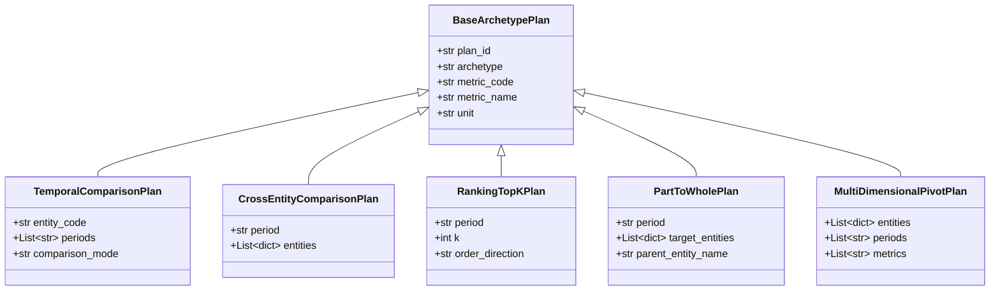
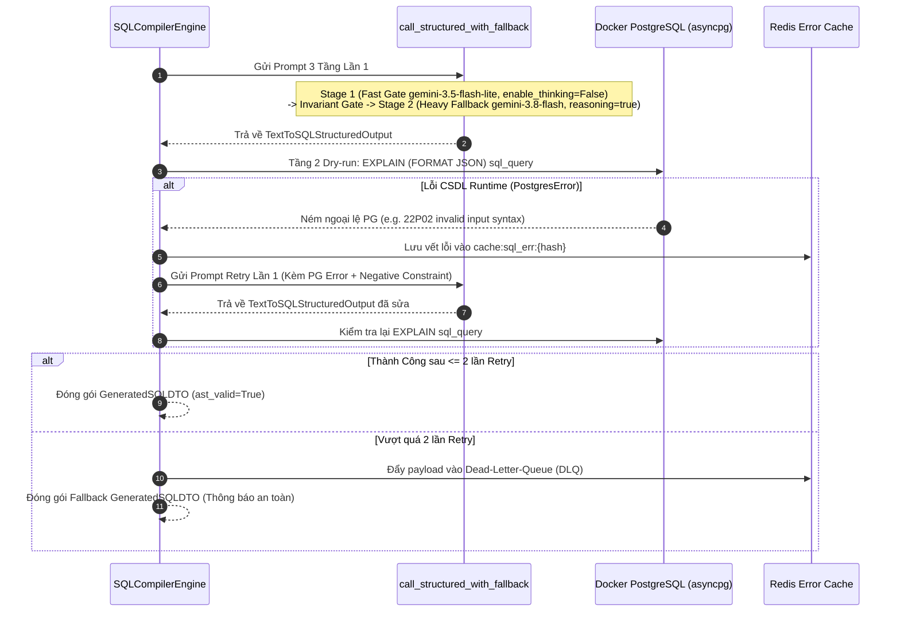
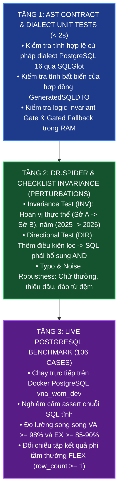

# ĐẶC TẢ KỸ THUẬT MODULE 05: TEXT-TO-SQL COMPILER & SCATTER-GATHER ENGINE
## (STAGE 5: HYBRID SEMANTIC AST COMPILER & GATED 2-STAGE SQL GENERATOR)

> **Dự án:** Hệ thống Trợ lý ảo Tra cứu Dữ liệu Kho DWH Chính phủ điện tử (`IPGov_Chatbot`)  
> **Cơ sở dữ liệu thực nghiệm:** PostgreSQL DWH `vna_wom_dev` (Docker `localhost:5432`)  
> **Cơ chế gọi LLM chuẩn hóa:** Gated 2-Stage Confidence Fallback qua Ponytail Helper `call_structured_with_fallback[T]()` (SSOT tại `IPGov_Chatbot/core/llm_gateway.py`), tích hợp Chain-of-Thought (`thought_scratchpad`), Fast Gate (`google/gemini-3.5-flash-lite`, `enable_thinking=False`), Invariant Gate (AST & Schema Grounding), và Heavy Fallback (`google/gemini-3.8-flash`, `reasoning=true`, effort='medium').  
> **Chuẩn mực kỹ thuật:** Arc42 (Building Block & Runtime View), IEEE Std 1016-2009, BIRD / Spider 2.0 Benchmarks, Ponytail Lean Software Engineering.  
> **Nguyên tắc cốt lõi:** Bắt buộc tuân thủ [.agents/rules/overview-rule-Chatbot.md](../../.agents/rules/overview-rule-Chatbot.md), [.agents/rules/context_rule.md](../../.agents/rules/context_rule.md), [.agents/rules/test_case_rule.md](../../.agents/rules/test_case_rule.md), và [.agents/rules/ipgov-coding-rules.md](../../.agents/rules/ipgov-coding-rules.md).

---

## 📋 KHAI BÁO DÒNG NGỮ CẢNH (CONTEXT LINEAGE DECLARATION)

Bảng đối chiếu dòng ngữ cảnh kỹ thuật theo quy định tại `context_rule.md`:

| Tài Liệu Tham Chiếu (SSOT Source) | Section / Mục Đối Chiếu | Giá Trị Kế Thừa / Ràng Buộc Kỹ Thuật Đối Với Module 05 |
| :--- | :--- | :--- |
| **00_TECH_STACK_VA_KIEN_TRUC_TONG_THE.md** | Mục 2 & Mục 3 (Pipeline Architecture) | Vị trí Stage 5 trong pipeline; dialect PostgreSQL 16; tích hợp SSOT LLMGateway. |
| **01_DATA_WAREHOUSE_VA_CAY_THUC_THE_DWH.md** | Mục 2 & Mục 4 (Schema Physical & Traps) | Ràng buộc 34 dòng fact NULL `office_id` ([TRAP-007]); ép kiểu an toàn ([TRAP-004]). |
| **03_SEMANTIC_LAYER_MDL_VA_IN_MEMORY_CATALOG.md** | Mục 5 (Hybrid Semantic AST Compiler) | Track A biên dịch tất định từ `MetricSpecDTO`; CTE `leaf_criteria`; push-down Window Functions. |
| **05_MULTI_AGENT_WORKFLOW_DIN_MAC_SQL.md** | Mục 3 (Gated Fallback) & Mục 5 (Archetypes) | Kiến trúc Gated 2-Stage Confidence Fallback qua `call_structured_with_fallback`; 5 Kimball Archetypes; Single Unified SQL ưu tiên tuyệt đối. |
| **08_BO_TEST_CASE_KIEM_THU_TOAN_DIEN...md** | Phân hệ 1, 2, 3 & Ma trận 106 cases có SQL | Tiêu chuẩn FLEX non-trivial ground truth; Valid SQL Rate $\ge 98\%$; Execution Accuracy $\ge 85-90\%$. |
| **MODULE_04_CATALOG_SPEC.md** | Mục 4 (CatalogPrunedDTO) | Hợp đồng đầu vào trực tiếp từ Module 04 (`schema_slice_ddl`, `join_paths`, `data_contracts`). |
| **IPGov_Chatbot/core/llm_gateway.py** | Ponytail Structured Fallback Engine | Hàm `call_structured_with_fallback` & `call_structured_with_fallback_async` kèm Invariant Gate. |

---

## 1. MỤC ĐÍCH & CÁC NGUYÊN LÝ THIẾT KẾ CỐT LÕI

Module 05 đóng vai trò là **Động cơ Biên dịch và Sản xuất SQL Trung tâm (Central Text-to-SQL Compiler & Dispatcher Engine)**. Module nhận ngữ cảnh nghiệp vụ đã được làm giàu, phân loại và cắt tỉa từ Module 03 (Router & H-DFT) và Module 04 (In-Memory Semantic Catalog & Steiner Tree), sau đó chuyển hóa thành các câu truy vấn PostgreSQL 16 chuẩn xác, an toàn, tối ưu hiệu năng trước khi chuyển sang Module 06 (AST Security Guardrails) và Module 07 (DWH Execution Engine).

Module 05 được thiết kế dựa trên **4 Nguyên lý Kiến trúc Cốt lõi**:

1. **Database-First Push-Down Aggregations (Ưu tiên Tuyệt đối Single Unified SQL):**
   - Thay vì phân rã các câu hỏi phân tích phức tạp (YoY, MoM, Xếp hạng Top-K, Tỷ trọng Part-to-Whole, Đối chuẩn đa đơn vị) thành hàng chục câu query rời rạc gây bão hòa Connection Pool và tăng round-trip mạng, hệ thống ưu tiên đẩy toàn bộ các phép tính toán xuống các hàm cửa sổ **PostgreSQL 16 Window Functions** (`LAG()`, `LEAD()`, `DENSE_RANK()`, `SUM() OVER ()`) và CTEs hợp nhất trong **ĐÚNG MỘT CÂU TRUY VẤN SQL DUY NHẤT**.
   - Cơ chế **Scatter-Gather Engine** chỉ được kích hoạt trong phạm vi hẹp: Khi câu hỏi yêu cầu phân tích đa nguồn dữ liệu độc lập hoặc các phép truy vấn rời rạc không thể gom chung vào một execution plan.

2. **Cơ Chế Phân Tầng Thích Ứng Kết Hợp Gated 2-Stage Confidence Fallback:**
   - **Track A (85% Luồng Thống Kê Chuẩn Tắc):** Được xử lý hoàn toàn bởi **Deterministic Semantic AST Compiler** chạy trong RAM DuckDB từ `MetricSpecDTO`. Đặc tính: $0\text{ token LLM}$, thời gian xử lý $< 1\text{ms}$, tỷ lệ lỗi cú pháp bằng $0.0\%$, tự động tiêm đầy đủ các điều kiện nghiệp vụ bất biến.
   - **Track B (15% Luồng Phi Quy Chuẩn Phức Tạp):** Kích hoạt **LLM Text-to-SQL Generator** kế thừa chuẩn hóa qua Ponytail Helper `call_structured_with_fallback[TextToSQLStructuredOutput]()`:
     * **Cổng Tinh Gọn (Fast Gate - Stage 1):** `google/gemini-3.5-flash-lite` với Chain-of-Thought qua `thought_scratchpad` để giải quyết các bước suy luận về JOINs, bộ lọc và chỉ tiêu với chi phí thấp ($0.10/M tokens) và độ trễ thấp (~500ms). Cấu hình suy luận: `temperature=0.0`, `max_tokens=800`, tắt Native Reasoning (`extra_body={"enable_thinking": False}`) nhằm loại trừ triệt để bẫy lặp thoái hóa vô tận (OWASP LLM04) và duy trì First-Token Latency tối ưu.
     * **Hàng Rào Kiểm Định Bất Biến (Invariant Gate):** Kiểm tra đồng thời 3 điều kiện: (1) Cú pháp SQLGlot AST PostgreSQL 16 hợp lệ; (2) Schema Grounding: bảng sử dụng bắt buộc nằm trong `CatalogPrunedDTO`; (3) Ngưỡng tin cậy `confidence_score >= 0.70`.
     * **Cổng Dự Phòng Chuyên Sâu (Heavy Fallback - Stage 2):** Tự động chuyển giao sang `google/gemini-3.8-flash` khi vi phạm Invariant Gate hoặc lỗi upstream API. Cấu hình suy luận: **Bật Native Reasoning (`reasoning = true`)** với `extra_body={"reasoning": {"effort": "medium"}}` (hoặc `thinking_config=types.ThinkingConfig(thinking_budget=1024)` trên Google GenAI SDK), `temperature=0.0`, `max_tokens=2048`, cho phép mô hình phát sinh reasoning tokens chuyên sâu để duyệt các mối liên kết đa bảng phức tạp, tự sửa lỗi AST và tái cấu trúc CTEs/Window Functions chính xác 100%.
   - **Cơ chế Fallthrough Tự động:** Khi Track A phát hiện câu hỏi chứa các điều kiện lọc tùy biến, phép so sánh hoặc gom nhóm ngoài danh mục template chuẩn, hệ thống tự động chuyển tiếp (fallthrough) sang Track B một cách liền mạch mà không làm gãy luồng xử lý.

3. **Kiến Trúc Tối Ưu Hóa Prompt Caching 3 Tầng (Prompt Caching Architecture $\ge 80\%$ Hit Rate):**
   - Tuân thủ nguyên lý Longest Invariant Prefix Matching của Google Gemini / OpenRouter:
     * **Tầng 1 (Static Invariant Prefix $\ge 1024$ tokens):** Ghim cố định quy chuẩn dialect PostgreSQL 16, các mẫu hình 5 Kimball Archetypes, quy tắc Data Contracts, và các mẫu Few-shot Canonical Prototypes độc lập. Tầng này không đổi giữa các request, đạt Cache-Hit Rate $> 80\%$, giảm $75 - 90\%$ chi phí token đầu vào và giảm First-Token Latency (TTFT) từ $\sim 2.5\text{s}$ xuống $< 400\text{ms}$.
     * **Tầng 2 (Column-Level Pruned Schema Slice $< 600$ tokens):** Chỉ nhúng DDL các cột thực sự liên quan do Steiner Tree trích xuất, triệt tiêu token bloat của các bảng nhiều cột (như `report` 29 cột).
     * **Tầng 3 (Dynamic Suffix ở đuôi):** Đặt câu hỏi cụ thể, slots trích xuất và ngữ cảnh phân quyền HBAC ở vị trí cuối cùng của prompt.

4. **Cơ Chế Phục Hồi 2 Tầng & Redis Error Cache (2-Tier Self-Correction & Negative Constraint Injection):**
   - Tích hợp kiểm soát lỗi qua **In-Process SQLGlot AST Pre-check** trước khi gửi xuống CSDL, kết hợp kiểm tra runtime PostgreSQL qua `EXPLAIN`.
   - Giới hạn tối đa **2 vòng lặp tự sửa (Max 2 Self-Correction Retries)** với thông điệp lỗi có cấu trúc.
   - Tích hợp **Redis Error Cache (`cache:sql_err:{prompt_hash}`)** để ghi nhớ các mẫu câu truy vấn từng thất bại, tự động tiêm các **Ràng buộc Phủ định (Negative Constraints)** nhằm ngăn chặn LLM lặp lại cùng một sai lầm trong các lượt truy vấn tương tự. Trường hợp vượt quá số lần retry, yêu cầu được định tuyến an toàn vào Dead-Letter-Queue (DLQ) để phục vụ quy trình Active Learning.

---

## 2. SƠ ĐỒ KIẾN TRÚC & LUỒNG XỬ LÝ (SYSTEM ARCHITECTURE & EXECUTION FLOW)

```mermaid
flowchart TD
    INPUT(["Đầu Vào: CatalogPrunedDTO + RouterOutputDTO + UserSecurityContextDTO"]) --> GATING{"Phân Tầng Thích Ứng<br/>(Adaptive Cascading)"}
    
    %% Track A: Deterministic AST Compiler
    GATING -- "Khớp 100% MetricSpec Template" --> TRACK_A["TRACK A: DETERMINISTIC SEMANTIC AST COMPILER<br/>• DuckDB In-Memory AST Builder<br/>• Tiêm CTE leaf_criteria<br/>• Tiêm NULLIF TRIM value::numeric<br/>• Tiêm report_status = 'approved'<br/>• Tiêm HBAC Tenant & Department<br/>• Thời gian xử lý < 1ms, 0 Token LLM"]
    
    TRACK_A --> VALIDATE_A{"Có điều kiện tùy biến<br/>ngoài Template?"}
    VALIDATE_A -- "Không (Đạt chuẩn 100%)" --> DTO_OUT(["GeneratedSQLDTO (Track A)<br/>Chuyển sang Module 06 AST Enforcer"])
    VALIDATE_A -- "Có điều kiện tùy biến" --> FALLTHROUGH["Kích hoạt Fallthrough sang Track B"]
    
    %% Track B: Complex LLM Generator với Gated 2-Stage Fallback
    GATING -- "Phi chuẩn / So sánh Đa kỳ" --> FALLTHROUGH
    FALLTHROUGH --> CHECK_ERR_CACHE{"Tra cứu Redis Error Cache<br/>cache:sql_err:{prompt_hash}"}
    
    CHECK_ERR_CACHE -- "Có vết lỗi trước đó" --> INJECT_NEG["Tiêm Negative Constraints vào Prompt"]
    CHECK_ERR_CACHE -- "Không có vết lỗi" --> PROMPT_BUILD["Xây Dựng Prompt 3 Tầng Chuẩn Cache"]
    INJECT_NEG --> PROMPT_BUILD
    
    PROMPT_BUILD --> GATED_FALLBACK["Ponytail call_structured_with_fallback[TextToSQLStructuredOutput]"]
    
    subgraph GATED_ENGINE ["Động Cơ Gated 2-Stage Confidence Fallback"]
        direction TB
        STAGE1["Stage 1 (Fast Gate): google/gemini-3.5-flash-lite<br/>• CoT qua thought_scratchpad<br/>• enable_thinking = False<br/>• Prompt Caching Hit Rate >= 80%<br/>• Độ trễ ~500ms, chi phí siêu rẻ"]
        INVARIANT_GATE{"Hàng Rào Invariant Gate:<br/>1. SQLGlot AST parse OK?<br/>2. Schema Grounding OK?<br/>3. confidence >= 0.70?"}
        STAGE2["Stage 2 (Heavy Fallback): google/gemini-3.8-flash<br/>• Kích hoạt khi Invariant Gate fail<br/>• reasoning = true (effort='medium')<br/>• Năng lực lập luận SQL phức tạp cao"]
        
        STAGE1 --> INVARIANT_GATE
        INVARIANT_GATE -- "Fail / confidence < 0.70" --> STAGE2
    end
    
    GATED_FALLBACK --> GATED_ENGINE
    INVARIANT_GATE -- "Pass 100%" --> DRY_RUN["Tầng 2: PostgreSQL Live DB Dry-Run<br/>(EXPLAIN query trên asyncpg localhost:5432)"]
    STAGE2 --> DRY_RUN
    
    DRY_RUN -- "Dry-Run Thành Công" --> DTO_OUT_B(["GeneratedSQLDTO (Track B)<br/>Chuyển sang Module 06 AST Enforcer"])
    DRY_RUN -- "DB Ném Lỗi Runtime" --> RETRY_CHECK{"Retry Count < 2?"}
    
    RETRY_CHECK -- "Còn lượt retry (<= 2)" --> BUILD_RETRY["Đóng gói Error Trace có cấu trúc<br/>+ Tiêm vào Prompt Retry"]
    BUILD_RETRY --> GATED_FALLBACK
    
    RETRY_CHECK -- "Vượt quá 2 lượt" --> DLQ_ESCALATE["Ghi nhận sự cố vào DLQ & Redis Error Cache<br/>Kích hoạt Graceful Degradation Fallback"]
    DLQ_ESCALATE --> DTO_ERR(["GeneratedSQLDTO (Fallback / Error Notice)"])

    classDef inputNode fill:#1f2937,stroke:#9ca3af,stroke-width:2px,color:#fff;
    classDef gateNode fill:#1e3a8a,stroke:#3b82f6,stroke-width:2px,color:#fff;
    classDef trackANode fill:#14532d,stroke:#22c55e,stroke-width:2px,color:#fff;
    classDef trackBNode fill:#7c2d12,stroke:#f97316,stroke-width:2px,color:#fff;
    classDef errNode fill:#991b1b,stroke:#ef4444,stroke-width:2px,color:#fff;
    classDef outNode fill:#312e81,stroke:#6366f1,stroke-width:2px,color:#fff;

    class INPUT inputNode;
    class GATING,VALIDATE_A,CHECK_ERR_CACHE,INVARIANT_GATE,DRY_RUN,RETRY_CHECK gateNode;
    class TRACK_A trackANode;
    class PROMPT_BUILD,GATED_FALLBACK,STAGE1,STAGE2,BUILD_RETRY,INJECT_NEG,FALLTHROUGH trackBNode;
    class DLQ_ESCALATE,DTO_ERR errNode;
    class DTO_OUT,DTO_OUT_B outNode;
```



---

## 3. ĐẶC TẢ HỢP ĐỒNG ĐẦU VÀO & ĐẦU RA (DATA CONTRACTS)

### 3.1. Hợp Đồng Đầu Vào (Input Contracts)

Module 05 tiếp nhận đồng thời 3 đối tượng DTO từ các module tiền nhiệm:

1. **`CatalogPrunedDTO` (Từ Module 04):**
   Chứa lát cắt DDL tối thiểu, danh sách bảng kết nối qua Steiner Tree, các mệnh đề JOIN và ràng buộc nghiệp vụ bắt buộc:
   ```python
   class JoinPathDTO(BaseModel):
       source_table: str
       target_table: str
       on_clause: str
       join_type: str = "INNER JOIN"

   class CatalogPrunedDTO(BaseModel):
       selected_tables: List[str]
       bridge_tables: List[str]
       join_paths: List[JoinPathDTO]
       schema_slice_ddl: str
       data_contracts: List[str]
       discovery_response: Optional[str] = None
       suggested_action_chips: List[str] = Field(default_factory=list)
       latency_ms: float
       trace_id: str
       confidence_score: float
   ```

2. **`RouterOutputDTO` (Từ Module 03):**
   Chứa thông tin định tuyến ý định, nhận diện Archetype, các khe khuyết slot và phạm vi thời gian/địa bàn:
   ```python
   class RouterOutputDTO(BaseModel):
       intent: str                         # TEMPLATE_FAST_TRACK, DYNAMIC_PARALLEL_DAG, SINGLE_SQL...
       dag_archetype: Optional[str] = None # TEMPORAL_COMPARISON, CROSS_GEO, MULTI_METRIC, COMPONENT, PIPELINE...
       subquery_count: int = 1
       complexity: str = "LOW_TEMPLATE"
       temporal_scope: Dict[str, Any]      # start_year, end_year, quarter, raw_expression...
       spatial_scope: Dict[str, Any]       # department_code, office_id, location_name...
       dwh_entities: List[str]
       metric_code: Optional[str] = None
       filled_slots: Dict[str, Any] = Field(default_factory=dict)
       confidence_score: float
       trace_id: str
   ```

3. **`UserSecurityContextDTO` (Từ Module 01):**
   Ngữ cảnh phân quyền HBAC để biên dịch điều kiện bảo mật:
   ```python
   class UserSecurityContextDTO(BaseModel):
       user_id: str
       username: str
       tenant_code: str                     # Ví dụ: '68' (Lâm Đồng), '79' (TP.HCM)
       department_code: Optional[str] = None
       office_id: Optional[str] = None
       role_level: int                      # 0: Cấp Tỉnh, 1: Cấp Sở, 2: Cấp Phòng ban
   ```

---

### 3.2. Hợp Đồng Dữ Liệu Đầu Ra Của Node 4b Generator (`TextToSQLStructuredOutput`)

Hợp đồng dữ liệu Pydantic v2 được ép kiểu nghiêm ngặt (`extra="forbid"`) khi gọi qua `call_structured_with_fallback`:

```python
class TextToSQLStructuredOutput(BaseModel):
    """Hợp đồng đầu ra của LLM Text-to-SQL Generator (Node 4b) với Chain-of-Thought."""
    model_config = ConfigDict(extra="forbid")

    thought_scratchpad: str = Field(
        description="Suy luận từng bước về JOINs, điều kiện lọc, chỉ tiêu và phân quyền"
    )
    sql_query: str = Field(
        description="Câu lệnh SELECT PostgreSQL 16 chuẩn cú pháp"
    )
    tables_used: List[str] = Field(
        description="Danh sách các bảng/view vật lý được sử dụng"
    )
    confidence_score: float = Field(
        ge=0.0, le=1.0, 
        description="Độ tin cậy tự đánh giá của mô hình (ngưỡng >= 0.70)"
    )
    sql_ast_explanation: Optional[str] = Field(
        default=None, 
        description="Giải thích cấu trúc cây AST và các vị từ lọc"
    )
```

---

### 3.3. Hợp Đồng Đầu Ra Toàn Diện Module 05 (`GeneratedSQLDTO`)

Sau khi biên dịch và vượt qua các tầng kiểm tra AST/Dry-run, Module 05 đóng gói kết quả thành `GeneratedSQLDTO` (Snapshot Stage 5):

```python
class SQLExecutionMode(str, Enum):
    SINGLE_UNIFIED = "SINGLE_UNIFIED"       # Đẩy gộp 1 query có Window Functions / CTEs (Ưu tiên)
    SCATTER_GATHER = "SCATTER_GATHER"       # Phân rã N queries song song (Trường hợp đặc thù)
    BYPASS_ZERO_SQL = "BYPASS_ZERO_SQL"     # Không sinh SQL (Discovery / Chitchat / Out-of-Scope)

class SubqueryTaskItem(BaseModel):
    task_id: str
    sql: str
    target_metric: Optional[str] = None
    target_period: Optional[str] = None
    target_entity: Optional[str] = None
    parameters: Dict[str, Any] = Field(default_factory=dict)

class GeneratedSQLDTO(BaseModel):
    model_config = ConfigDict(extra="forbid")

    raw_sql: str                                      # Câu SQL hoàn chỉnh sẵn sàng cho AST Enforcer
    execution_mode: SQLExecutionMode = SQLExecutionMode.SINGLE_UNIFIED
    dag_archetype: Optional[str] = None              # Tên Archetype Kimball được áp dụng
    subquery_tasks: List[SubqueryTaskItem] = Field(default_factory=list) # Danh sách task nếu Scatter-Gather
    tables_referenced: List[str]                     # Danh sách các bảng vật lý được truy vấn
    parameters: Dict[str, Any] = Field(default_factory=dict) # Các tham số ràng buộc an toàn (nếu có)
    generator_track: Literal["TRACK_A_COMPILER", "TRACK_B_LLM"]
    thought_scratchpad: Optional[str] = None         # Chuỗi suy luận CoT nếu sinh qua Track B
    llm_provider: Optional[str] = None               # Model đã sinh SQL (e.g. google/gemini-3.5-flash-lite / gemini-3.8-flash)
    confidence_score: float = 1.0                    # Độ tin cậy tổng thể
    fallback_triggered: bool = False                 # Cờ ghi nhận có phải kích hoạt Heavy Fallback Stage 2 không
    prompt_cache_hit: bool = False                   # Cờ ghi nhận Cache Hit tại Gateway
    retry_count: int = 0                             # Số lần tự sửa lỗi (0, 1, 2)
    ast_valid: bool = True                           # Đã vượt qua kiểm duyệt cú pháp SQLGlot
    latency_ms: float                                # Thời gian xử lý của Module 05
    trace_id: str
```

---

## 4. TRACK A: DETERMINISTIC SEMANTIC AST COMPILER (85% LUỒNG THỐNG KÊ CHUẨN TẮC)

### 4.1. Cơ Chế Biên Dịch Từ `MetricSpecDTO`
Đối với các câu hỏi thống kê chuẩn tắc có chỉ tiêu và thời gian rõ ràng, hệ thống kích hoạt **Deterministic Semantic AST Compiler** trực tiếp trong bộ nhớ Python/DuckDB mà không cần gọi LLM:

```python
class MetricFilter(BaseModel):
    field: str
    operator: Literal["eq", "in", "gte", "lte"]
    value: Any

class MetricSpecDTO(BaseModel):
    metric_code: str
    aggregation_func: Literal["SUM", "COUNT", "AVG"] = "SUM"
    grain: Literal["leaf_criteria", "department", "office"] = "leaf_criteria"
    filters: List[MetricFilter] = Field(default_factory=list)
    group_by: List[str] = Field(default_factory=lambda: ["year"])
```

### 4.2. Thuật Toán Sinh SQL Tất Định & Cưỡng Chế Data Contracts
Thuật toán sinh mã SQL PostgreSQL 16 tuân thủ nghiêm ngặt 4 quy tắc kỹ thuật:
1. **CTE Nút Lá `leaf_criteria`:** Luôn lọc chỉ tiêu ở cấp độ nút lá (`is_leaf = true` hoặc `NOT EXISTS sub.parent_id`), triệt tiêu hoàn toàn hiện tượng tính trùng (Double-Counting) giữa chỉ tiêu tổng hợp và chỉ tiêu thành phần.
2. **Ép Kiểu An Toàn Chuẩn Hóa:** Luôn bọc cột giá trị trong biểu thức `NULLIF(TRIM(f.value), '')::numeric` theo quy định tại `[TRAP-004]`, ngăn chặn runtime crash do các dòng dữ liệu text/ngày tháng rác.
3. **Bộ Lọc Báo Cáo Đã Phê Duyệt:** Bắt buộc có điều kiện `f.report_status = 'approved'`.
4. **Phân Quyền HBAC Tự Động:** Tự động gắn các vị từ `f.tenant_code = :tenant_code`, `f.department_code = :department_code` theo `UserSecurityContextDTO`.

```python
def compile_track_a_metric_sql(spec: MetricSpecDTO, user_ctx: UserSecurityContextDTO) -> str:
    """Biên dịch tất định từ MetricSpecDTO sang SQL PostgreSQL 16 trong RAM (< 1ms)."""
    # 1. Khởi tạo CTE lọc nút lá chống double-counting
    sql_parts = [
        "WITH leaf_criteria AS (",
        "    SELECT c.id, c.code, c.name",
        "    FROM dwh_internal.criteria c",
        "    WHERE NOT EXISTS (",
        "        SELECT 1 FROM dwh_internal.criteria sub WHERE sub.parent_id = c.id",
        "    )",
        ")",
        "SELECT",
        "    f.year_code AS year,",
        "    SUM(NULLIF(TRIM(f.value), '')::numeric) AS total_val,",
        "    COUNT(DISTINCT f.office_id) AS total_reporting_offices",
        "FROM dwh_internal.fact_report_criteria f",
        "INNER JOIN leaf_criteria lc ON f.criteria_id = lc.id",
        "WHERE f.report_status = 'approved'",
        f"  AND lc.code = '{spec.metric_code}'"
    ]

    # 2. Tiêm bộ lọc thời gian
    for flt in spec.filters:
        if flt.field in ("year", "year_code"):
            if flt.operator == "eq":
                sql_parts.append(f"  AND f.year_code = '{flt.value}'")
            elif flt.operator == "in" and isinstance(flt.value, list):
                years_str = ", ".join(f"'{y}'" for y in flt.value)
                sql_parts.append(f"  AND f.year_code IN ({years_str})")

    # 3. Tiêm bộ lọc bảo mật HBAC tất định
    sql_parts.append(f"  AND f.tenant_code = '{user_ctx.tenant_code}'")
    if user_ctx.department_code:
        sql_parts.append(f"  AND f.department_code = '{user_ctx.department_code}'")
    if user_ctx.office_id and user_ctx.role_level >= 2:
        sql_parts.append(f"  AND f.office_id = '{user_ctx.office_id}'")

    sql_parts.append("GROUP BY f.year_code ORDER BY f.year_code ASC;")
    return "\n".join(sql_parts)
```

### 4.3. Cơ Chế Adaptive Fallthrough (Chuyển Tiếp Tự Động Sang Track B)
Nếu trong quá trình xử lý Track A, Compiler phát hiện một trong các dấu hiệu sau:
- Câu hỏi chứa các điều kiện lọc ngoài danh mục cột tiêu chuẩn (ví dụ: lọc theo tên dự án, lọc theo ngày cụ thể ngoài năm).
- Người dùng yêu cầu liên kết với các bảng không nằm trong Semantic Model cố định (ví dụ: `ward-boundary`, bảng phân tích log).
- Yêu cầu so sánh đa chiều phức tạp mà `MetricSpecDTO` không thể mô hình hóa trọn vẹn.
$\to$ Hệ thống lập tức ghi nhận cờ `fallthrough = True` và chuyển giao toàn bộ ngữ cảnh sang **Track B (LLM Generator)** mà không ném ra exception hay trả về lỗi cho người dùng.

---

## 5. TRACK B: COMPLEX TEXT-TO-SQL GENERATOR VỚI GATED 2-STAGE CONFIDENCE FALLBACK (15% LUỒNG PHI CHUẨN)

### 5.1. Cơ Chế Vận Hành `call_structured_with_fallback` Trong Track B

Thay vì gọi LLM trực tiếp, Track B ủy quyền hoàn toàn cho lớp trừu tượng `call_structured_with_fallback[TextToSQLStructuredOutput]()` từ `IPGov_Chatbot/core/llm_gateway.py`.

```python
def invariant_sql_validator(res: TextToSQLStructuredOutput, candidate_tables: List[str]) -> bool:
    """Hàng rào kiểm định bất biến 3 bước cho câu lệnh SQL sinh ra trước khi chấp nhận."""
    # 1. Kiểm định Cú pháp CSDL qua SQLGlot
    try:
        parsed = sqlglot.parse_one(res.sql_query, read="postgres")
        if parsed is None:
            return False
        # Chặn các câu lệnh DDL/DML nếu vô tình sinh ra
        if not isinstance(parsed, (sqlglot.exp.Select, sqlglot.exp.Union)):
            return False
    except Exception as e:
        logger.warning(f"Invariant Gate: SQL syntax error: {e}")
        return False

    # 2. Kiểm định Schema Grounding (Triệt tiêu ảo giác bảng/cột)
    tables_in_ast = [t.name.lower() for t in parsed.find_all(sqlglot.exp.Table)]
    cand_lower = [t.split(".")[-1].lower() for t in candidate_tables]
    # Ngoại lệ hợp lệ: CTE tự định nghĩa trong câu query
    cte_names = [cte.alias.lower() for cte in parsed.find_all(sqlglot.exp.CTE)]
    for tbl in tables_in_ast:
        if tbl not in cand_lower and tbl not in cte_names and tbl != "sub":
            logger.warning(f"Invariant Gate: Phát hiện bảng ảo giác '{tbl}' ngoài Schema Slice!")
            return False

    # 3. Kiểm định Ngưỡng Tin Cậy Tự Đánh Giá
    if res.confidence_score < 0.70:
        logger.warning(f"Invariant Gate: Độ tin cậy ({res.confidence_score}) < 0.70")
        return False

    return True
```

Quy trình kích hoạt trong hàm sinh SQL của Track B:
```python
async def generate_complex_sql_track_b(
    prompt_3tier: str,
    system_prompt: str,
    candidate_tables: List[str]
) -> Tuple[TextToSQLStructuredOutput, str, bool, float]:
    """Sinh SQL phức tạp qua Gated 2-Stage Confidence Fallback."""
    from IPGov_Chatbot.core.llm_gateway import call_structured_with_fallback_async
    
    # Định nghĩa validator gắn kèm context bảng ứng viên
    validator = lambda res: invariant_sql_validator(res, candidate_tables)

    parsed_result, model_used, usage, latency_ms = await call_structured_with_fallback_async(
        prompt=prompt_3tier,
        schema=TextToSQLStructuredOutput,
        system_prompt=system_prompt,
        primary_model="google/gemini-3.5-flash-lite",
        fallback_model="google/gemini-3.8-flash",
        min_confidence=0.70,
        confidence_attr="confidence_score",
        invariant_validator=validator,
        temperature=0.0
    )

    fallback_triggered = ("gemini-3.8-flash" in model_used)
    return parsed_result, model_used, fallback_triggered, latency_ms
```

---

### 5.2. Đặc Tả 5 Mẫu Hình Phân Tích DWH (Kimball Analytical Archetypes)
Tuân thủ nguyên tắc **Database-First Push-Down Aggregations**, toàn bộ 5 mẫu hình phân tích phức tạp được chuẩn hóa bằng cấu trúc **Single Unified SQL** sử dụng PostgreSQL 16 Window Functions:



#### Archetype 1: So Sánh Chuỗi Thời Gian Liên Hoàn (TEMPORAL_COMPARISON - YoY, MoM)
- **Mục tiêu:** Tính toán độ biến động tuyệt đối ($\Delta$) và tốc độ tăng trưởng liên kỳ (%) giữa các năm hoặc các quý mà không cần phân rã thành nhiều subqueries.
- **Khuôn mẫu SQL Chuẩn (PostgreSQL Push-Down Window Functions):**
  ```sql
  WITH yearly_data AS (
      SELECT 
          f.year,
          SUM(NULLIF(TRIM(f.value), '')::numeric) AS metric_val
      FROM dwh_internal.fact_report_criteria f
      JOIN dwh_internal.criteria c ON f.criteria_id = c.id
      WHERE f.report_status = 'approved'
        AND f.tenant_code = '68'
        AND c.code = 'tai_nan_lao_dong_2'
        AND f.year IN ('2025', '2026')
      GROUP BY f.year
  )
  SELECT 
      year,
      metric_val,
      LAG(metric_val) OVER (ORDER BY year ASC) AS prev_period_val,
      metric_val - LAG(metric_val) OVER (ORDER BY year ASC) AS absolute_delta,
      ROUND(
          ((metric_val - LAG(metric_val) OVER (ORDER BY year ASC)) / 
           NULLIF(LAG(metric_val) OVER (ORDER BY year ASC), 0)) * 100.0, 
          2
      ) AS growth_rate_pct
  FROM yearly_data
  ORDER BY year ASC;
  ```

#### Archetype 2: Đối Chuẩn Ngang Hàng Đa Thực Thể (CROSS_ENTITY_COMPARISON)
- **Mục tiêu:** So sánh số liệu giữa $N$ phòng ban hoặc $N$ sở ngành trong cùng một kỳ báo cáo.
- **Khuôn mẫu SQL Chuẩn:**
  ```sql
  SELECT 
      COALESCE(o.name, 'Chưa gán phòng ban') AS office_name,
      d.name AS department_name,
      SUM(NULLIF(TRIM(f.value), '')::numeric) AS total_metric_val,
      AVG(SUM(NULLIF(TRIM(f.value), '')::numeric)) OVER () AS group_mean_val,
      SUM(NULLIF(TRIM(f.value), '')::numeric) - AVG(SUM(NULLIF(TRIM(f.value), '')::numeric)) OVER () AS diff_from_mean
  FROM dwh_internal.fact_report_criteria f
  JOIN dwh_internal.criteria c ON f.criteria_id = c.id
  LEFT JOIN dwh_internal.office o ON f.office_id = o.id
  LEFT JOIN dwh_internal.deparment d ON f.department_code = d.code
  WHERE f.report_status = 'approved'
    AND f.tenant_code = '68'
    AND f.year = '2026'
    AND c.code = 'ho_so_dvc'
    AND f.department_code = '68-1-02'
  GROUP BY o.name, d.name
  ORDER BY total_metric_val DESC;
  ```

#### Archetype 3: Xếp Hạng Phân Vị & Tìm Cực Trị (RANKING_TOP_K)
- **Mục tiêu:** Lấy Top K đơn vị dẫn đầu/thấp nhất kèm khoảng chênh lệch giữa đơn vị cao nhất và thấp nhất (`spread_val`).
- **Khuôn mẫu SQL Chuẩn:**
  ```sql
  WITH ranked_offices AS (
      SELECT 
          o.name AS office_name,
          SUM(NULLIF(TRIM(f.value), '')::numeric) AS total_val,
          DENSE_RANK() OVER (ORDER BY SUM(NULLIF(TRIM(f.value), '')::numeric) DESC) AS rank_pos,
          MAX(SUM(NULLIF(TRIM(f.value), '')::numeric)) OVER () - 
          MIN(SUM(NULLIF(TRIM(f.value), '')::numeric)) OVER () AS spread_val
      FROM dwh_internal.fact_report_criteria f
      JOIN dwh_internal.office o ON f.office_id = o.id
      JOIN dwh_internal.criteria c ON f.criteria_id = c.id
      WHERE f.year = '2026'
        AND f.report_status = 'approved'
        AND f.tenant_code = '68'
        AND c.code = 'so_lao_dong_dao_tao_kc'
      GROUP BY o.name
  )
  SELECT office_name, total_val, rank_pos, spread_val
  FROM ranked_offices
  WHERE rank_pos <= 5
  ORDER BY rank_pos ASC;
  ```

#### Archetype 4: Tỷ Trọng Cấu Phần Trên Tổng Thể (PART_TO_WHOLE)
- **Mục tiêu:** Tính toán tỷ trọng đóng góp % của từng đơn vị trực thuộc trên tổng số của cơ quan chủ quản bằng hàm `SUM() OVER ()`.
- **Khuôn mẫu SQL Chuẩn:**
  ```sql
  SELECT 
      COALESCE(o.name, 'Trực tiếp cấp Sở/Tỉnh') AS entity_name,
      SUM(NULLIF(TRIM(f.value), '')::numeric) AS entity_val,
      SUM(SUM(NULLIF(TRIM(f.value), '')::numeric)) OVER () AS grand_total,
      ROUND(
          (SUM(NULLIF(TRIM(f.value), '')::numeric) / 
           NULLIF(SUM(SUM(NULLIF(TRIM(f.value), '')::numeric)) OVER (), 0)) * 100.0, 
          2
      ) AS share_pct
  FROM dwh_internal.fact_report_criteria f
  JOIN dwh_internal.criteria c ON f.criteria_id = c.id
  LEFT JOIN dwh_internal.office o ON f.office_id = o.id
  WHERE f.year = '2026'
    AND f.report_status = 'approved'
    AND f.tenant_code = '68'
    AND f.department_code = '68-1-02'
    AND c.code = 'kinh_phi_khuyen_cong'
  GROUP BY o.name
  ORDER BY entity_val DESC;
  ```

#### Archetype 5: Ma Trận Phân Tích Chéo Đa Chiều (MULTI_DIMENSIONAL_PIVOT)
- **Mục tiêu:** Ma trận chéo $N$ đơn vị $\times$ $M$ kỳ thời gian mà không cần chạy $N \times M$ queries riêng rẽ. Sử dụng hàm tổng hợp có điều kiện `FILTER (WHERE ...)` của PostgreSQL 16.
- **Khuôn mẫu SQL Chuẩn:**
  ```sql
  SELECT 
      o.name AS office_name,
      SUM(NULLIF(TRIM(f.value), '')::numeric) FILTER (WHERE f.year = '2025') AS val_2025,
      SUM(NULLIF(TRIM(f.value), '')::numeric) FILTER (WHERE f.year = '2026') AS val_2026,
      ROUND(
          ((SUM(NULLIF(TRIM(f.value), '')::numeric) FILTER (WHERE f.year = '2026') - 
            SUM(NULLIF(TRIM(f.value), '')::numeric) FILTER (WHERE f.year = '2025')) / 
           NULLIF(SUM(NULLIF(TRIM(f.value), '')::numeric) FILTER (WHERE f.year = '2025'), 0)) * 100.0, 
          2
      ) AS growth_pct
  FROM dwh_internal.fact_report_criteria f
  JOIN dwh_internal.criteria c ON f.criteria_id = c.id
  JOIN dwh_internal.office o ON f.office_id = o.id
  WHERE f.report_status = 'approved'
    AND f.tenant_code = '68'
    AND c.code = 'tai_nan_lao_dong_2'
    AND f.year IN ('2025', '2026')
  GROUP BY o.name
  ORDER BY val_2026 DESC;
  ```

---

### 5.3. Đặc Tả Cấu Hình Reasoning & Tham Số Suy Luận Cho 2 Tầng LLM (LLM Reasoning Settings Specification)

Tuân thủ nghiêm ngặt nguyên lý **Vô Lăng Định Hướng + Cầu Dao An Toàn** và kiến trúc đã thống nhất tại cuộc hội thoại *"Migrate To Google Gemini API"*, cơ chế suy luận của hai tầng LLM được cấu hình riêng biệt nhằm tối ưu hóa tính đánh đổi giữa độ trễ, chi phí và độ chính xác:

#### 1. Bảng Đối Chiếu Cấu Hình Chi Tiết Hai Tầng LLM

| Tiêu Chí Kỹ Thuật | Cổng 1: Fast Gate (Primary LLM) | Cổng 2: Heavy Fallback (Secondary LLM) |
| :--- | :--- | :--- |
| **Model ID Chỉ Định** | `google/gemini-3.5-flash-lite` | `google/gemini-3.8-flash` |
| **Vai Trò & Phạm Vi** | Xử lý 100% các câu hỏi thuộc Track B ($15\%$ tổng lưu lượng). | Kích hoạt khi Cổng 1 fail Invariant Gate hoặc lỗi upstream API ($< 2\%$ tổng lưu lượng). |
| **Cơ Chế Suy Luận (Reasoning)** | **Prompt Chain-of-Thought (CoT)** qua In-Schema `thought_scratchpad` $\le 150$ từ. | **Native Reasoning (`reasoning = true`)** với cơ chế suy luận nội sinh của mô hình. |
| **Cấu Hình Reasoning API** | `extra_body={"enable_thinking": False}` (OpenRouter)<br>`thinking_budget=0` (Google GenAI) | `extra_body={"reasoning": {"effort": "medium"}}` (OpenRouter)<br>`thinking_config=types.ThinkingConfig(thinking_budget=1024)` (Google GenAI) |
| **Lý Do Kỹ Thuật** | Tắt native reasoning loops để triệt tiêu 100% bẫy lặp thoái hóa vô tận (OWASP LLM04 / TRAP-017), giữ độ trễ siêu tốc $< 500\text{ms}$. | Cho phép mô hình tự sinh 100 - 300 reasoning tokens để duyệt sâu cây quan hệ đa bảng, phân tích root cause từ feedback lỗi AST, tái cấu trúc CTEs/Window Functions. |
| **Cầu Dao An Toàn (max_tokens)** | `max_tokens = 800` (đủ cho 150 từ CoT + 30 dòng SQL) | `max_tokens = 2048` (headroom an toàn cho reasoning dài + complex SQL CTEs) |
| **Nhiệt Độ (Temperature)** | `temperature = 0.0` (tất định tuyệt đối) | `temperature = 0.0` (tất định tuyệt đối) |
| **Định Dạng Đầu Ra** | Pydantic JSON Mode (`TextToSQLStructuredOutput`) | Dual-Mode: Ưu tiên Pydantic JSON Mode, tự động fallback sang Markdown Raw SQL Block nếu reasoning dài gây vỡ JSON wrap. |
| **Độ Trễ Trung Bình** | $\sim 500 - 800\text{ms}$ | $\sim 2.0 - 3.5\text{s}$ (Chấp nhận theo Rule 8 để đổi lấy độ chính xác tối thượng). |
| **Định Mức Chi Phí Ước Tính** | $\sim \$0.10 / 1\text{M tokens}$ (Prompt) | $\sim \$0.75 - \$3.75 / 1\text{M tokens}$ (chỉ chịu tải $< 2\%$ câu hỏi). |

#### 2. Đặc Tả Khối Dữ Liệu API Call Payload Chuẩn Hóa

**A. Payload Gửi Cổng 1 (Fast Gate - `gemini-3.5-flash-lite` qua OpenRouter/OpenAI SDK):**
```python
# Cổng 1: Fast Gate không dùng native thinking, sử dụng In-Schema thought_scratchpad
payload_stage1 = {
    "model": "google/gemini-3.5-flash-lite",
    "messages": [
        {"role": "system", "content": static_invariant_prefix_prompt},
        {"role": "user", "content": dynamic_user_prompt}
    ],
    "temperature": 0.0,
    "max_tokens": 800,
    "response_format": {"type": "json_object"},
    "extra_body": {
        "enable_thinking": False  # Tắt suy luận native để chống runaway token
    }
}
```

**B. Payload Gửi Cổng 2 (Heavy Fallback - `gemini-3.8-flash` qua OpenRouter/OpenAI SDK):**
```python
# Cổng 2: Heavy Fallback kích hoạt Native Reasoning để phân tích phản hồi lỗi AST
payload_stage2 = {
    "model": "google/gemini-3.8-flash",
    "messages": [
        {"role": "system", "content": static_invariant_prefix_prompt},
        {"role": "user", "content": retry_prompt_with_ast_feedback}
    ],
    "temperature": 0.0,
    "max_tokens": 2048,  # Headroom rộng cho reasoning tokens + CTE query
    "response_format": {"type": "json_object"},
    "extra_body": {
        "reasoning": {
            "effort": "medium"  # Kích hoạt thinking mode cấp độ medium
        }
    }
}
```

---

### 5.4. Điều Kiện Hẹp Kích Hoạt Scatter-Gather Engine
Hệ thống **CHỈ** chuyển sang cơ chế **Scatter-Gather** (`SQLExecutionMode.SCATTER_GATHER`) khi thỏa mãn một trong các điều kiện biên:
1. Câu hỏi yêu cầu truy vấn đồng thời dữ liệu từ các kho/phân vùng độc lập không thể JOIN trên cùng một câu SQL.
2. Các phép phân tích yêu cầu độc lập tuyệt đối giữa các chỉ tiêu không có quan hệ ngữ nghĩa (ví dụ: đồng thời lấy báo cáo tài chính dự án từ schema khác và báo cáo tai nạn lao động).
3. Khi áp dụng Scatter-Gather, động cơ sử dụng `asyncio.gather` với `asyncio.Semaphore(max_concurrency=20)` trên `asyncpg` Connection Pool để thu thập kết quả vào `intermediate_results` qua Reducer `operator.ior`.

---

## 6. TỐI ƯU HÓA PROMPT & KIẾN TRÚC CACHING (HIGH CACHE-HIT & LOW COST/LATENCY)

### 6.1. Cơ Chế Prompt Caching Của Các Nhà Cung Cấp LLM
Các nhà cung cấp SOTA (Google Gemini, OpenAI via OpenRouter) sử dụng cơ chế **Exact Prefix Caching**. Để tận dụng tối đa cơ chế này, prompt bắt buộc phải thỏa mãn:
- **Độ dài tiền tố tĩnh $\ge 1024$ tokens:** Đảm bảo vượt qua ngưỡng tối thiểu để kích hoạt Cache.
- **Tính bất biến tuyệt đối:** Không chứa bất kỳ biến động nào (như `current_timestamp`, `trace_id`, `session_id`, câu hỏi người dùng) ở phần đầu và thân giữa prompt.
- **Tiết kiệm định lượng:** Giảm $75 - 90\%$ chi phí token đầu vào (Cache Read vs Cache Write), giảm First-Token Latency (TTFT) từ $\sim 2.5\text{s}$ xuống $< 400\text{ms}$.

---

### 6.2. Cấu Trúc Prompt 3 Tầng Phân Tách Nghiêm Ngặt

```
┌────────────────────────────────────────────────────────────────────────┐
│ TẦNG 1: STATIC INVARIANT PREFIX (Ghim Cố Định, >= 1024 Tokens)        │
│ • System Role & Dialect Rules: PostgreSQL 16 Dialect                   │
│ • Data Contracts: NULLIF TRIM ::numeric, report_status='approved',     │
│   leaf_criteria CTE                                                    │
│ • 5 Kimball Archetypes Prototypes (Mẫu SQL Window Functions trừu tượng)│
│ • Canonical Prototypes (Quy chuẩn Few-shot, không rò rỉ Golden test)   │
│ • Hướng dẫn Chain-of-Thought suy luận qua thought_scratchpad           │
│ ===> CACHE HIT RATE >= 80% TẠI OPENROUTER / GEMINI GATEWAY             │
├────────────────────────────────────────────────────────────────────────┤
│ TẦNG 2: SEMI-STATIC SCHEMA SLICE (< 600 Tokens)                        │
│ • Lát cắt DDL rút gọn mức cột (Column-level Pruned Schema) từ Mod 04   │
│ • Danh sách quan hệ JOIN cụ thể (JoinPathDTO từ Steiner Tree)          │
│ • Các điều kiện ràng buộc bổ trợ riêng của miền dữ liệu                │
├────────────────────────────────────────────────────────────────────────┤
│ TẦNG 3: DYNAMIC SUFFIX (Đuôi Động Ở Cuối Cùng)                         │
│ • Ngữ cảnh bảo mật người dùng (UserSecurityContextDTO: tenant, role)   │
│ • Các Slot trích xuất được từ H-DFT (ActiveQuestFrame slots)           │
│ • Câu hỏi thực tế của người dùng (Raw User Prompt)                     │
│ • [Tùy chọn] Negative Constraints tiêm từ Redis Error Cache            │
└────────────────────────────────────────────────────────────────────────┘
```

#### Chi Tiết Nội Dung Tầng 1 (Static Invariant Prefix):
```markdown
Bạn là Kiến trúc sư CSDL PostgreSQL 16 và Chuyên gia Text-to-SQL cho Kho DWH Chính phủ điện tử IPGov.
Nhiệm vụ của bạn là phân tích câu hỏi người dùng và lát cắt Schema để sinh câu lệnh SQL PostgreSQL 16 DUY NHẤT, hợp lệ, tối ưu và an toàn tuyệt đối.

### QUY TRÌNH SUY LUẬN BẮT BUỘC (CHAIN-OF-THOUGHT):
Trong trường `thought_scratchpad`, bạn BẮT BUỘC thực hiện suy luận 4 bước trước khi viết SQL:
1. Xác định thực thể, chỉ tiêu chuyên môn và phạm vi không gian/thời gian.
2. Phân tích các bảng cần kết nối dựa trên Schema Slice và quan hệ JOINs.
3. Xác định Archetype phân tích (chuỗi thời gian, xếp hạng, tỷ trọng, đối chuẩn hay fact đơn).
4. Kiểm tra các điều kiện an toàn: Data Contracts, nút lá `leaf_criteria`, trạng thái `approved` và phân quyền HBAC.

### QUY TẮC CỐT TỬ (DATA CONTRACTS - KHÔNG ĐƯỢC VI PHẠM):
1. ÉP KIỂU SỐ AN TOÀN: Cột `value` trong `fact_report_criteria` chứa text. BẮT BUỘC dùng:
   `SUM(NULLIF(TRIM(f.value), '')::numeric)` hoặc Safe Regex Case. TUYỆT ĐỐI KHÔNG ép kiểu thô `f.value::numeric`.
2. TRẠNG THÁI BÁO CÁO: Mọi truy vấn số liệu thực tế BẮT BUỘC có điều kiện: `f.report_status = 'approved'`.
3. CHỐNG DOUBLE-COUNTING CHỈ TIÊU: Khi truy vấn chỉ tiêu, BẮT BUỘC liên kết qua CTE `leaf_criteria` (nút lá không có con):
   WITH leaf_criteria AS (SELECT c.id, c.code, c.name FROM dwh_internal.criteria c WHERE NOT EXISTS (SELECT 1 FROM dwh_internal.criteria sub WHERE sub.parent_id = c.id))
4. BẢO TOÀN DỮ LIỆU CẤP TỈNH (NULL office_id): CSDL có 34 dòng báo cáo cấp Sở/Tỉnh có `office_id IS NULL`. Nếu câu hỏi hỏi cấp Sở/Tỉnh, DÙNG `LEFT JOIN dwh_internal.office o ON f.office_id = o.id` hoặc liên kết trực tiếp `f.department_code = d.code`.
5. ĐẨY PHÉP TOÁN XUỐNG CSDL: Tính toán so sánh, %, tỷ trọng, thứ hạng BẮT BUỘC dùng Window Functions:
   - Tăng trưởng: LAG() OVER (ORDER BY year ASC)
   - Xếp hạng: DENSE_RANK() OVER (ORDER BY ... DESC)
   - Tỷ trọng: SUM(...) / NULLIF(SUM(...) OVER (), 0) * 100.0

### ĐỊNH DẠNG ĐẦU RA BẮT BUỘC (STRICT JSON MODE):
Chỉ trả về JSON khớp 100% schema `TextToSQLStructuredOutput`:
{
  "thought_scratchpad": "Bước 1: ... Bước 2: ... Bước 3: ... Bước 4: ...",
  "sql_query": "SELECT ...;",
  "tables_used": ["dwh_internal.fact_report_criteria", "dwh_internal.criteria"],
  "confidence_score": 0.95,
  "sql_ast_explanation": "Truy vấn Fact kết hợp CTE leaf_criteria và Window Functions..."
}
```

---

## 7. CƠ CHẾ CACHE ERROR & VÒNG LẶP TỰ PHỤC HỒI (SELF-CORRECTION & RETRY)

### 7.1. Phối Hợp Giữa Gated Fallback Và Vòng Lặp Self-Correction
Kiến trúc kết hợp nhịp nhàng giữa **Gated 2-Stage Fallback** và **Vòng lặp Self-Correction**:
1. Khi gọi `call_structured_with_fallback`, nếu Stage 1 (`gemini-3.5-flash-lite`, `enable_thinking=False`) vi phạm Invariant Gate (lỗi cú pháp AST, bảng ảo giác hoặc confidence < 0.70), hệ thống tự động kích hoạt Stage 2 (`gemini-3.8-flash` với `reasoning=true`). Tầng Heavy Fallback sẽ tận dụng các reasoning tokens nội sinh để phân tích cấu trúc lỗi và tự tái sinh câu truy vấn chính xác.
2. Nếu cả Stage 2 vẫn thất bại hoặc câu lệnh SQL vượt qua Invariant Gate nhưng bị lỗi khi chạy `EXPLAIN` dry-run trên PostgreSQL `vna_wom_dev`:
   - Kích hoạt **Vòng lặp Self-Correction (Tối đa 2 lần)** với thông báo lỗi có cấu trúc.
   - Đồng thời lưu vết lỗi vào **Redis Error Cache (`cache:sql_err:{prompt_hash}`)** để tiêm **Negative Constraints** cho các câu hỏi tương tự sau này.

---

### 7.2. Cấu Trúc Dữ Liệu Redis Error Cache (`cache:sql_err`)
- **Key:** `cache:sql_err:{sha256(raw_prompt + schema_slice_tables)}`
- **TTL:** $86,400\text{ giây}$ (24 giờ).
- **Payload Cấu Trúc (JSON):**
  ```json
  {
    "failed_sql": "SELECT f.value::numeric ...",
    "error_layer": "POSTGRES_RUNTIME_ERROR",
    "pg_code": "22P02",
    "error_message": "invalid input syntax for type numeric: \"N/A\"",
    "negative_constraint": "KHÔNG ĐƯỢC ép kiểu thô f.value::numeric. BẮT BUỘC dùng NULLIF(TRIM(f.value), '')::numeric hoặc Regex Safe Case.",
    "occurrence_count": 1,
    "last_failed_at": "2026-09-28T11:15:00Z"
  }
  ```

---

### 7.3. Trình Tự Thực Thi Vòng Lặp Self-Correction



**Mẫu Prompt Phục Hồi Tự Sửa Lỗi (Structured Self-Correction Prompt):**
```markdown
Câu lệnh SQL bạn vừa sinh ra đã gặp lỗi khi kiểm tra runtime trên PostgreSQL 16. Hãy phân tích nguyên nhân và sửa lại câu lệnh.

### THÔNG TIN LỖI:
- CÂU SQL BỊ LỖI:
  ```sql
  {failed_sql}
  ```
- TẦNG PHÁT HIỆN: {error_layer} (Cú pháp AST / Runtime CSDL)
- MÃ LỖI POSTGRES: {pg_code}
- NỘI DUNG LỖI CHI TIẾT: {error_message}

### YÊU CẦU SỬA CHỮA:
1. Đọc kỹ thông báo lỗi trên và xác định chính xác dòng/cột gây lỗi.
2. Tuân thủ nghiêm ngặt các Data Contracts:
   - Dùng NULLIF(TRIM(f.value), '')::numeric
   - Dùng f.report_status = 'approved'
   - Không bịa đặt tên bảng hoặc tên cột ngoài Schema Slice.
3. Xuất suy luận sửa chữa trong `thought_scratchpad` và câu SQL hoàn chỉnh trong `sql_query`.
```

---

## 8. THIẾT KẾ TEST SUITE CHẶT CHẼ & TIÊU CHUẨN NGHIỆM THU (ACCEPTANCE CRITERIA)

Tuân thủ nghiêm ngặt **Quy chuẩn Kiểm thử Hành vi Bền vững** tại `.agents/rules/test_case_rule.md` và triết lý **FLEX Non-Trivial Ground Truth Standard**, bộ kiểm thử của Module 05 được thiết kế theo mô hình **Kim Tự Tháp 3 Tầng**:



---

### 8.1. Ma Trận Phân Bổ 106 Ca Kiểm Thử Có SQL Của Module 05
Trong tổng số 113 Test Cases HITL (`golden_full_suite.json`), có **106 Test Cases yêu cầu sinh SQL** (7 ca còn lại là Out-of-Scope, PII Denial và Chitchat thuần túy đã chặn ở Module 01-03). Module 05 chịu trách nhiệm trực tiếp trên 106 cases này qua 4 phân hệ:

| Mã Phân Hệ Test Suite | Số Cases | Phạm Vi Kiểm Thử Trọng Tâm Trong Module 05 | Tiêu Chuẩn Nghiệm Thu Cốt Lõi (Pass Criteria) |
| :--- | :---: | :--- | :--- |
| **`CI-FASTTRACK-METRIC`** | **20** | Track A Deterministic Compiler: Tra cứu chỉ số đơn lẻ, fact direct (`GOLDEN_001`, `002`, `011`, `012`) và các câu hỏi chuyên viên. | • 100% xử lý qua Track A trong RAM ($< 1\text{ms}$).<br>• Valid SQL Rate = $100\%$, Zero token LLM.<br>• Có đủ CTE `leaf_criteria` và `report_status='approved'`. |
| **`CI-TEMPORAL-ANALYTICS`**| **12** | Track B Archetype 1 (TEMPORAL_COMPARISON): So sánh tăng trưởng YoY qua `LAG()`, so sánh liên hoàn 4 quý năm 2025. | • Sinh đúng cấu trúc Single Unified SQL với `LAG()`.<br>• Không xảy ra lỗi chia cho 0 khi kỳ cơ sở bằng 0/NULL.<br>• Execution Accuracy $\ge 90\%$. |
| **`CI-COMPLEX-AGG-MULTIHOP`**| **39** | Track B Archetype 2, 3, 4, 5: Xếp hạng Top-K (`DENSE_RANK()`), tỷ trọng Part-to-Whole (`SUM() OVER()`), Pivot ma trận chéo và JOIN đa bảng qua Steiner Tree. | • Tự động kết nối đúng các Bridge Tables (`office`, `deparment`).<br>• Bảo toàn 34 dòng fact cấp Tỉnh có `office_id IS NULL`.<br>• Valid SQL Rate $\ge 98\%$. |
| **`CI-DWH-ROBUSTNESS`** | **4** | Khả năng tự phục hồi và safe casting: Xử lý 7 dòng text dị thường, trùng lặp dòng chỉ tiêu. | • Tự động bọc Regex Safe Casting hoặc `NULLIF TRIM ::numeric`.<br>• Không bao giờ văng ngoại lệ `invalid input syntax`. |
| **`CI-MULTITURN-SQL`** | **31** | Các câu hỏi đa lượt kế thừa ngữ cảnh H-DFT: Anaphora (`"ở đó"`, `"năm sau"`), Drill-down từ Tỉnh xuống Phòng ban. | • Kế thừa chính xác các slot `year`, `office_id` từ `RouterOutputDTO`.<br>• Thay đổi độ mịn (`GROUP BY`) chính xác theo từng lượt. |
| **TỔNG CỘNG** | **106** | **TOÀN BỘ CÁC TRUY VẤN DWH CÓ SINH MÃ SQL** | **VA $\ge 98\%$, EX $\ge 85 - 90\%$, Retry $\le 2$ lần** |

---

### 8.2. Tiêu Chí Nghiệm Thu Định Lượng (Quantitative Acceptance Gates)
1. **Valid SQL Rate (VA):**
   $$\text{VA} = \frac{\text{Số câu SQL hợp lệ cú pháp trên PostgreSQL 16}}{\text{Tổng số 106 câu hỏi}} \ge 98.0\%$$
2. **Execution Accuracy (EX - FLEX Non-Trivial Standard):**
   $$\text{EX} = \frac{\text{Số câu SQL trả về kết quả khớp Ground Truth (và } \ge 1 \text{ dòng)}}{\text{Tổng số 106 câu hỏi}} \ge 85.0\%$$
   *(Tuyệt đối không tính tập rỗng 0 dòng làm bằng chứng chạy đúng).*
3. **Tỷ Lệ Cache-Hit Rate Đầu Vào (Prompt Caching):**
   $$\text{Cache-Hit Rate} = \frac{\text{Số tokens được đọc từ Cache}}{\text{Tổng số tokens đầu vào}} \ge 80.0\%$$
4. **Giới Hạn Tự Sửa Lỗi (Self-Correction Ceiling):**
   Tỷ lệ câu hỏi cần đến lần retry thứ 2 $\le 5.0\%$. Tỷ lệ rơi vào DLQ do kiệt sức retry $\le 2.0\%$.
5. **Thời Gian Xử Lý An Toàn (Safety Timeout Guard):**
   Tuân thủ Quy tắc 8 (Zero SLA trong MVP), duy trì `safety_timeout = 10.0s` cho lời gọi LLM để phòng vệ deadlock/hang mạng.

---

## 9. KẾ HOẠCH BÀN GIAO THI CÔNG & DÂY CHUYỀN SNAPSHOT (CASCADE SYNC)

### 9.1. Cấu Trúc Mã Nguồn Module 05 (`IPGov_Chatbot/modules/mod05_sql_compiler/`)
Theo đúng cấu trúc chuẩn của hệ thống, Module 05 sẽ được triển khai tại thư mục:
```
IPGov_Chatbot/modules/mod05_sql_compiler/
├── __init__.py                     # Package init & re-exports
├── compiler_facade.py             # Facade chính điều phối Track A, Track B, Self-Correction
├── track_a_compiler.py            # Deterministic Semantic AST Compiler trong RAM (85%)
├── track_b_generator.py           # LLM Text-to-SQL Generator gọi qua call_structured_with_fallback
├── archetype_patterns.py          # Thư viện 5 Kimball Archetypes SQL Patterns & Window Functions
├── prompt_templates.py            # Static Invariant Prefix & Prompt Builder chuẩn Caching
├── error_cache_service.py         # Quản lý Redis Error Cache (cache:sql_err) & Negative Injection
├── ast_validator.py               # Invariant Gate Validator (SQLGlot AST + Schema Grounding)
└── scatter_gather_dispatcher.py   # High-concurrency asyncpg pool dispatcher (cho trường hợp hẹp)
```

### 9.2. Hợp Đồng Tạo Snapshot Giai Đoạn 5 (Stage 5 Baseline Snapshot)
Sau khi hoàn thành thi công và vượt qua bộ kiểm thử, Module 05 bắt buộc xuất bản tệp snapshot baseline:
- **Đường dẫn snapshot:** `IPGov_Chatbot/tests/snapshots/stage_5_sql_gen/snapshot_baseline.json`
- **Mục đích:** Đóng vai trò là đầu vào bất biến cho Module 06 (Security Guardrails & AST Enforcer) và Module 07 (DWH Execution Engine), bảo đảm tính kiểm thử dây chuyền độc lập tuyệt đối (Chained Snapshot Testing).
