# ĐẶC TẢ KỸ THUẬT MODULE 06: SECURITY GUARDRAILS & AST ENFORCER

> [!IMPORTANT]
> **TIÊU CHUẨN AN NINH TẤT ĐỊNH CẤP AST (ZERO SECURITY TOLERANCE)**
> 
> Module 06 chịu trách nhiệm phân tích cú pháp tĩnh, cô lập phạm vi phân quyền Hierarchical Role-Based Access Control (HBAC) và chặn đứng 100% các rủi ro Semantic SQL Injection, DDL/DML đột biến dữ liệu hoặc vượt cấp địa bàn trước khi gửi câu truy vấn tới máy chủ CSDL PostgreSQL.
> Toàn bộ logic chạy thuần trong bộ nhớ RAM qua thư viện `sqlglot` phương ngữ `postgres`, đảm bảo độ trễ $< 5\text{ms}$.

---

## 1. Vị Trí Kiến Trúc & Luồng Dữ Liệu (Pipe-and-Filter)

```mermaid
flowchart LR
    M05["Module 05<br/>GeneratedSQLDTO"] --> M06["Module 06<br/>ASTEnforcerService"]
    M06 --> T1["Tầng 1: Cú pháp & Single Statement"]
    T1 --> T2["Tầng 2: DDL/DML Mutation Shield"]
    T2 --> T3["Tầng 3: Physical Table Whitelist"]
    T3 --> T4["Tầng 4: RecursiveScopeVisitor<br/>HBAC & Safe Wrapping"]
    T4 --> T5["Tầng 5: LIMIT 500 Injection"]
    T5 --> DTO["SanitizedSQLDTO<br/>(is_safe=True)"]
    DTO --> M07["Module 07<br/>DWH Execution Engine"]
```

---

## 2. 5 Tầng Kiểm Soát An Ninh Tất Định (5-Tier Security Guardrails)

| Tầng Kiểm Soát | Đối Tượng / Thao Tác Kiểm Tra | Hành Động Khi Vi Phạm |
|---|---|---|
| **Tầng 1: Cú pháp & Single Statement** | Kiểm tra cú pháp PostgreSQL 16 qua `sqlglot.parse(read="postgres")`. Đếm số lượng câu lệnh. | Chặn đứng nếu chứa dấu chấm phẩy `;` chia tách nhiều câu lệnh. Ném `SecurityEnforcementError(MULTIPLE_STATEMENTS)`. |
| **Tầng 2: Mutation Shield** | Duyệt cây cú pháp tìm các node: `exp.Insert`, `exp.Update`, `exp.Delete`, `exp.Drop`, `exp.Alter`, `exp.Command`. | Chặn toàn bộ lệnh thay đổi schema hoặc dữ liệu. Ném `SecurityEnforcementError(DDL_DML_MUTATION)`. |
| **Tầng 3: Physical Table Whitelist** | So khớp toàn bộ tên bảng trong AST với danh mục Whitelist: `fact_report_criteria`, `deparment`, `office`, `criteria`, `criteria_group`, `report`, `mission`, `user_mission`, `users`, `user`, `scope`. | Chặn truy cập trái phép vào `pg_catalog`, `information_schema` hoặc bảng cấm. Ném `SecurityEnforcementError(FORBIDDEN_TABLE)`. |
| **Tầng 4: Recursive Scope Visitor (HBAC)** | Tiêm đệ quy mệnh đề phân quyền `((original_where)) AND (hbac_where)` vào tất cả các node SELECT/Subquery/CTE có chứa bảng đích. Bọc ngoặc kép chống Semantic SQLi (`' OR 1=1 --`). | Cưỡng chế phân quyền tất định mà LLM không thể can thiệp hay xóa bỏ. |
| **Tầng 5: LIMIT 500 Injection** | Cưỡng chế giới hạn tối đa `LIMIT 500` cho các câu truy vấn SELECT thông thường (bỏ qua nếu câu truy vấn là thuần Aggregation không có `GROUP BY`). | Ngăn chặn hiện tượng cạn kiệt bộ nhớ RAM và nghẽn mạng do quét toàn bộ bảng. |

---

## 3. Cấu Trúc Khế Ước Dữ Liệu (DTO)

### 3.1. `SanitizedSQLDTO`
- `raw_sql`: Chuỗi SQL ban đầu từ Module 05.
- `sanitized_sql`: Chuỗi SQL sau khi bọc ngoặc, tiêm HBAC và áp LIMIT 500.
- `execution_mode`: Chế độ thực thi (`SINGLE_UNIFIED`, `SCATTER_GATHER`, `BYPASS_ZERO_SQL`).
- `hbac_injected`: Boolean xác nhận vị từ HBAC đã được tiêm thành công.
- `predicates_added`: Danh sách các vị từ đã tiêm (`tenant_code`, `department_code`, `office_id`, `report_status`).
- `tables_validated`: Danh sách các bảng vật lý được phép trong Whitelist.
- `subquery_tasks`: Danh sách các subqueries đã làm sạch (nếu chạy Scatter-Gather).
- `is_safe`: Cờ xác nhận an toàn tuyệt đối (Security Violation Rate = 0.0%).
- `ast_valid`: Cờ chuẩn cú pháp PostgreSQL 16.
- `latency_ms`: Thời gian xử lý trong RAM ($< 5\text{ms}$).

---

## 4. Kết Quả Kiểm Thử & Nghiệm Thu (Acceptance Metrics)

- **Đơn vị kiểm thử Unit Tests**: `IPGov_Chatbot/tests/test_mod06_ast_enforcer.py` (**19/19 PASSED in 0.24s**).
- **Kiểm thử Chained Snapshot**: `IPGov_Chatbot/tests/test_chained_snapshots_mod06_07.py` (**106/106 ca kiểm thử đạt tỷ lệ an toàn 100.0%**).
- **Tỷ lệ vi phạm bảo mật**: **$0.0\%$**.
