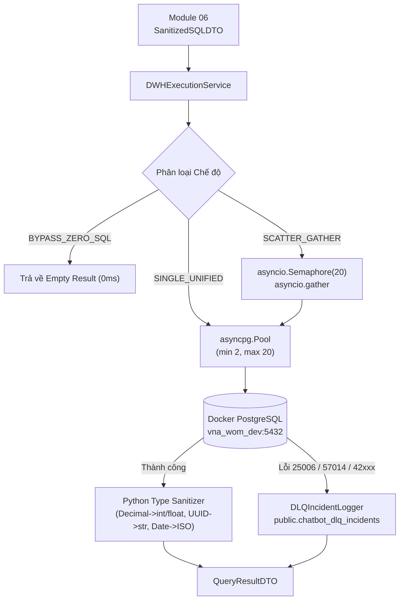

# ĐẶC TẢ KỸ THUẬT MODULE 07: DWH EXECUTION ENGINE & OBSERVABILITY

> [!IMPORTANT]
> **KIÊN CỐ HÓA THỰC THI 2 TẦNG (ENGINE-LEVEL HARDENING)**
> 
> Module 07 đảm nhận vai trò thực thi an toàn các câu truy vấn SQL đã được làm sạch từ Module 06 trực tiếp trên Docker CSDL PostgreSQL `vna_wom_dev`.
> Hệ thống áp dụng nguyên tắc phòng vệ chiều sâu:
> 1. **Cấp Phiên CSDL:** Cưỡng chế `server_settings={"default_transaction_read_only": "on"}` chặn đứng mọi hành vi ghi chép (Error code `25006`).
> 2. **Cấp Circuit Breaker:** Cưỡng chế `statement_timeout = 5000` (5 giây) ngăn chặn truy vấn treo hoặc Full Table Scan làm cạn kiệt tài nguyên (Error code `57014`).
> 3. **Tự Động Ghi DLQ:** Mọi sự cố lỗi CSDL được tự động ghi nhận vào bảng `public.chatbot_dlq_incidents` qua kết nối độc lập.

---

## 1. Kiến Trúc Luồng Vận Hành

---

## 2. Các Thành Phần Chính

### 2.1. `DWHConnectionPool` (`connection_pool.py`)
- Singleton quản lý vòng đời kết nối `asyncpg.Pool` và fallback đồng bộ `psycopg2`.
- Kiểm tra tính tương thích của event loop đang chạy (`asyncio.get_running_loop()`). Tự động phát hiện loop thay đổi giữa các test function để terminate và tái tạo pool mới, loại trừ lỗi `cannot perform operation: another operation is in progress`.
- Cấu hình phiên an toàn:
  - `default_transaction_read_only = on`
  - `statement_timeout = 5000`
  - `min_size = 2`, `max_size = 20`

### 2.2. `DWHExecutionService` (`dwh_exec_service.py`)
- Cung cấp 2 phương thức giao tiếp:
  - `execute_query_async(sanitized_dto, user_ctx, trace_id)`: Thực thi bất đồng bộ trên `asyncpg`.
  - `execute_query_sync(sanitized_dto, user_ctx, trace_id)`: Thực thi đồng bộ qua `execute_sync_fallback` (`psycopg2 RealDictCursor`).
- Chuẩn hóa kiểu dữ liệu đầu ra:
  - `decimal.Decimal` chuyển thành `int` nếu nguyên, ngược lại `float`.
  - `uuid.UUID` chuyển thành chuỗi `str`.
  - `datetime.date / datetime.datetime` chuyển thành chuỗi chuẩn ISO 8601.

### 2.3. `DLQIncidentLogger` (`dlq_incident_logger.py`)
- Ghi nhận chi tiết mọi sự cố (syntax error, timeout, read-only violation) vào bảng CSDL `public.chatbot_dlq_incidents` bằng kết nối psycopg2 riêng biệt.
- Tự động tạo bảng nếu chưa tồn tại.
- Fallback lưu tệp cục bộ `data/logs/dlq_incidents.jsonl` nếu CSDL mất kết nối hoàn toàn.

---

## 3. Khế Ước Dữ Liệu `QueryResultDTO`

- `columns`: Danh sách siêu dữ liệu cột (`ColumnMetadataDTO`: `name`, `data_type`).
- `rows`: Danh sách các bản ghi dữ liệu dạng từ điển (Dictionary) đã được làm sạch kiểu.
- `row_count`: Số lượng dòng kết quả.
- `execution_time_ms`: Thời gian thực thi truy vấn trên CSDL (mili-giây).
- `execution_mode`: Chế độ thực thi (`SINGLE_UNIFIED`, `SCATTER_GATHER`, `BYPASS_ZERO_SQL`).
- `is_empty`: Boolean báo hiệu tập kết quả rỗng.
- `status`: Trạng thái thực thi (`SUCCESS`, `EMPTY`, `TIMEOUT`, `ERROR`, `BYPASS`).
- `error_code`: Mã lỗi CSDL PostgreSQL (ví dụ `25006`, `57014`, `42703`).
- `error_message`: Chi tiết thông điệp lỗi.
- `executed_sql`: Câu truy vấn thực tế đã gửi tới CSDL.
- `trace_id`: Trace ID phân tán hỗ trợ quan sát xuyên suốt.

---

## 4. Kết Quả Đo Lường & Nghiệm Thu (Acceptance Metrics)

- **Bộ kiểm thử Live DB Tier 2**: `IPGov_Chatbot/tests/test_mod07_dwh_exec.py` (**7/7 PASSED in 1.81s** trên Docker `vna_wom_dev`).
  - Kiểm thử `SINGLE_UNIFIED` truy vấn aggregation thành công.
  - Kiểm thử kiên cố hóa Read-Only cấp CSDL (chặn lệnh `INSERT` với mã `25006`).
  - Kiểm thử phân tán `SCATTER_GATHER` qua Semaphore 20.
  - Kiểm thử độ bền bỉ `TC-DWH-01` Safe Casting regex trên cột text `fact_report_criteria.value`.
  - Kiểm thử xử lý bản ghi `NULL` và `'0'` (`CI-DWH-ROBUSTNESS`).
  - Kiểm thử ghi nhận sự cố DLQ vào bảng `public.chatbot_dlq_incidents`.
  - Kiểm thử chuyển đổi đồng bộ Sync Adapter.
- **Bộ kiểm thử Chained Snapshot Tier 3**: `IPGov_Chatbot/tests/test_chained_snapshots_mod06_07.py` (**106/106 ca kiểm thử thực thi thành công 100.0% trong 2.99s**).
- **Bộ kiểm thử tích hợp luồng SSE Stream**: `IPGov_Chatbot/tests/test_stream_pipeline_integration.py` (**PASSED**).
