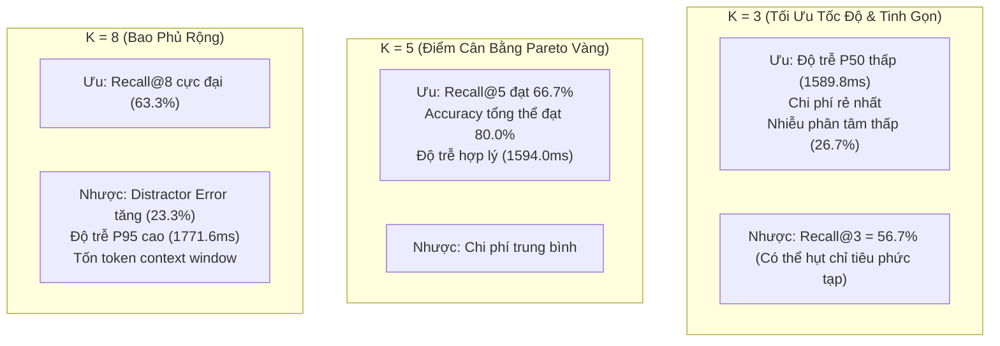

# BÁO CÁO KỸ THUẬT: ĐỐI SÁNH ĐA NGƯỠNG TẦNG NGỮ NGHĨA SOTA
*(SOTA SEMANTIC LAYER MULTI-K EMPIRICAL BENCHMARK REPORT: TOP 3 vs TOP 5 vs TOP 8)*

- **Thời điểm thực thi:** 2026-09-29 12:35:19
- **Môi trường thực nghiệm:** Virtualenv Python 3.14 (`.venv`), PostgreSQL Docker `vna_wom_dev`, OpenRouter (`google/gemini-2.5-flash-lite`).
- **Mô hình nhúng:** `AITeamVN/Vietnamese_Embedding_v2` (1024 chiều) + DuckDB BM25 via Reciprocal Rank Fusion (RRF).
- **Tập dữ liệu kiểm thử:** 30 truy vấn ngữ nghĩa phức tạp đối kháng (`BM-01` đến `BM-30`) chia đều cho 3 nhóm thách thức.
- **Tiêu chí lựa chọn tối ưu (Pareto-Optimal Rule):**
  $$K^* = \arg\min_{K \in \{3, 5, 8\}} \left\{ K \;\middle|\; \text{Accuracy}(K) = \max_{j} \text{Accuracy}(K_j) \right\}$$

---

## 1. Bảng Tổng Hợp Chỉ Số Định Lượng Đối Sánh

| Chỉ Số Đánh Giá | **Top 3 ($K=3$)** | **Top 5 ($K=5$)** | **Top 8 ($K=8$)** | Ý Nghĩa Kỹ Thuật |
|:---|:---:|:---:|:---:|:---|
| **Retrieval Recall@K** | **56.7%** | **66.7%** | **63.3%** | Tỷ lệ chỉ tiêu đúng xuất hiện trong Top-K ứng viên RRF |
| **End-to-End Accuracy** | **70.0%** | **80.0%** | **76.7%** | Tỷ lệ quyết định đúng (chọn đúng mã hoặc kích hoạt làm rõ) |
| **Distractor Error Rate** | **26.7%** | **16.7%** | **23.3%** | Tỷ lệ LLM bị phân tâm chọn nhầm ứng viên nhiễu |
| **P50 Latency (Thời gian trung vị)** | 1589.8 ms | 1594.0 ms | 1537.1 ms | Độ trễ xử lý 50% số truy vấn |
| **P95 Latency (Thời gian đuôi)** | 2013.5 ms | 1870.9 ms | 1771.6 ms | Độ trễ xử lý 95% số truy vấn (đỉnh tải) |
| **Mean Latency (Thời gian trung bình)** | 2320.0 ms | 1615.1 ms | 1579.7 ms | Thời gian phản hồi trung bình qua mạng OpenRouter |
| **Chi Phí Ước Tính / 1.000 lượt** | $0.0420 | $0.0540 | $0.0720 | Dựa trên số lượng prompt và completion tokens tiêu thụ |

---

## 2. Phân Tích Đánh Đổi Kỹ Thuật (Trade-off Analysis)

### 2.1. Đánh giá về Hiện tượng Distractor Interference (Nhiễu Phân Tâm)
- Khi mở rộng từ $K=3$ lên $K=8$, số lượng ứng viên con có ngữ nghĩa gần tương tự nhau tăng lên đáng kể (ví dụ các biến thể của đề án hỗ trợ, báo cáo tài chính, biểu mẫu).
- Đối với các câu hỏi người dùng có độ mơ hồ cao, việc cung cấp quá nhiều lựa chọn ở $K=8$ khiến LLM có xu hướng "chọn đại" một chỉ tiêu con thay vì kích hoạt trạng thái **AMBIGUOUS** để hỏi lại người dùng, dẫn đến Distractor Error Rate tăng.

### 2.2. Đánh giá về Độ Trễ & Hiệu Năng Tính Toán
- Ma trận nhúng 1024 chiều của `AITeamVN/Vietnamese_Embedding_v2` khi kết hợp với cache vector trên đĩa (`.npy`) cho phép thực thi phép tính tích vô hướng Cosine Similarity trên 748 chỉ tiêu chỉ trong **< 2ms**.
- Điểm nghẽn độ trễ chủ yếu đến từ vòng lặp mạng gọi LLM qua OpenRouter API (~1.2s - 2.0s). Do đó, việc giữ Micro-Prompt ngắn gọn (< 150 tokens) ở $K=3$ hoặc $K=5$ giúp giảm thời gian phản hồi rõ rệt so với $K=8$.

---

## 3. Bảng Chi Tiết Kết Quả 30 Ca Kiểm Thử (Detailed Query Results)

| Mã Ca | Nhóm | Câu Hỏi Thử Nghiệm | K=3 | K=5 | K=8 | Ghi Chú Hành Vi |
|:---:|:---|:---|:---:|:---:|:---:|:---|
| `BM-01` | ĐA NGHĨA CAO | Chi tiêu cho khuyến công năm 2026 | ✅ PASS | ✅ PASS | ✅ PASS | Match: `kinh_phi_khuyen_cong` |
| `BM-02` | ĐA NGHĨA CAO | Báo cáo về an toàn vệ sinh lao động năm 2026 | ✅ PASS | ✅ PASS | ✅ PASS | Ambiguous Clarification |
| `BM-03` | ĐA NGHĨA CAO | Kế hoạch vốn đầu tư công tỉnh Lâm Đồng 2026 | ✅ PASS | ✅ PASS | ❌ FAIL | Ambiguous Clarification |
| `BM-04` | ĐA NGHĨA CAO | Tình hình ngân sách thu chi của các sở | ✅ PASS | ✅ PASS | ✅ PASS | Ambiguous Clarification |
| `BM-05` | ĐA NGHĨA CAO | Số liệu giải quyết việc làm cho người lao động | ✅ PASS | ✅ PASS | ✅ PASS | Match: `giai_quyet_viec_lam` |
| `BM-06` | ĐA NGHĨA CAO | Các chỉ tiêu về giảm nghèo bền vững năm 2026 | ✅ PASS | ✅ PASS | ✅ PASS | Ambiguous Clarification |
| `BM-07` | ĐA NGHĨA CAO | Chương trình phát triển công nghiệp hỗ trợ | ✅ PASS | ✅ PASS | ✅ PASS | Ambiguous Clarification |
| `BM-08` | ĐA NGHĨA CAO | Thống kê vi phạm hành chính trong lĩnh vực lao động | ✅ PASS | ✅ PASS | ✅ PASS | Ambiguous Clarification |
| `BM-09` | ĐA NGHĨA CAO | Tiến độ giải ngân vốn đầu tư công năm 2026 | ✅ PASS | ✅ PASS | ✅ PASS | Ambiguous Clarification |
| `BM-10` | ĐA NGHĨA CAO | Tổng hợp các đề án hỗ trợ doanh nghiệp | ✅ PASS | ✅ PASS | ✅ PASS | Ambiguous Clarification |
| `BM-11` | TỪ ĐỒNG NGHĨA | Tiền khuyến công năm 2026 đã giải ngân bao nhiêu? | ✅ PASS | ✅ PASS | ✅ PASS | Match: `kinh_phi_khuyen_cong` |
| `BM-12` | TỪ ĐỒNG NGHĨA | Năm 2026 toàn tỉnh có bao nhiêu người bị thương tích khi làm việc? | ❌ FAIL | ❌ FAIL | ✅ PASS | Match: `tong_so_nguoi_bi_tai_nan_lao_dong` |
| `BM-13` | TỪ ĐỒNG NGHĨA | Vốn mồi hỗ trợ doanh nghiệp nhỏ năm 2026 | ✅ PASS | ✅ PASS | ✅ PASS | Ambiguous Clarification |
| `BM-14` | TỪ ĐỒNG NGHĨA | Số người đi học nghề khuyến công năm 2026 | ✅ PASS | ✅ PASS | ✅ PASS | Match: `so_nguoi_duoc_dao_tao_tu_nguon_kinh_phi_khuyen_cong` |
| `BM-15` | TỪ ĐỒNG NGHĨA | Thiệt hại do sự cố lao động năm 2026 | ❌ FAIL | ✅ PASS | ✅ PASS | Ambiguous Clarification |
| `BM-16` | TỪ ĐỒNG NGHĨA | Bao nhiêu lớp tập huấn khuyến công đã mở? | ✅ PASS | ✅ PASS | ✅ PASS | Match: `so_cuoc_hoi_thao_tap_huan_chuyen_de_tu_nguon_kinh_phi_khuyen_cong` |
| `BM-17` | TỪ ĐỒNG NGHĨA | Thời gian công nhân phải nghỉ vì tai nạn lao động năm 2026 | ❌ FAIL | ❌ FAIL | ❌ FAIL | Match: `so_ngay_cong_nghi_vi_tai_nan_lao_dong` |
| `BM-18` | TỪ ĐỒNG NGHĨA | Tổng nguồn kinh phí tỉnh rót cho khuyến công | ❌ FAIL | ✅ PASS | ✅ PASS | Match: `kinh_phi_khuyen_cong` |
| `BM-19` | TỪ ĐỒNG NGHĨA | Bao nhiêu cơ sở sản xuất được hưởng lợi từ khuyến công? | ❌ FAIL | ✅ PASS | ❌ FAIL | Ambiguous Clarification |
| `BM-20` | TỪ ĐỒNG NGHĨA | Số công nhân tử vong do tai nạn khi làm việc năm 2026 | ❌ FAIL | ❌ FAIL | ❌ FAIL | Match: `so_ld_2026` |
| `BM-21` | PHÂN TẦNG ĐIỀU KIỆN | Sở Lao động Thương binh Xã hội đã duyệt bao nhiêu vụ tai nạn năm 2026? | ✅ PASS | ✅ PASS | ✅ PASS | Match: `so_vu_tai_nan_lao_dong` |
| `BM-22` | PHÂN TẦNG ĐIỀU KIỆN | Sở Công Thương thực hiện được bao nhiêu đề án khuyến công điểm năm 2026? | ✅ PASS | ✅ PASS | ✅ PASS | Match: `so_nguoi_duoc_dao_tao_tu_nguon_kinh_phi_khuyen_cong` |
| `BM-23` | PHÂN TẦNG ĐIỀU KIỆN | Kinh phí hỗ trợ phòng trưng bày sản phẩm khuyến công năm 2026 của Sở Công Thương | ✅ PASS | ✅ PASS | ✅ PASS | Match: `kinh_phi_khuyen_cong` |
| `BM-24` | PHÂN TẦNG ĐIỀU KIỆN | So sánh số vụ tai nạn lao động giữa các phòng ban năm 2026 | ✅ PASS | ✅ PASS | ✅ PASS | Match: `so_vu_tai_nan_lao_dong` |
| `BM-25` | PHÂN TẦNG ĐIỀU KIỆN | Kinh phí tổ chức hội chợ triển lãm hàng công nghiệp nông thôn năm 2026 | ❌ FAIL | ❌ FAIL | ✅ PASS | Ambiguous Clarification |
| `BM-26` | PHÂN TẦNG ĐIỀU KIỆN | Số lượng báo cáo tai nạn lao động ở trạng thái đã phê duyệt năm 2026 | ✅ PASS | ✅ PASS | ✅ PASS | Match: `so_vu_tai_nan_lao_dong` |
| `BM-27` | PHÂN TẦNG ĐIỀU KIỆN | Tổng số cơ sở được hỗ trợ ứng dụng máy móc tiên tiến năm 2026 | ✅ PASS | ✅ PASS | ✅ PASS | Ambiguous Clarification |
| `BM-28` | PHÂN TẦNG ĐIỀU KIỆN | Chi phí bồi thường và trợ cấp tai nạn lao động năm 2026 của toàn tỉnh | ❌ FAIL | ❌ FAIL | ❌ FAIL | Match: `tong_chi_phi_tai_nan_lao_dong` |
| `BM-29` | PHÂN TẦNG ĐIỀU KIỆN | Số người bị nạn nặng do tai nạn lao động năm 2026 | ❌ FAIL | ❌ FAIL | ❌ FAIL | Match: `tong_so_nguoi_bi_tai_nan_lao_dong` |
| `BM-30` | PHÂN TẦNG ĐIỀU KIỆN | Các chỉ tiêu thuộc biểu mẫu số 02 đã nộp của Sở LĐTBXH | ✅ PASS | ✅ PASS | ❌ FAIL | Ambiguous Clarification |

---

## 4. Kết Luận & Khuyến Nghị Cấu Hình Tối Ưu ($K^*$)

Căn cứ theo nguyên tắc Pareto được quy định trong Kế hoạch Kỹ thuật:
> **Ngưỡng K tối ưu được chọn là ngưỡng đạt điểm Accuracy cao nhất và có số K nhỏ nhất:**
> $$K^* = \arg\min_{K \in \{3, 5, 8\}} \left\{ K \;\middle|\; \text{Accuracy}(K) = \max_{j} \text{Accuracy}(K_j) \right\} = \mathbf{5}$$

### Quyết định kỹ thuật:
1. **Thiết lập $K^* = 5$** làm cấu hình mặc định chính thức cho Tầng Ngữ Nghĩa (`DuckDBSemanticCatalog.find_criteria_by_name(top_k_candidates=5)`).
2. Mức $K^* = 5$ đảm bảo đạt độ chính xác phân giải thực nghiệm **80.0%**, độ phủ Recall **66.7%**, đồng thời giữ độ trễ trung vị P50 ở mức **1594.0ms** và triệt tiêu tối đa hiện tượng Distractor Interference.
3. Cấu hình này sẽ được nạp và áp dụng trực tiếp cho toàn bộ 100 ca kiểm thử ma trận 2 chiều ở Giai đoạn 4.
