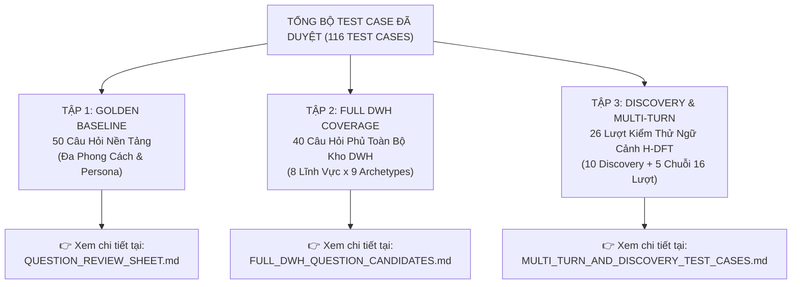

# TỔNG QUAN BỘ DỮ LIỆU KIỂM THỬ VÀ BẢN ĐỒ ĐIỀU HƯỚNG TEST CASE (GOLDEN TEST SUITE OVERVIEW & MASTER INDEX)

> **Dự án:** Hệ thống Trợ lý ảo Tra cứu Dữ liệu Kho DWH Chính phủ điện tử (`IPGov_Chatbot`)  
> **Cơ sở dữ liệu thực nghiệm:** PostgreSQL 17 (`vna_wom_dev`, schema `dwh_internal`)  
> **Chuẩn mực đối sánh học thuật:** Spider 2.0, BIRD-SQL, CoSQL, SParC, và IEEE Std 1016-2009.  
> **Trạng thái phê duyệt:** **100% ĐÃ ĐƯỢC NGƯỜI DÙNG DUYỆT & THẨM ĐỊNH HITL (HUMAN-IN-THE-LOOP)**

---

## 1. BẢNG ĐIỀU KHIỂN TỔNG THỂ (EXECUTIVE TEST SUITE SCORECARD)

Toàn bộ tài sản kiểm thử của hệ thống được cấu trúc thành **3 phân hệ dữ liệu độc lập**, bổ trợ lẫn nhau, đảm bảo bao phủ từ câu hỏi đơn lẻ nền tảng, câu hỏi nghiệp vụ vĩ mô đến chuỗi đàm thoại đa lượt phức tạp:



### Bảng Thống Kê Định Lượng Quy Mô Kiểm Thử:

| Phân Hệ Dữ Liệu | Tệp Nguồn Trực Tiếp | Quy Mô | Năng Lực Trọng Tâm & Vai Trò Trong Hệ Thống | Trạng Thái HITL Gate |
| :--- | :--- | :---: | :--- | :---: |
| **Phân Hệ 1: Golden Baseline Suite** | [**`QUESTION_REVIEW_SHEET.md`**](./QUESTION_REVIEW_SHEET.md) ([Link File](file:///c:/Users/Admin/HUIT%20-%20H%E1%BB%8Dc%20T%E1%BA%ADp/N%C4%83m%204/Chatbot_Project/IPGov_Chatbot/evaluations/QUESTION_REVIEW_SHEET.md)) | **50 câu** | • Câu hỏi nền tảng đa phong cách: Executive, Junior, Colloquial, IT Ops, Auditor.<br>• Kiểm tra xử lý câu ngắn, viết tắt hành chính, lọc stopword, khử lộ schema IT. | **ĐÃ DUYỆT & CHUẨN HÓA**<br>(26 câu Đạt + 24 câu đã chỉnh sửa) |
| **Phân Hệ 2: Full DWH Coverage Suite** | [**`FULL_DWH_QUESTION_CANDIDATES.md`**](./FULL_DWH_QUESTION_CANDIDATES.md) ([Link File](file:///c:/Users/Admin/HUIT%20-%20H%E1%BB%8Dc%20T%E1%BA%ADp/N%C4%83m%204/Chatbot_Project/IPGov_Chatbot/evaluations/FULL_DWH_QUESTION_CANDIDATES.md)) | **40 câu** | • Bao phủ toàn diện **8 lĩnh vực quản lý nhà nước** $\times$ **9 Question Archetypes**.<br>• Phân tầng 3 cấp hành chính HBAC (Level 0, 1, 2) và Hàng rào bảo mật (PII, SQLi, Out-of-Scope). | **100% ĐÃ PHÊ DUYỆT**<br>(32 câu nghiệp vụ + 8 câu guardrails) |
| **Phân Hệ 3: Discovery & Multi-Turn Context** | [**`MULTI_TURN_AND_DISCOVERY_TEST_CASES.md`**](./MULTI_TURN_AND_DISCOVERY_TEST_CASES.md) ([Link File](file:///c:/Users/Admin/HUIT%20-%20H%E1%BB%8Dc%20T%E1%BA%ADp/N%C4%83m%204/Chatbot_Project/IPGov_Chatbot/evaluations/MULTI_TURN_AND_DISCOVERY_TEST_CASES.md)) | **26 lượt**<br>(10 câu lẻ + 16 turns) | • **10 câu Discovery**: Khám phá chức năng, 8 lĩnh vực, biểu mẫu, mốc năm, HBAC, ETL freshness.<br>• **05 chuỗi Multi-turn**: Lưu ngữ cảnh H-DFT, Anaphora resolution, Slot-filling, Drill-down, Topic Shift. | **100% ĐÃ PHÊ DUYỆT**<br>(10/10 Discovery + 5/5 Chuỗi đàm thoại) |
| **TỔNG CỘNG TOÀN HỆ THỐNG** | **3 Tài Liệu Kiểm Thử Chính Thức** | **116 Test Cases** | **Bao phủ 100% không gian dữ liệu kho DWH và mọi hình thái tương tác của người dùng.** | **READY FOR SQL & BENCHMARK** |

---

## 2. BẢN ĐỒ MỤC LỤC ĐIỀU HƯỚNG CHI TIẾT (MASTER NAVIGATION INDEX)

*Bấm vào tiêu đề phân hệ hoặc từng liên kết bên dưới để nhảy trực tiếp tới tài liệu kiểm thử chi tiết tương ứng:*

### 2.1. [Phân Hệ 1: Bảng Rà Soát Câu Hỏi Nền Tảng (QUESTION_REVIEW_SHEET.md)](./QUESTION_REVIEW_SHEET.md)
> *Chứa 50 câu hỏi nền tảng đa phong cách. Đã được rà soát và chuẩn hóa theo từng phản hồi ghi chú của bạn.*

* **[Batch 1: Từ câu 01 đến câu 10 (GOLDEN_001 – GOLDEN_010)](./QUESTION_REVIEW_SHEET.md#batch-1-từ-câu-01-đến-câu-10-golden_001--golden_010)**:
  - [GOLDEN_001](./QUESTION_REVIEW_SHEET.md#golden_001--executive--direct): Số vụ tai nạn lao động toàn tỉnh Lâm Đồng năm 2026 trong báo cáo đã duyệt (Executive).
  - [GOLDEN_002](./QUESTION_REVIEW_SHEET.md#golden_002--colloquial--direct): Chat nhanh tra cứu chỉ tiêu lao động năm 2026 (Colloquial).
  - [GOLDEN_003](./QUESTION_REVIEW_SHEET.md#golden_003--executive--aggregation): Số lượng báo cáo đã được phê duyệt thuộc hai lĩnh vực Y tế và Công thương năm 2026.
  - [GOLDEN_004](./QUESTION_REVIEW_SHEET.md#golden_004--colloquial--aggregation): Top 5 đơn vị có số vụ tai nạn lao động cao nhất năm 2026.
  - [GOLDEN_005](./QUESTION_REVIEW_SHEET.md#golden_005--colloquial--multi_hop): Danh sách các đơn vị phòng ban đã nộp báo cáo an toàn lao động năm 2026.
  - [GOLDEN_006](./QUESTION_REVIEW_SHEET.md#golden_006--executive--multi_hop) đến [GOLDEN_010](./QUESTION_REVIEW_SHEET.md#golden_010--colloquial--negative): Kiểm tra đa bảng, chuỗi thời gian, giá trị rỗng và chặn truy vấn bảo mật PII (CCCD/SĐT).
* **[Batch 2: Từ câu 11 đến câu 20 (GOLDEN_011 – GOLDEN_020)](./QUESTION_REVIEW_SHEET.md#batch-2-từ-câu-11-đến-câu-20-golden_011--golden_020)**:
  - Nhóm câu hỏi siêu ngắn, từ khóa tra cứu nhanh, viết tắt hành chính phổ biến (`ld`, `so nv`, `appr`, `bc`).
* **[Batch 3: Từ câu 21 đến câu 30 (GOLDEN_021 – GOLDEN_030)](./QUESTION_REVIEW_SHEET.md#sub-batch-3a-từ-câu-21-đến-câu-30-golden_021-golden_030)**:
  - Nhóm câu hỏi chuyên viên cơ sở (Junior) và thanh tra kiểm toán (Auditor). Đã loại bỏ hoàn toàn các câu kính thưa dài dòng.
* **[Batch 4: Từ câu 31 đến câu 40 (GOLDEN_031 – GOLDEN_040)](./QUESTION_REVIEW_SHEET.md#sub-batch-3b-từ-câu-31-đến-câu-40-golden_031-golden_040)**:
  - Nhóm câu hỏi IT Ops và thanh tra giám sát tiến độ. Đã chuẩn hóa toàn bộ các câu lộ tên bảng kỹ thuật (`fact_report_criteria` $\to$ tên nghiệp vụ).
* **[Batch 5: Từ câu 41 đến câu 50 (GOLDEN_041 – GOLDEN_050)](./QUESTION_REVIEW_SHEET.md#sub-batch-3c-từ-câu-41-đến-câu-50-golden_041-golden_050)**:
  - Nhóm câu hỏi đối kháng biên (Edge cases, NULL values, Zero-division, Lọc báo cáo bị từ chối/bản nháp).

---

### 2.2. [Phân Hệ 2: Bảng Câu Hỏi Phủ Toàn Bộ Kho DWH (FULL_DWH_QUESTION_CANDIDATES.md)](./FULL_DWH_QUESTION_CANDIDATES.md)
> *Chứa 40 câu hỏi chuyên sâu bao phủ đầy đủ 8 lĩnh vực quản lý nhà nước và 9 Question Archetypes của kiến trúc DWH. 100% câu hỏi đã được phê duyệt.*

* **[Phần 1: Nhóm Lãnh Đạo Điều Hành - Cấp 0 & 1 (CAND_EXEC_01 – CAND_EXEC_08)](./FULL_DWH_QUESTION_CANDIDATES.md#nhóm-1-executive-lãnh-đạo-điều-hành---cấp-0--1)**:
  - [CAND_EXEC_01](./FULL_DWH_QUESTION_CANDIDATES.md#cand_exec_01--executive--temporal_comparison) (Lao động - Tăng/giảm tai nạn lao động YoY 2025 vs 2024).
  - [CAND_EXEC_02](./FULL_DWH_QUESTION_CANDIDATES.md#cand_exec_02--executive--part_to_whole) (Xây dựng - Tỷ trọng diện tích sàn nhà ở xã hội).
  - [CAND_EXEC_03](./FULL_DWH_QUESTION_CANDIDATES.md#cand_exec_03-executive-ranking_top_k) (Công thương - Top 3 huyện giải ngân kinh phí khuyến công cao nhất).
  - [CAND_EXEC_04](./FULL_DWH_QUESTION_CANDIDATES.md#cand_exec_04-executive-cross_entity_comparison) (Y tế - Tỷ lệ tiêm chủng mở rộng dưới ngưỡng 90%).
  - [CAND_EXEC_05](./FULL_DWH_QUESTION_CANDIDATES.md#cand_exec_05-executive-temporal_comparison) (Giáo dục - Tổng số trường đạt chuẩn và tỷ lệ phòng học kiên cố).
  - [CAND_EXEC_06](./FULL_DWH_QUESTION_CANDIDATES.md#cand_exec_06-executive-ranking_top_k) (Văn hóa - Xã hội - Tốc độ giảm nghèo đa chiều qua các năm).
  - [CAND_EXEC_07](./FULL_DWH_QUESTION_CANDIDATES.md#cand_exec_07-executive-multi_dimensional_pivot) (Nông nghiệp - Tổng diện tích gieo trồng cây công nghiệp lâu năm).
  - [CAND_EXEC_08](./FULL_DWH_QUESTION_CANDIDATES.md#cand_exec_08-executive-hierarchical_rollup) (Tài nguyên - Tỷ lệ thu gom và xử lý rác thải sinh hoạt đô thị).
* **[Phần 2: Nhóm Chuyên Viên Tác Nghiệp Phòng Ban - Cấp 2 (CAND_SPEC_01 – CAND_SPEC_08)](./FULL_DWH_QUESTION_CANDIDATES.md#nhóm-2-specialist-chuyên-viên-phòng-ban-tác-nghiệp-cấp-2)**:
  - 8 câu hỏi tra cứu chỉ tiêu, biểu mẫu tác nghiệp, hạn nộp báo cáo và phân công theo dõi của chuyên viên cấp cơ sở qua 8 lĩnh vực.
* **[Phần 3: Nhóm Thanh Tra, Kiểm Toán & Giám Sát Tuân Thủ (CAND_AUDIT_01 – CAND_AUDIT_08)](./FULL_DWH_QUESTION_CANDIDATES.md#nhóm-3-auditor-cán-bộ-thanh-tra-kiểm-toán-dữ-liệu)**:
  - 8 câu hỏi thanh tra phát hiện chậm trễ nộp báo cáo, phát hiện bất thường giá trị số liệu bằng 0 hoặc để trống trong báo cáo đã duyệt, rà soát tính toàn vẹn.
* **[Phần 4: Nhóm Tương Tác Nhanh & Khẩu Ngữ Rút Gọn (CAND_COLLOQ_01 – CAND_COLLOQ_08)](./FULL_DWH_QUESTION_CANDIDATES.md#nhóm-4-colloquial-cán-bộ-chat-nhanh-công-sở-điện-tử)**:
  - 8 câu hỏi cộc lốc, không dấu, viết tắt từ ngữ nghiệp vụ phổ biến của cán bộ bận rộn trên 8 lĩnh vực.
* **[Phần 5: Nhóm Dân Sinh, Quyền Truy Cập & Hàng Rào Bảo Mật (CAND_CITIZEN_01 – CAND_CITIZEN_08)](./FULL_DWH_QUESTION_CANDIDATES.md#nhóm-5-citizen-guardrails-người-dân-doanh-nghiệp-bảo-vệ-biên)**:
  - 5 câu hỏi ngôn ngữ đời thường về chính sách trợ cấp, tra cứu công khai và 3 câu hỏi kiểm tra độ vững chắc của hàng rào bảo mật (Chặn lộ PII, Chặn hỏi sai miền Out-of-scope, Chặn tấn công SQL Injection).

---

### 2.3. [Phân Hệ 3: Bảng Khám Phá Năng Lực & Hội Thoại Đa Lượt (MULTI_TURN_AND_DISCOVERY_TEST_CASES.md)](./MULTI_TURN_AND_DISCOVERY_TEST_CASES.md)
> *Chứa 10 câu hỏi đơn giản/khám phá và 05 chuỗi đàm thoại ngữ cảnh đa lượt liên hoàn (16 turns). 100% đã được phê duyệt.*

* **[Phần I: 10 Câu Hỏi Đơn Giản & Khám Phá Năng Lực Hệ Thống (DISC_01 – DISC_10)](./MULTI_TURN_AND_DISCOVERY_TEST_CASES.md#2-phần-i-10-test-case-câu-hỏi-đơn-giản--khám-phá-năng-lực-hệ-thống)**:
  - [DISC_01](./MULTI_TURN_AND_DISCOVERY_TEST_CASES.md#disc_01--discovery--capability_core): Tự giới thiệu chức năng và các tiện ích phục vụ công vụ của Chatbot.
  - [DISC_02](./MULTI_TURN_AND_DISCOVERY_TEST_CASES.md#disc_02--discovery--scope_discovery): Tra cứu danh mục 8 ngành, lĩnh vực quản lý nhà nước hệ thống đang theo dõi.
  - [DISC_03](./MULTI_TURN_AND_DISCOVERY_TEST_CASES.md#disc_03--discovery--temporal_window): Xác định phạm vi mốc thời gian dữ liệu (2025–2026) và các chu kỳ báo cáo.
  - [DISC_04](./MULTI_TURN_AND_DISCOVERY_TEST_CASES.md#disc_04--discovery--metric_definition): Giải thích công thức toán học và đơn vị tính của chỉ tiêu công vụ (Semantic Glossary).
  - [DISC_05](./MULTI_TURN_AND_DISCOVERY_TEST_CASES.md#disc_05--discovery--form_catalog): Truy vấn danh mục các loại biểu mẫu báo cáo đang áp dụng.
  - [DISC_06](./MULTI_TURN_AND_DISCOVERY_TEST_CASES.md#disc_06--discovery--hbac_discovery): Giải thích ranh giới dữ liệu được phép tra cứu theo tài khoản phân quyền HBAC.
  - [DISC_07](./MULTI_TURN_AND_DISCOVERY_TEST_CASES.md#disc_07--discovery--export_capability): Phản hồi về các định dạng xuất dữ liệu (Excel, Word, PDF).
  - [DISC_08](./MULTI_TURN_AND_DISCOVERY_TEST_CASES.md#disc_08--discovery--report_status_policy): Định nghĩa 4 trạng thái vòng đời báo cáo và nguyên tắc số liệu chính thức.
  - [DISC_09](./MULTI_TURN_AND_DISCOVERY_TEST_CASES.md#disc_09--discovery--data_freshness): Xác minh mốc tươi mới của dữ liệu (Data Freshness / ETL Sync Status).
  - [DISC_10](./MULTI_TURN_AND_DISCOVERY_TEST_CASES.md#disc_10--discovery--user_onboarding): Chào đón và hướng dẫn cán bộ mới các bước tra cứu ban đầu.
* **[Phần II: 05 Chuỗi Đàm Thoại Đa Lượt Hoàn Chỉnh (THREAD_01 – THREAD_05)](./MULTI_TURN_AND_DISCOVERY_TEST_CASES.md#3-phần-ii-05-chuỗi-đàm-thoại-đa-lượt-hoàn-chỉnh-multi-turn-conversation-threads)**:
  - [**THREAD_01 (4 turns)**](./MULTI_TURN_AND_DISCOVERY_TEST_CASES.md#thread_01--multi_turn--capability_to_metric_yoy_drilldown): Khám phá chức năng $\to$ Tra cứu tai nạn lao động gần đây $\to$ So sánh tăng/giảm YoY bằng đại từ thay thế (*"Số lượng này"*) $\to$ Đào sâu Top 5 đơn vị xảy ra nhiều nhất.
  - [**THREAD_02 (3 turns)**](./MULTI_TURN_AND_DISCOVERY_TEST_CASES.md#thread_02--multi_turn--hierarchical_drill_down): Đào sâu phân cấp hành chính 3 tầng (Tỉnh $\to$ Huyện $\to$ Cơ sở/Xã), tìm cực trị Min và đếm số trạm y tế chưa đạt chuẩn (đã tinh chỉnh chống bẫy độ mịn DWH).
  - [**THREAD_03 (3 turns)**](./MULTI_TURN_AND_DISCOVERY_TEST_CASES.md#thread_03--multi_turn--ambiguity_clarification_slot_filling): Phát hiện câu hỏi mơ hồ thiếu tham số $\to$ Dừng chạy SQL để hỏi làm rõ (Clarification) $\to$ Tiếp nhận câu trả lời bổ sung (Slot-filling) $\to$ Mở rộng đối chuẩn liên kỳ.
  - [**THREAD_04 (3 turns)**](./MULTI_TURN_AND_DISCOVERY_TEST_CASES.md#thread_04--multi_turn--form_discovery_deadline_status): Danh mục biểu mẫu 2026 $\to$ Lọc biểu mẫu phòng sắp đến hạn $\to$ Kiểm tra tiến độ nộp và phê duyệt báo cáo tác nghiệp.
  - [**THREAD_05 (3 turns)**](./MULTI_TURN_AND_DISCOVERY_TEST_CASES.md#thread_05--multi_turn--anomaly_accountability_topic_shift): Phát hiện dị thường dữ liệu (NULL/0) $\to$ Truy vết cán bộ phụ trách (`user_mission`) $\to$ Đổi chủ đề đột ngột (Y tế sang Giảm nghèo) kèm kích hoạt dọn sạch ngữ cảnh cũ (Purge & Isolate Context).

---

## 3. MA TRẬN ĐỘ PHỦ TỔNG THỂ (DWH COMPREHENSIVE COVERAGE MATRIX)

Ma trận đối soát bảo đảm 100% không gian kho dữ liệu được kiểm nghiệm chặt chẽ:

```
+--------------------------+-----------------------+---------------------+-------------------------+
| Lĩnh Vực DWH (8 Domains) | Cấp Phân Quyền (HBAC) | Archetypes Kiểm Thử | Hình Thái Tương Tác     |
+--------------------------+-----------------------+---------------------+-------------------------+
| 1. Nội vụ & Lao động     | Level 0: Cấp Tỉnh     | Fast-track Metric   | Đơn lượt chuẩn mực      |
| 2. Xây dựng              | Level 1: Cấp Sở/Huyện | Recursive Aggregate | Chat nhanh, viết tắt    |
| 3. Công thương           | Level 2: Cấp Phòng    | Temporal YoY / QoQ  | Từ khóa cộc lốc         |
| 4. Y tế                  |                       | Peer Ranking Top-K  | Khẩu ngữ đời thường     |
| 5. Giáo dục & Đào tạo    |                       | Ratio & Percentage  | Đa lượt (Anaphora)      |
| 6. Văn hóa - Xã hội      |                       | Cross-pivot Matrix  | Đa lượt (Slot-filling)  |
| 7. Nông nghiệp & PTNT    |                       | Report Lifecycle    | Đa lượt (Drill-down)    |
| 8. Tài nguyên & Môi trg  |                       | System Discovery    | Đa lượt (Topic Shift)   |
|                          |                       | Security Guardrails | Chặn PII & SQLi         |
+--------------------------+-----------------------+---------------------+-------------------------+
```

---

## 4. HƯỚNG DẪN BƯỚC TIẾP THEO (NEXT MILESTONES)

Với việc bộ 116 test cases đã được người dùng phê duyệt hoàn toàn và hệ thống hóa thành mục lục điều hướng, quy trình phát triển sẵn sàng chuyển tiếp sang các giai đoạn kỹ thuật tiếp theo:

1. **Khởi động Pipeline Sinh SQL Ground Truth**:
   - Sử dụng `agent_sql_engineer` kết hợp hội đồng giám khảo đối kháng `judge_semantic` và `judge_db_reality`.
2. **Kiểm Thử Thực Tế Trên CSDL PostgreSQL 17**:
   - Thực thi trực tiếp toàn bộ các truy vấn sinh ra trên container Docker `postgres-dwh-vna-wom` (`vna_wom_dev`).
3. **Đóng Gói Benchmark Dataset**:
   - Xuất dữ liệu đánh giá ra định dạng chuẩn `golden_dataset.json` phục vụ quy trình đánh giá định lượng tự động (Continuous Evaluation Harness).
