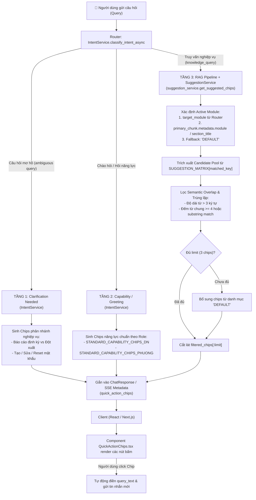

# BÁO CÁO PHÂN TÍCH TOÀN DIỆN: LOGIC GỢI Ý CÂU HỎI TIẾP THEO (FOLLOW-UP QUICK ACTION CHIPS) CỦA CHATBOT

---

## 1. TỔNG QUAN KIẾN TRÚC & MỤC TIÊU THIẾT KẾ

Trong hệ thống Chatbot Hướng dẫn Sử dụng Hệ thống Quản lý và Báo cáo An toàn Lao động, tính năng **Gợi ý câu hỏi tiếp theo** (kỹ thuật gọi là **Quick Action Chips** hay **Suggested Action Chips**) được thiết kế nhằm giải quyết bài toán cốt lõi trong tương tác Người - Máy (Conversational UX):
- **Giảm tải nhận thức (Cognitive Load)**: Người dùng (Doanh nghiệp hoặc Cán bộ Phường/Xã) thường không nắm rõ quy trình nghiệp vụ hành chính hoặc không biết phải đặt câu hỏi gì tiếp theo.
- **Định hướng luồng nghiệp vụ (Business Flow Guidance)**: Dẫn dắt người dùng đi qua từng bước cụ thể (từ Đăng ký -> Đăng nhập -> Cập nhật thông tin -> Lập báo cáo -> Gửi báo cáo -> Xem thống kê).
- **Tối ưu hóa tốc độ phản hồi (Near-Zero Latency)**: Cơ chế tạo gợi ý hoạt động độc lập và song song với luồng sinh câu trả lời RAG, không tiêu tốn token LLM, đảm bảo độ trễ phản hồi không bị kéo dài.

Hệ thống triển khai cơ chế gợi ý theo mô hình **Phân tầng 3 cấp độ (Three-Tier Suggestion Mechanism)** tùy thuộc vào trạng thái và ý định (intent) của câu hỏi.

---

## 2. SƠ ĐỒ LUỒNG XỬ LÝ TOÀN DIỆN (END-TO-END FLOW)



---

## 3. PHÂN TÍCH CHI TIẾT 3 TẦNG SINH GỢI Ý CÂU HỎI

### 3.1. Tầng 1: Ambiguity Clarification Chips (Giải quyết câu hỏi mơ hồ)
- **Vị trí cài đặt**: `backend/app/services/intent_service.py` (hàm `_rule_based_fast_intent`).
- **Nguyên lý hoạt động**:
  Khi người dùng nhập các từ khóa quá rộng, đa nghĩa như `"tai nạn lao động"`, `"báo cáo tnld"`, `"tài khoản"`, hệ thống không vội vàng tìm kiếm toàn bộ tài liệu mà chủ động kích hoạt cơ chế **Hỏi làm rõ (Clarifying Turn)**:
  1. **Đối với câu hỏi về Tai nạn lao động**:
     - *Phân hệ Doanh nghiệp*: Trả về 2 chips:
       - `🚨 Khai báo TNLĐ đột xuất` (`query_text`: "Hướng dẫn khai báo tai nạn lao động đột xuất doanh nghiệp")
       - `📊 Báo cáo định kỳ TNLĐ` (`query_text`: "Hướng dẫn nộp báo cáo định kỳ tai nạn lao động doanh nghiệp")
     - *Phân hệ Phường/Xã*: Trả về 2 chips:
       - `🚨 Báo cáo TNLĐ đột xuất` (`query_text`: "Hướng dẫn quy trình báo cáo tai nạn lao động đột xuất không theo HĐLĐ")
       - `📊 Báo cáo TNLĐ định kỳ` (`query_text`: "Hướng dẫn quy trình báo cáo tai nạn lao động định kỳ cho người không có HĐLĐ")
  2. **Đối với câu hỏi về Quản lý Tài khoản Phường/Xã**:
     - Khi cán bộ chỉ gõ `"tài khoản"` hoặc `"tài khoản phường"`, hệ thống cung cấp ngay 4 thao tác cốt lõi:
       - `➕ Tạo mới tài khoản`
       - `✏️ Chỉnh sửa tài khoản`
       - `🔓 Khôi phục mật khẩu`
       - `🗑️ Xóa tài khoản`

---

### 3.2. Tầng 2: Intent-based Static Capability Chips (Chào hỏi & Năng lực)
- **Vị trí cài đặt**: `backend/app/services/intent_service.py` (hàm `classify_intent_async`).
- **Nguyên lý hoạt động**:
  - Khi `raw_intent == "CHITCHAT_GREETING"` hoặc `"CHITCHAT_CAPABILITY"`:
  - Hệ thống trả về danh sách các quick action chips chuẩn hóa theo vai trò (`STANDARD_CAPABILITY_CHIPS_DN` hoặc `STANDARD_CAPABILITY_CHIPS_PHUONG`).
  - Ví dụ phân hệ Phường/Xã bao gồm:
    1. `🚨 Khai báo TNLĐ đột xuất`
    2. `📊 Báo cáo TNLĐ định kỳ`
    3. `👥 Quản trị tài khoản`
    4. `🔑 Đổi thông tin / Mật khẩu`
    5. `📞 Hỗ trợ kỹ thuật`

---

### 3.3. Tầng 3: Context-Aware Matrix-Based Suggestion (Lõi gợi ý sau câu trả lời RAG)
- **Vị trí cài đặt**: `backend/app/services/suggestion_service.py` và được gọi tại nhiều điểm trong `backend/app/services/rag_service.py`.
- **Hàm thực thi chính**: `SuggestionService.get_suggested_chips(query, target_module, primary_chunk, limit=3)`.

#### Chi tiết giải thuật từng bước:

#### Bước 1: Xác định Active Module Key
Hệ thống tiến hành xác định phân hệ nghiệp vụ hiện tại theo thứ tự ưu tiên:
1. Nhận `target_module` do **Single-Pass Router** phân loại từ câu hỏi.
2. Nếu `target_module` rỗng, lấy từ metadata của đoạn văn bản có điểm tương đồng cao nhất (`primary_chunk.metadata.module` hoặc `primary_chunk.metadata.section_title`).
3. Chuẩn hóa và so khớp hai chiều với các khóa trong `SUGGESTION_MATRIX`:
   ```python
   matched_key = "DEFAULT"
   if active_module:
       for key in self.SUGGESTION_MATRIX:
           if key == active_module or key in active_module or active_module in key:
               matched_key = key
               break
   ```

#### Bước 2: Truy xuất Tập ứng viên (Candidate Pool)
- Lấy danh sách câu hỏi gợi ý từ `SUGGESTION_MATRIX[matched_key]`. Hiện tại ma trận bao gồm **12 nhóm phân hệ nghiệp vụ chuyên sâu**:
  1. `ĐĂNG KÝ`: Hỏi về kích hoạt tài khoản, dùng MST làm tài khoản, đăng nhập, sửa thông tin.
  2. `ĐĂNG NHẬP`: Đổi mật khẩu, cập nhật thông tin, nộp báo cáo, quên mật khẩu.
  3. `THAY ĐỔI MẬT KHẨU`: Đổi thông tin doanh nghiệp, nộp báo cáo TNLĐ/ATVSLĐ, hotline.
  4. `THAY ĐỔI THÔNG TIN DOANH NGHIỆP`: Cách lưu thông tin, nộp báo cáo định kỳ, xem thống kê.
  5. `BÁO CÁO ĐỊNH KỲ - 1. Tai nạn lao động`: Xử lý khi không có tai nạn, đơn vị tiền lương, sửa báo cáo đã gửi, in/scan tài liệu.
  6. `BÁO CÁO ĐỊNH KỲ - 2. An toàn vệ sinh lao động`: Nút gửi vs hủy bỏ, sửa báo cáo chờ tiếp nhận, video hướng dẫn, mở khóa báo cáo.
  7. `THỐNG KÊ`: Xem biểu đồ theo năm, in/xuất file báo cáo, liên kết sang nộp báo cáo.
  8. `THAY ĐỔI THÔNG TIN CÁ NHÂN` (Phường/Xã).
  9. `TỔNG QUAN CHỨC NĂNG TÀI KHOẢN PHƯỜNG/XÃ`.
  10. `TẠO MỚI / CHỈNH SỬA / KHÔI PHỤC / XÓA TÀI KHOẢN PHƯỜNG/XÃ`.
  11. `BÁO CÁO TAI NẠN LAO ĐỘNG ĐỘT XUẤT / ĐỊNH KỲ KHÔNG THEO HĐLĐ`.
  12. `LIÊN HỆ HỖ TRỢ`: Khung giờ làm việc tổng đài, số hotline khẩn cấp.
  13. `DEFAULT`: Bộ câu hỏi cứu cánh (Fallback) khi không khớp bất kỳ module nào.

#### Bước 3: Thuật toán lọc trùng lặp & loại trừ Semantic Overlap (Deduplication)
Để tránh hiện tượng ngớ ngẩn: **"Người dùng vừa hỏi câu A, bot trả lời câu A rồi gợi ý lại đúng câu A"**, thuật toán áp dụng cơ chế lọc dựa trên từ vựng giao nhau:
```python
norm_query = query.lower().strip()
filtered_chips: List[QuickActionChip] = []

for item in candidate_list:
    item_q = item["query_text"].lower()
    # Tách các từ có độ dài > 3 ký tự nhằm loại bỏ stop words ngắn
    common_words = set(w for w in item_q.split() if len(w) > 3).intersection(
        set(w for w in norm_query.split() if len(w) > 3)
    )
    # Điều kiện xác định câu hỏi trùng ý định:
    is_same_intent = (
        len(common_words) >= 4 
        or item_q in norm_query 
        or norm_query in item_q
    )

    if not is_same_intent:
        filtered_chips.append(QuickActionChip(
            id=item["id"],
            label=item["label"],
            query_text=item["query_text"]
        ))
    if len(filtered_chips) >= limit:
        break
```

#### Bước 4: Cơ chế bù đắp thiếu hụt (Fallback Mechanism)
Nếu sau khi lọc trùng lặp, số lượng chips ứng viên còn lại không đủ `limit` (mặc định là 3 chips), hệ thống tiếp tục duyệt qua danh mục `SUGGESTION_MATRIX["DEFAULT"]`, chèn thêm các chips chưa từng xuất hiện cho tới khi đủ 3 chips:
```python
if len(filtered_chips) < limit:
    for item in self.SUGGESTION_MATRIX["DEFAULT"]:
        if not any(c.id == item["id"] for c in filtered_chips):
            filtered_chips.append(QuickActionChip(...))
        if len(filtered_chips) >= limit:
            break
```

---

## 4. TÍCH HỢP HỆ THỐNG & HIỂN THỊ TRÊN GIAO DIỆN CLIENT

### 4.1. Tích hợp trong Backend (`rag_service.py`)
Chips được sinh và đính kèm vào kết quả phản hồi ở tất cả các nhánh xử lý:
1. **Chế độ Procedural Extractive (Bypass LLM)**: Trả về câu trả lời chuẩn xác trích xuất từ tài liệu + Ảnh/Video + 3 Chips gợi ý.
2. **Chế độ Targeted Generative QA (Qwen LLM)**: Trả về câu trả lời tóm tắt ngắn + 3 Chips gợi ý.
3. **Chế độ Fallback Escalation (Hỗ trợ kỹ thuật)**: Trả về thông tin hotline + Chips của module `"LIÊN HỆ HỖ TRỢ"`.
4. **Chế độ Server-Sent Events (SSE Stream)**: Gói chips được gửi ngay trong sự kiện đầu tiên (`event: metadata`), giúp giao diện hiển thị khung gợi ý tức thì mà không cần đợi LLM stream hết văn bản.
5. **Lưu trữ CSDL (Supabase Persistence)**: Mảng `quick_action_chips` được serialize và lưu trữ cùng với tin nhắn trong bảng `chat_messages`.

### 4.2. Render trên Giao diện Frontend (`React / Next.js`)
- **File thành phần**: `frontend/src/components/chat/QuickActionChips.tsx`
- **Cấu trúc hiển thị**:
  - Tiêu đề có icon sinh động: `✨ Gợi ý câu hỏi liên quan tiếp theo:`
  - Các nút bấm dạng Chip bo tròn (`rounded-full`), nền xanh nhạt (`bg-blue-50/80`), viền xanh, chữ xanh đậm.
  - Mỗi chip hiển thị `label` súc tích (kèm emoji đại diện) và mũi tên `ArrowRight` có hiệu ứng dịch chuyển khi hover (`group-hover:translate-x-0.5`).
- **Tương tác người dùng**:
  - Khi người dùng click vào một chip, sự kiện `onSelect(chip.query_text)` được kích hoạt.
  - Giao diện tự động gán `chip.query_text` vào khung chat và kích hoạt lệnh gửi truy vấn như một tin nhắn thông thường.

---

## 5. PHÂN TÍCH PHẢN BIỆN HỌC THUẬT & ĐÁNH GIÁ CRITICAL THINKING

Tuân thủ nguyên tắc tư duy phản biện khoa học, dưới đây là phân tích các **giả định ngầm (hidden assumptions)**, **bằng chứng học thuật** và **điểm yếu kỹ thuật** của kiến trúc hiện tại:

### 5.1. Các Giả Định Ẩn (Hidden Assumptions)
1. **Giả định về Sự Phù Hợp Tĩnh (Static Relevance Assumption)**: Giả định rằng nếu người dùng hỏi về một module (ví dụ: *Báo cáo TNLĐ*), thì 3-4 câu hỏi định sẵn trong `SUGGESTION_MATRIX` luôn là những điều người dùng quan tâm nhất.
2. **Giả định về Sự Tương Đồng Từ Vựng (Lexical Equivalence Assumption)**: Giả định rằng việc đếm số từ trùng nhau có độ dài > 3 ký tự (`len(common_words) >= 4`) là đại diện chính xác cho việc hai câu hỏi có cùng ý đồ (intent).
3. **Giả định Không Lưu Vết Phiên (Stateless Suggestion Assumption)**: Giả định rằng mỗi lượt hỏi đáp (turn) là độc lập, không cần quan tâm người dùng đã click câu nào ở 2-3 lượt trước đó.

### 5.2. Đối Chiếu Nghiên Cứu Học Thuật Uy Tín
1. **Lý thuyết Conversational Search (Radlinski & Craswell, SIGIR 2017 - *"A Theoretical Framework for Conversational Search"*):**
   - Nghiên cứu chỉ ra rằng hệ thống hội thoại tìm kiếm thông tin đạt hiệu quả cao nhất khi có tính **Chủ động hỗn hợp (Mixed-Initiative)** và **Nhận thức ngữ cảnh đa lượt (Multi-turn Context Awareness)**.
   - *Điểm yếu của hệ thống hiện tại*: Logic gợi ý hiện tại hoàn toàn là **Stateless** (không trạng thái). Nếu một người dùng ở Turn 1 bấm vào gợi ý *"Báo cáo TNLĐ định kỳ"*, sau khi bot trả lời, ở Turn 2 hệ thống vẫn có thể gợi ý lại chính các câu hỏi cùng nhóm mà người dùng vừa thấy, gây ra cảm giác "máy móc" và lặp lại (Repetition fatigue).
2. **Cơ chế Hỏi Làm Rõ & Gợi Ý Truy Vấn (Aliannejadi et al., SIGIR 2019 - *"Asking Clarifying Questions in Open-Domain Information-Seeking Conversations"*):**
   - Việc sinh câu hỏi tiếp theo cần dựa trên **Mức độ không chắc chắn thông tin (Information Gain)** và sự thiếu hụt thông tin trong câu trả lời hiện tại, chứ không chỉ dựa vào việc người dùng đang đứng ở thư mục/module nào.
   - Việc chỉ so khớp từ khóa cứng nhắc (Rule-based Substring matching) để loại trừ trùng lặp dẫn đến hai lỗi kinh điển trong Xử lý Ngôn ngữ Tự nhiên:
     - **False Positive (Lọc nhầm)**: Hai câu hỏi có cùng từ vựng kỹ thuật nhưng hỏi về hai khía cạnh hoàn toàn trái ngược (ví dụ: *"Khi nào cần báo cáo"* và *"Không có báo cáo thì điền số mấy"* đều chứa các từ "báo", "cáo", "nào", "không") có thể bị loại nhầm.
     - **False Negative (Bỏ sót)**: Hai câu hỏi có từ ngữ khác nhau nhưng cùng nghĩa (Paraphrasing - ví dụ: *"Quên mật khẩu"* vs *"Không nhớ pass đăng nhập"*) sẽ không bị bộ lọc phát hiện, dẫn đến bot gợi ý lại điều người dùng vừa hỏi.
3. **Sự Đánh Đổi Giữa Static Matrix vs Generative Follow-up (Gao et al., Foundations and Trends in IR 2018 - *"Neural Approaches to Conversational AI"*):**
   - *Mặt mạnh của Static Matrix*: Độ trễ 0ms, chi phí $0, kiểm soát an toàn nghiệp vụ 100% (không bao giờ sinh ra câu hỏi vi phạm chính sách hoặc sai luật).
   - *Mặt yếu của Static Matrix*: Độ phủ bị giới hạn trong số lượng câu hỏi cố định; không có khả năng thích nghi với câu trả lời vừa được sinh ra (Context-independent).

---

## 6. BẢNG TỔNG KẾT ĐÁNH ĐỔI (TRADE-OFF ANALYSIS)

| Tiêu chí | Cơ chế Hiện tại (Static Matrix + Lexical Overlap) | Cơ chế LLM-Generated Dynamic Suggestions |
| :--- | :--- | :--- |
| **Độ trễ xử lý (Latency)** | **~ 0.5 ms** (Truy xuất từ điển trong RAM) | **~ 800 - 1500 ms** (Gọi thêm prompt LLM) |
| **Chi phí tính toán (Token Cost)** | **0 tokens** | **Tốn 150 - 250 tokens / lượt** |
| **Độ an toàn & Tính chính xác** | **100% chính xác** theo nghiệp vụ HDSD | Tiềm ẩn nguy cơ **Ảo giác (Hallucination)** |
| **Tính đa dạng & Thích ứng** | Thấp (Lặp lại bộ câu hỏi cố định theo module) | **Rất cao** (Bám sát câu trả lời vừa sinh) |
| **Khả năng lọc trùng lặp** | Trung bình (Dễ bị hạn chế bởi từ đồng nghĩa) | **Xuất sắc** (Hiểu sâu ngữ nghĩa câu hỏi) |

---

## 7. ĐỀ XUẤT LỘ TRÌNH TỐI ƯU HÓA (RECOMMENDED ROADMAP)

Để khắc phục triệt để các hạn chế mà vẫn bảo toàn ưu điểm độ trễ thấp của hệ thống, kiến trúc nên được nâng cấp theo 3 giai đoạn:

1. **Giai đoạn 1: Session-level Deduplication (Khử trùng lặp theo phiên chat)**:
   - Truyền lịch sử `session_history` vào `get_suggested_chips`.
   - Lọc bỏ vĩnh viễn các câu hỏi mà người dùng **đã từng hỏi hoặc đã từng click** trong cùng một phiên làm việc.
2. **Giai đoạn 2: Semantic Similarity Filter (Khử trùng lặp bằng Vector Cosine)**:
   - Thay thế bộ lọc đếm từ (`len(common_words) >= 4`) bằng phép tính Cosine Similarity giữa embedding của câu query và embedding của candidate questions (được pre-computed sẵn trong RAM).
   - Nếu cosine similarity > 0.82 -> loại trừ câu hỏi tương ứng.
3. **Giai đoạn 3: Mô hình Lai (Hybrid Fast-Path & Dynamic Generation)**:
   - Giữ nguyên `SuggestionService` làm chế độ mặc định nhanh cho Mode A (Extractive).
   - Ở Mode B (Generative QA), tích hợp vào prompt của LLM yêu cầu trả về thêm trường JSON `follow_up_suggestions: [str, str, str]` bám sát ngữ cảnh câu trả lời vừa phân tích.
